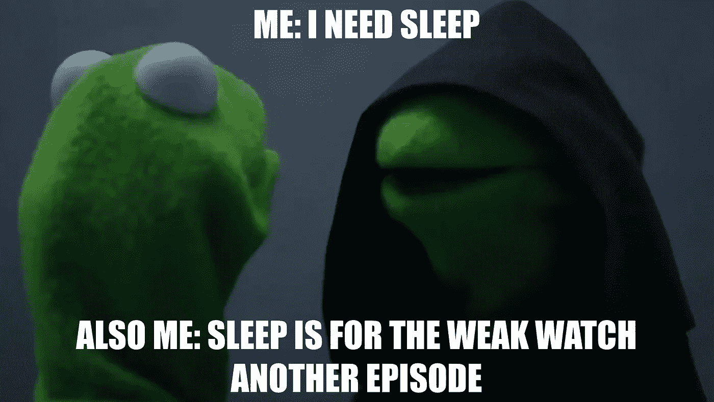
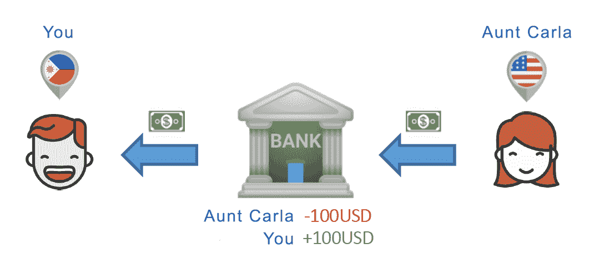
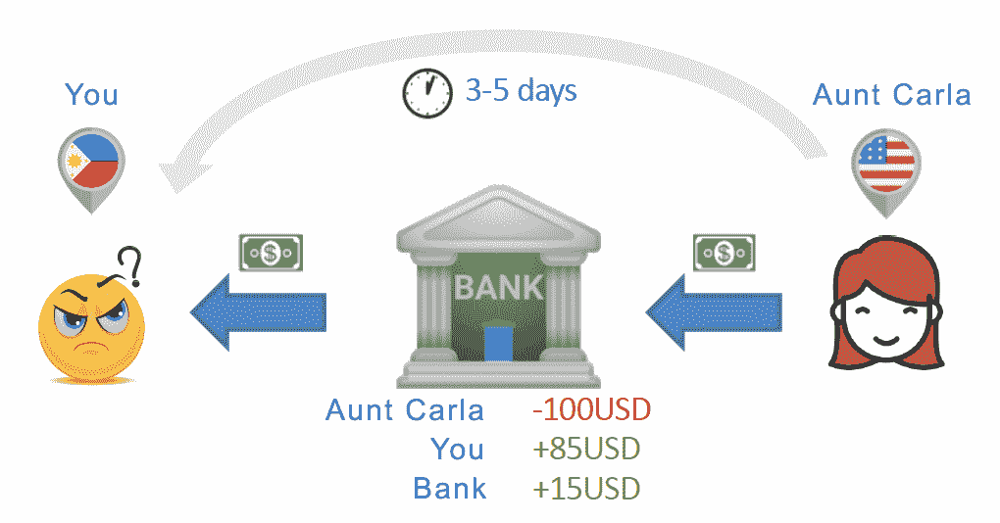
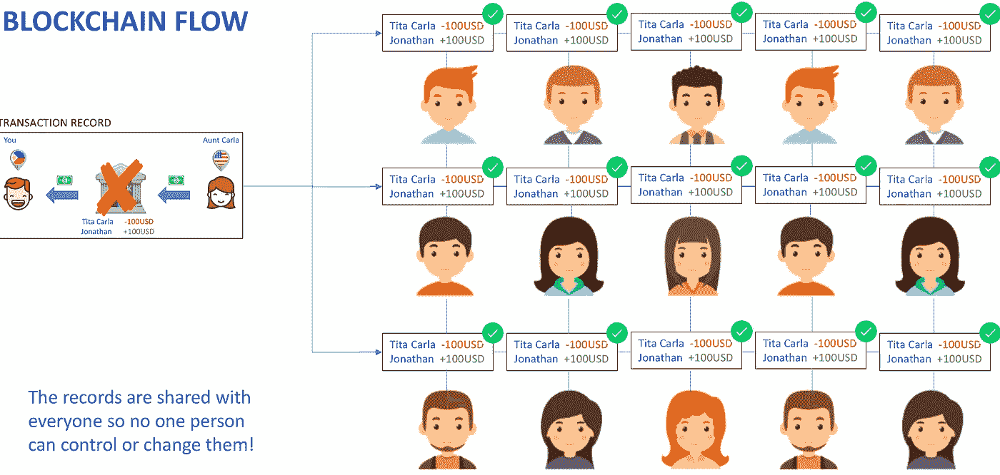
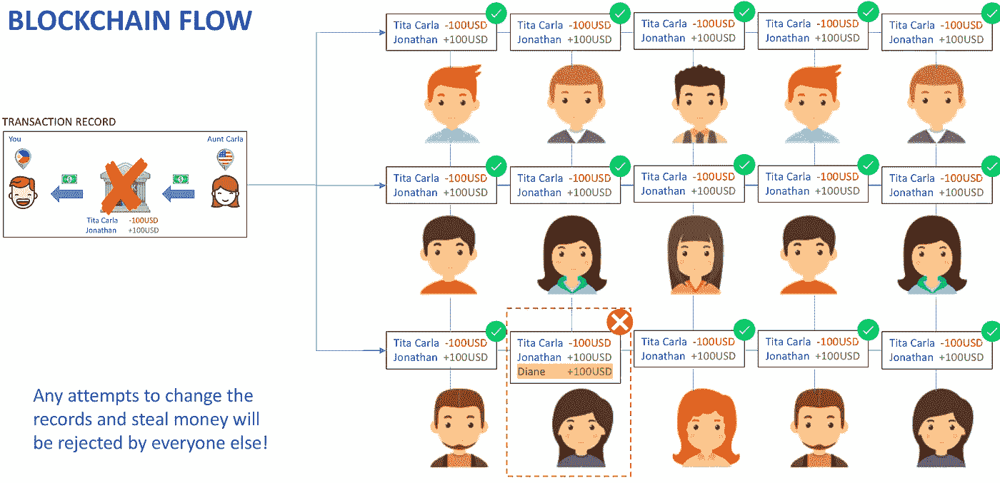

# 千禧一代区块链指南(带 gif 和 memes)

> 原文：<https://medium.com/hackernoon/a-millennials-guide-to-blockchain-with-gifs-and-memes-cc565547f283>

像大多数千禧一代一样，我喜欢用尽可能简单的方式解释事情——推特长度，搞笑故事格式。因此，当我第一次听到“区块链”这个词时，我立即求助于谷歌，寻找一个包罗万象的、一两句俏皮话的关于这项技术的信息，这项技术被认为可以一举消除疾病、推翻政府、用一辆兰博基尼取代我的自行车。

不幸的是，我阅读的每一篇文章都夹杂着我从未听说过的术语，比如“节点”、“hashrates”和“无许可分布式分类帐技术”。每一篇文章和 YouTube 的解释者都让我越来越困惑。

区块链真的那么复杂吗？你真的需要麻省理工学院的计算机科学硕士学位才能理解它是如何工作的吗？

谢天谢地，答案是否定的。不管很多人怎么想，区块链并不是一个难以理解的概念。这个问题实际上是它目前被解释的方式。现在，大多数解释者都太专业了，把非专业人士(比如我)远远甩在了后面。

但是你不应该成为一名程序员来理解一项技术可以提供的价值。

以互联网为例。你可以这样解释:

> “互联网是一个全球连接的网络系统，使用 TCP/IP 通过各种类型的介质传输数据。互联网是一个全球交流网络，包括私人、公共、商业、学术和政府网络，通过导向、无线和光纤技术连接在一起。”

但是我们大多数人会这样解释:

> "互联网是我们以数字方式发送和接收信息的一种方式."

或者说实话:

> “互联网是我们爬上前任的脸书，狂看网飞的一种方式”

了解价值—检查。

# 那么区块链呢？

我的目标是用一种即使你不信任自动取款机的爷爷也能理解的方式来解释区块链。

如果你把区块链剥离到它的核心，你会发现它只是一个记录工具。今天，我们出于各种原因保存记录。商店保留所有库存和销售记录，以管理库存。银行保存着你的存款和取款记录，以记录你有多少钱。街尾的酒吧会记录下你从未打算支付的账单。

我们都非常熟悉上面的记录保存示例。但是他们和区块链有什么关系呢？

让我们更仔细地看一下银行的例子，并对其进行一些扩展。假设你的阿姨卡拉住在国外，她想在菲律宾给你寄钱。

你和卡拉阿姨在同一家国际银行有账户。卡拉阿姨去银行说:“我想给我在菲律宾的侄子汇 100 美元！”银行首先检查以确保卡拉阿姨有足够的钱，然后在它的大银行记录簿中记录交易“卡拉阿姨:-100 美元，你+100 美元**”**。

有点老派。但信不信由你，这是迄今为止在世界范围内汇款的“最佳”方式。

# 通过银行汇款的过程提出了三个主要问题:

1.  我们需要信任一个中间人(即银行)来跟踪我们所有的记录，并确保没有人(包括银行员工)犯错误或篡改记录。
2.  银行希望从这笔交易中分得一大笔钱。假设银行手续费是 15%(这是一些机构收取的实际费率！).你不会从卡拉阿姨那里得到 100 美元，而只会得到 85 美元。银行拿走剩下的 15 英镑。
3.  转账需要时间，通常是几天，你甚至可以取出你阿姨寄给你的钱。

5 天后，当你拿到 85 美元时，你可能会想:

区块链技术可以结束所有这些挫折。

想象一下:如果所有的记录都是公开的，任何人都可以查看，而不是依赖一个中间人来跟踪所有的记录，会怎么样？

在区块链上，卡拉阿姨的-100 美元和你的+100 美元的记录被发送给网络上的每个人。因为现在每个人都有该记录的副本，所以没有人控制它。这意味着你不可能给自己额外的钱或者偷别人的钱。

这一过程免除了银行手续费，并允许资金立即转移，因为现在资金直接从卡拉阿姨那里转到你那里。它还防止任何意外或故意篡改记录。举例来说，如果你的表妹黛安试图篡改记录给自己一点额外的现金——典型的黛安——她会被拒绝。为什么？因为她创造的记录无法与任何人相提并论。

现在，每个人都可以看到你如何获得或花费你的钱的想法可能会让你有点紧张。你可能不想让任何人知道你把钱花在了什么地方。

没关系，因为在区块链上，你的身份是**完全受保护的**。代替你们的名字，你和你的阿姨卡拉将被随机生成的字母数字字符串识别。

现在让这种想法持续一会儿。

**有了区块链的技术，我们现在有了一种存储数字记录的万无一失的方法，永远不会被黑客攻击或操纵，让我们能够安全地向任何人汇款——即时且几乎免费。**

我的朋友们，这是我们从未见过的。

但是汇款并不是区块链技术的唯一应用。这里是 ***的关键要点:任何依赖于信任中间人的过程，不管是哪个行业，都可以通过区块链得到潜在的改善——这就是为什么每个人都对它如此兴奋！***

这里有一个快速列表，列出了应用区块链改善我们生活的其他方式。

# 消除选民欺诈

利用区块链技术，我们可以将每一张选票与一个真实的人联系起来，同时保证他们的身份安全，彻底消除任何选民欺诈，确保当选的人真的当选了。

# 降低订阅费用

如果你能以更便宜的价格看你最喜欢的节目会怎么样？像网飞这样的服务提供商被认为是向付费用户分发视频内容的中间人。区块链可以将用户直接连接到内容提供商，让你以当前成本的一小部分自由地狂欢你最喜欢的节目。

# 跟踪产品质量

将农产品从农场运送到餐桌的过程可能是一场物流噩梦。货物可能会被放错地方、被盗或意外地与低质量的产品调换。你刚刚在星巴克花了一大笔钱买的那袋有机哥伦比亚黑咖啡可能真的含有来自其他地方的合成咖啡豆。区块链的万无一失的记录系统确保了产品的原产地和质量，包括你早上喝的咖啡里的豆子。

现在出去用你新发现的区块链知识打动你所有的朋友吧！