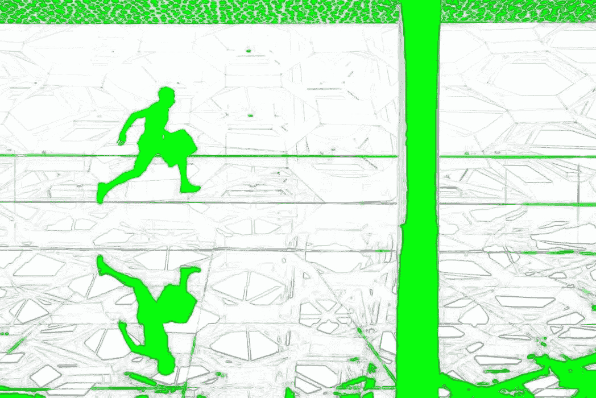

# 走向透明就是走向效率

> 原文：<https://medium.com/hackernoon/a-move-toward-transparency-is-a-move-toward-efficiency-adeb0e33a73>

> 由[Morphic therapy Inc .【的首席执行官 Praveen Tipirneni](https://www.quora.com/How-can-transparency-benefit-or-harm-new-startups-in-the-US/answer/Praveen-Tipirneni) 在 [Quora](http://quora.com?ref=hackernoon) 上最初发布。

很容易理解为什么首先会出现缺乏透明度和对隐喻墙的偏见:管理者不希望他们的员工关心与他们的具体工作无关的事情。但这是一种过时的观点。问题在于，缺乏透明度对员工的效率有着更深层次的影响，因此对公司也是如此。

有真实的成本需要考虑。在这个时代，信息优势至关重要。

但是透明涉及到更深层次的需求——做出选择的能力。这种需求是如此强大，它可能比我们的生存本能更重要。

作为首席执行官，我见过硬币的两面。我可以自信地说，透明度最高的公司将最适合实现它们的目标，因为它们迎合了人类根深蒂固的本能需求。

让我们更深入地了解透明度的作用:

**动机**

我们经常认为生存是我们最强大的需求。在《斗士的头脑:智力游戏内幕》一书中，作者萨姆·谢里丹探索了人们有意识地直接冲向危险，忽视他们的生存本能的历史证据。

他说，“我们选择违背自己最大利益的事情，因为做出选择的自由比这些利益更重要。”

想想员工。有了手头的所有信息，员工就可以决定他们的工作是否值得投入时间，而不仅仅是做他们被告知的事情。

选择是激励。

通过保持透明，你也展示了你对员工的信任。你愿意为你的员工和公司承担风险。透明度让每个员工都觉得自己受到重视，是团队的一部分。这意味着他们分享团队的目标、目的和成功。

但他们也分担了损失。

我们有保护初级员工免受损失的本能。我们遇到过这样的情况，我们在决定要有多透明。我们的担心之一是会有起伏。员工会如何看待？有些人甚至可能会离开，因为情绪低落太难处理了，尤其是那些不能把坏消息放在上下文中的初级员工。

但无论如何，我们都分享了，以巩固我们都在一起，并在低迷时期帮助激励员工。

**效率**

动力就是时间。适当的激励会带来工作场所透明度的最大好处:效率。

当每个人都可以访问时，状态会议就不那么重要了，员工可以更好地将时间花在重要的任务上。你不再需要在不了解相同信息的人或团体之间玩追赶游戏或冒沟通失误的风险。

在拥有大型多学科团队的生物制药公司，这可能是一个主要优势。

更重要的是，当目标和信息唾手可得时，员工可以主动朝着公司的目标努力。他们可以建立新的团体，为他们通常不参与的其他人做贡献，从事专门针对他们的新项目，或者在没有被告知的情况下带头。

**目的**

我们去年做了一个练习，为每个人创建了一个个人操作系统。每个人都回答的一个问题是，“让你做某事的最佳方式是什么？”几乎每个人都需要知道为什么他们被要求做某事。

当员工知道自己的工作在公司宏伟目标中所处的位置时，他们总体感觉越好，自豪感就越强。

过去，员工会收到一份战略文件，其中包含与他们的具体工作相关的各种指标、目标、假设和结果，但从来没有其他工作和部门的战略。通过获得企业级的所有信息，员工可以看到他们的工作如何在整体上发挥作用。

当人们看到全局并理解为什么他们被要求做某事时，它提供了能量和目的。

**透明科技**

新兴技术让公司比以往任何时候都更容易实现所有信息的透明。

Dropbox 和 Google Drive 等云存储服务允许在任何地点虚拟访问信息，而不仅仅是在办公室。像 Slack 这样的应用程序允许公司根据小组、部门和兴趣创建不同的渠道。任何人都可以访问每个群组或查看最新更新。

因为你可以选择自己的参与程度，某些项目和任务将只由那些必要的或感兴趣的人来承担。

当我们设计我们的新网站时，我们为网站设计创建了一个 Slack 频道。公司里的每个人都可以加入或发帖，但只有感兴趣的人才能参与。这意味着没有人会浪费时间去参加与他们无关的会议。

渠道的透明意味着任何人都可以贡献想法，无论大小，而不必承诺成为一项长期事业的一部分。

透明度让你的员工有工具和信心投入到工作中，并觉得他们值得信任，可以提出自己的解决方案。这让他们从为机器工作变成了机器的一部分。这将工作从简单的工作提升到了更高的层次。

它帮助你的员工尽可能做到最好。当你的员工以最佳状态工作时，你的公司也是如此。

> 由[Morphic therapy Inc .【的首席执行官 Praveen Tipirneni](https://www.quora.com/How-can-transparency-benefit-or-harm-new-startups-in-the-US/answer/Praveen-Tipirneni) 在 [Quora](http://quora.com?ref=hackernoon) 上最初发布。
> 
> 更多来自 Quora 的趋势科技答案，请访问[HackerNoon.com/quora](https://hackernoon.com/quora/home)。