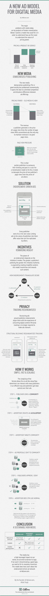

# 一种新的数字媒体广告模式

> 原文：<https://medium.com/hackernoon/a-new-ad-model-for-digital-media-5710aa417b07>

> …每一个企业的成功都是因为它做了别人做不到的事情。
> 
> –彼得·泰尔在*零对一:创业笔记，或如何构建未来*

广告对旧媒体公司来说是有利可图的，因为他们控制了他们媒体形式的发行。他们可以要价很高，因为没有人能提供相近的替代品。

数字媒体公司生活在相反的场景中；相近替代品的数量很高，并且持续上升。为了让数字广告变得可行，它们需要进行重组，以保护出版商免受竞争的侵蚀。在下面的信息图中，我展示了一个新的广告模型。

本文原载于 ideas.adlove.com 的[。](http://ideas.adlove.com/new-ad-model-media.html)