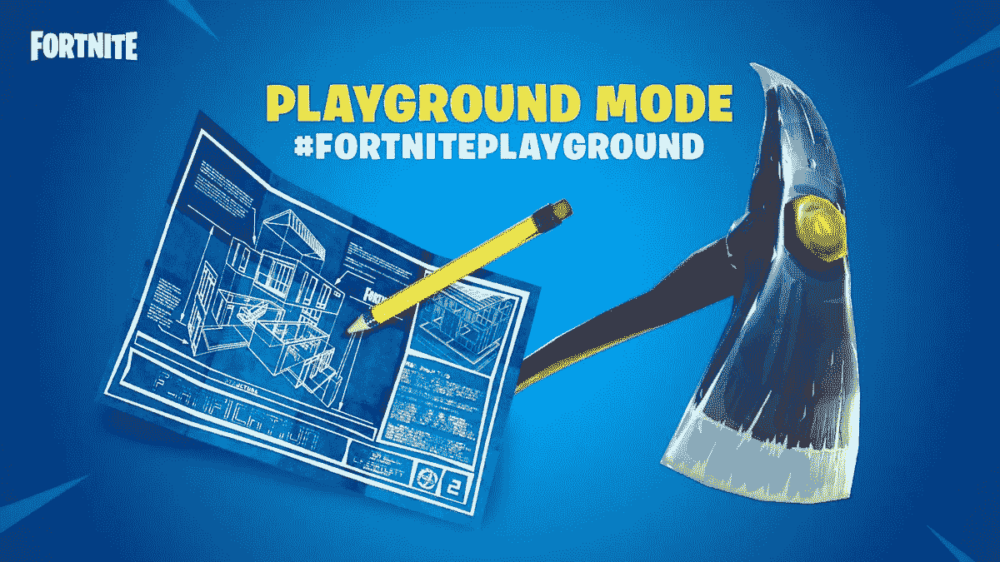
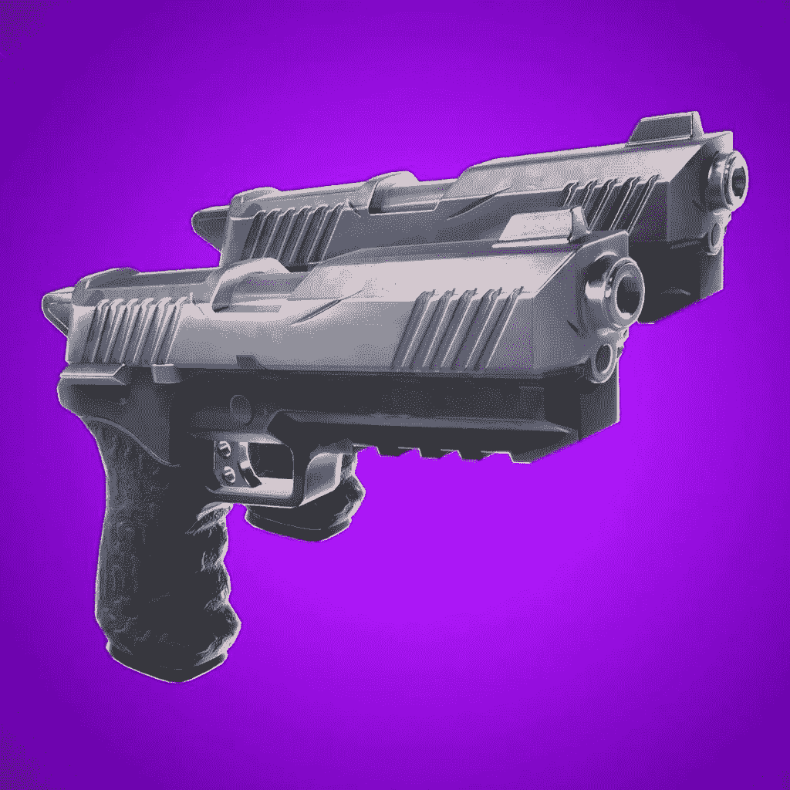
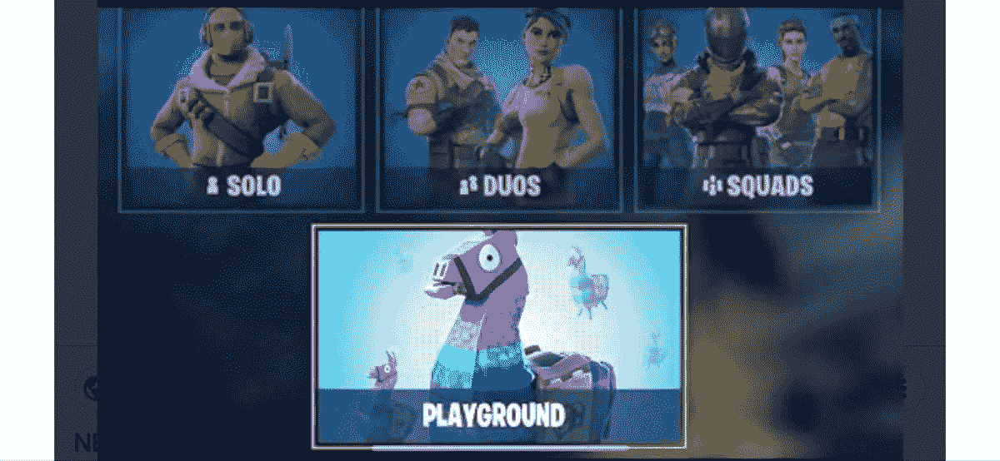
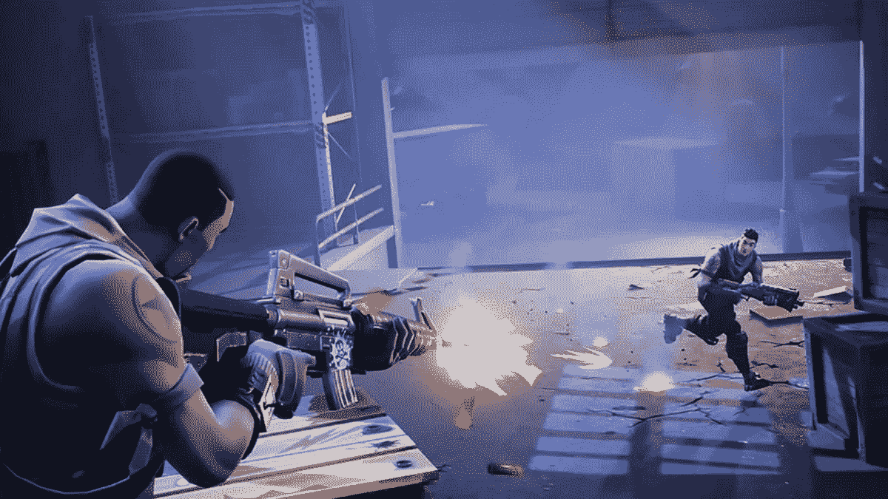
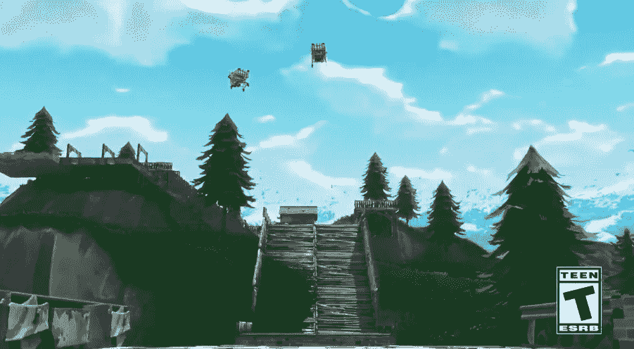

# FORTNITE 的新时代，《游乐场》的发布！

> 原文：<https://medium.com/hackernoon/a-new-era-for-fortnite-the-release-of-playground-today-9a1ea80eee2b>

# 期待已久的 FORTNITE“游乐场”于周三发布，但几个小时后就无法运行了；在推特上宣布“游乐场关闭维修，我们调查我们的婚介服务的一些问题。”

*By my disrupt _ _ 2018 年 6 月 27 日*

## 游乐场模式终于来了，地图制作器是其中一个很棒的功能，但不要急，它在发布后不久就不起作用了。它有许多新功能！

## *堡垒之夜也有双手枪，一扣扳机就能同时射击*

**

## *还有新皮肤！！*

*新的**游乐场模式**，带来更真实的场景，更干净或更少的战区。拥有良好垂直和水平架设技能的玩家可以建造像堡垒一样的建筑，比他们的对手要快得多。战略性是建筑中的关键，因为需要大量的技能和创造力。*

*在玩的时候，配对是不稳定的，但是我抓住机会计划在没有人射击的情况下建造我的堡垒*

****

*游乐场模式给所有玩家一个小时的自由时间来探索地图和工具。是完美的训练，需要学习所有需要的技能和探索游戏的全部潜力。当挖掘游戏玩家获得十倍于正常的资源。有一些很酷的新武器和装备有待发现，我发现了一些非常酷的，但我打算让玩家享受发现宝藏的乐趣。玩家能够学习如何使用游戏，而不必在这个过程中杀死任何人或保护自己，这是一个++*

**

## *操场模式的另一个新特点是武器的训练选项，这允许玩家练习瞄准对方而不杀死对方。*

**

*游戏玩家一跳下战斗巴士，就能找到练习射击的朋友，他们拥有稀有但尚未掌握的武器。或者你可以推着购物车从斜坡上跳下来，很有趣！*

*我很高兴游戏的设计者明白了所缺少的东西，操场模式，应该早点加入进来。有用！什么时候工作。练习空间对于提高技能和允许球员冒更大的风险来说是极好的。战争游戏有时会变得单调，因为玩家没有时间完全探索游戏，*堡垒之夜开发者*明白这一点。现在操场模式允许创造性，作为一个玩家，我希望充分探索。*

*现在不要以为 ***是游乐场模式，*** 的意思是玩的好看，仍然是战争游戏。玩家需要学习如何与他人一起使用自由模式，因为还没有规则。但是很高兴看到当玩家拥有堡垒之夜的所有功能时，他们能做些什么。*

> *[**你可以去*堡垒之夜*的游乐场看看，如果正在工作或者等待，就下载吧，因为值得！**](https://www.epicgames.com/fortnite/en-US/news)*

*如果你喜欢这个故事，请鼓掌，这样我会继续带给你更多。*