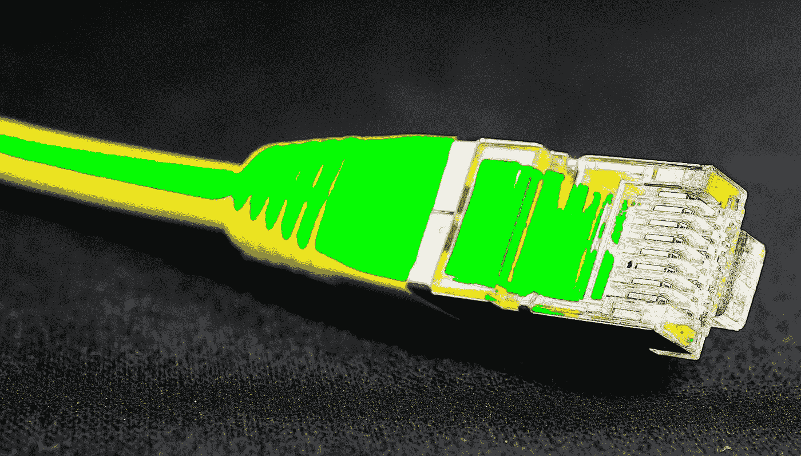

# 一个新的互联网——为什么不呢？

> 原文：<https://medium.com/hackernoon/a-new-internet-why-not-e6cbfe92bbb>

# 以下是本周十大科技新闻:

世界不需要一个新的脸书，它需要一个新的互联网。与其他数万亿美元的行业相比，互联网是一个婴儿——我们如何使用它以及另一端的人们如何从我们身上赚钱，都将发生很大的变化。*“通过数据市场将你自己的浏览活动、偏好和身份货币化的吸引力。向自我监管社区的发展——取代硅谷董事会强加的、由裸体识别机器人强制执行的“社区标准”。对集中式数据存储体系结构导致的带宽瓶颈的修复—更快、更可靠的访问。综上所述，保证* ***的不可信赖性*** *由设计决定。用户体验完美无瑕，不怕被利用。”*

[**Kin 是任天堂的 Crypto，Ted Livingston 是我们的宫本**](https://hackernoon.com/kin-is-the-nintendo-of-crypto-and-ted-livingston-is-our-miyamoto-61a2bf1168a6)**by[Eric Martin](https://medium.com/u/9c88458fdf71?source=post_page-----e6cbfe92bbb--------------------------------)。这个秘密的大众采用思想片有很大的比较。1958 年，第一个电子游戏被发明出来:这是一个类似于乒乓的游戏。2008 年，随着比特币论文《比特币:点对点电子现金系统》的出版，比特币被发明出来。但直到 20 世纪 80 年代，视频游戏才开始获得主流采用，我相信 2018 年将标志着加密货币开始通过 Kin 成为主流采用的一年。Kin 是由 Kik 创始人 Ted Livingston 推出的加密货币，很快将集成到 Kik 消息应用程序中。”**

**[**四轴飞行器物理讲解**](https://hackernoon.com/quadcopter-physics-explained-468ee44ba40b) **:** 这是 [Sanyam Bhutani](https://medium.com/u/a08b1e531f9c?source=post_page-----e6cbfe92bbb--------------------------------) 的'[飞行汽车工程师日记'](https://hackernoon.com/@init_27)系列中的第 3 部分。是时候了。来建造你自己的四轴飞行器，或者至少了解它们是如何飞行的，因为为什么不呢？！？！*“物理学认为在稳定状态下，作用在物体上的净力应该为零。因此，如果所有的转子都朝同一个方向旋转，就会产生一个净扭矩，导致整个四轴飞行器旋转。”*在[第 0 部](https://hackernoon.com/diary-of-a-flying-car-engineer-0-112b0747418a)、[第 1 部](https://hackernoon.com/quadcopter-as-the-flying-car-test-platform-diary-of-a-flying-car-engineer-1-d2e735d8e32e)和[第 2 部](https://hackernoon.com/building-a-quadcopter-components-explained-diary-of-a-flying-car-engineer-2-c9410b52fe61)中阅读更多关于[一个飞行汽车工程师的日记](https://hackernoon.com/@init_27)。**

**[**成本每合理决策(CPRD)**](https://hackernoon.com/cost-per-reasonable-decision-cprd-ed1ca8c6147) 作者[约翰·卡特勒](https://medium.com/u/4c3f4fe11e6b?source=post_page-----e6cbfe92bbb--------------------------------)。科技行业正在做出合理的决定吗？衡量过去决策能力的指标或 KPI 能推动更合理的决策吗？*“与需要几分钟的“6”决策相比，需要几天/几周/几个月(和很多人)的“8”决策的增量价值是多少？你的决定是不是太大了(反馈循环太长了)，以至于如果事情变糟，你就不能早点抽身，或者如果事情进展顺利，你就不能双倍下注？有些决定就是这样。大多数都不是。”***

**[**Python 最快的版本是哪个？**](https://hackernoon.com/which-is-the-fastest-version-of-python-2ae7c61a6b2b)**[安东尼·肖](https://medium.com/u/ec39004dd57f?source=post_page-----e6cbfe92bbb--------------------------------)。你想知道吗？我告诉你并不能证明什么，除非你阅读了它是如何被测试的，但是不管怎样，Python 3.7 是“官方”Python 中最快的，PyPy 是我测试过的最快的实现。随着 Python 2 的使用越来越少，我希望看到 PyPy3 在未来的表现与 PyPy 一样好，甚至更好。”****

****[**在网上匿名，重获自由**](https://hackernoon.com/becoming-anonymous-on-the-internet-and-gaining-back-your-freedom-e888ad5a13be) 作者[亚当](https://medium.com/u/e0cba1f3a5d?source=post_page-----e6cbfe92bbb--------------------------------)。互联网能一直匿名访问吗？几天前，@iamdylancurran 写了一条推特，这条推特迅速走红，甚至连爱德华·斯诺登也转发了这条推特:“想把自己吓坏吗？我会让你知道脸书和谷歌在你不知情的情况下储存了多少你的信息。“我决定利用 TweetStorm，把它变成一个网站，为普通非技术用户提供简单可行的提示，让他们开始重获自由。”****

****[**感谢脸书，现在我们都知道为什么隐私很重要**](https://hackernoon.com/thanks-facebook-now-we-all-know-why-privacy-is-important-fccd630d73d1) 作者[亚历克斯·马辛斯基](https://medium.com/u/5d291010601c?source=post_page-----e6cbfe92bbb--------------------------------)。脸书对你的了解之多可能会让人害怕…但是另一种选择会是什么样的呢？分散化让事情变得更强大，因为它减少了可能导致失败的单个点的数量。然而，我们当前的世界由大规模的中央机构组成，这些机构收集了不计其数的个人数据(通过点击或点击签署的难以理解的合同获得了我们的许可)。”****

****[**一个秘密交易者的日记——第一周**](https://hackernoon.com/a-crypto-traders-diary-week-1-e2e1a1785895) 大卫·吉尔伯森。非常有趣的开头……”*也许连续几个小时盯着图表会让我厌烦到流泪。但我希望我最终能和这张图表合二为一；我会看到它的个性，像一条宠物蛇。我会知道它在一天中不同时间的行为方式，感觉它什么时候饿了，什么时候需要上厕所，什么时候保持清洁，什么时候给它一点点拍打。”*****

****[**货币的历史&比特币和加密货币经济的未来**](https://hackernoon.com/the-history-of-money-the-future-of-bitcoin-and-the-cryptocurrency-economy-5cc25e808275) 作者[肯尼李](https://medium.com/u/f9523f18e303?source=post_page-----e6cbfe92bbb--------------------------------)。密码！它有一美元所拥有的…但也许更少的偏见原则？"*比特币的价值主张不是数字货币——现有货币的 90%只作为数字货币存在；比特币的价值主张是其保证数字货币可信度的方法。”*****

****[**我是如何成为产品经理的:马纳斯·j·萨洛依**](https://hackernoon.com/a-suitable-job-or-how-i-became-a-product-manager-53af1f5e2277)一段(14 分钟)的职业回顾。如果可以，把你的专业知识传授给下一个有抱负的专业人士。这个帖子已经起草了一年多了。我写这篇文章是为了回应我在 Linkedin/Twitter 上收到的无数询问如何进入产品角色的信息。在过去的 5 年里，我为各种创业公司工作，开发了一些有趣的产品，并从开发人员转变为产品经理。这也是我试图总结我现在的职业生涯，包括从我以前的工作中学到的东西。”****

****亲切的问候，****

****[大卫·斯穆克](http://www.davidsmooke.net/)，[阿米](http://twitter.com/ami)****