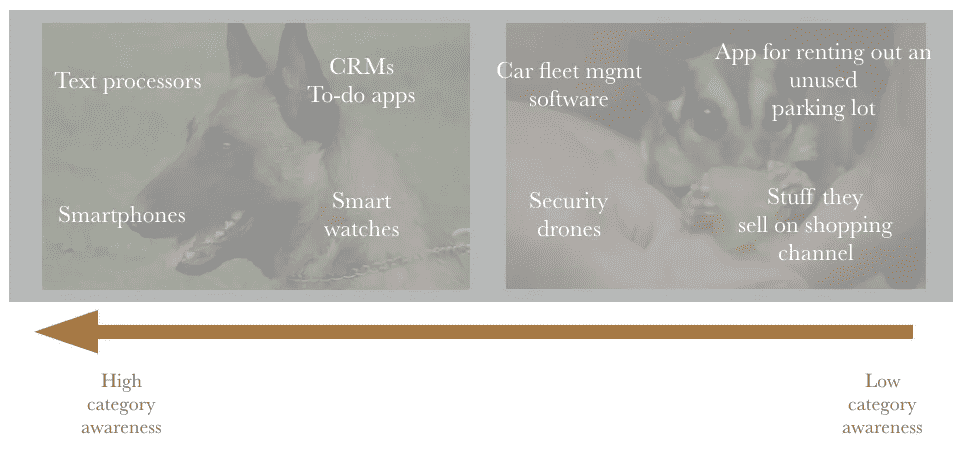
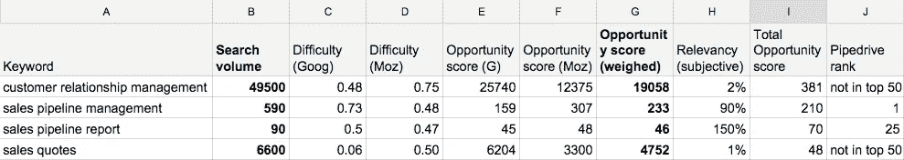
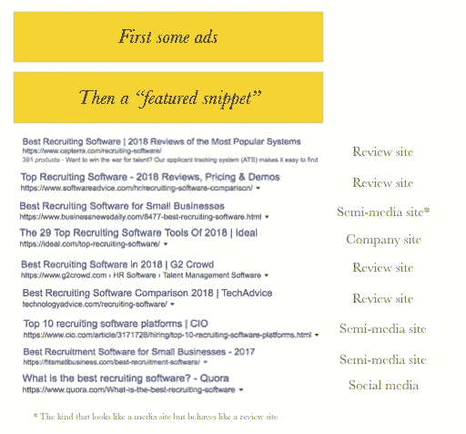

# 创业公司的无废话营销框架非常简单，甚至营销人员都可以使用

> 原文：<https://medium.com/hackernoon/a-no-bs-marketing-framework-for-startups-that-is-so-simple-even-marketers-can-use-it-3f3f1dc731d7>

> “看来我们的产品符合市场需求。我们应该投资哪些营销渠道？”

这可能是创业社区中最常见的问题(就在*“我们如何给我们的 ICO 定价？”)*。在多年来回答了几十次之后，我现在认为我有了一个可靠的答案，相当于在一个陌生的城市里有一张地图。你仍然可能会迷路，但是很有可能到达你想去的地方。

准备好了吗？建立营销计划从评估品类认知度开始。

# 第一步。地图类别意识:你是护卫犬、糖滑翔机还是两者兼而有之？

为了说明这一点，请和我一起绕着宠物走一圈。如果你觉得需要一个能陪伴你的人来保护你的财产，你可以养一只看门狗。你大概知道会发生什么事情，也知道照看一只狗的生意是如何运作的。如果你不想养狗，再多的广告也不会说服你去养狗。

在光谱的另一端是糖滑翔机。没有人某天早上醒来谷歌*“买一架糖滑翔机”*。但是这个瞪着眼睛的生物有点可爱。有可能你看到一只宠物的照片，立刻决定你需要一只，即使你不是在找宠物。

养狗通常不是一件冲动的事情，这个决定是在对狗有一定了解的基础上做出的。**当品类认知度很高时，决策就是这样制定的**。养一只糖滑翔机这样的宠物就不一样了。这不一定是一个冲动的决定，但通常情况下，对动物(或工具或旅行目的地)的**意识****会产生一种需求或想要作为副产品**。

Examples of software tools and gadgets with various levels of category awareness

> *“但是我的邻居看到动物救助中心广告上的一只可爱的小狗并决定收养它怎么办？”。*

问得好，我正要说到这一点。

就像生活中的几乎所有领域一样，有一个范围，很少有产品处于极端。我说的产品是指产品的受众。

让我们来看看待办事项应用程序。一些生产力爱好者从 9 岁就开始使用这些应用程序，他们使用一个待办事项应用程序只是为了勾掉他们已经使用过的待办事项应用程序。他们 **100%了解类别**。还有一部分人在过去的 20 年里一直愉快地在冰箱上使用便利贴。也许他们最近承担了很多额外的责任，并且/或者他们已经开始忘记事情了。

给他们看一个待办事项应用程序，它的效果就是给他们看一个非常可爱的宠物。他们很快就能意识到问题、类别和解决方案。

如果你在销售类似待办事项应用程序的东西，你知道你需要向知道类别和不知道类别的人推销。你在卖飞鼠的同时也在卖狗。

# 第二步。基于类别意识，广泛选择渠道和策略

如果你知道你所经营的市场在品类认知度方面处于什么位置，你就可以优先选择渠道。

如果类别意识已经建立，一定数量的人已经在寻找解决方案。最有效的营销方法是收获需求(而不是创造需求)。当人们在寻找某样东西时，你只要在场并能被发现就行了。我们稍后会谈到如何做到这一点，但如果是人们 ***搜索*** 寻找解决方案，那么(doh)最好的渠道是*搜索*引擎优化、付费搜索和补充搜索的媒体渠道类型。

如果你的观众中大多数人没有明显的类别意识，你就需要创造它。你需要打断别人的思路，在竞争相同注意力的人群中脱颖而出。因为他们没有积极寻找解决方案，渠道是人们花费(阅读:浪费)大量时间的地方。Instagram、脸书、Twitter 和其他社交渠道是显而易见的起点，但传统媒体(和公关)也值得记住。

请注意，频道列表并不详尽。许多渠道在品类认知度谱的两边都同样出色，例如活动或品牌广告。

注意:下面的第 3 步和第 4 步是最有用的，如果你卖的是看门狗或狗-松鼠混血儿(打个比方)。如果你是 100%糖滑翔机类型，请随意跳到第 5 步。

# 第三步。做关键词研究，一路

[关键词研究](https://moz.com/beginners-guide-to-seo/keyword-research)是从数量、竞争力和相关性方面分析搜索查询的过程。数量越多，与你的工作越相关，竞争越少，越好。这个术语通常出现在搜索引擎优化的上下文中，但是就像计算机不仅仅是一个文本处理器一样，这个实践可以提供更多。

是的，关键词研究指导你的搜索引擎优化和内容营销工作，但如果你在这个过程中增加一个步骤，它可以为你提供一个详细的计划，优先考虑哪些渠道。关键词研究还能让你了解目标受众使用的语言。

我的建议是至少花几天时间来做这个练习，最好让除了你的内容营销商或代理之外的人参与进来。这是一个非常重要的话题，不能让看起来有资格的人来做，因为它不仅指导内容战略，还指导整体收购战略。

还和我在一起吗？你会喜欢下一步，以及如何不复杂的营销。

# 第四步。确定你需要掌握的特定渠道(和策略),以便被发现

让我们假设你已经做了关键词研究，找到了一个人们用来发现你的工作中的工具和见解的关键词列表。如果你是一家早期的 ie 公司，我建议挑选 10-20 个关键词来关注。在你雇佣第二个专门的内容营销人员之前。你可能想要一个健康的组合:一些数量巨大的头尾宽泛术语，一些高意图长尾术语，一些竞争术语(如*“mailchimp 的替代品”*)和一些低意图/教育性术语。

好消息是**现在你知道在接下来的 3-6 个月里你需要关注哪些渠道**。

现在让我们假设“最佳招聘软件”是您选择的高优先级关键词之一。这是谷歌列出搜索结果的第一页:

如果你想被找到，你想被列在哪里？是的，这是一个反问句。

一个典型的答案是*【第一家有机上市】*，这没错。同样的还有*“页面上的某个地方”*或*“付费列表之一”*。但是这些都是不够的，因为它忽略了人们可能会出于许多原因中的一个点击第二、第三或第七个列表。

所以这个问题的最佳答案是“**至少一个付费列表和所有免费列表**”。这样，人们发现不了你的产品或服务的可能性非常小，与他们点击的位置无关。

当然，不可能出现在所有的位置上，因为从本质上来说，有些搜索结果是你的竞争对手的，让你的标志出现在那里是一个相当高的要求。但是你可以出现在所有的列表网站，媒体文章或评论，用户生成的内容网站，如 Quora，视频列表，博客等。

你可以把你的营销计划想象成一个矩阵，其中大约有 15 个关键词和 10 个搜索结果。总共有 150 个位置。其中 50 个被你的竞争对手占据了。太好了，这样聚焦就容易多了。

比方说，Quora 有 4 个位置，Reddit 有 3 个，媒体文章和博客文章有 32 个，GetApp 等列表网站有 20 个，维基百科条目有 5 个，Youtube 视频有 8 个，其他网站有 28 个。

恭喜你，你已经准备好了你的营销计划蓝图。你确切地知道哪些关键词是你需要瞄准的，哪些频道是你需要关注的。在上面的练习中，它是评论站点(即。审查管理和一些 PPC 计划)和(半)媒体网站。

# 第五步。最大化推荐，您最有效的“渠道”

虽然基于关键词研究的规划对大多数初创公司来说非常有效，但有一个渠道甚至更有效:推荐。

是的，与“付费搜索广告”不同，推荐实际上并不是一种策略或渠道，但它有助于将推荐视为一种渠道。因为无论你是在卖“看门狗”还是“糖滑翔机”，如果你在做一件不太引人注目的东西，大多数未来的顾客都有可能通过推荐发现你。

获得更多的推荐更多的是产品和客户服务，而不是营销问题，但营销人员仍然可以做很多事情来推动这一点。营销可以(也应该):

*   建立**测量基线可接受性**的流程(如每月 NPS 调查)，
*   对询问和给出建议的原因产生**见解**。一个简单的调查是一个好的开始，你可以通过简单的测试来跟进，
*   **简化信息**给润滑做推荐，
*   以建立**推荐计划**的形式提供触发和奖励。正如我在之前所写的那样，这里最好的方法是不要在激励和推广方面做得过分。

# 第六步。执行、衡量、重复，并保持耐心

就是这样。使用这个框架，你可能会想出一个可靠的执行计划。

当然，在执行之前，您可能需要牺牲一些宝贵的开发时间来进行适当的跟踪。

不管事情是否“运转”,我都会每 6 个月左右进行一次营销计划练习。类别意识不是固定的，而是不断变化的。关键词研究永远不会“完成”，一些搜索术语越来越受欢迎，另一些则日渐式微，最重要的是，总有一些你还没想到的好关键词。可用于执行的资源往往会发生变化，希望是变好，而不是变坏。

最后但同样重要的是，你需要有一些耐心。我们的银河系中大约有 3000 亿颗恒星，几乎和创业公司一样多。渠道已经饱和，事情比以前花费更多的时间和金钱。

# 让我们回顾一下

评估品类认知度是一个很好的起点，因为这可以让你对目标受众产生共鸣，并有助于了解你是否能够坚持推动知名度和推荐，或者需要努力提高对你的品类的认知度和需求。**品类认知帮助您对渠道和策略做出第一选择**。

**做关键词研究能让你洞察**你需要创作的内容类型、你需要使用的语言类型，以及最有效地将你与寻找类似产品的人联系起来的渠道。

而且不管你是卖“看门狗”还是卖“糖滑翔机”，**获得推荐可能是你获得客户最有效的手段**。

快乐成长！

*PS。我写过更多这样的关于创业营销的帖子。在 Medium* *上关注我的* [*或者来访问我的*](/@andrus) [*博客*](http://purde.net/2018/03/startup-marketing-plan/) *(这里发表了这篇文章的早期版本)。*