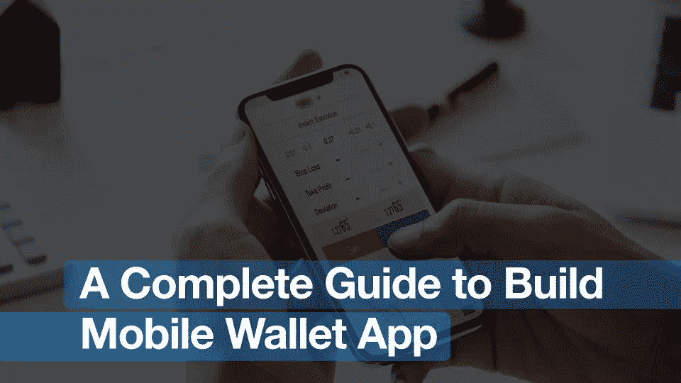
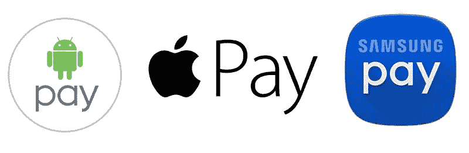
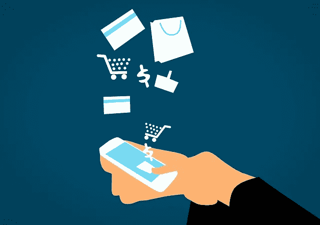
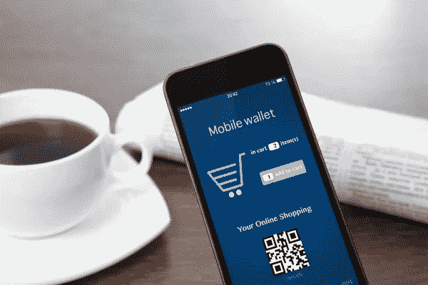
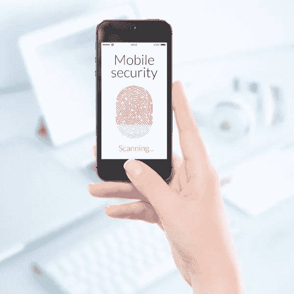

# 2018 年打造安全移动钱包应用的简明指南

> 原文：<https://medium.com/hackernoon/a-no-confusion-guide-to-build-a-secure-mobile-wallet-app-in-2018-917fc4b95dd2>

> 移动钱包应用程序开发是电子商务的未来。句号。

从 2017 年最后一个季度开始，我们见证了移动钱包应用程序已成为增长最快的数字产品之一。你同意吗？我想大多数人都会点头同意。

据统计，全球移动支付应用的收入从 4500 亿美元增长到 7800 亿美元。在美国，25-34 岁年龄段的消费者中有 45%使用 P2P 支付。35-44 岁的下一个年龄组显示出 37%的增长。

> 专家预测，2019 年收入将超过 1 万亿美元。

根据目前来自印度市场的报告， [RBI 确认移动支付增长了 16%](https://www.business-standard.com/article/companies/mobile-wallet-transactions-rise-16-in-may-rbi-s-monthly-bulletin-118071100061_1.html)。此外，随着像 Paytm 或 [Google Tez 这样的应用程序的出现，在线钱包应用程序使事情变得有条不紊。](https://www.innofied.com/google-tez-vs-apps-like-paytm-wallet%E2%80%8A/)

# 为什么要搭建手机钱包 App？

超过 12 亿人可以使用具有支付能力的银行账户。但是，你也会发现超过 50 亿的手机用户。这表明拥有手机的人比银行用户多。因此[手机钱包应用开发](https://www.innofied.com/financial-app-developers/)对于初创公司、中小微企业或大型企业来说可能是一个投资的好主意。因为每个金融机构都喜欢通过一系列移动应用程序来增加他们的客户群。

移动支付应用程序开发并不是什么新鲜事。这些类型的应用程序在市场上已经存在很长时间了。手机钱包应用程序可以将手机变成一个更智能、更具互动性的设备。它让在线支付、代金券、优惠券和积分卡的世界变得更有价值。但是你需要的是一个完整的构建移动钱包应用的指南——这可能就是你正在寻找的。

# 数字钱包应用有什么好大惊小怪的？哪些行业可以从电子钱包中获益？

现在，在推出了谷歌支付、T2 苹果支付和 T4 三星支付之后，在线支付行业肯定会有所动作。但它特别青睐一些行业，我认为这让世界对在线支付应用变得狂热起来。

移动钱包应用程序不过是一种支付服务/渠道，用户可以使用智能手机发送或接收资金。它可以存储您的信用卡/借记卡信息、数字货币、门票和会员卡，您可以随时使用它们进行购物。

然而，与金钱相关并不意味着它只是帮助金融业繁荣发展。有更多的行业和垂直行业正在利用移动支付应用程序开发的优势。

**#1。零售和电子商务业务**

零售和电子商务行业尤其充分利用了移动钱包应用。它们允许存储关于交易的信息，以优惠券、奖金、积分卡等形式进行支付。如果您想要创建一个电子商务或零售业务应用程序，您需要了解支付网关集成趋势，并保持更新。

> **红利阅读:** [让交易更安全的 5 大支付行业趋势](http://seeromega.com/5-payments-industry-trends-will-make-transactions-secure/)

**#2。金融机构**

您可以使用各种信用卡或借记卡，为客户提供多种服务。为了实现无卡，金融公司集成了移动钱包应用程序，其中信用卡和借记卡的存储信息使客户可以直接进行交易。

**#3。电信公司**

电信公司允许消费者使用移动钱包应用程序来支付账单、充值，甚至向其他账户汇款。

**#4。运输和物流公司**

你一定试过奥拉和优步，看到他们如何让你通过数字钱包支付。他们甚至在优步建立了自己的移动支付应用，如 Ola Money 或 integrated [Paytm](https://paytm.com/) (印度移动钱包应用)。

**#5。食品、杂货和基于事件的企业**

从支付电影票到你最喜欢的戏剧表演。甚至当你钱包里没有现金或者在超市购物时，你也可以点一份食物。一款 NFC 支付应用让客户在这个忙碌的世界中变得轻松。

如果你已经登陆了这篇文章，我可能会假设你要么是在寻找正确的方法在" ***如何建立一个手机钱包 app？*** “然而，在此之前，你需要确定你需要的数字钱包的类型，研究市场，在锁定潜在客户时要聪明，并确定你想要提供的用户体验。在你确认所有这些方面之后，确定你喜欢集成的功能，因为你添加的功能总数将反映在应用程序开发的[最终成本](https://www.innofied.com/what-is-the-cost-of-app-development/)中。

# 如何创建简单安全的移动支付应用程序的提示和技巧

如果你想为一个特定的商店或一般用途创建一个电子钱包，你需要知道一些有用的提示和技巧。这是一个严重的问题，当你想建立这样一个应用程序，因为它有太多的复杂性。因此，快速调查以下内容非常重要

# #1.你做作业了吗？你研究过市场吗？

对于任何应用程序开发过程，不管是哪个行业，你都需要做足功课。由于数字化，我们可以在网上寻找任何信息。因此，稍微深入一下，我们就可以避免其他在线支付应用程序犯的常见错误。你可以在 [ThinkMobiles](https://thinkmobiles.com/blog/top-digital-wallets/) 中浏览这篇精彩的文章，它讲述了表现最佳的移动钱包应用程序是如何打破所有刻板印象的。

# #2.在讲述你的应用程序的主要目的时要聪明

你必须以你的目标受众真正想要使用的方式来创建应用。为了做到这一点，决定你想用产品解决的问题，你将提供的服务，以及谁可以使用该应用程序。根据年龄、习惯、职业等将顾客分组，以预测每一类顾客的需求。如今奖励数字钱包的需求很大，所以给他们一个忠诚于你的安全钱包应用的理由。你开展的应用营销活动应该关注潜在客户、个性化优惠和显示产品用途的相关内容。

> **红利阅读:** [如何发起一场 app 营销活动？](https://www.innofied.com/how-to-launch-an-app-successfully/)

# #3.选择您的钱包类型

在你确定了你的移动钱包应用的平台之后，现在轮到选择钱包的类型了。嗯，有一些常见的类型是突破性的

1.  在移动运营商的帮助下收发钱的钱包
2.  通过中小企业冲销资金的公司
3.  另一种是通过网络支付
4.  使用 NFC 发起非接触式支付的钱包

# #4.你必须坚持的用户界面

对于应用程序的成功，用户界面和 UX 是不可避免的一部分，因此你的在线支付应用程序的用户界面应该反映主要目的。你的首要任务是参与度、可读性、吸引人和令人难忘的图标和品牌名称。你的应用程序屏幕的层次结构也应该是合适的和符合逻辑的。每一次滑动、触摸和点击都应该足够有价值。确保应用程序是用户友好的，对用户来说不那么复杂。

请务必与您的移动钱包应用程序开发合作伙伴讨论开发您的支付应用程序所需的时间，因为在正确的时间推出它对于应用程序的成功非常重要。

> **下载:** [打造一款手机钱包 App 实际需要多长时间？](https://www.innofied.com/lp/free-guide-to-know-how-long-it-takes-to-build-an-app)

# 哪些功能使您的移动钱包应用程序开发与众不同？

当你使用移动支付应用时，你必须考虑一些基本功能。其中一些是寻找和满足客户需求的正常方式，例如——

*   用户注册或登录
*   授权银行账户/信用卡/借记卡
*   添加和检查帐户余额
*   资金转移
*   账单支付/充值
*   折扣/兑换优惠券

我们知道移动钱包应用程序开发是一个成熟的业务解决方案，它可以与您的客户建立联系，并增加忠诚客户的强大数据库。然而，一些更多的附加功能可以为您提供有用的体验，并可以帮助您的在线支付应用程序脱颖而出。这包括-

*   忠诚卡
*   通过广告活动奖励优惠
*   礼品卡
*   推送通知
*   地理标签的集成
*   会员卡

现在，让我们来看看除了这些列出的特性之外，您需要考虑的一些特殊想法。雇用在金融应用程序开发方面有丰富经验的移动应用程序开发人员，或者您可以简单地浏览一下我们的指南，了解一个金融软件实际上需要具备哪些主要功能:

> **红利阅读:** [完整的财务软件开发指南](https://www.innofied.com/fintech-software-development-guide/)

# 手机钱包应用程序是如何工作的？

我们通常知道如何使用电子钱包。您需要打开应用程序，并使用 PIN 码、密码、指纹扫描仪等对应用程序进行授权。然后你会发现用户选择一个卡或银行帐户，并计划使用这个帐户执行任何类型的当前交易。然后，用户可以“**应用优惠券**”进行交易(如果可用的话)。为了实现这个目标，用户应该连接到支付终端。

在整个过程中，移动支付应用使用了多种技术，下面我们来列举一下。确保你与你的应用程序开发合作伙伴交流，并接受你更喜欢在应用程序中使用的技术。

1.  **NFC 技术传输支付信息**

这是一种非接触式远程技术，可在 10 厘米的距离内工作，为用户提供智能手机和 PoS 设备之间的安全和非接触式支付。这项技术的工作原理几乎和蓝牙一样，但它是立即连接的，而蓝牙需要十分之一秒。这项技术具有多功能性，即使兼容设备没有电源也能正常工作。在这种技术中，支付是由于从移动设备到支付终端的自动支付和信息提取而进行的。如果移动钱包应用程序支持[主机卡仿真](http://www.sequent.com/host-card-emulation/)，用户需要有适当的互联网连接来关闭该过程。

**2。蓝牙和 iBeacon 也用于支付**

iBeacon 允许无线电信标以极低的功耗启动非接触式数据交换。设备以不间断的方式发射信号，由具有 BLE 的智能手机接收，并位于 70 米的显著范围内。用户只需激活蓝牙来接收无线电信标。iBeacon 技术允许发送关于各种广告活动、折扣券以及它们何时落入无线电信标范围的个性化报价。它增加了客户的兴趣，当你选择 iBeacons 时，不要犹豫。

3. **QR 码是可接受的支付方式之一**

通过使用 QR 生成器等特殊服务，您可以帮助加密信息并创建代码，在收据表格上添加生成的 [QR 代码](https://en.wikipedia.org/wiki/QR_code)的图像。客户需要在他们的移动应用程序屏幕上看到代码，并从他们的银行账户进行支付。他们应该确认输入密码的过程。客户通过电子邮件收到付款收据，这使您可以安全地使用手机钱包。

# 在开发手机钱包应用程序时，安全性是第一位的

安全性是您在构建在线支付应用程序时应该考虑的最重要的因素之一。没有人愿意看到自己的钱被偷。因此，通过使用以下技术，移动钱包应用程序开发公司试图从各个方面确保这项服务的安全。

**点对点加密—** 为整个交易流程提供保护的强大安全工具之一。它开始加密，只要你的手机刷过 PoS 终端，然后资金，最后授权。因此，如果你雇佣了一个移动应用程序开发者来开发一个类似的应用程序，比如 Paytm 或 Google Tez，请确保启用这个安全的交易流程。

**令牌化** —这项技术借助可靠的数据连接，使在线支付更加安全。买方不使用卡向他或她的卖方提供支付细节。因此，所有的卡信息都是加密的，并被转换成一个所谓的令牌，看起来像一个类似的随机数。

**密码** —密码是任何一个 app 或网站的保护措施，每一个拥有个性化细节的 app 都应该拥有。最好添加拒绝功能，以防客户输入非常简单和简短的密码，这将有助于使安全性更强。如果智能手机有指纹扫描仪，我们可以另外添加生物识别支持。

> **红利阅读:** [如何雇佣手机 App 开发者打造安全的在线支付 App？](https://www.innofied.com/how-startups-can-hire-mobile-app-developer/)

# 让你的移动支付应用成为下一个神奇的球

在这篇文章的最后，我们想喘口气说，无论是一家老牌企业还是一家新的初创企业，谁想推出移动钱包应用程序，或者最近觉得该应用程序必须确保几件事

*   他们为什么要开发移动应用程序？
*   调查他们正在尝试构建在线支付应用的特定行业。
*   研究市场上的同类 app，找出它未能解决的痛点。
*   选择适合企业的钱包类型
*   看到并找到更好的用户交互界面
*   仔细选择你的手机钱包应用程序的功能
*   你需要知道手机钱包应用程序是如何工作的，以及哪种技术是最好的
*   首先考虑你的安全。

确保你为用户而不是为你自己创建一个移动支付应用。你的应用程序将被普通人使用，他们并不都懂技术。用户更喜欢一个简单的平台来访问服务。他们没有时间从头开始理解你的应用。另一件你必须要求你的移动应用开发者关注的事情是应用性能。移动钱包应用程序应该更轻便，具有所需的功能并经过全面优化。

最重要的是，无论何时你雇佣移动应用开发者，一定要和他协商完成应用的时间。因为你在市场上发布应用的时间也是一个重要的成败因素。

# [下载我们独特的指南，了解构建一个移动钱包应用程序实际需要多长时间。](https://www.innofied.com/lp/free-guide-to-know-how-long-it-takes-to-build-an-app)

**作者简介—** 微软产品的技术作家对增长黑客有着浓厚的兴趣。 ***Moumita*** 拥有 7 年的行业经验，帮助优化和促进 B2B/B2C 业务的最新内容趋势。她用来自谷歌、雅虎、推特、脸书等的最新内容更新她的圈子。当她不写博客或挖掘内容营销策略时，她会边喝咖啡边用 Kindle 放松。

> [点击此处查看原文](https://www.innofied.com/complete-guide-to-build-secure-mobile-wallet-app/)