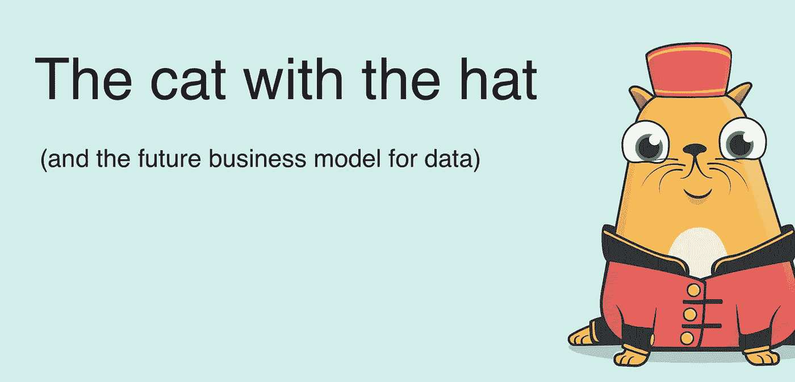

# 不可替代的令牌(NFT)商业模式关于拥有对象的对象的俳句

> 原文：<https://medium.com/hackernoon/a-non-fungible-token-nft-business-model-haiku-about-objects-that-own-objects-95fd6948ba26>

## 戴着赚钱帽子的数码猫

[source kitty](https://steemit.com/steemhunt/@urbangladiator/kittyhats-hats-apparel-and-accessories-for-your-cryptokitties)

# 不可替代的令牌(NFT)商业模式俳句

首先你买一只猫，
然后你给你的猫买一顶帽子，
你的猫拥有这顶帽子。

这是一顶神奇的帽子，
帽子出现在地图上，
老鼠使用的地图。

现在马特喜欢你的猫。
但是当你把你的猫卖给马特时，猫会拿走它的帽子。

老鼠会付钱给帽子，
这样它们就能找到猫，
帽子会付钱给马特的猫。

猫付钱给马特。你不希望你还有那顶赚钱的帽子吗？

灵感来自于弗雷德·威尔逊和克里斯·迪克森在令牌峰会上的谈话。

> 猫=你的数据
> 
> 帽子=从数据中洞察你是谁
> 
> Matt =您向其提供数据以换取服务的第三方平台。
> 
> 地图=数据经纪人
> 
> rat =想给你找对广告的广告商

[NFTs](https://hackernoon.com/tagged/nfts) 可用于通过租赁数据访问权和将[机器学习](https://hackernoon.com/tagged/machine-learning)转移到联合学习，将人们纳入其数据所创造的价值中。

我在下面的文章中解释了这个想法以及它与个人数据的关系。

 [## 数据市场:我们需要考虑使用像性这样的个人数据，每…

### 让人们在没有知情同意的情况下出售他们的个人数据是一个可怕的想法。

hackernoon.com](https://hackernoon.com/data-markets-we-need-to-think-about-using-personal-data-like-sex-your-consent-is-required-every-8df8c5a5dcd8)