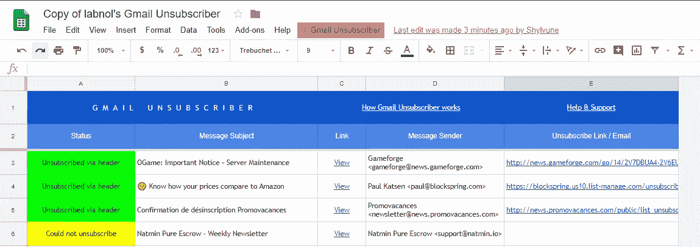
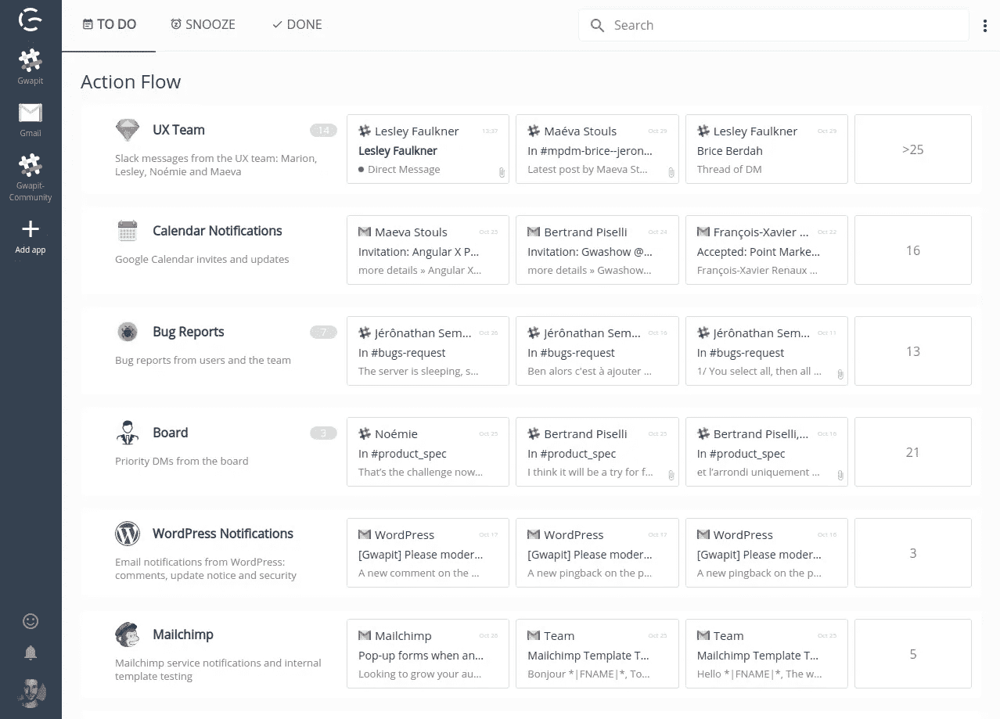

# 使用 Gmail 实现零收件箱的实用指南

> 原文：<https://medium.com/hackernoon/a-practical-guide-to-achieving-inbox-zero-with-gmail-8028e32739bd>

电子邮件超载对工作效率、注意力持续时间和压力都有严重影响。在我们的上一篇文章中，我们分析了电子邮件超载的后果，并提出了一个 [7 步法](https://gwapit.com/blog/email/farewell-email-overload-prioritization/)来遏制它。

今天，我们将采取一种更实际的方法，看看你可以使用的工具(与 Gmail 一起)来减少你收到的电子邮件数量，并加速它们的分类。我们将首先研究 Gmail 的内置功能，然后提出一些工具来扩展它们。

# GMAIL 内置功能

在我们研究扩展 Gmail 功能的解决方案之前，让我们看看我们可以利用内置功能做些什么。多年来，谷歌增加了几个功能来帮助用户对电子邮件流进行优先排序。

## 使用“收件箱”进行高级分类

收件箱是 2015 年向公众发布的新产品。它的目标是**将你的邮件分类。**
收件箱现在有两种不同的方式:你可以用它来代替 Gmail，方法是访问收件箱网站[。](https://inbox.google.com/)

独立产品有多达 8 个捆绑包:`Trips, Saved, Purchases, Social, Updates, Forums, Promos, and Low Priority.`开箱即用，捆绑包的准确性并不完全是一流的，但随着您的改进，它会变得更好。

收件箱带来了许多其他令人兴奋的功能，例如批量存档电子邮件，休眠重要邮件以稍后回复，或者在不离开应用程序的情况下创建提醒。可悲的是，[谷歌正在关闭它](https://gsuiteupdates.googleblog.com/2018/09/inbox-by-gmail-shutdown.html):到 2019 年 3 月底，Inbox 将不再作为独立产品提供。

如果您想保留 Gmail 提供的所有其他功能，**您也可以在普通 Gmail 网站上激活收件箱**。只需进入右上方的⚙️>配置收件箱。Gmail 版本最多有 4 个类别:`Social, Promotions, Updates, Forums`。

## `IMPORTANT`的特色

在 Gmail 中，有几个内置的优先级系统，其中重要的标记。它看起来像你的电子邮件旁边的一面黄旗。

有两种方法可以使用它:

*   默认情况下(在新的 Gmail 收件箱上)，您可以手动将每封邮件标记为重要或不重要。

*   在设置>常规中，激活`personal level indicator`设置会让**谷歌自动为你标记邮件**。您仍然可以手动与标记进行交互，这将提高自动标记的精确度。

## 轻松取消订阅

多亏了一个小脚本，你甚至不用离开邮箱，只需点击几下鼠标，就可以取消订阅时事通讯。Il 将**自动让你退订那些你给了特定标签**的邮件。

设置它只需要几分钟:

1.  [将纸张](https://docs.google.com/spreadsheets/d/18hVYvHMeM1R7a_leHxGGjp2qzgRSd_-o7HxTF4-CM70/copy)复制到驱动器上，然后打开。
2.  点击页面顶部的`Gmail Unsubscriber`箭头，然后进行配置。你必须授权脚本，然后选择一个标签。这就是脚本运行所需的全部内容。
3.  现在进入你的邮箱，将所有不想要的邮件标记为`unsubscribe`。每隔 15 分钟，该脚本会检查您的邮箱，取消您的订阅。
4.  Google Sheets 会自动填充你取消订阅的所有服务。

你可以感谢 Amit Argawal 的剧本。

这种方法很快就能建立起来，很容易使用，可能会节省你很多时间。用到了骨子里！

## 标签走得更远

标签可以被证明是超级有用的，不仅仅是清理不需要的东西。您可以根据需要创建任意多个并嵌套它们。标签特别有用，因为它们与其他 Gmail 功能集成在一起，如过滤器、搜索或优先收件箱(设置>收件箱>收件箱类型)。

优先收件箱将你的收件箱分成 4 个部分(默认为`Important and Unread, Starred, Everything Else`)。您可以将它与您的自定义标签混合使用。

## 掌握 GMAIL 搜索操作符

有没有花太多时间去找一封旧邮件？多亏了星号或重要标签，重要信息应该已经和你邮箱的其他信息分开了。有时这还不够:这就是搜索修饰符发挥作用的时候了。

修饰语的效力令人难以置信，因为它们可以无限地相互堆叠在一起:你所记得的关于邮件的任何信息都有助于找回邮件。例如，`label:important has:drive has:document before:2017/06/10 {subject:dinner subject:lunch}`将搜索主题行中包含午餐或晚餐、标记为重要、包含 Google Drive 文档并在 2017 年 6 月 10 日之前发送/接收的电子邮件。搜索修饰符非常丰富和简单。完整列表[可在谷歌文档中找到。](https://support.google.com/mail/answer/7190?hl=en)

# 扩展 GMAIL

## 会议日程安排

你为工作安排了许多会议，来回的会议变得很麻烦？有几种方法可以解决这个问题。

首先也是最自然要实现的是采用**行动导向的写作风格。**当你回复一封邮件时，想想你的意图——你想达到什么目的。如果目标是安排一次会面，那么在第一封邮件中提供几个会面时间选项可以帮助去掉不必要的步骤。我们在另一篇文章中讨论了[面向行动的写作](http://gwapit.com/blog/email/effective-writing/)。它可以用于任何事情，而不仅仅是电子邮件。

虽然这简化了电子邮件流程，但在建议潜在的会议时间之前，你仍然每次都必须检查你的日历…除非你得到一些帮助。

**让人工智能助手来回处理**

如果你在销售或任何其他领域工作，需要每天预定几个会议，你可以考虑得到帮助以节省更多时间。有人工智能调度助手可以帮助你处理会议过载。

这个过程非常简单。这些 AI 助手，比如 [Kono](https://kono.ai/) 或者 [Amy](https://x.ai/) 连接到你的谷歌日历。当您想要安排与某人的会议时，您可以在“抄送”栏中添加助理的电子邮件地址。然后，机器人会联系你的收件人，提供几次会面时间。一旦您的收件人联系 Kono/Amy 进行确认，会议将自动添加到您的日历中。

有了 Kono，甚至还有一个 [Slack bot](https://kono.ai/slack) 可以在一个命令中快速安排与队友的会议，例如:`@kono schedule meeting with @Bob and @Robert next week`。如果需要，该机器人还处理重新调度。

## 打盹，计划和冻结电子邮件与回旋镖

Boomrang 帮助你确保你的邮件得到回复，并且你不会忘记任何一封。它附带了几个功能，允许您:

*   安排稍后发送电子邮件
*   如果发送电子邮件后没有收到回复，提醒您
*   “回旋镖”电子邮件有点像打盹:你的电子邮件被存档，并在你选择的时间回到你的收件箱。

*   暂停你的收件箱，这将阻止新邮件进入你的收件箱，直到你准备好接收它们。您可以为退回的电子邮件设置自动回复器，并设置绕过暂停的例外情况。

# 像你说的那样

我们之前提到的所有工具**都建立在现有的 Gmail 收件箱**之上，使其更加结构化，并提供额外的功能来更好地处理收到的电子邮件。

在 [Gwapit](https://gwapit.com/?utm_source=blog&utm_campaign=em&utm_term=em3) ，我们对这个问题有不同的处理方式。我们知道每个公司都是不同的，都有自己的电子邮件流程，所以我们让我们的**客户创建并共享自定义过滤器**(“群组”)来对即将到来的风暴进行分类。在设置阶段之后，好处是显而易见的。

Screenshot of Gwapit’s main dashboard with all the notifications coming from different apps

Gwapit 不仅仅是管理你的电子邮件和通知。它**连接到您的工作区应用程序，以重组和优先化您的通知流**。我们目前支持 Gmail、Slack、Github、JIRA 和 Confluence。

Gwapit 目前处于测试阶段，[和我们一起打造](https://gwapit.com/?utm_source=blog&utm_campaign=em&utm_term=em3)。

*原载于 2018 年 10 月 2 日*[*gwapit.com*](https://gwapit.com/blog/email/inbox-zero-gmail-practical-guide/)*。*