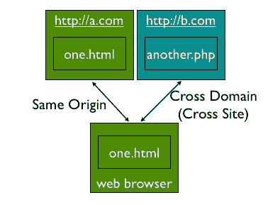
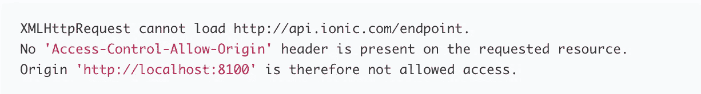

# IONIC 3 和 Cordova 中 CORS(跨源资源共享)问题的实用解决方案

> 原文：<https://medium.com/hackernoon/a-practical-solution-for-cors-cross-origin-resource-sharing-issues-in-ionic-3-and-cordova-2112fc282664>

**总结**:我在爱奥尼亚和科尔多瓦的 [WKWebView](https://developer.apple.com/documentation/webkit/wkwebview) 提供了一个解决 CORS 问题的实用方案。该解决方案适用于 iOS 和 Android。

Image credit: [http://enzolutions.com](http://enzolutions.com/articles/2014/05/31/what-is-cross-origin-resource-sharing-cors/)

如果您用 Ionic 或 Cordova 编码，并使用 REST API，您可能会看到这样的错误:

*XMLHttpRequest 无法加载*[*http://api.ionic.com/endpoint.*](http://api.ionic.com/endpoint.)*请求的资源上不存在“Access-Control-Allow-Origin”标头。因此，不允许访问源“http://localhost:8100”。*

# 什么是 CORS？

CORS 主张跨产地资源共享。简而言之，CORS 是一种防止客户端向主机请求显示当前未显示的服务的方法。这样做是出于安全原因。

## 问题是

为了让外部 API 服务器在 CORS 存在的情况下工作，它应该在它的头中包含类似这样的内容:

> 访问控制允许来源:*

然而，问题是一些 API 提供者不包括这一点，因为我们对服务器没有任何控制，所以我们不能将这一点添加到响应头中。

这是一个巨大的问题，特别是在 iOS 中，Ionic 和 Cordova 运行在 [WKWebView](https://developer.apple.com/documentation/webkit/wkwebview) 中，这执行 CORS。

# 解决方法

爱奥尼亚的博客有一篇关于 CORS 问题的旧文章。不幸的是，他们提供的解决方案仅适用于使用`ionic serve`或`ionic run -l`运行应用程序的情况。该解决方案将无法在生产版本中使用！

好消息是，你仍然可以通过做一点点工作来解决问题。我列出了几个解决方案:

1.  **使用代理(不是一个好的解决方案):**想法很简单:在客户端和主 API 服务器中间创建自己的服务器。您的客户端请求发送到您自己的支持 CORS 的服务器。您的服务器将请求发送到 API 服务器，获取结果，然后将结果发送给您。

您的服务器可以非常简单，只需从 Google Firebase 等数据库服务器读取来自特定节点的请求(如**/请求**)，然后将结果写入另一个名为**/回复**的节点。

虽然这是可行的，但我不喜欢这个解决方案，因为你需要创建一个新的服务器并维护它。

**2。使用原生 HTTP(我的最爱)**:幸运的是 Cordova 的[原生 HTTP 插件](https://github.com/silkimen/cordova-plugin-advanced-http)来拯救了。由于这个插件的 HTTP 请求不通过 WKWebView，它没有 CORS 问题。这太棒了。

所以解决方案是通过本地 HTTP 插件而不是 NodeJS 的请求来发送给定 API 的 HTTP 请求。因此:

**解决方案:**不用 npm 的`Request`或者`Fetch`包，用 Cordova 的插件。

下面是一个使用 Cordova 的本地 HTTP 的币安 REST API 的使用示例:

# 如果我们对 API 使用 npm 包装器会怎么样？

上面的解决方案有效，因为我们使用了一个简单的 REST HTTP 调用。然而，有时 API 调用更复杂。例如，您必须提供 APIKey 和 Secret 并签署请求。

对于这种复杂的请求，有一些 npm 包装器来完成这项工作并处理更复杂的问题，只是这些包使用 npm 的`Request`或`Fetch`包。

根据您使用的 npm 包装，有两种可能的情况:

## 1.`Request`或`Fetch`函数在构造函数中公开

如果你幸运的话，一些 npm 包比如 [CCXT](https://www.npmjs.com/package/ccxt) 已经允许你重载它们的获取请求功能。在这种情况下，您只需要将自己的 HTTP Fetch 包装器传递给它的构造函数:

## 2.`Request`或`Fetch`函数没有在构造函数中公开

但是如果你运气不好，Fetch 请求函数并没有在构造函数中公开。例如，这里有一个[很棒的币安 API](https://www.npmjs.com/package/binance) 的 npm 包装器。但是它使用了 npm 的`Request`包，导致了 CORS 问题，唉…

在这种情况下，解决方案并不太难:您只需要修改那个包，并强制它使用 Cordova 的`Request`而不是 npm 的。

例如，我[修改了币安的 npm 包装器](https://github.com/ourarash/binance)，这样，它就从构造函数中获取了`Request`函数，我将其设置为`cordova.plugin.http.get`:

简而言之，如果您正在为 REST API 使用一个 npm 包装器，而该包装器没有在其构造函数中公开其 HTTP 请求函数:

*   在您自己的 Github 中创建 Github 上的包装器的一个分支
*   修改该包并强制它使用 Cordova HTTP 请求
*   在你的 Ionic 程序中使用修改后的包

警告是，如果 npm 包装器被更新，您将需要在您的分支中集成更新。但是也许您可以创建一个 pull 请求，并鼓励包所有者使用您的更新，并在构造函数中公开请求函数。

如果你喜欢这篇文章，请给我反馈，如果这个解决方案解决了你的问题。

还有，请试试我用 Ionic 写的 app:[比特币疯狂](http://BitcoinCrazYness.com)。这是针对加密货币交易者的最全面的警报和投资组合管理应用程序之一。