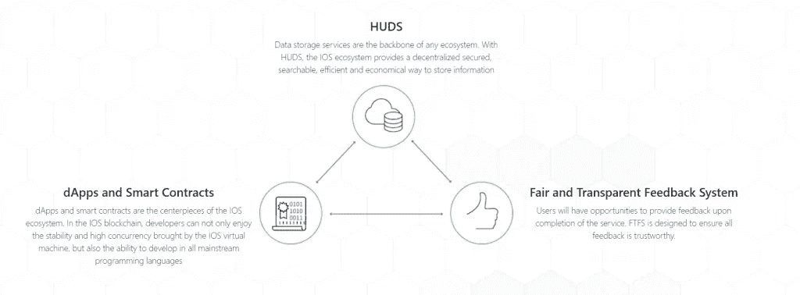
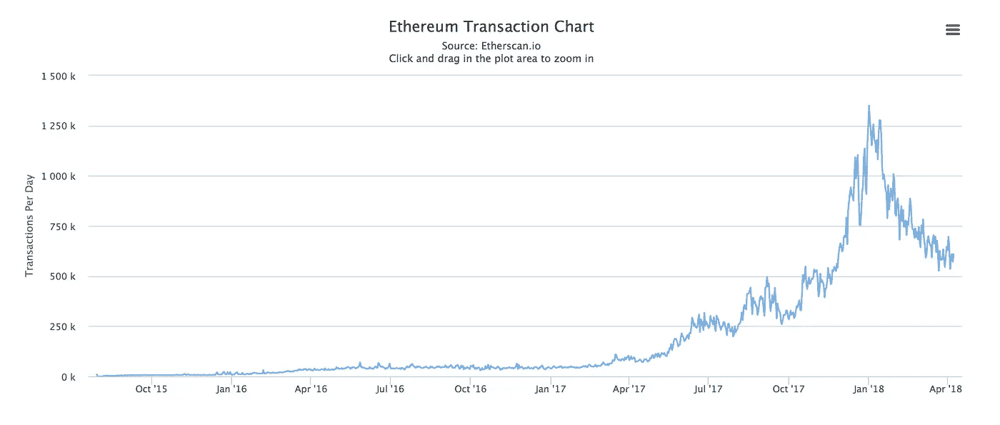
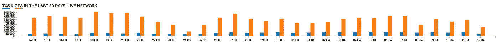
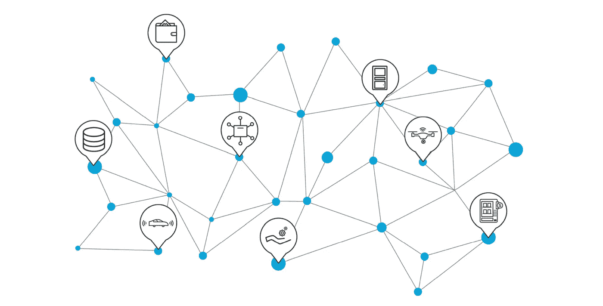
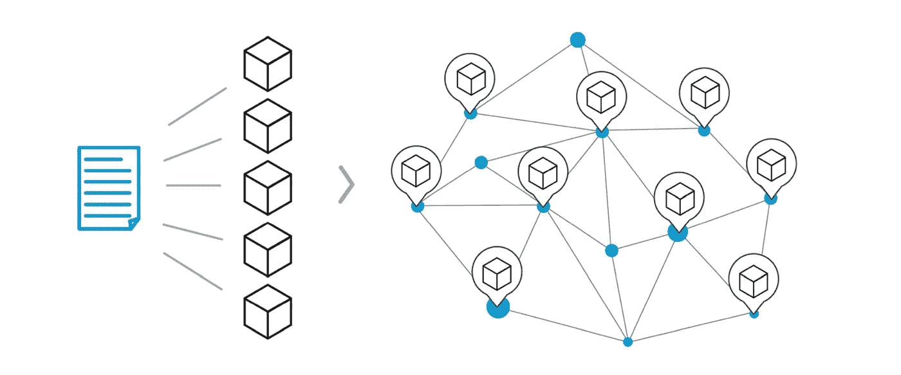
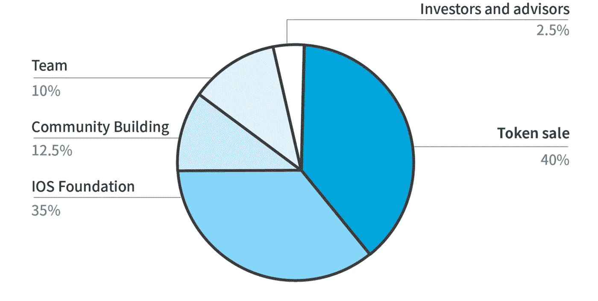
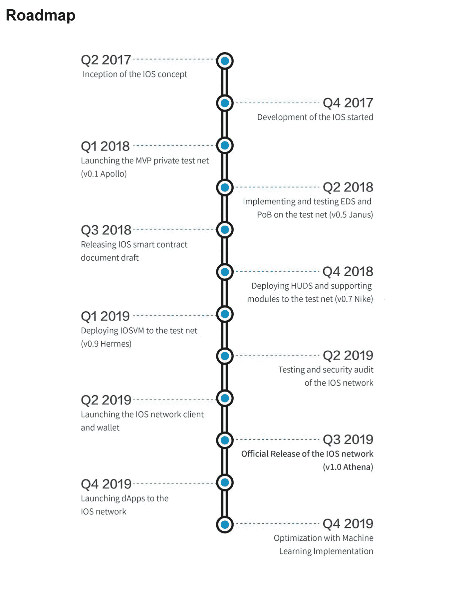
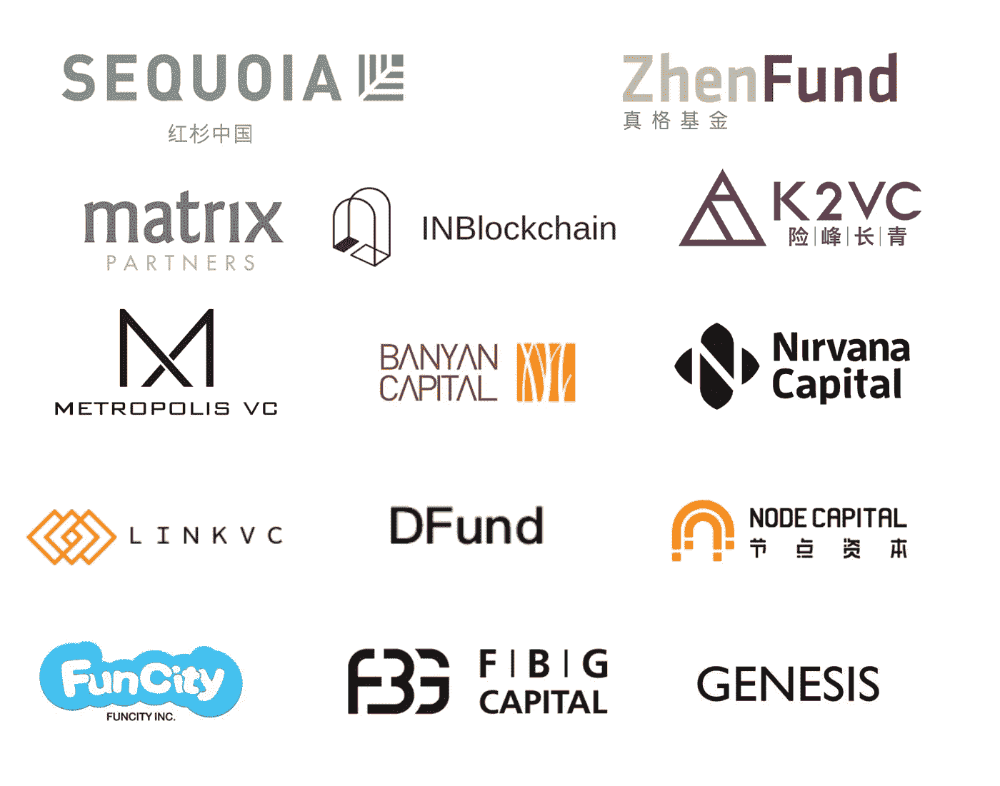
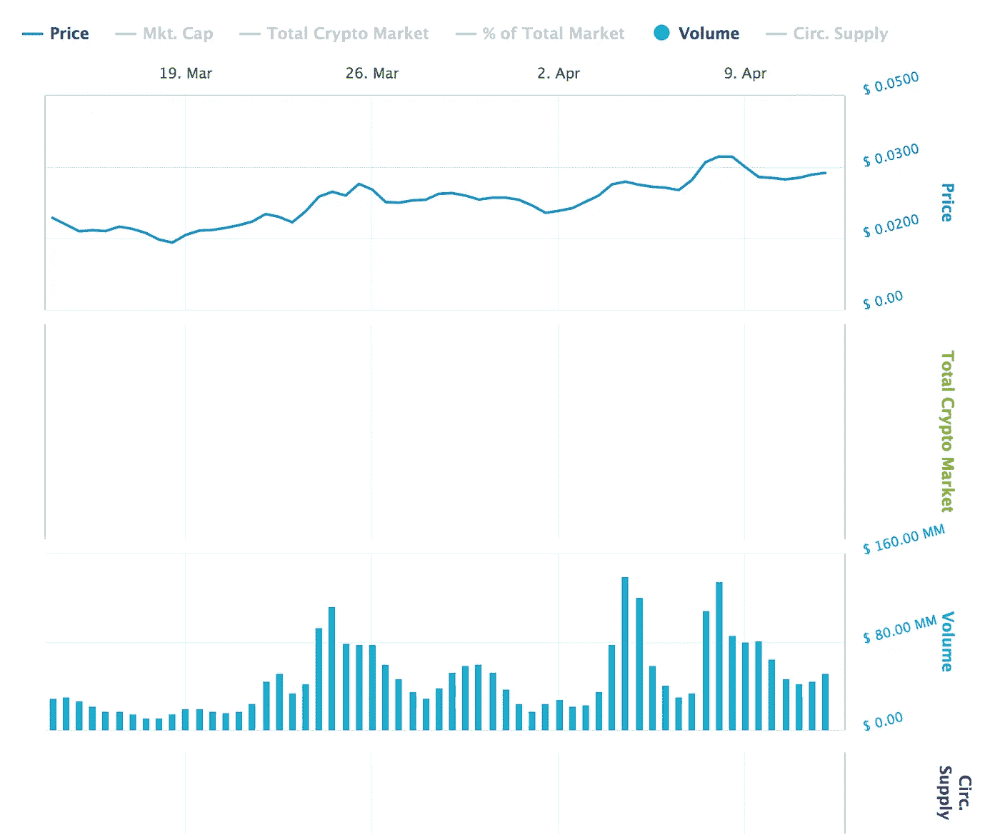
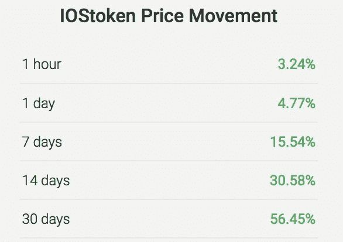

# IOSToken (IOST)的初级读本—以太坊、EOS 和 IOTA 的竞争对手，旨在赋予机器完整性。

> 原文：<https://medium.com/hackernoon/a-primer-on-iostoken-iost-the-ethereum-eos-and-iota-competitor-aiming-to-give-machines-43b0a33df983>

距离我 2017 年 7 月在 [EOS 上进行的最后一次深潜已经过去一年了。](https://hackernoon.com/a-primer-on-eos-ethereums-newest-competitor-and-why-it-grew-3-2x-overnight-5211b7207a85)

从那以后，加密货币和[区块链](https://hackernoon.com/tagged/blockchain)的格局发生了很大的变化，所以我决定开始对一些创新的区块链项目进行一系列的深入研究。

作为 Reddit 的 [/r/Cryptocurrency](https://www.reddit.com/r/CryptoCurrency/) (每月可接待多达 1000 万独立访客)的版主，我在了解最新加密产品方面做得相当不错。

然而，今天我将对一枚我完全忽略的硬币进行回顾，直到它打破了 marketcap 排名前 50 的硬币。

# 总结:

**令牌名称:**服务互联网令牌
**符号:** IOST
**类型:** ERC-20 令牌
**总供应量:**210 亿
**market cap:**[【2.66 亿美元](https://coincheckup.com/coins/iostoken/charts)截至 4 月 8 日。
**社交媒体:** [Reddit](https://www.reddit.com/r/IOStoken/) ，[不和谐](https://discord.gg/arbQt6w)， [BitcoinTalk](https://bitcointalk.org/index.php?topic=2786059.0) ， [Twitter](https://twitter.com/iostoken) ，[媒体](/@iostoken)
**白皮书:** [IOST 初级读本](https://docsend.com/view/rwgpdxx)，[技术白皮书](https://docsend.com/view/ihwqcdg)

# 什么是 IOSToken？

[“服务互联网”(IOS)区块链](https://www.reddit.com/r/IOStoken)是一个来自中国的项目，旨在解决区块链技术所面临的基本可扩展性挑战，以便使人、服务和机器能够在吞吐量超过 100，000 TPS(每秒事务数)的网络上扩展健壮的服务。

区块链内置了以下功能:

*   智能合同语言(dApps)。
*   私人交易。
*   分散式 P2P 托管(亚马逊 S3 的竞争对手)。
*   分散市场的用户信誉跟踪。
*   运行在智能设备上的轻量级基础设施。
*   区块链对“好公民”的奖励。

# 那是什么意思？

首先，现在的区块链有一个问题——一个大问题。他们还不能大规模处理交易。

如果你是，也没关系:

*   发送付款。
*   与智能合约或 dApp 交互。
*   验证身份。
*   主持分散投票。

所有这些操作都需要区块链来“验证”和处理交易。

客观地说，人们喜欢将区块链 tps 与平均处理约 2000 笔 tps 的 Visa 网络进行比较。虽然 Visa 网络很少处理超过 4000 tps，但该网络估计能够处理大约 56，000 tps。

这种比较的问题是双重的:

1.  支付只是现代智能区块链上发生的一种交易。
2.  Visa 作为一种集中式服务，不会对多个节点的交易进行交叉验证。这意味着对他们来说，一个交易永远只是一个交易。在区块链中，一个事务的处理能力相当于数千个集中式事务的处理能力。

## 那么，我们还有多远？

为了根据 IOST 区块链和他们希望实现的目标来看待这个问题，我们必须看看另一个“智能区块链”——也就是说，我们必须看看一个允许处理可编程合同和代码执行的区块链，而不仅仅是一个只促进转账或支付的区块链。

**比较#1 —以太坊:** 以太坊是当前的王者，它是一个强大的智能合约平台，并拥有实时可用的 dApp 产品。

2018 年 1 月 4 日，在[CryptoKitties 热潮](http://www.bbc.com/news/technology-42237162)导致以太坊网络几乎 24 小时无法使用的几个月后，以太坊创下了有史以来单日处理 135 万笔交易的最高交易日。

如果在一天中平均分配，这将占到大约 15 TPS。

在此期间，处理速度为 15 TPS，传输速度变得非常慢，以太坊的“气价”飙升，用户使用该网络需要支付大量费用。

**比较#2 — Stellar:** Stellar 是一个区块链，由非营利性的 Stellar 基金会管理，与 IBM 和 Square 等公司合作。

Stellar 是所谓的“分散许可区块链”，这意味着通过使用其法定切片、验证器和可信节点，他们的“Stellar Consensus Protocol”(SCP)不像其他区块链那样分散，但它使他们在速度和成本上具有优势。

最近，巴克莱银行的一个团队在谷歌云基础设施上测试 Stellar 协议，能够对 Stellar 网络的私有版本进行压力测试，并实现 10，000 TPS 的交易速率。但是，需要注意的是，这是在完全受控的实验室环境中，而不是在公共区块链上。

# 那么，IOST 将如何解决这一切呢？

当当前的基础架构每天都难以处理如此大的数据量时，IOST 如何实现扩展到超过 100，000 TPS 的目标？

**#1 —轻量级节点/物联网节点:**

IOST 的第一个重大胜利之一是，并非所有节点都是平等的。要成为[比特币](https://hackernoon.com/tagged/bitcoin)或以太坊网络中的一个节点，你至少需要使用一台专用计算机来存储区块链，并通过挖掘来验证交易——在许多情况下，你甚至需要一台专用服务器来处理这些。

对于 IOST，将有“*一级节点*”具有完整的功能，以及“*简化支付验证节点(SPV)* ”作为简单验证交易的方法。

IOST 的目标是建立一个足够轻量级的节点系统，任何智能连接设备，从电脑到无人机，再到无人终端，都可以成为一个节点，以验证和处理交易。

**#2 —用户声誉和社区奖励:**

分布式账本技术在规模之外面临的最大挑战之一是所谓的“坏演员挑战”

坏演员是任何为了自己的利益而损害集体技术的人。

例如，在以太坊网络上，当我们向网络发送小事务(如 CryptoKitties 中的动作)时，我们通常是糟糕的参与者。我们知道它们是低优先级、低费用的交易，最终会阻塞网络，但我们想采取下一个游戏行动，所以我们还是做了。

在 IOST，用户可以通过以下两种方式获得奖励:

1.  “公平透明的反馈系统”(FTFS)。
2.  Servi 令牌。

在 FTFS 系统中，用户、服务和合同可以根据他们的行为和与他人的互动获得反馈。良好的反馈将影响他们的“可信度得分”(我们将在下面概述)，这最终会在区块链中带来好处，并鼓励用户以社区的最大利益行事，即使他们是伪匿名的。

另一方面，Servi 令牌是可奖励的令牌，当用户采取自愿行动来帮助网络时，将分发该令牌。这可能包括提供公益社区服务、审查第三方服务或为社区做出其他贡献。

这些服务令牌是一种不可交易的自毁资产，在一次性(每次交易)的基础上对用户的“可信度得分”做出贡献。

**#3 —可信度证明/可信度得分:** 大多数网络都有存在付费授权类漏洞的节点。

在采矿电力网络中，你可以购买装备来升级你电网。

通过 masternodes 和 PoS 网络，您可以将资金锁定在专用节点上，成为验证者。

IOST 的目标是通过他们所谓的“可信度验证”来建立一个更快更公平的系统

可信度证明是经典利害关系证明模型的混合。

在可信度验证中，每个节点都有一个“可信度分数”，该分数基于:

*   节点中 IOST 的数量。
*   获得的 Servi 令牌数。
*   该节点的正面评论数。
*   节点以前的操作/事务。

IOST 网络将随机并通过算法为每个块选择一定数量的验证器。根据设计，网络中可信度分数较高的节点更有可能被选择，但这是无法保证的。

PoB 系统不是严格地将验证设置到一组受信任的服务器或主节点，而是基于生态系统中好的参与者的信誉不断地选择随机的一组验证者。

由于用户不能保证他们将成为任何未来阻止的验证者，这降低了恶意行为的风险，因为你需要超过 51%的随机选择的参与者是具有相同目标的坏参与者，以危及网络，而这在众包声誉环境中几乎是不可能的，在那里你更经常选择“好参与者”

**#4 —高效分布式分片(EDS):** IOST 的另一个得意之作是他们提出的高效分布式分片或“EDS”系统。

这使他们能够在节点之间分配工作负载，并监控节点上的工作负载以及总体网络运行状况。

当一个节点超负荷工作时，EDS 系统会选择另一个节点来分配一些传入的工作负载，以便随着新节点进入生态系统，允许网络容量的线性扩展。

**#5 — Atomix:**

IOST Atomix 系统是一个原子承诺系统，旨在防止诸如“双重花费攻击”的问题

当一个网络可能有多个事务发生时，我们会遇到两个相互影响的事务:

**交易 A**:*从地址 X 转 100 IOST 到地址 Y*

**交易 B:**“*检查地址 X 的余额*

如果我们让这些交易在网络中同时发生，我们就会遇到问题。例如，如果“交易 B”的目标是在进行转账之前检查用户是否有一定的余额，并且它正好在“交易 A”发生之前或期间进行检查，那么我们将为“交易 B”生成一个误报响应

为了处理这种情况，我们需要将事件作为一个“原子单元”来处理，作为一个整体来处理，每个事务的结果必须正确无误地完成，任何事务才能继续进行。

如果我们从另一个方向来看这个问题，我们可能会有一个非常复杂的事务，有 17 个不同的步骤，而我们高效的分布式共享(EDS)系统决定将这些步骤中的每一步拆分到 17 个不同的节点上。

如果其中一个步骤发生冲突并失败，但其他 16 个步骤能够成功处理，这将对网络产生意想不到的、可能是破坏性的影响。

为了解决这个问题，IOST 将事务步骤捆绑为一个原子单元，即使它分布在不同的处理实体中。

这确保了整个流程作为一个完整的原子单元要么成功提交，要么完全失败，并且没有部分事务发生。

**#6 —微状态块:**

IOST 可伸缩性的最后一个关键特性，不幸的是，我对它的技术了解最少，然而，讽刺的是，它却是我最感兴趣的。

IOST 提出了一个叫做“微观国家区块”的概念

传统区块链面临的挑战之一是每隔几秒钟就要存储一个新的数据“块”。这个块记录了在那几秒钟内区块链发生的事情，比如任何交易。即使在此期间没有发生任何事情，也仍然需要发出冻结。

区块链中没有空值，也没有跳过的块。如果什么都没发生，你仍然在存储一个“空块”,但是它通常和存储事务的块大小相同，或者几乎相同。

随着时间的推移，这个区块链变得越来越大，但是仍然需要存储在节点上，以便验证事务。随着时间的推移，这将成为一个严重的问题。

例如，现在，2018 年 4 月 8 日，比特币区块链的大小大约为 165 GB。这意味着如果你想运行一个节点，你需要下载和存储 165 GB 的信息。

# IOST 背后是谁？

IOST 最引人注目的方面之一是他们团队的质量。虽然许多项目依赖于个人开发人员，但 IOST 基金会拥有超过 18 名经验丰富的核心开发人员，包括:

# 特伦斯王:

*   普林斯顿大学分布式系统科学硕士
*   芝加哥大学分布式系统理学学士。
*   CoinLang(普林斯顿)比特币高级函数语言的开发者
*   为比特币开发了 CoinJoin 匿名安全协议
*   IOST 的联合创始人

# 吉米·钟:

*   埃默里大学计算机科学和数学学士学位(优等生)
*   500 家创业公司的校友
*   多个风投支持的创业公司的创始人。
*   早期 BTC/联邦理工学院矿工。
*   IOST 的联合创始人。

# Kelvin Tan:

*   清华大学的计算机科学学士。
*   2008 年全国信息奥林匹克竞赛金奖。
*   2011 年 ACM 编程竞赛金奖。
*   EtherCap 的 CTO。
*   IOST 的联合创始人。

# 谢耳朵·梅:

*   威斯康星大学麦迪逊分校博士
*   信息数学国家奥林匹克金奖。
*   在 ICML、AAAI、WSDM 和爱沙尼亚发表的 ACM/IPC 地区论文金奖。

# 崇腾:

*   康奈尔大学计算机安全博士。
*   前谷歌工程师。
*   Linux 内核贡献者。
*   2011 年起早期区块链社区贡献者。

# 博世·李:

*   塔夫茨大学计算机科学和应用数学学士学位(最优秀)
*   前高盛合伙人。
*   摩根士丹利前分析师。
*   德勤前分析师。
*   IOST 的联合创始人

# 会赵:

*   普林斯顿大学经济学博士和硕士。
*   香港大学教授。
*   夏洛特.伊丽莎白保护者联谊会。
*   夏永祥经济学奖获得者。

# 令牌是如何分发的？

该代币在私人代币销售中发行，将 210 亿 IOST 的 40%出售给了私人基金投资者。

IOST 基金会还宣布，他们将从基金会拨款中锁定所有 73.5 亿美元的 IOST 代币，直到他们的 mainnet 推出。

# 那么，mainnet 还没有推出吗？怎么回事？

不，mainnet 还没有启动。

IOST 最近向他们的公共 Github 发布了他们的第一个代码——在一个全新的共识协议上建立一个新的区块链是需要时间的。但是，IOST 一直在以积极的步伐前进。

根据他们的路线图，他们希望在 2018 年 Q2 之前部署一个完整的功能测试网络，并在 2019 年第三季度推出一个完整的独立网络。

# 投资者

鉴于 IOST 项目的雄心，他们还设法吸引了一些高层投资者，包括领先的风险投资公司红杉资本(Sequoia Capital)的中国分公司。

他们的其他一些著名顾问包括:

*   贾天，Bitfinex 投资人，Bitfund 有限合伙人，Zcash 顾问。
*   BMan Lee，阿里巴巴、联想和奇虎的顾问。他是百度 AOD 平台的负责人，该平台为超过 50 万家企业提供服务。
*   Ryan Bubinski 是 Codecademy 的联合创始人，被《时代》杂志列为 100 位最具影响力的人物之一。

# 市场表现:

看看 CoinCheckUp.com 上的 [IOST，我们可以看到，在过去 30 天里，IOST 表现强劲，甚至在熊市中也是如此，自其在](https://coincheckup.com/coins/iostoken/charts)[币安](https://www.binance.com/?ref=11712515)开始交易以来，日交易量在 3000 万美元至 1.5 亿美元之间。

事实上， [IOST](https://coincheckup.com/coins/iostoken/charts) ，即使在 2018 年初 Q1/Q2 的熊市中，IOST 在 3 月份也增长了 56.45%，成为前 50 名硬币中增长第四快的，击败了 [EOS](https://coincheckup.com/coins/eos/charts) 、[币安硬币](https://coincheckup.com/coins/tron/charts)、 [Tron](https://coincheckup.com/coins/tron/charts) 、[比特币](https://coincheckup.com/coins/bitcoin/charts)和[以太坊](https://coincheckup.com/coins/ethereum/charts)等投资。

# **那么，您现在可以从哪里获得 IOSToken 呢？**

*   [币安](https://www.binance.com/?ref=11712515)
*   [霍比普罗](https://www.huobipro.com/en-us/topic/invited/?invite_code=pfr33)
*   OKEX
*   库科恩
*   Bitfinex

*免责声明:*

*   这篇文章的作者没有购买任何 IOST，他们在接下来的 72 小时内也不打算购买。
*   *这篇文章的作者可能会按照各种联盟计划，通过该内容中的链接获得报酬。*

# 你喜欢这篇文章吗？订阅作者了解更多！

接下来是什么硬币？

在接下来的几个月里，我将像这样深潜硬币:

*   卡尔达诺
*   主要的
*   新的
*   极微小
*   韦钱
*   本体论
*   万链
*   星云
*   家族
*   蜡

还有更多，在评论区留下评论，为你最喜欢的投票，不要忘了订阅，这样你就不会错过详细的初级读本！

编辑:这篇文章的早期版本称一些杰出人物为“投资者”,而事实上他们是这个项目的“顾问”。