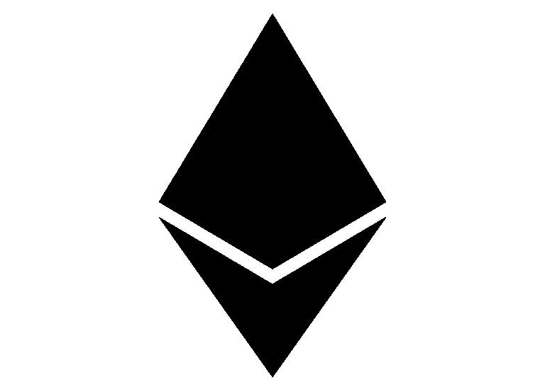

# 一个动摇以太坊的提议——一个即将出现的新标准？

> 原文：<https://medium.com/hackernoon/a-proposal-to-shake-up-ethereum-a-new-standard-on-the-horizon-d2dfa88507a6>

让我们切入正题…有一个新的以太坊标准提案即将出台，它可能会永远改变以太坊智能合约的面貌。

在这篇博文中，我将介绍以太坊及其智能合约(和代币)，现有的标准，以及由威泰克·拉多姆斯基提出的新标准提案，以及它将如何永远改变以太坊。

# 初级读本

在进入更高级的话题之前，我想先了解一些基础知识和一些术语，以便每个人都能理解这篇文章。

*   **智能合同** —智能合同是一组**条款和条件**，描述两方或多方之间的**关系，可通过**程序代码**强制执行。**
*   **令牌** —这是一个以这种方式编码的**智能契约**来表示一个**数字资产**。每个令牌都有适合其预期用途的**属性**和**功能**；例如，可以创建一个令牌来支付网络访问费用，而创建另一个令牌来代表真实资产，如股票。代币可以有**固定供给**，或者**可变供给**(通货膨胀、通货紧缩等)。).
*   **以太坊** —是一个**平台**，可以用来创建任何任意的智能契约。这些智能合约存储在网络上，从而使它们成为 [**分布式**](https://en.wikipedia.org/wiki/Distributed_computing)**[**分散式**](/@VitalikButerin/the-meaning-of-decentralization-a0c92b76a274) 。另外，以太坊上的智能合约是**不可变**和**防篡改**。**
*   ****ERC**——代表**E**E**R**E**C**备注。它是**对**以太坊**网络提出改进**的官方协议。通常有一个数字附加到“ERC”(即 ERC-20)，这只是一个唯一的提案 ID 号。**
*   ****可替代性—** *货物或商品的属性，其单个单元本质上是可互换的。***

# **什么是 [ERC-20](https://github.com/ethereum/EIPs/blob/master/EIPS/eip-20.md) ？**

**ERC-20 是令牌的标准接口，由[维塔利克·布特林](https://medium.com/u/587a00dbce51?source=post_page-----d2dfa88507a6--------------------------------)和[法比安·沃格斯泰勒](https://medium.com/u/4b59b3ef14a2?source=post_page-----d2dfa88507a6--------------------------------)于 2015 年 11 月提出。这个标准*“允许以太坊上的任何代币被其他应用重新使用:从钱包到分散的交易所。”***

**为了使令牌符合 **ERC-20 协议**并允许与其他智能合约和分散式应用程序(dApps)无缝交互，它们需要支持以下功能:**

*   **检索将存在的令牌总量，也称为令牌供应总量**
*   **检索某个以太坊地址拥有的令牌数**
*   **在双方之间转移代币**
*   **批准将代币用作货币资产**

****ERC-20** 是面向代表**可互换代币**的。一个**可替换令牌**不是唯一的，并且**可与另一个**相同令牌**互换。**可替代性**的重要性将在稍后的文章中体现出来。****

**ERC-20 代币的一个例子是金恩硬币。对于游戏玩家来说，它是多个 ENJ 实现的游戏之间的通用货币。它还将提供虚拟商品和数字资产的便携性和可转让性。你可以在我之前的一篇博文中找到更多关于 ENJ 的信息。**

# **什么是 [ERC-721](https://github.com/ethereum/EIPs/issues/721) ？**

****ERC-721** 是**N**on-**F**ungible**T**okens(**NFT**)的标准接口，由 [Dieter Shirley](https://medium.com/u/6e4f22124657?source=post_page-----d2dfa88507a6--------------------------------) 于 2017 年 9 月提出。该提案于 2018 年 3 月被接受为 ERC-721 的官方接口。**

****NFT**在本质上是**唯一的**，并且每一个都可以被**唯一地相互识别**。他们可以代表数字或实物资产的所有权。**NFT**可以代表多种多样的资产，包括:**

*   ****物理属性** —房屋，独特的艺术品**
*   ****虚拟收藏品** —独特的小猫图片、可收藏的卡片**
*   ****“负价值”资产** —贷款、负担和其他责任**

**总的来说，所有的房子都是不同的，没有两只小猫是一样的。**NFT**是**可区分的**，你**必须单独追踪每一个的所有权**。**

****ERC-721** 背后的动机是这样一个事实，即 **ERC-20** 对于**跟踪 NFT**来说**是不够的**，因为每项资产都是不同的(不可替代的)，而大量代币中的每一个都是相同的(可替代的)。**

**这种 ERC-721 NFT 的一个现有的例子是非常流行的 CryptoKitties 游戏中的“Kitties”。每只隐猫在本质上都是独一无二的，并且被唯一识别。没有两只密码猫是一样的。**

# **什么是 [ERC-1155](https://github.com/ethereum/EIPs/issues/1155) ？**

**ERC-1155 是 2018 年 6 月由[**Witek 拉多姆斯基**](https://medium.com/u/48394d8ae56a?source=post_page-----d2dfa88507a6--------------------------------) ( [金恩](https://enjincoin.io/)联合创始人& CTO)提出的一个**单部署契约**中多项/令牌定义的标准接口。威泰克在 2017 年 6 月为第一个非
可替换令牌创建了代码，这启发了 ERC-721 的创建。**

****ERC-1155** 提议背后的主要动机是这样一个事实，即 **ERC-20** 和 **ERC-721** 要求为每个可替换或 NFT 令牌/集合部署一个**单独的合同**。可以想象，这是非常低效的，并且*“通过将每个令牌合约分离到其自己的许可地址的性质来限制某些功能”。***

**与 ERC-20 和 ERC-721 相比， **ERC-1155 方案**具有许多优势，包括:**

*   ****模块化插头&播放合同** —如上所述， **ERC-20** 和 **ERC-721** 需要为每个部署一个**单独的合同**，这导致了大量的重复代码，从而“污染”了区块链以太坊。 **ERC-1155** 提出跨令牌的“公共”代码存储在**中央智能契约**中，并被赋予一个**唯一标识符**。然后，这个唯一标识符可以被需要中央智能合约代码的其他智能合约引用。这基本上为智能合约提供了从中央智能合约中**【重用】**代码而无需复制的能力，从而节省了存储空间、处理能力和电力。**
*   ****捆绑代币的原子互换**—**原子互换** *“是一种智能合约技术，能够在不使用交易所等集中中介的情况下，将一种加密货币交换为另一种加密货币”*。使用当前的标准，如果 Alice 想用 Token A 和 Token B 与 Bob 交换 Token C 和 Token B，则至少需要**四个单独的步骤**(图 A)。ERC-1155 通过**将多个令牌**组合在一起解决了这种低效率，而不管是否有许多令牌需要交换，并通过**两步过程**将所有东西捆绑在一起(图 B)。**

****

**Figure A**

****

**Figure B**

*   ****一次完成多个复杂操作** — ERC-1155 将允许您在一次交易中执行多个复杂操作，这将使交易变得“更轻”和更便宜(图 C)。**

****

**Figure C**

*   ****可替代性奇点**——我已经讲过 ERC-20 如何迎合可替代令牌，ERC-721 如何迎合不可替代令牌。有了 ERC-1155，开发人员现在将有更大的选择余地，因为每个令牌都可以批量生产或单独创建，并且包含唯一的元数据或完全可替换。**

# **ERC-1155 在现实中如何使用？**

**作为对[金恩](https://enjincoin.io/)团队(以及他们提出 ERC-1155 的 CTO)的赞颂，我将用游戏来展示一个例子。游戏变得高度复杂…角色有不同的皮肤，可以装载不同的武器，使用不同的药水等。**

****

**我将使用魔兽世界作为一个案例研究，并提出观点，就好像它是在以太坊区块链推出的一样。在写这篇文章的时候，魔兽世界拥有令人难以置信的 109，429 件物品！这些物品中有些是**唯一可识别的**，有些是**而不是**。例如，**彩色剑**是**唯一可识别的**(现存数量有限)，而**古代治疗药剂**不是。以目前的标准来看，每把**彩色剑**都需要用 **ERC-721 令牌**来表示，而**古代治疗药剂**将会用 **ERC-20 令牌**来表示。**

**不幸的是，这两种令牌类型不能很好地结合在一起。此外， **ERC-721** 标准将要求每一个不可替代的项目，有一个**单独的合同**。通常情况下，驱动这些项目的代码看起来**几乎相同**，只是有一些小的改动，然而，当前的标准**不满足**代码重用**的**。本质上，这些需要单独存储在区块链上，因为重复的代码而污染了它。例如，如果有 100 把**彩色剑**存在，它们中的每一把都需要一个**单独的** ERC-721 令牌。**

**有了 **ERC-1155** 你可以拥有两全其美的**；一个*可替代性奇点*(这句流行语归我所有)。根据游戏机制，你可以创建数千种不同的物品类型；其中一些是唯一可识别的，而另一些是可替换的。你可以用同样的标准代表独特的**彩色剑**和可替换的**古代治疗药剂**。****

**更进一步，ERC-1155 可以治疗一组非功能性神经营养不良，从而保留一些可替代性。例如，你可以分辨出你的令牌是一把**彩色剑**，它的唯一标识符是第一个被创造的。**

**最后，双方之间的交易现在可以包含一篮子可替代和不可替代的项目。例如，在一次交易中，爱丽丝可以用她的**彩色剑**和 **10 种古代治疗药剂**交换鲍勃的**波塞迪斯**和 **5 种星体法力药剂**。**

# **结论**

**最后，我坚信 ERC-1155 提案是朝着正确方向迈出的一步。ERC-20 和 ERC-721 很好地服务了以太坊网络，然而，ERC-1155 将把我们带到一个全新的水平，使开发者能够在一个单一的标准下表示他们的可替代和不可替代的令牌，同时也使交易更便宜和更轻松。**

## **确保你给这篇文章你的👏 **50** **鼓掌**👏和我的博客 a **关注**如果你喜欢这篇文章并想看更多。**

****

**也可以捐款到以下地址以示支持:
**ETH/ENJ**:[0x4c 7195 e 074 cf 0 ab 6 f 77 BDB 7 c 97 FD 2567066 bb 712](https://goo.gl/H8xSTn)**

***免责声明:本博客帖子中的所有信息和数据仅供参考。我的观点是我自己的。我不提供个人投资建议，也不是合格的特许投资顾问*。*我对任何信息的准确性、完整性、适用性或有效性不做任何陈述。我将不对任何错误，遗漏，或任何损失，或因其展示或使用引起的损害负责。所有信息均按原样提供，不提供任何担保，也不授予任何权利。***