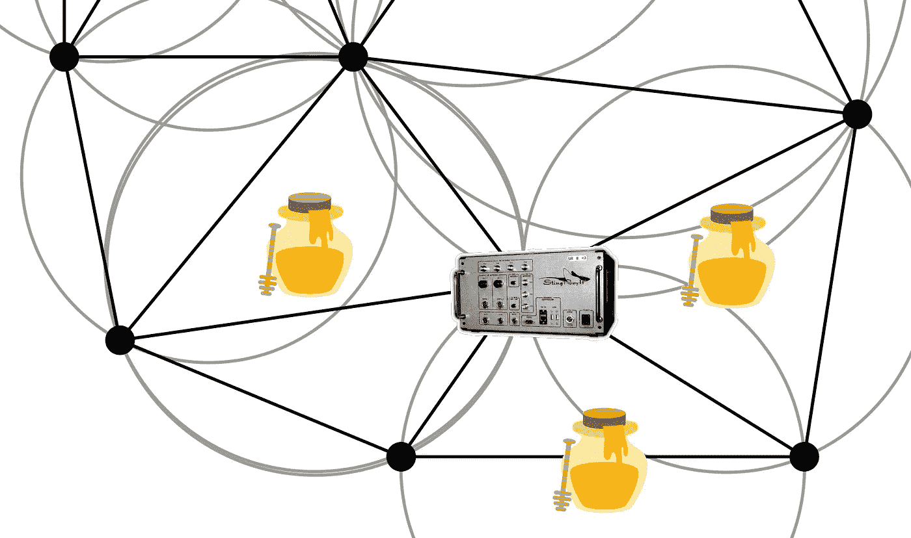

# 流氓 IMSI 捕鼠器(又名“黄貂鱼”设备)三角测量的建议方法

> 原文：<https://medium.com/hackernoon/a-proposed-method-for-triangulation-of-rogue-imsi-catchers-a-k-a-stingray-devices-44046ab97261>

# 黄貂鱼在华盛顿特区四处游荡。

本周广泛报道([美联社](https://apnews.com/d716aac4ad744b4cae3c6b13dce12d7e/APNewsBreak:-US-suspects-cellphone-spying-devices-in-DC)、 [NPR](https://www.npr.org/sections/thetwo-way/2018/04/04/599428495/feds-say-theyve-detected-apparent-rogue-spy-devices-in-d-c) 、[华盛顿邮报](https://www.washingtonpost.com/world/national-security/dhs-says-it-has-detected-possible-cellphone-surveillance-in-dc--and-doesnt-know-whos-doing-it/2018/04/03/f69fbe36-3785-11e8-acd5-35eac230e514_story.html)、 [BBC](http://www.bbc.com/news/technology-43639709) )华盛顿特区和其他未披露的城市正在展示异常现象，似乎是由于未经授权和未知的 IMSI 捕鲸船(如臭名昭著的“[黄貂鱼](https://www.muckrock.com/news/archives/2016/dec/07/rochester-police-release-unredacted-list-harris-co/)”设备)。这些[间谍设备](https://www.eff.org/document/eff-one-pager-cell-site-simulators)经常被执法部门用来跟踪个人、拦截短信、监听电话。(美国公民自由联盟保持着一份已知雇佣 IMSI 捕手进行国内监视的联邦机构的最新名单。)

国土安全部在 2018 年 3 月 26 日给俄勒冈州参议员罗恩·怀登的一封[信](https://www.documentcloud.org/documents/4429966-DHS-response-to-Wyden-3-26-18.html)(及其[附件](https://www.documentcloud.org/documents/4430049-DHS-attachment-in-response-to-Wyden-3-26-18.html))中披露了在美国城市涉嫌存在不明运营商的**流氓 IMSI 捕手。**

这封信承认*“外国政府使用 IMSI 捕手可能会威胁美国的国家和经济安全，”*并承认美国对发现这种威胁毫无准备:

> “[目前]国土安全部不具备探测 IMSI 捕手的技术能力。为了支持这种能力，DHS 需要资金来采购、部署、运行和维护这种能力，包括硬件、软件和劳动力的成本。”

# 我们需要一张网来捕捉这些黄貂鱼

在这篇文章中，我提出了一个简单的“网”，合法的联邦机构可以在华盛顿特区(或任何其他地区)撒下这张网，以绘制未经授权的 IMSI 捕手的位置。这种无法察觉的反击是非侵入性的，廉价的，并且不需要新技术。

看起来像受害者手机的蜜罐设备网格应该放置在整个感兴趣区域的网格中。蜜罐识别信息(IMSI/ESN)的黑名单将被提供给该区域的所有授权服务提供商。在预定的协调时间，合法的蜂窝塔实施黑名单，并断开与蜜罐设备的所有连接。

**任何看似与“手机信号塔”保持连接的蜜罐手机实际上都在与 ISMI 捕手互动！**一旦所有合法的手机信号发射塔连接被拒绝，仍在接收服务的“蜜罐”一定就在未授权的 IMSI 捕捉者附近，而这些捕捉者并不知道黑名单的存在。

为了更好地定位恶意信号的来源，网络控制器可以慢慢降低设备上的信号广播功率。由于黄貂鱼的接近，ISMI 捕手的位置可以从保持连接时间最长的蜜罐中精确定位。

# 保持游泳安全

上述网络应使用现有的廉价技术快速实施，以明确绘制流氓黄貂鱼问题的规模。每个大使馆围墙外的蜜罐会很快发现哪些外国政府以这种方式获取数据。

由于更新和激活设备 ID 黑名单对于授权的蜂窝塔运营商来说不是一项繁重的任务，因此这可以作为例行程序来实现。事实上，合作的执法部门和电信公司可以很容易地将网络众包到区域网络上的任何电话上！当设备不在使用中时，服务提供商可以立即将其添加到黑名单中，并在几秒钟内断开所有合法连接。如果这个设备在停电期间发现并连接到了一个“信号塔”，那么它一定是被附近的一条流氓黄貂鱼诱捕了。通过用闲置设备定期检测附近的 IMSI 捕手，这张黄貂鱼网可以不间断地覆盖整个国家。

*感谢@Dad 发来一篇关于流氓 IMSI 捕手的文章，这让我开始思考如何解决华盛顿和其他地方的现状。*

# 参考

**美联社:美国怀疑手机间谍装置在 DC** ，Frank Bajak，2018 . 04 . 04:[https://AP news . com/d 716 AAC 4 ad 744 B4 CAE 3c 6 b 13 DCE 12d 7 e/AP news break:-US-suspects-cellular-spuring-devices-in-America](https://apnews.com/d716aac4ad744b4cae3c6b13dce12d7e/APNewsBreak:-US-suspects-cellphone-spying-devices-in-DC)

**NPR:联邦调查局称在华盛顿发现明显的流氓间谍设备**，Merrit Kennedy，2018 . 04 . 04:[https://www . NPR . org/sections/the two-way/2018/04/04/599428495/Feds-Say-They ve-Detected-Apparent-Rogue-Spy-Devices-In-d-c](https://www.npr.org/sections/thetwo-way/2018/04/04/599428495/feds-say-theyve-detected-apparent-rogue-spy-devices-in-d-c)

**华盛顿邮报:DHS 在华盛顿发现了可能的手机监控——但不知道是谁在做**，马特·扎波托斯基，2018 . 04 . 03:[https://www . Washington Post . com/world/national-security/DHS-says-it-has-detected-possible-phone-surveillance-in-DC-and-not-know-whos-doing-it/2018/04/03/f 69 FBE 36-377](https://www.washingtonpost.com/world/national-security/dhs-says-it-has-detected-possible-cellphone-surveillance-in-dc--and-doesnt-know-whos-doing-it/2018/04/03/f69fbe36-3785-11e8-acd5-35eac230e514_story.html?utm_term=.416fb9059bbf)

**BBC:华盛顿州发现神秘黄貂鱼装置**，2018 . 04 . 04:[http://www.bbc.com/news/technology-43639709](http://www.bbc.com/news/technology-43639709)

**MuckRock:罗切斯特警方发布哈里斯公司黄貂鱼和翠鸟产品未编辑名单**，柯蒂斯·沃尔曼，2016 . 12 . 02:[https://www . muck rock . com/news/archives/2016/dec/07/Rochester-police-release-un edited-list-Harris-co/](https://www.muckrock.com/news/archives/2016/dec/07/rochester-police-release-unredacted-list-harris-co/)

**电子前沿基金会:手机基站模拟器上的一个寻呼机**，[https://www . eff . org/document/eff-One-Pager-Cell-Site-Simulators](https://www.eff.org/document/eff-one-pager-cell-site-simulators)

**纽约时报:纽约警方使用秘密手机追踪器，公民自由组织称**，约瑟夫·戈尔茨坦，2016 . 02 . 11:[https://www . nytimes . com/2016/02/12/ny region/New York-Police-dept-cell-tracking-stingrays . html](https://www.nytimes.com/2016/02/12/nyregion/new-york-police-dept-cellphone-tracking-stingrays.html)

美国公民自由联盟:黄貂鱼追踪装置:谁得到了它们？*2018 年 3 月更新:*[https://www . aclu . org/issues/privacy-technology/surveillance-technologies/stingray-tracking-devices-whos-got-them](https://www.aclu.org/issues/privacy-technology/surveillance-technologies/stingray-tracking-devices-whos-got-them?redirect=map/stingray-tracking-devices-whos-got-them)

**DHS 信封面:**[https://www . document cloud . org/documents/4429966-DHS-response-to-Wyden-3-26-18 . html](https://www.documentcloud.org/documents/4429966-DHS-response-to-Wyden-3-26-18.html)

**DHS 来信附件:**[https://www . document cloud . org/documents/4430049-DHS-Attachment-in-response-to-Wyden-3-26-18 . html](https://www.documentcloud.org/documents/4430049-DHS-attachment-in-response-to-Wyden-3-26-18.html)