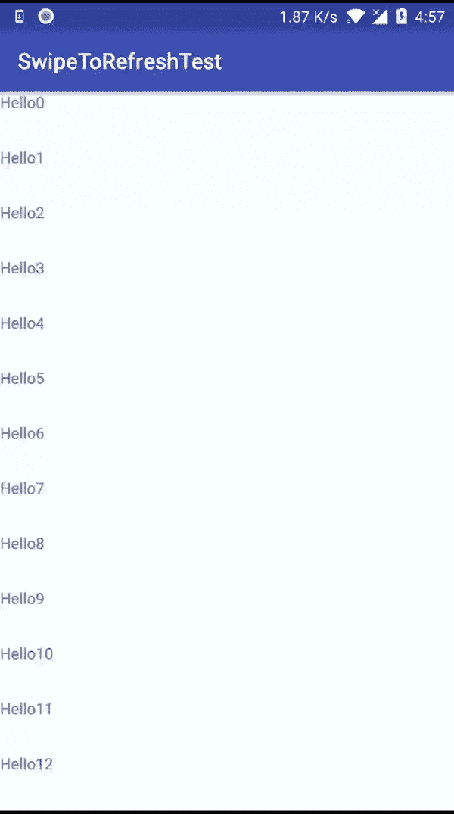

# 你可以称之为自己的提神剂

> 原文：<https://medium.com/hackernoon/a-pull-to-refresh-you-can-call-your-own-6609870a1806>

在 22.1.0 中引入的 SwipeToRefreshLayout 已经成为许多现代 [Android](https://hackernoon.com/tagged/android) 应用程序中的主要部分。这是我利用 ValueAnimator 和 Android Touch 框架创建一个简单的 SwipeToRefreshLayout 克隆的尝试。

让我们首先总结一下本教程中使用的 Android touch 框架中的两个函数:**oninterceptouchevent**和 **onTouchEvent** 。

*   **oninterceptouchevent**允许[视图组](https://hackernoon.com/tagged/viewgroup)来“拦截”一个触摸事件，并决定是将其传递给其子对象还是自己消费该事件。因此，这个函数是 ViewGroup 的一部分，而不是 View。
*   **onTouchEvent** 同时存在于 View 和 ViewGroup 类中。在 Viewgroup 类中，只有当父类决定不将触摸事件传递给它的子类时，才会调用这个函数(例如，它在 onInterceptTouchEvent 上传递 true)。然而，在孩子中，当孩子接收到来自其父母的触摸事件时，这被调用。

这种从父节点到子节点过滤触摸事件的流程可以用来创建一个非常基本的刷新视图，这在许多应用程序中都可以看到。

我们的定制拉入更新工作方式如下:

如果用户在可滚动视图(例如 RecycleView)上向下滚动，则不需要刷新视图。因此，父视图组对触摸事件不感兴趣，并将其传递给子视图组。(onInterceptTouchEvent = false)。

然而，如果用户向上滚动，我们的场景就会分成两部分。第一个更简单的场景是用户还没有到达 recycleview 的顶部，因此我们不需要“刷新视图”。(onInterceptTouchEvent = false)。

第二种情况是当用户到达顶部并试图进一步向上滚动时。这将触发刷新视图出现。因此，仅在这种情况下，父节点对触摸事件感兴趣，不会将其传递给子节点，而是触发自己的 onTouchEvent。(onInterceptTouchEvent = true)。

事不宜迟，让我们直入主题吧。

首先，让我们创建一个自定义拉的框架来刷新父级。

AnimatedPullToRefreshLayout Skeleton

对于任何基本的拉至刷新模式，父级(在本例中为:AnimatedPullToRefreshLayout)必须确定可滚动的子级当前是否在顶部。确定这一点的最简单方法是在父级的 onLayout 回调中将 scrollListener 附加到子级

onLayout Implementation

setOnScrollListener 用于设置 onTopReached，它表示子节点的状态(是在顶部还是在其他位置)。

然而，附加一个 scrollListener 本身是不够的，因为 onTopReached 也在 oninterceptouchevent 中使用，并且一旦它在 onScrollListener 中被设置为 true，oninterceptouchevent 就不会让触摸事件传播到子节点。因此，我们还必须跟踪触摸事件的 y 坐标。

onInterceptTouchEvent Implementation

在父节点决定处理 touchEvent 的情况下，将在父节点中触发 onTouchEvent。onTouchEvent 负责呈现自定义拉取以刷新逻辑。

onTouchEvent Implementation

在前面代码块的 ACTION_MOVE 事件中，增加子视图的上边距会显示 framelayout 下层中的“刷新视图”。当用户将手指从设备上松开时，或者当触发 UI 线程中刷新逻辑的后台任务完成时，必须收回刷新视图。(例如 API 调用)。

stopLoading Implementation

应用程序中使用的 xml:

这里有一个小演示让你大吃一惊。尽情享受吧！

*我希望你喜欢我的定制拉动更新视图。我希望下次能见到你。*