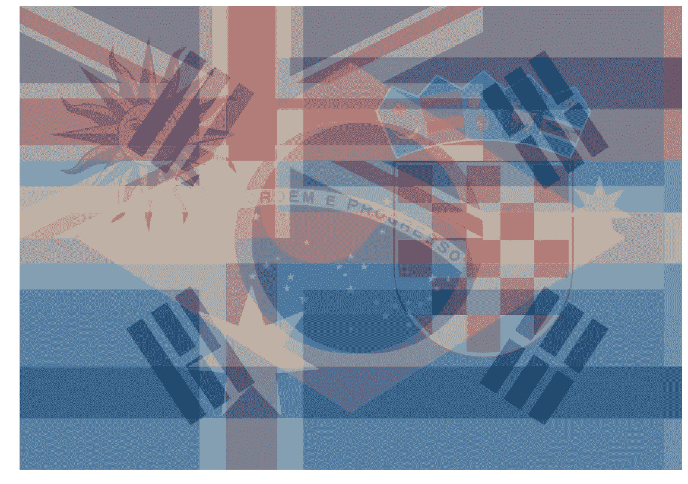

# 章鱼保罗的量子继承者

> 原文：<https://medium.com/hackernoon/a-quantum-successor-to-paul-the-octopus-e03de3fdc7d0>

谁将赢得[世界杯](https://hackernoon.com/tagged/world-cup)？2010 年，我们有一只[章鱼](https://en.wikipedia.org/wiki/Paul_the_Octopus#Death_and_legacy)来帮助我们。2014 年，我们不得不通过观看比赛来寻找答案。但是今年，我们有了量子计算机。

尽管量子计算机在许多事情上都很擅长，但预测体育比赛的结果却不是其中之一。但是，让我们不要让像事实这样愚蠢的事情阻碍我们。不管怎样，我们做吧！

我拿了今年世界杯所有参与者的旗帜，并用二进制给它们起了个名字。这些名称的前三位告诉我们它们所在的组(`000`表示 A 组，`001`表示 B 组，以此类推)。最后两位告诉我们他们在比赛开始前在小组中的位置(`00`为顶端，`11`为底端，等等)。所以这是一个相当合理的，而不是完全任意的二进制编码。

然后我告诉一台[量子计算机](https://hackernoon.com/tagged/quantum-computer)创建所有这些文件名的量子叠加。我使用了 IBM 的名为 *Tenerife* 的 5 量子位设备，所以预计会稍微偏向西班牙。

接下来我让设备给我一个输出。事实上，它给了我很多输出。每一个都是一个文件名，由量子叠加随机生成。老实说，这对于量子计算机来说并不是一个很好的用途。但这很容易做到。像一个*你好世界*，但是以足球为主题。

最后，我将这些结果用于创建一个合成图像，将旗帜叠加在一起，创建一个旗帜来统治所有的旗帜。

这就是了。

量子计算机就是关于干涉的。不正确的解决方案会产生破坏性的干扰。正确的会被放大。

要做到这一点，需要编写一个量子算法来实际完成这项工作。诚然，这是我们完全忽略的一个小细节。我们只是随机生成输出，而不是做任何明智的事情。但是不管怎样，让我们坚持下去。看看上面的图片，看看哪个队会赢。

在我看来，巴西、冰岛、韩国、澳大利亚、乌拉圭和克罗地亚分成了 6 份。为了进行比较，下面是只有这些标志的图像。

量子计算机似乎认为它将是这六个国家之一，但它还不知道是哪一个。也许有一些平行宇宙仍然需要解决。

除了巴西，你可能已经注意到，这些球队都不是专家们预期会赢的球队(尽管有一只[猪预测了乌拉圭](https://www.bbc.com/news/uk-england-derbyshire-44493221))。这可能是因为他们没有抓住机会使用现在可用的基于云的原型量子处理器。我相信他们很快就会意识到他们的做法是错误的。也许他们正在观看澳大利亚对韩国的决赛。

这种对原型量子处理器的误用只是有点好玩。不要把你的房子押在这些“预测”上。但如果你想拥有自己的量子计算机乐趣，看看我的[源代码](https://github.com/decodoku/Quantum_Programming_Tutorial/blob/master/image-superposer/flag-superposer.ipynb)，看看 [*你好量子*](http://helloquantum.mybluemix.net/) ，或者看看下面的链接。

 [## 老虎和熊的量子叠加

### 这是一张老虎和熊重叠在一起的照片。虽然有许多方法可以达到…

medium.com](/qiskitters/a-quantum-superposition-of-a-tiger-and-a-bear-b461e3b23908)