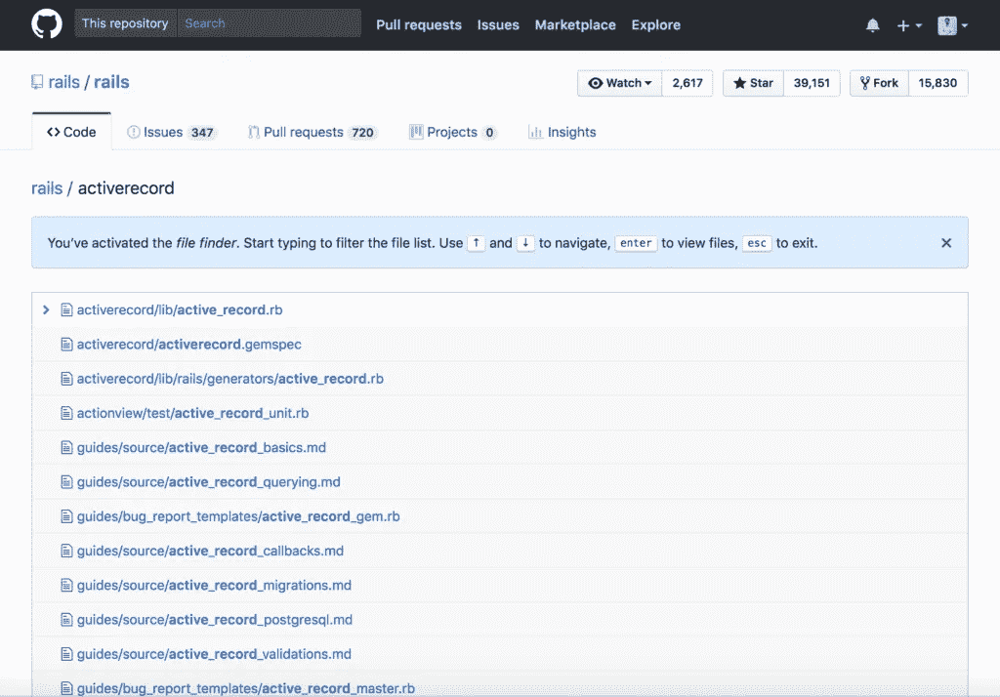

# 在 Github 存储库中快速导航的快捷方式

> 原文：<https://medium.com/hackernoon/a-quick-shortcut-for-quickly-navigating-in-github-repositories-8874200c4f65>

GitHub 是开发人员存储项目、与其他同事协作以及从其他开源项目中学习的最佳场所之一。这些类型的项目是用不同的编程语言编写的，通常使用不同的框架。由于这些框架或开发人员通常拥有将他们的代码文件组织到许多文件夹中的特定方式，这使得在 GitHub 中手动浏览它们有点困难。幸运的是，有一个非常有用的捷径可以帮助你。

如果你进入 GitHub 库，按下键盘上的 *T* ，你就可以开始输入你想要打开的文件的名字。这样，您就可以像键入一样快速地转到特定的文件，而不必在浏览项目中的多个嵌套文件夹后才转到特定的文件。然后你可以使用键盘上的上下键浏览文件，按*enter*查看文件，或者按 *esc* 退出。

这真的很简单，但我个人认为非常有用，因为当我试图找到一个特定的文件时，它节省了我很多时间。这并不意味着现在这样就足够了，并且能够避免使用通常的文件夹页面查找的需要。它只是一个快捷的方式，你可以用它来快速找到你已经知道的文件或文件夹。您仍然可以使用通常的方式在项目文件中导航，并不时地使用这个快捷方式。