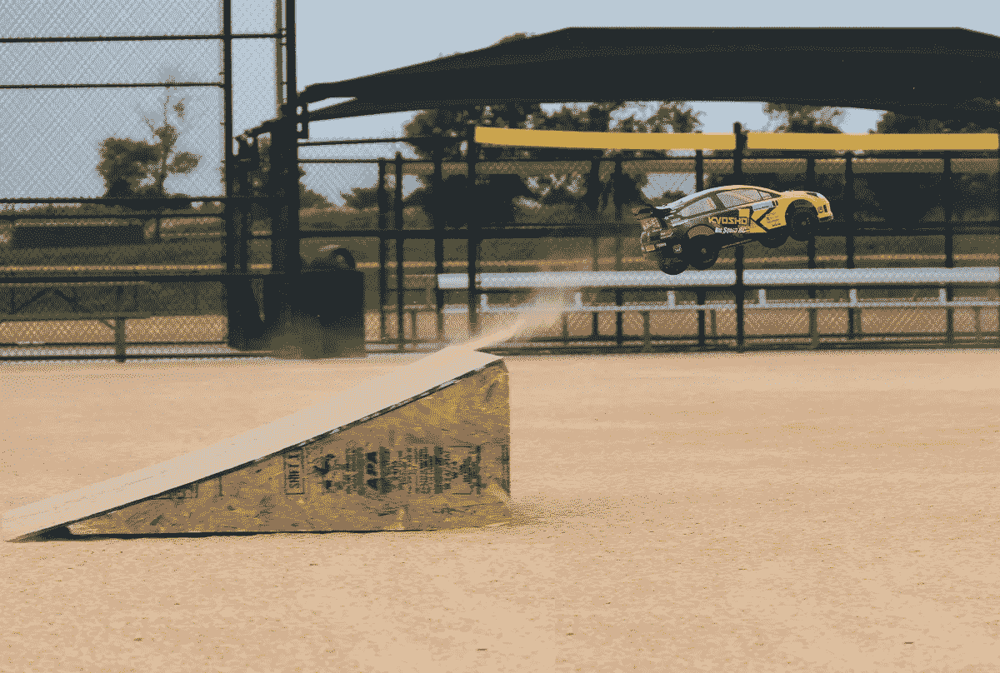

# 通向金钱未来的斜坡，以及为什么我们必须用它来实现 Web 3.0

> 原文：<https://medium.com/hackernoon/a-ramp-to-the-future-of-money-and-why-we-must-use-it-to-reach-web-3-0-c973e19e7934>

世界上大多数人不会明天醒来就开始使用加密安全的钱包来保存他们的个人财富，也不会转而使用代币作为所有交换的机制。

这并不意味着他们不应该——他们只是意识到了让人们放弃他们所知道的系统的困难，即使这个系统有更好的选择。这些事情需要时间，但这不应该阻止我们尽可能快地向那个未来冲刺，或者试图带领其他人和我们一起到达那里。

在 Nexves，我们正在想象未来，并开发我们需要的产品和服务。我们相信人类应该从现在开始攀登阶梯，从现有的和即将到来的技术中获益。我们需要“ ***”金钱*** ”来生存——但我们必须寻求创新的产品、服务和平台，让我们尽可能多地储蓄，扩大我们的财富，而不是让它休眠。互联网让人们能够以前所未有的规模获得过剩产能——看看优步和 Airbnb 就知道了，我们相信这种模式同样适用于金钱。

# 我们需要让我们的钱为我们服务

 [## 钱到底是什么

### 我们都相信钱意味着什么

medium.com](/@ChrisHerd/the-reality-of-what-money-actually-is-6ef11d91e89d) 

这样做的原因很清楚。银行剥削我们太久了，他们拿我们的钱赌博，让我们损失了一大笔钱。将我们的资本存放在这些机构的回报少得可怜。我们储蓄的利率处于令人不快的边缘，但 100 年来几乎没有变化。银行仍然通过让我们的钱为他们工作来赚取难以想象的利润。为什么我们不能平等受益，或者比那些用我们的钱致富的人受益更多？

与此同时，钱还不如印钱的纸值钱。你可能会认为，因为一种货币与一个国家联系在一起，它就意味着什么。现实是，近 100 年来，金钱除了是对价值神话的一种集体信仰之外，什么都不是。美元脱离黄金价值的那一天，世界上没有一种货币是由商品或资产支撑的。

最近国际转账 1900 万美元，收费 0.40 美分。银行被吓坏了。几个世纪以来，他们垄断了财富的转移，从每一笔交易中提成，却无法避免。即使使用当今最高效的转账服务，也要花费超过 100，000.00 美元的传统货币。

与此同时，你无法参与为最富有的 1%人群保留的资产类别。原因在于,“复杂性”规则决定了谁可以投资什么。我们认为这是不公平的，只要有多元化的资产组合，为什么每个人都不能更有效地充实自己呢？这就是我们在 [Nexves](https://medium.com/u/75e6c5c8d1fb?source=post_page-----c973e19e7934--------------------------------) 正在建造的东西

*   金钱想要数字化和免费，问题是依赖于 70 年代的技术意味着用传统的金钱不可能实现这一点。
*   依赖央行政策让我们任由政府随心所欲地贬值我们的货币(量化宽松)。在 2008 年金融危机期间，他们已经这么做了。
*   通货膨胀加剧了这个问题。金钱一年比一年不值钱，这就是弗雷多的价格如此之高的原因。这并不影响政府，而是一种用来充实政府的机制。
*   钱要自由，我单纯的想给你转账，为什么要放弃什么？仅仅因为某件事长期以来一直是某种方式，并不意味着它现在就是正确的做事方式。

## 我们现在有技术来改变我们通向未来的道路

我们是否选择接受取决于我们自己。未来是由那些对未来最有远见并坚持不懈地追求其实现的人创造的。这是我们在 [Nexves](https://medium.com/u/75e6c5c8d1fb?source=post_page-----c973e19e7934--------------------------------) 努力实现的未来。

## [要实现这一点，我们需要你看到它，并帮助我们塑造它——加入我们](https://chat.whatsapp.com/B8iqjrRoCgvFt9kgFYr9oX)

# 实现这一未来的步骤

要开始这样做，我们必须重新定义什么是钱，以及我们对一个账户应该提供什么的预期。我们必须建立一个中心点，使无数的服务从这里延伸出去。这种做法所能取得的成果的限制因素应该是我们能想象到的更美好未来的深度。中央枢纽成为在互联网上以前所未有的规模实现信任的关键，而无需泄露身份。在网上隐藏自己身份的能力对于采取某些行动至关重要，但这不应该成为有罪不罚的借口。

最容易加入的是一个与你目前使用的账户尽可能相似的账户。这消除了任何可感知的障碍，同时赋予你开始参与这个新世界所必需的技术。你把钱存入账户，它永远属于你，没有损失的风险。这是一种创造新货币的机制。储蓄证明就像一种“挖掘”,赋予你某种东西，使之成为有形资产。您的行动可以被衡量，并用来赚取额外的代币。要想吸引人，必须有一种激励或集体信念，即你收到的代币在未来会有价值，或者会有一个交易市场。同时，这种信念也不是 100%必要的。如果你持有代币，你将在每次有流动性时收到付款。

# 第一阶段——资产支持的数字货币

出于多种原因，加密货币/代币是货币的未来，但最重要的是，它们使交易变得非常高效——在速度和成本方面都是如此，但我们最初的问题仍然存在。如果人们还没有准备好进入这个领域，我们如何帮助他们以最低的门槛进入这个领域？我们可以通过提供比他们目前拥有的多几个数量级的福利来让他们达到目标。

## 通过他们已经熟悉的服务实现这一点

这意味着他们已经了解的资金管理平台。通过复制现有帐户上的功能——迭代它们并显著改善用户体验，我们可以创建一个令人信服的产品，而不改变行为或需要改变。这样做，进入的门槛就变为零了。每个人都需要一个账户来管理他们的钱， [Nexves](https://medium.com/u/75e6c5c8d1fb?source=post_page-----c973e19e7934--------------------------------) 成为了一个更好的版本。

实现这一未来的第一步是中央资金管理账户。这意味着一个平台，你可以把你现有的钱存进去。您放弃了通常会从您的帐户支出/储蓄中产生的利息和返现费用，而是获得了上述数字货币。**这将立即相当于你应该收到的利息金额，即 1 个代币= 15 英镑(在平台上存储 30 天的每 1000 英镑支付 1 个代币，1.5%的利息= 15 英镑，因此是初始代币价值)。**

对于那些愿意推测代币价值会上升的人来说，他们所要做的就是持有代币以期待未来的价值。自然，代币会升值，因为货币是贬值的，而不是通货膨胀的。这是对早期用户的奖励，因为与后来的用户相比，他们每节省 1000 英镑将获得更多代币。

从利息中积累的钱将被用来建立一个投资基金，投资于为最富有的 1%保留的资产类别。这意味着商业/国际房地产、私募股权和创业投资等。我们已经与这些行业的领军人物建立了合作伙伴关系。

为了最有效地推进这一计划，我们提议在储蓄证明机制的基础上进行代币销售，这将是所有未来代币的创建方式。首次出售将涉及约 2，500，000 枚代币，售价为每枚 15 英镑。这笔资金的大部分将立即投资于上述资产类别，其余资金将用于下面列出的创新。

# 第 2 阶段—数据分析以实现节约

我们将创建的第一个产品将利用平台上每个用户提供的数据的力量。现在，除了询问家人和朋友，你没有办法知道你正在使用的任何产品或服务是最划算的。我们将利用我们能够积累的情报，将其与令牌化相匹配，并获取难以想象的可操作数据量，为消费者提供革命性的透明度。现在，银行知道我为一项特定服务支付多少钱，你为同样的事情支付多少钱。他们不知道的是，基于我们每个人可能拥有的不同包装，这种比较是否公平。

我们在 [Nexves](https://medium.com/u/75e6c5c8d1fb?source=post_page-----c973e19e7934--------------------------------) 能做的是通过获取进行比较所需的数据来填补知识空白。通过代币支付，我们可以向你和平台上提供代币的其他人付费，你的回报是更高的投资基金所有权。这意味着，对于你每月的每一笔经常性支出，我们可以根据平台上其他人的支付情况告诉你应该节省多少。最终，我们将创建一个服务来代表您自动完成这项工作，为您节省大量时间。

# 第三阶段——盈利平台

[Nexves](https://medium.com/u/75e6c5c8d1fb?source=post_page-----c973e19e7934--------------------------------) 将实现的下一件事是一个赚钱的平台。这将利用人性，人性要求我们每个人为了共同的自身利益而理性行事。这里的大规模创新是，通过自私地行动，整个平台受益并获利。

1.  有人付钱给你，让你做一些能增加基金投资的事情
2.  这增加了你自己的代币的价值
3.  同时增加每个人都有的代币

想象一下 10，000 个人去他们当地的超市要求他们开始进货我们投资的产品的力量。想想 10 万人在他们的社交媒体账户上分享一条关于我们拥有的国际目的地的消息会有什么影响。现在想象一下，当数百万人在做同样的事情时，这种影响会有多大。这就是你可以成为其中一员的平台规模的力量。

我的目标是建立一个比我们任何人单独都大的东西。这意味着 Nexves 要取得成功，我们需要使用该平台的每个人的协作。我们相信，我们可以驾驭这种力量，同时影响和发展世界，使之成为我们想要生活的世界。通过鼓励每个人自私地行动，我们可以为每个人实现最好的结果。这意味着你可以通过帮助他人增加投资来获得报酬，包括你自己的投资。

最终，我们寻求成为历史上最大的超级聚合者。空前规模的集体谈判。

# 第四阶段——建立代币经济

从更高的交易频率中获得的流动性，对于将 Nexves 打造成一种可行的数字货币至关重要。要实现这一点，必须有一个人们可以交易的市场经济。这意味着要建立一个系统，让没有代币的人也能获得代币。他们有办法通过赚取这些钱来参与上述活动，这是为没有银行账户的人提供机会的一种方式，同时也创造了一个机会，在比目前可能的年龄小得多的年龄获得未来的参与者。

数字货币意味着为消费者购买构建一个完整的生态系统。这意味着对可以购买或使用的东西进行投资。一个最简单的例子就是国际房地产。房产的价值仍然是货币价值的资产，而租金可以用代币支付。这种方法的创新之处在于用过的代币会发生什么变化。如果你完全用代币购买住宿，90%的代币会被烧掉，10%留作住宿费用。代币交易意味着你获得了比传统货币更低的价格，而你剩余的硬币变得更有价值，因为你支付的硬币被销毁了。

更广泛的采用将使这种货币能够用于几乎任何领域的采购。使用该平台的用户越多，P2P 交易的潜在市场就越大。随着其他 Nexves 用户打开平台上其他产品和服务的大门，去中心化成为平台的超级力量。通过普遍的信任机制，你的帐户，不良行为可以被惩罚，控制或防止。

# 阶段 5——营销作为一种收入形式的侵蚀

我最大胆的反向信念是，广告作为互联网上的一种收入形式，将在未来十年内消失。去中心化互联网的兴起是不可避免的，在这种互联网中，每个人都拥有一切，但同时又没有任何东西。这将使我们能够收回我们目前免费提供给公司的数据，防止我们成为受害者并无情地在网络上跟踪的有针对性的入侵广告。

> 如果你不为产品付款，你就是产品，将演变成你是用你控制的货币——注意力——付款的产品

这是在承认我们应该掌握自己的命运——为什么跨国企业集团要通过把我们变成僵尸来商品化我们的注意力，这些僵尸对社会的唯一贡献就是积累资本以推动购买？

## 数字税收

就像 Napster 是 Spotify 的前身一样，在线产品/服务的下一条收入路线是什么？数字税收将通过使用你的 CPU/GPU 来挖掘一种货币来实现，这种货币根据你提供给创作者的产品、服务或内容的关注量来分配给创作者。

Nexves 将允许内容/产品/服务的消费，而无需用户直接向创作者或服务提供商付费。对于 CPU 使用率较低的任务——观看视频、阅读文章、社交网络、照片共享，以及几乎所有你在网上进行的任务——这些服务将向你征收%的 CPU 使用率，并使用它来挖掘密码，这些密码将根据你观看、阅读或使用他们制作的内容的时间分配给创作者。

## 未来

想象一下，互联网上最大的机构被“免费”的替代品取代，这包括脸书、网飞、谷歌和你能想象到的其他每一个十亿美元的跨国企业集团。这些服务不会通过利用您提供的数据和向您做广告来获得报酬，相反，它们的收入将直接来自您，以及您对维护世界上最复杂、分布最广的区块链所做的贡献。一种直接从关注中成长的数字货币将会出现。注意力将演变成互联网的现金，因为最终，它将成为唯一重要的东西。在线服务的参与度和付费之间将存在直接的关联。

你的 Nexves 账户将成为这个项目的中心。

# 阶段 6——普遍信任机制

一个通用的信任机制是实现第三次互联网浪潮的关键。

**Web 1.0 催生了互联网
Web 2.0 催生了主宰互联网的巨头
Web 3.0 将催生分布式网络，并将其收回**

Airbnb 有它的评论系统，优步有它的明星，但没有任何东西可以跨越互联网的广度来提供人们为什么应该信任你的整体快照。你的资金管理账户成为了网络通行证，你可以完全控制网上的信息。这将使您能够将您的数据货币化，并控制何时披露哪些信息是合适的。这种机制可以确保环境中的信任，如果没有它，就不可能做任何事情。

这使得每个人都可以推销自己的注意力。从许多方面来说，这是世界上唯一仍然稀缺的商品。被广告成为一个有意识的决定，你是受益者。此外，存在有效的控制，这意味着公司参与这一新系统是有益的。如果你的资金管理账户被用作企业在其中搜索线索的一个约束条件，而不是付费在特定的词或短语上做广告，那么它们将能够直接将广告定位到来源，而无需向中介付费。最重要的一点是，你是决定是否让这些公司访问你的客户资料的人。

# 第 7 阶段—平台服务层

Nexves 的最终愿景是成为实现更加去中心化的世界的关键基础设施。它成为你的数字身份的支柱，成为你将网上行为货币化的途径，并通过让你的钱发挥作用的同时以前所未有的规模储蓄来积累财富。储蓄凭证成为一种机制，使资产支持的数字货币得以出现，在这种货币中，你的代币提供了实物资产的有形所有权。这是革命性的。

除此之外，一个充满可能性的世界出现了。我对互联网发展方式的不满并不是源于我们注意力的垄断，而是随着一个未经许可的世界被利用而加剧。为了夺回控制权，我们必须插入机制，使我们能够保护我们的数据。这并不意味着隐藏它，或减少我们发布的关于自己的内容，这意味着我们更明智地在网上分享信息，并拥有当我们想脱离时可以关闭的开关。在这个世界上，我们已经被操纵以某种方式投票，通过消费新闻和宣传，这往往被证明是错误的，这不仅是明智的，而且对于确保我们保持对自己情感的控制至关重要。

最终，我们希望其他人与我们的平台互动。这意味着创建分布式服务和产品，并集成到我们自己的产品中。您的当前账户是一个哑账户。一旦你把钱投入到利用当今可用技术的工作中，同时将它与平台规模的影响结合起来，我们就可以建立一种数字货币，使我们能够实现对所有人都更加公平的互联网愿景。

## 今天就开始为你的未来投资吧。成为 Nexves。

# [加入我们的 Whatsapp 群](https://chat.whatsapp.com/B8iqjrRoCgvFt9kgFYr9oX)或者[加入我们的 Slack 频道](https://join.slack.com/t/nexves/shared_invite/enQtMzA0MTMwNjQ0MzQyLTNmNWVlYzg2YWRlMWZkZDdhMDM4NTMyMzQyYTgyMzQ1ZmVjMmYzZjAwZWQwZTI1ZmZhOWE2M2Q5NTE4YWYzMTQ)

# 【www.Nexves.com 