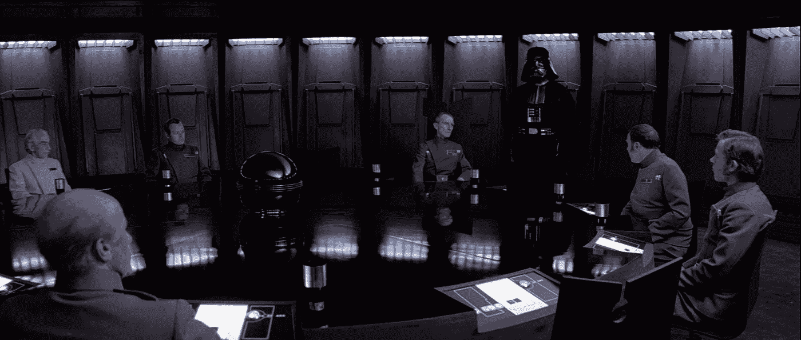

# 播客的真实 DAO 模板

> 原文：<https://medium.com/hackernoon/a-real-world-dao-template-for-podcasts-732da0dcb5a4>

## ***帕特里翁杀手。***

我叫安东，我们正在构建[theta DAO 框架](https://web.thetta.io)。就像开放齐柏林飞艇，但是对于道斯来说。

仅在 [5 天前，我还是最好的“只面向核心开发者”俄语播客之一 DevZen 的嘉宾](https://devzen.ru/episode-0198)。我们讨论了我们的框架，作为一个真实世界使用场景的例子，我提出了一个适合他们的 DAO 方案。

在这里，我们将设计一个 DAO 方案，它可以被一个播客节目用来激励不同的参与者。

好了，下面是 DevZen 过程的样子:

在现实世界中有许多可以有效使用 Dao 的情况:

*   (当务之急)如果你想激励许多不同的参与者，并明确“游戏规则”。
*   如果您需要管理某些东西并集体更改参数。
*   如果您希望流程自动化。
*   如果你想更开放(关于薪水、财务、投资人等)。
*   (最低优先级)如果您想保护自己免受集中化(即政府控制、本地管理员等)的影响

因此，在 DevZen 播客中，我们希望在代码中(而不是在纸上)定义组织，并添加加密激励来激励团队工作、嘉宾出现在节目中，以及听众可以立即自动购买广告。

“嘉宾没有出现在节目中”的问题是真实的，对任何播客来说都是非常关键的。

在纳西姆·塔勒布的新书《游戏中的皮肤》中有一个很好的例子。引用:“罗伯特·鲁宾，[……]，在 2008 年银行业崩溃之前的十年里，从花旗银行获得了超过 1 . 2 亿美元的薪酬。当这家实际上已经资不抵债的银行被纳税人拯救时，他没有开任何支票——他援引不确定性作为借口”。缺乏明确的奖惩机制导致了这一点。我们想解决这个问题。

# DevZen 播客的加密协议是什么样的？

1.  任何支持者(“赞助人”)都将获得 ERC721 徽章“我是支持者#120”
2.  任何收听者通过向 DevZen DAO 发送 X ETHers 可以获得一个 er C20“dev Zen”令牌，成为“赞助人”(即令牌持有者)。
3.  所有收集到的 ETH 都将与路线图一起进入“资金流”合同。它是这样工作的:
4.  每月支付 0.5 ETH 的托管费用
5.  支付其他费用(费用可以修改)
6.  如果收集到 1 个 ETH(仅一次)->购买麦克风
7.  如果收集了 5 个 ETH(仅一次)->购买新服务器
8.  其余的分成作为对 DevZen 团队的奖励(根据声誉计算分红)
9.  任何顾客都可以使用 DevZen 代币来投放广告。只需烧 Ktokens 将你的 add 加入槽中(线性，无优先级)。
10.  任何信誉令牌持有者都可以使用信誉来管理 DAO，即改变参数。此外，信誉在投票中用于选择下一个主持人以及添加或删除主持人。
11.  要成为客人，听众必须首先成为顾客(即，他们必须购买一些 DevZen 代币)，然后他们必须在 D 天内下注 S 个代币。表演结束后，S 代币将返还给顾客。如果客人错过了演出(那就糟了)，代币就会被烧掉。

Photo by: J[ames Altucher](/@jaltucher?source=post_header_lockup)

以下是描述此场景的更详细的文件—[https://gist . github . com/AnthonyAkentiev/05579 C3 a 77 be 6d 41718 F2 DD 70627 a5dd](https://gist.github.com/AnthonyAkentiev/05579c3a77be6d41718f2dd70627a5dd)

所有这些需求都可以使用 Thetta 的许可、资金流、治理和令牌子系统来实现。您可以使用 Thetta 来设置播客“organization”的基本布局，然后在其上添加一些功能，如 TokenCuratedRegistries。在这种情况下，本例中的 Thetta 是一个易于使用的基本 DAO 层，它与来自其他库(如 OpenZeppelin)的智能契约兼容。

我们继续吧。

# DevZen 令牌模型。例子

DevZen 代币每周铸造一次:

1.  5 个广告位 10 个代币
2.  0 个自由浮动令牌

DevZen 代币被烧毁:

1.  每个广告位 2 个令牌(如果广告在当前剧集中播放)。假设 1 个德弗森代币价值 25 美元。这意味着每个广告位最初花费 50 美元。

*但是，如果节目中没有广告，这些代币不会自动燃烧！它们被保存在禅道中以备将来购买。然而，想象一下，如果 100 个广告位没有被使用，200 个代币被铸造和保存。然后一个买家可以买下所有这些代币，并在连续 20 场演出中投放广告！*

信誉令牌每周铸造一次:

1.  1 台主机的 2 个信誉奖励代币
2.  4 个版主的 2 个信誉奖励代币
3.  为 1 名客人提供 1 张代币作为奖励

声誉可以通过燃烧 1:1 转换(“兑现”)到 DevZen 令牌。

“I order to mint more reputation tokens!”

# 问题 1。通货膨胀

每周会有 10 个 DevZen + 5 声望令牌被发出，但是只有 10 个 DevZen 令牌可以被烧掉。如果信誉令牌可以以一对一的比率转换为开发令牌，那么在最坏的情况下，我们将最终拥有 15 个开发令牌，但只能烧掉其中的 10 个。这是+5 代币的通货膨胀(在最大等级)，这将降低 DevZen 代币的价格。

尽管如此，我认为通胀是好的，因为它给了我们做市的自由浮动令牌。这意味着 DevZen 代币总是可以买到，经济运行得更好。**价格下降可以被视为使用该系统的自动费用。**

# 问题二。如果我有代币，但没有可用的广告位，该怎么办？

好的，你买了 2 个代币，想投放你的广告。但是没有广告时段。

你必须等待。

或者 DevZen 可以将广告位的价格从 2 个令牌增加到 3 个令牌。

或者 DevZen 可以通过拍卖模型从固定的位置价格转变为动态的价格。

任何 DAO 都应该适应变化，这就是治理子系统非常重要的原因。Thetta 有不同的现成模块，可以用于治理。

# 结论

可以在这里看到 DevZen DAO 方案:
[**https://github . com/Thetta/DAO-Templates/tree/master/contracts/3-DevZen DAO**](https://github.com/Thetta/DAO-Templates/tree/master/contracts/3-DevZenDao)

它还没有 100%准备好，但是它会给你一个最终版本的样子和行为的想法。

对我们来说很明显，将 DevZen 目前使用的 Patreon 结构转换为 DAO 增加了激励，在代码中形式化了该过程，并改进了众筹过程。