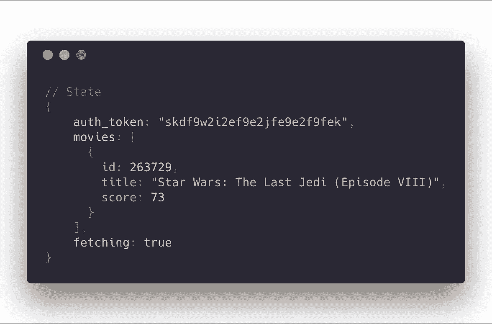
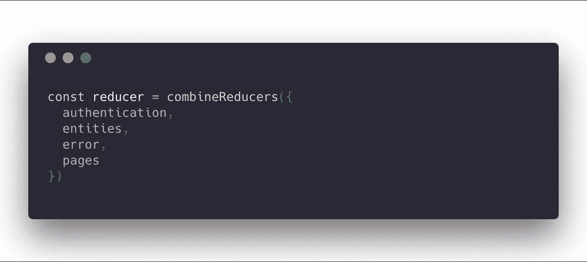
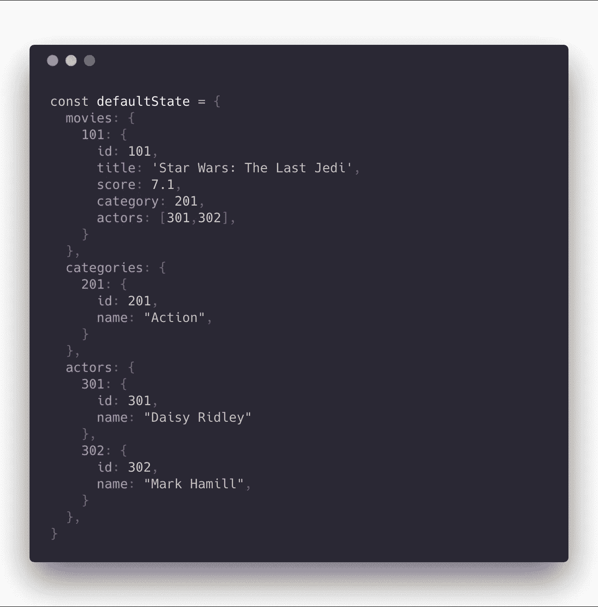
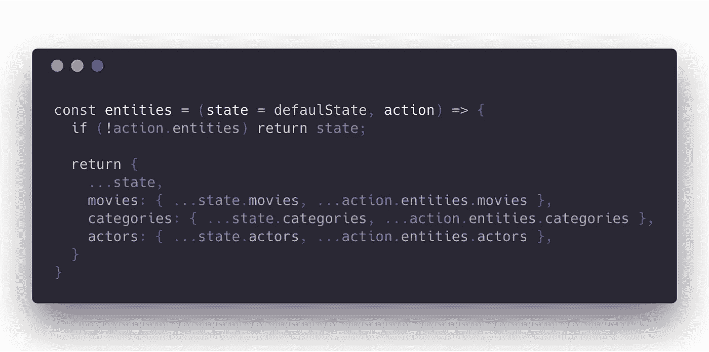
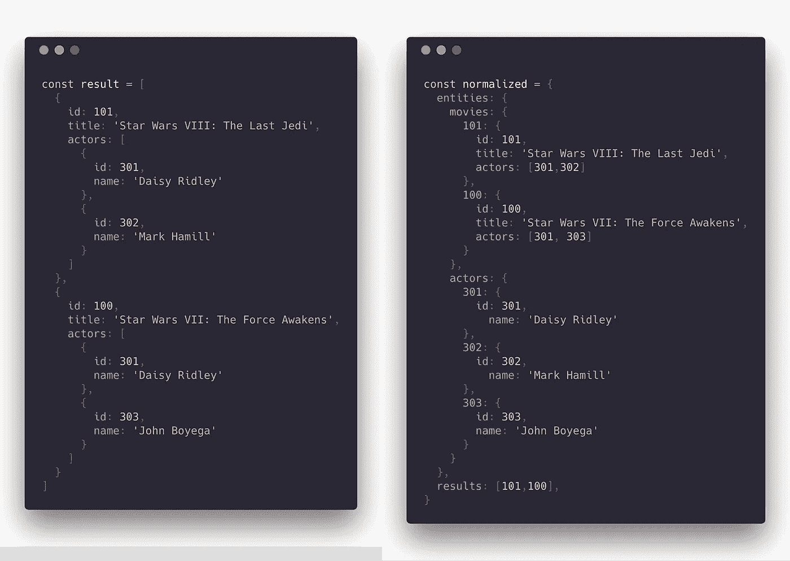
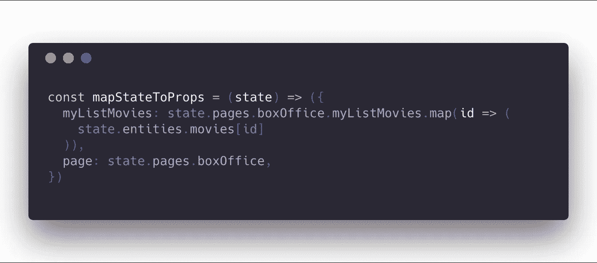

# 一个冗余的国家组织提案

> 原文：<https://medium.com/hackernoon/a-redux-state-organization-proposal-a93f3d79a6d2>

当使用 Redux 时，很难开始组织你的状态。我已经看到我的许多学生在需要的时候不断添加房产。这种疯狂的策略可能会导致你有一个巨大的国家造成的可怕的技术债务。

例如，当遵循该策略时，您可能会得到如下结果:

Try to imagine this but with almost 50 properties, and larger lists.

我在上面的状态中发现的问题是所有属性都是混合的。

*   `auth_token`将主要集中使用:一个`ApiClient`服务或中间件。
*   `movies`是一个实体列表。它将用于整个应用程序，以呈现应用程序提供的信息。
*   `fetching`是一个表示性的标志，我们将在一个特定的视图(组件)中使用它，例如为了显示一个加载微调器。

我们可以从**量级**的角度来看属性是如何混合的——因为`movies`(数据)与`fetching`(标志)和**用法**的重要性不同——因为它们在完全不同的地方和时间使用。

这两点可能会影响设计，**一个混乱的状态组织可能会影响我们选择器的模块化(** `**mapStateToProps**` **)。**

# 建议的解决方案

经过一些尝试，我想出了一个解决上述问题的国家组织。它非常灵活，适合不同结构的项目。

使用`combineReducers`创建该状态，以定义由不同减速器控制的独立状态部分。注意，我使用了 [**的简写属性名**](https://developer.mozilla.org/en-US/docs/Web/JavaScript/Reference/Operators/Object_initializer#New_notations_in_ECMAScript_2015) 来定义对象的属性:`authentication`是`authentication: authentication`的简写，是我稍后将描述的第二个 reducer 函数。

## **认证还原器**

身份验证缩减器旨在存储和控制与当前登录用户相关的所有数据。如果您的应用中没有任何身份验证策略，您可以跳过这一部分。在其中，您可以保存像当前用户对象、auth 令牌这样的东西。这非常有用，例如，当您希望记住会话时，因为它可以在创建存储时持久化和预加载。这里有一个非常酷的教程[丹·阿布拉莫夫的](https://egghead.io/lessons/javascript-redux-persisting-the-state-to-the-local-storage)解释了如何轻松做到这一点。

该还原程序将监听与认证相关的特定动作类型:`SIGN_IN_SUCCESS` `SIGN_UP_SUCCESS` `LOG_OUT` …

## 实体缩减器

这是减速器最特别的部分。我们习惯于看到基于`action.type`上的巨大`switch`的 reducers，以及状态转换列表。但是这个程序将用不到 20 行代码来控制我们前端的整个数据集。

这个想法是，状态的这个属性存储了一个本地数据库，其中包含我们必须处理的所有实体，这些实体是在某个时候从后端提供给我们的。假设我们继续以电影为例，那么这可能是一种状态:

正如你所看到的，状态被分成不同的实体组，这些组不是数组，而是带有与每个实体的每个对象的 id 相关的键的对象。这样可以避免重复。**主要思想是，这将作为一个迷你本地关系数据库**:没有什么是重复的，但被引用。通过避免嵌套，我们使得**更容易关联数据并避免不一致**。

如果您的数据都是本地的，那么用这种方式管理它不会有问题，但是如果您使用的是 API，它很可能会以嵌套的方式提供数据。为了将数据处理成我们的格式，您可以使用 [normalizr](https://github.com/paularmstrong/normalizr) 。经过一些配置，就可以扁平化调用函数`normalize`。它将返回一个具有两个属性的对象:`entities`和`result`。实体将是以我们的格式提取和规范化的数据；结果将是您刚才获取的根实体的 id 的关系。

实体！多巧啊，哈？实际上，不是。我从 [Redux 的真实世界示例](https://github.com/reduxjs/redux/tree/master/examples/real-world)中获得了这种模式，它使用 Github 的 API，在此之后规范化它的数据。

由于这种格式，我们可以编写一个缩减器，只用几行代码就可以控制状态的整个`entities`部分

每次我们的动作包含属性`entities`，它将与我们当前状态的实体值合并。

> 警告:这个 reducer 只是在数据到来时添加或覆盖数据，没有理由从我们的状态中删除数据。有些人可能会说这是不必要的，因为删除可以被视为对元素的`delete`标志的修改(软删除)。你怎么想呢?有什么改进这个案子的建议吗？大家在评论里辩论一下吧！

## 页面缩减器

酷！我们所有的数据都被自动处理并合并到国家！但是我们应该小心:我们的数据存储在对象中，没有数组，所以没有顺序。

我们应该保持后端提供的结果的顺序，他们可能会花费大量的资源(所以钱💸)来决定电影呈现给每个用户的顺序(网飞，有人？).但是通过规范化它们，我们忽略了这个顺序。这就是为什么 normalizr 也给了我们`results`，一个代表获取资源的 id 关系。

你获取了一个 ID 为`101`的电影(API 响应一个对象)？`results`属性将为`101`；获取 id 为`101`和`100`的电影数组(API 发送数组)？`results`将此数组`[101,100]`(保持顺序)。请参见下面的示例:

注意，原来的响应是一个电影数组，规范化对象的`results`属性也是一个数组，保持原来的顺序。

entities reducer 中没有空间容纳这个`results`数组，所以我们必须将它放在另一个地方:页面 reducer。页面缩减器是关于不同页面需要的局部变量，以呈现其信息。元素数组，加载标志，如果不使用 redux-form，可能是表单数据。基本思想是，当 entities reducers 保存来自资源的数据时， **pages reducer 存储与呈现屏幕**相关的数据。

正如您所看到的，当将状态映射到容器中的属性时，我们创建了一个数组，将结果(`state.pages.boxOffice.myListMovies`，id 列表)中的所有元素映射到`entities`中的实际数据。

这个想法是将`state.pages`属性再次分割成一组你在应用程序中显示的所有页面。例如，路由反应路由器加载的每个组件。

# 包扎

这种结构将帮助您轻松扩展数据驱动的应用程序。如果你必须添加其他类型的实体，这不会影响页面的结构。如果您想添加另一个以不同方式加载现有实体的屏幕，您可以使用 pages reducer，而不必担心数据控制。所有这些都将帮助我们遵循简单的真理来源原则，这将帮助您在开发过程中避免许多问题。

将来，我想用这种模式来写 Redux 的重选。

让我知道你在评论中的想法，让我们讨论更好的做法或修改。

编码快乐！