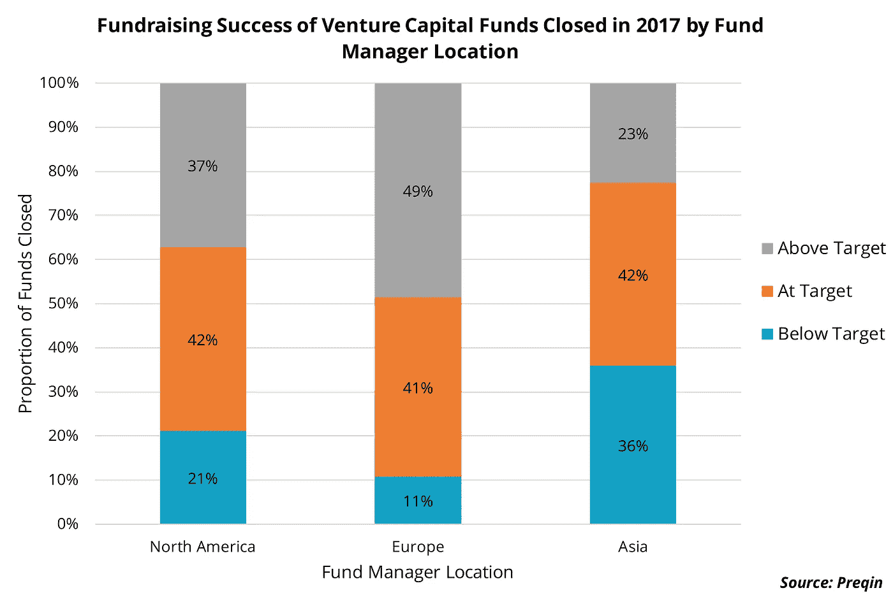

# 风险资本筹资和投资者偏好的区域比较

> 原文：<https://medium.com/hackernoon/a-regional-comparison-of-venture-capital-fundraising-and-investor-appetite-2f63b6d6bfdb>

北美是 2017 年活跃在[风险投资](https://hackernoon.com/tagged/venture-capital)基金中的大多数(57%)有限合伙人的家园。鉴于普通合伙人通常更了解所在地区有限合伙人的要求，基金经理往往会吸引大部分国内投资者。因此，毫不奇怪，总部位于北美的风险投资基金继续主导 2017 年的融资市场:262 只基金最终收盘，获得了总额 350 亿美元的[投资者](https://hackernoon.com/tagged/investor)资本。这超过了总部位于亚洲和欧洲的 185 家投资公司筹集的总资本(210 亿美元)。

尽管总部位于欧洲的风险投资基金在 2017 年仅获得全球融资总额的 13%，但该地区的融资环境非常有利。如下图所示，欧洲基金经理募集的风险资本工具中，90%达到或超过了目标规模，相比之下，北美和亚洲基金的这一比例分别为 79%和 65%。这可能是由于欧盟最近为解决采用 AIFMD 引起的某些问题而实施的欧洲风险资本基金条例。新的变化包括提高亚洲地区风险资本投资的灵活性，以及限制收取托管费用，使这一资产类别对投资者更具吸引力。

当查看风险投资基金达到最终关闭所需的时间时，2017 年关闭的北美车辆平均花费 14.4 个月在路上，远低于 17.1 个月的全球平均水平。在欧洲筹集的资金平均需要 18.4 个月才能最终完成，而亚洲基金平均需要 20 个月才能完成。

Preqin 的基金搜索和委托功能显示，在积极寻求在未来一年投资风险投资基金的有限合伙人中，欧洲的比例最高(40%)，其次是总部位于北美(29%)和亚洲(21%)的投资者。在欧洲，公共养老基金(18%)、基金会(16%)和家族理财室(13%)是寻求风险投资策略的最主要投资者类型。总部位于洛桑的 Caisse de Pensions de l ' tat de Vaud 计划在未来 12 个月内向全球风险投资基金投资约 2.5 亿瑞士法郎。总部位于英国的纳菲尔德基金会(Nuffield Foundation)将在未来一年寻求投资这一资产类别，并优先考虑欧洲和北美等发达市场。

*   *数据来源于先秦调查和专有研究。*
*   *不包括基金经理的基金。*
*   *特别感谢林碧轩、李思欣·蔡的贡献。*
*   *在推特上关注我*[@菲利斯 _ 埃吉迪奥](https://twitter.com/felice_egidio)