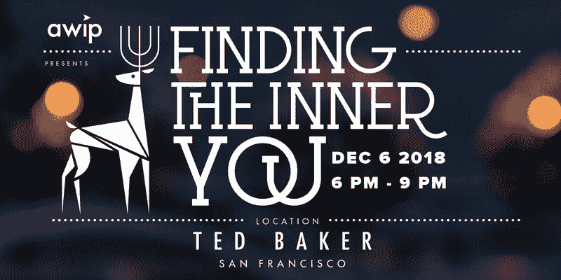
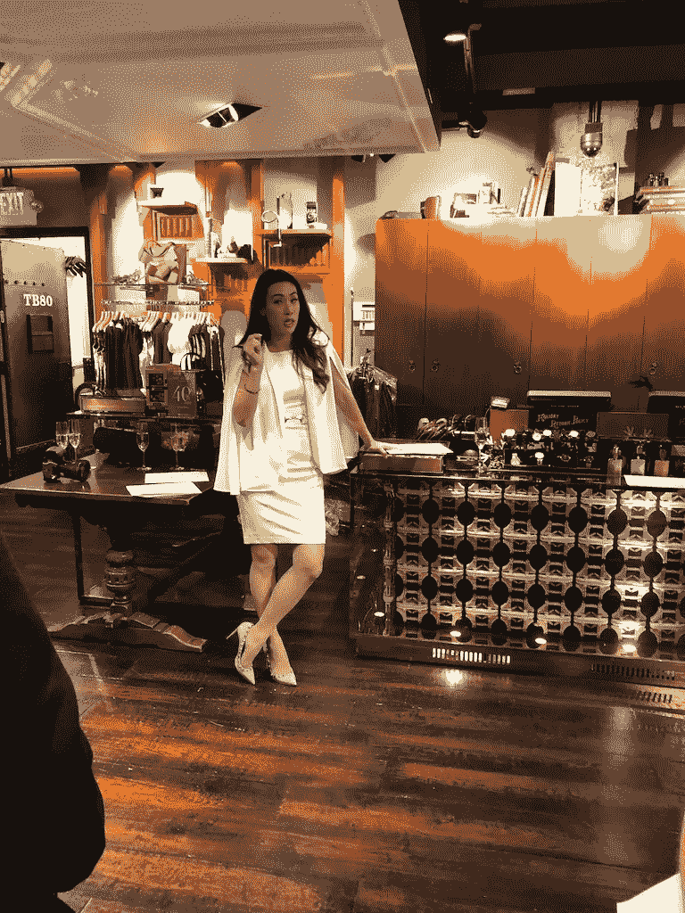

# 2019 年的决心:通过提升产品中的女性来发现内在的你

> 原文：<https://medium.com/hackernoon/a-resolution-for-2019-finding-the-inner-you-5253bde19bab>

演职员表:AWIP 团队、 [*韩辉*](https://www.linkedin.com/in/hanh-bui/)*(12 月节目负责人)、* [*艾莎乔希*](https://www.linkedin.com/in/eshajoshi/) *(事后博主)*

[推进产品中的女性](http://www.advancingwomeninproduct.org) (AWIP)在 2018 年取得了令人瞩目的成绩:除了增加了三个国家和国际分会(旧金山、西雅图和巴黎)以及在全球范围内增加了 4000 名会员，他们还举办了一场年终派对，主题是授权一群美丽而大胆的女士将最自信的自己带到工作和生活中。AWIP 社区的成员于 2018 年 12 月 6 日聚集在 Ted Baker San Francisco，欢迎两位热情的女士，她们全心全意地支持 AWIP 赋予更多女性科技领导角色的使命: [Betty Hsu](https://www.linkedin.com/in/betty-hsu-aa738b/) ，专业形象教练 [Elisa Cicinelli](https://www.linkedin.com/in/elisacicinelli/) ，专业头像摄影师。

从她关于领导力培训的演讲和对其*领导力行为准则*的概述，到在日常生活中练习这些技能的分组会议，Betty 展示了在生活的重要对话和演讲中保持自信的技巧和诀窍。

从 Betty 的演示中可以获得一些重要信息:

**情商，又称情商(EQ)，是表现最强的预测指标。**

情商是一个很强的绩效预测指标，在所有类型的专业人士中，有近 60%的成功是由情商决定的。这也转化为关系管理的成功。情商是对一个人意识到与你交往的人的情绪以及你自己的情绪的能力的衡量，以便建立一种牢固的工作关系。

强势的姿态是被认可为自信专业人士的关键。

贝蒂认为，强有力的身体姿势是表达积极的身体语言和自信的最有效的方式之一。笔直挺拔所传达的信息远非言语所能形容。

为了获得一个强壮的姿势，贝蒂的建议是站着，让你的重量平衡在你的双脚上，保持你的头部，并增强你内在的存在感来控制你周围的空间。

> "当我们占据更多空间时，我们的睾丸激素增加，压力激素减少."

强有力的声音显示出对所传达信息的信心和自信。

包括在她的行为准则中，强有力的声音是传达个性和自信不可或缺的。贝蒂的建议是，以最佳音量说话，保持放松的节奏，用微妙的表情突出你的信息，最后，让你的隔膜产生共鸣。

> “当你在电话面试中打电话时，试着站起来！即使是通过电话，你的面试官也能看出你何时微笑，何时躺下。”

**强烈的眼神交流是可信度的一个很好的指标。**

在重要的演讲或谈话中，你保持专注并与每个人保持至少 3-5 秒的目光接触的能力对于与房间里的每个人互动至关重要。比自信地说话更重要的是，眼神交流是你所有社交活动的基础。你的眼睛可以传达各种各样的情绪:恐惧、快乐、自信，甚至值得信赖。

这些建议，加上贝蒂愿意在活动中与个别女士交谈，使她的演讲获得了成功。

Betty Hsu presenting her Leadership Codes of Conduct

当晚的赞助商 Ted Baker SF 为活动展示了他们可爱的店面空间和美味的开胃菜。此外，他们还捐赠了一个深蓝色天鹅绒 Rosalaa 斜挎包作为活动抽奖的奖品。当晚还伴随着 Elisa 为活动参与者拍摄的大头照。

抽奖奖品被授予 AWIP 会员[玛利亚·古吉娜](https://www.linkedin.com/in/maria-gudkina/)！在活动结束后与她交谈时，她说:“我发现 AWIP 活动对我的产品生涯和我融入科幻社区非常有用。[AWIP]，请继续举办这些伟大的活动！”

AWIP 期待着新的一年——请关注 2019 年即将到来的活动！

请访问我们的网站:[www.advancingwomeninproduct.org](http://www.advancingwomeninproduct.org)或脸书页面:[https://www.facebook.com/groups/awipInfo/](https://www.facebook.com/groups/awipInfo/)了解我们 2019 年即将举办的活动和章节的更多信息！

*关注*[*@ bettyhsutedjong*](https://www.instagram.com/bettyhsutedjong/)***。***

*跟随 Elisa Cicinelli*[*@ elisacicinelli*](https://twitter.com/elisacicinelli)*。*

*在这里* *了解更多关于提升女性产品* [*的信息。*](https://www.advancingwomeninproduct.org/)