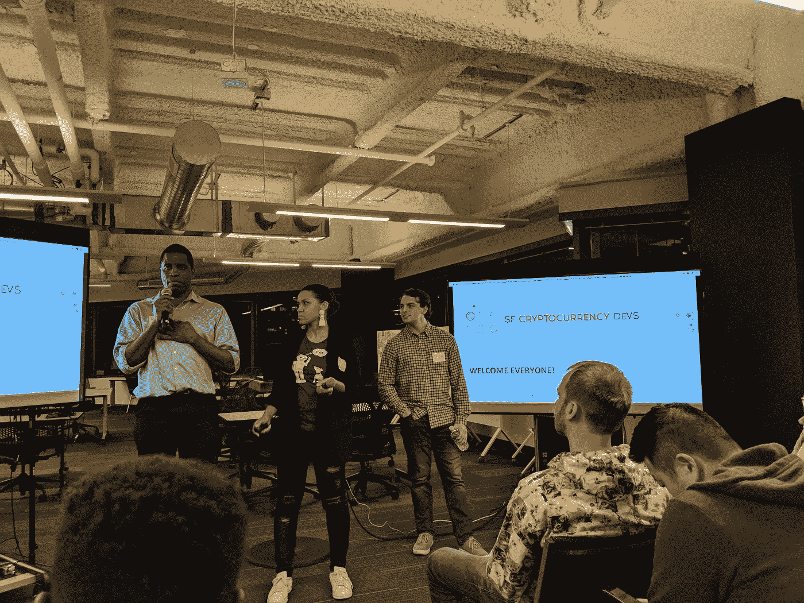
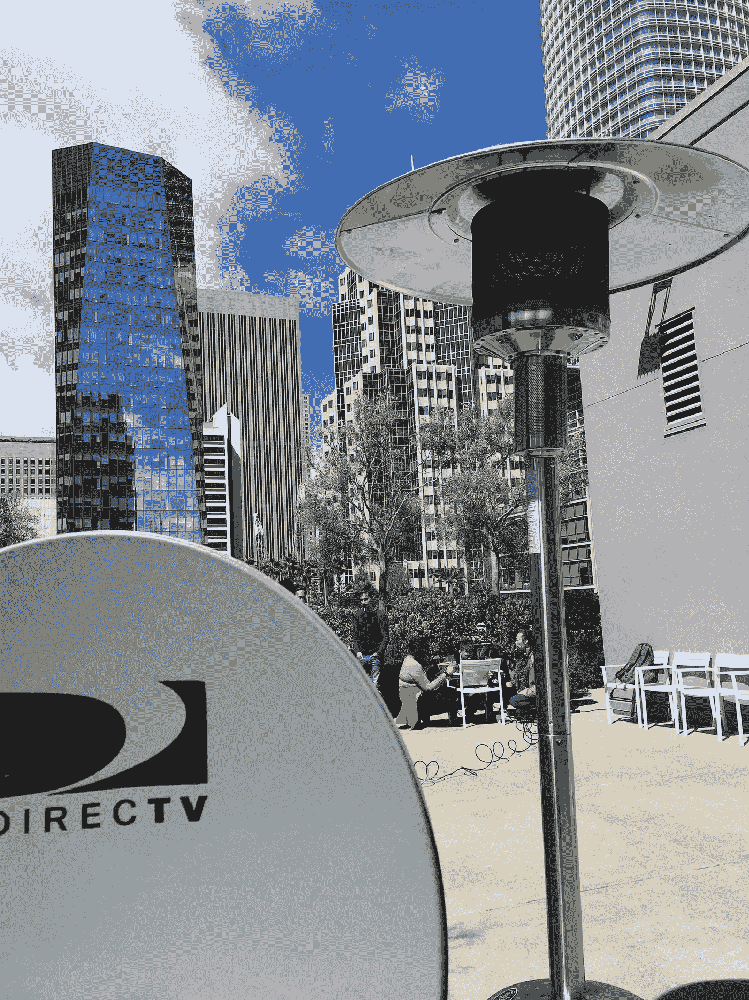
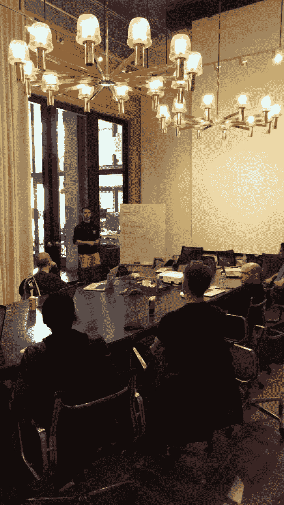
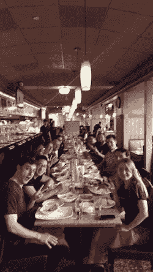

# 我担任旧金山加密货币开发者会议组织者时的回顾

> 原文：<https://medium.com/hackernoon/a-retrospective-on-my-time-as-organizer-of-the-sf-cryptocurrency-devs-meetup-44ac629a8d1>

在这篇文章中，我讨论了我在硅谷中心组织了七个月最大的加密货币开发者会议后学到的东西——特别是我讨论了三个教训，揭示了我们如何克服 meetups、oss 和区块链项目面临的最大障碍:建立社区。



My very first event — Zcash 1/24/18

一个 AR 时尚爱好者，一个魅力企业家，一个大学生走进一家酒吧。不，这不是一个糟糕笑话的开始，这是一个典型的周三晚上——一个充满笑声、聊天、猜测和兴奋的夜晚，在技术上深入研究了[区块链](https://hackernoon.com/tagged/blockchain)技术的另一个令人兴奋的应用之后。在我作为 SF[Crypto Devs Meetup](https://hackernoon.com/tagged/crypto-devs-meetup)group 的联合组织者的七个月活动中，我有幸领导这些活动，每隔一个星期三，有时甚至连续三四周。无论是什么话题，*如何为比特币核心做出贡献，跨链原子互换，或谨慎的日志合同，*我总是醒着，直到周四早上的深夜，试图理解*为什么*和*如何*？

唉，这一切都在过去的周二晚上结束了，我把接力棒交给了我的继任者，出色的瓦尔·麦克，准备回到科尔比学院，在那里我将完成我的本科学业(还剩两年，哦，我的天！).所以今晚，我坐下来思考我的经历，成功的事件，忘记点披萨，马克·纳达尔的霓虹绿裤子，推出布洛克和杰里的。在此过程中，有一个共同的主题非常突出。

> 社区、聚会、开放源码软件项目和整个区块链空间的生死存亡。

下面是三个故事，展示了我学到的如何建立一个积极参与、热情的社区的经验。

# 周日聊天

你如何让一个开源项目吸引人？是什么让一个无聊的工程师兴奋起来，激发开 PR 的努力？这些是我在试图创建自己的开源社区时思考的一些问题。


JZcash

在我为 SF Crypto Devs 工作的前三个月，我领导了黑客和聊天周日活动，每个月一到两个周日。这些活动的前提是*我们提供咖啡，你带来项目，我们一起黑。*最终，我们希望培养一个构建者社区，开发令人兴奋的开源软件，并繁荣到下一个令人兴奋的区块链项目中。

最令人惊讶的一群敬业的人出现了，他们周日放弃了那里，和我们一起工作。太棒了！

在这些周末活动的过程中，我试图引导一系列(失败的)项目:

*   [JZCash](https://github.com/SFCryptocurrencyDevs/jzcash)
*   [平价比特币客户端的一份文档](https://github.com/SFCryptocurrencyDevs/parity-bitcoin)
*   [一个 JavaScript 电报机器人](https://github.com/SFCryptocurrencyDevs/tipmebch)
*   一个 Rust Meetup 机器人

这些最初试图建立一些东西并吸引一个专注的贡献者社区的尝试失败了——尽管他们都是怀着伟大的意图开始的，人们介入并做出了一些贡献，我们都学到了一两件事，但兴奋并没有持续多久。最终开发停止了，社区也分散了。

然而，我们最终还是挖到了金子。



Me holding the satellite dish in place.

一个阳光明媚的周日下午，在镀锌工作区的屋顶上，一群 SF Crypto Dev 工程师一起工作，构建一个 [Blockstream 比特币卫星](https://blockstream.com/satellite/)接收器。我们有一个 python 专业人员调试 gui 软件，一个嵌入式系统专家解释我如何买错了零件，我们三个人不断地重新定位盘子，其余的人按照我们能找到的一套(唯一的一套)指令工作。

六个小时后，我们预定的房间用完了，我们不得不收拾行李。虽然我们不能正确地调整和配置接收器，但同志情谊和团队合作是无与伦比的；那一天在场的社区仍然偶尔回忆起那次经历——如果我们有正确的部分，如果我们尝试将接收器再向北移动一度，我们可能会成功。

## 第一课:在这个充满 oss 机会和开发者挑战的世界里，人们最感兴趣的是独特的和具有挑战性的体验，特别是那些他们可以告诉他们的朋友和家人的难忘的挑战。

*说你拿着比特币卫星接收器到处乱砍有多酷？*当然比*“我又赢得了 100 美元的建筑——又一个聊天机器人”*或者*“我为 X 开源项目做出了另一个微不足道的贡献。”*

# 紧急读数



一个周四的下午，Taariq 兴奋地发布了一个链接，标题如下:

*看看这个！这是新的热点！雪崩，DAGS！🔥🔥*

他当然是在谈论 Team Rocket 最近发布的白皮书，标题是: [*雪花到雪崩:一个新的加密货币亚稳态共识协议家族*](https://ipfs.io/ipfs/QmUy4jh5mGNZvLkjies1RWM4YuvJh5o2FYopNPVYwrRVGV)

罗柏，我们需要尽快举办一场活动。我们主持一个阅读会议来讨论这个怎么样。我们称之为紧急阅读，时间是本周日下午 5 点到 7 点。

就这样，紧急周日阅读变成了两周一次的周日活动(我最喜欢的活动，苏格拉底式，关于最新和最伟大的即将到来的加密方案、共识协议等的互动讨论。)

很快我们就有了一群固定的人，一个自愿放弃周日的社区，每隔一个周末，与 Taariq 和我一起呆在外面。起初，这似乎是凭空而来，最终毫无意义。为什么周日的阅读活动如此令人兴奋？是什么激发了这群人的热情？是什么激励这些工程师在工作日花时间预习，为周日的活动做准备？

**TLDR:** 帕累托原理是真实的。我在主持这个聚会的过程中学到的 80%发生在 20%的事件中(周日紧急阅读)。在这些事件中，80%的贡献来自 20%的人。让我们称这些人为种马。

请原谅，我有一个观点。

在一天结束的时候，大多数团队都需要某种类型的领导者，一个推动团队前进并抵制懒惰、不活跃和自满的人。每次我们有一个这样的紧急阅读，一个领导者很自然地接管并把他/她的专业知识传授给小组。

*   对于[雪崩](https://www.meetup.com/SF-Cryptocurrency-Devs/events/250911279/)，一位分布式系统工程师解释了一切是如何连接在一起的。
*   对于 [Mimble Wimble](https://www.meetup.com/SF-Cryptocurrency-Devs/events/251520979/) ，我解释了隐蔽交易和彼得森承诺背后的椭圆曲线加密。
*   对于[门限，代理重签名](https://www.meetup.com/SF-Cryptocurrency-Devs/events/252815050/)，Taariq 解释了自己项目的签名方案。
*   对于 [Grin](https://www.meetup.com/SF-Cryptocurrency-Devs/events/251745922/) ，昆腾·勒·塞勒解释了蒲公英协议。

这个团队的经历，以及活动的最终成功，可以归功于一个人的非凡努力。

## 第二课:找到你的种马。每个社区都需要有人来推动群体前进。

# 完美的专利披萨配方

You simply can’t run a Meetup without pizza.

这是另一个活动的早上，我面临着臭名昭著的 Meetup 困境:我应该点多少比萨饼？对于那些不熟悉组织活动的人来说，这是一个非同小可的问题；点太多的比萨饼，似乎是事件是预订不足，点太少的比萨饼，人们不能集中精力，因为空着肚子。没有一个一刀切的解决方案；点披萨取决于很多因素，比如 RSVP 的数量、披萨的大小和餐馆的选择。

我花了一段时间来掌握这个挑战。有一次，我从帕西点了披萨，发现他们的披萨很小，有六块——前十名参与者之后出现的每个人都没什么印象。下一次我向索玛比萨店订购十个超大比萨时，观众有五十人。我最后带着两个完整的比萨饼回到我的公寓(早餐、午餐和晚餐的冷蔬菜比萨饼，好吃极了！).

在无数次失败(以及耐莉的斥责)后，我终于明白了。这里，是正式的 SF Crypto Devs，专利，精确，正式验证，比萨饼订购公式书面生锈(证明只有在非随机甲骨文假设，又名只适用于 [SOMA 比萨饼](https://www.yelp.com/biz/soma-pizza-san-francisco-4))。：

```
fn calc_number_of_pies(rsvps: u32) -> u32 {
    let number_of_attendees = (rsvps as f32) * 0.33;
    let number_of_slices = number_of_attendees * 2.0;
    let number_of_pies = number_of_slices / 8.0;
    // Don't forget the extra large constant factor
    return (number_of_pies * 0.8).round() as u32;
}
```

[如果你想为你的活动测试这个工具，它在生锈的操场上。](https://play.rust-lang.org/?gist=4b7deb34cc6ed798fd6ceef778756a56&version=stable&mode=debug&edition=2015)

底线是，在过去的五场比赛中，我们已经吃了足够多的比萨饼。

SF Crypto Dev 会议的其他方面也是如此:周日活动(如上所述)、社区邮件、SF Crypto Devs 简介幻灯片等。一切都需要时间来调整。然而，一旦找到了金凤花，合适的组合，它就起作用了(也就是说，找到适合市场的产品——是的，你的 Meetup 是人们用他们的时间支付的产品)。

## 第三课:继续尝试。一个单一的、失败的事件或不受欢迎的想法并不能说明整个社区。社区是随着时间建立起来的，可能需要一段时间才能适应。

# 结论



Chaat Corner was always a favorite!

首先，我要感谢不可思议的 SF 加密开发者社区！我真的很高兴见到大家，迫不及待地想今年冬天回来参加一个活动！

对你来说，读这篇文章。感谢您让我与您分享这段经历——如果您正在考虑建立自己的社区，那就去做吧！我希望这些课程中的一门或全部能帮助你找到成功。