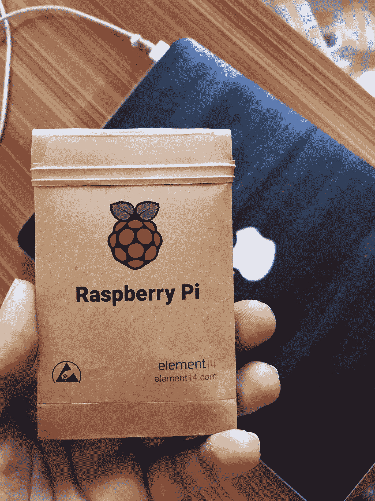
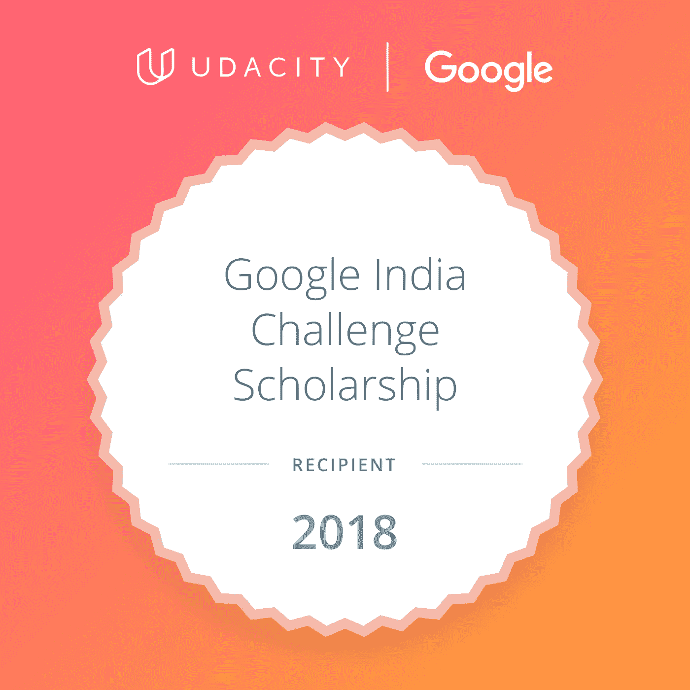
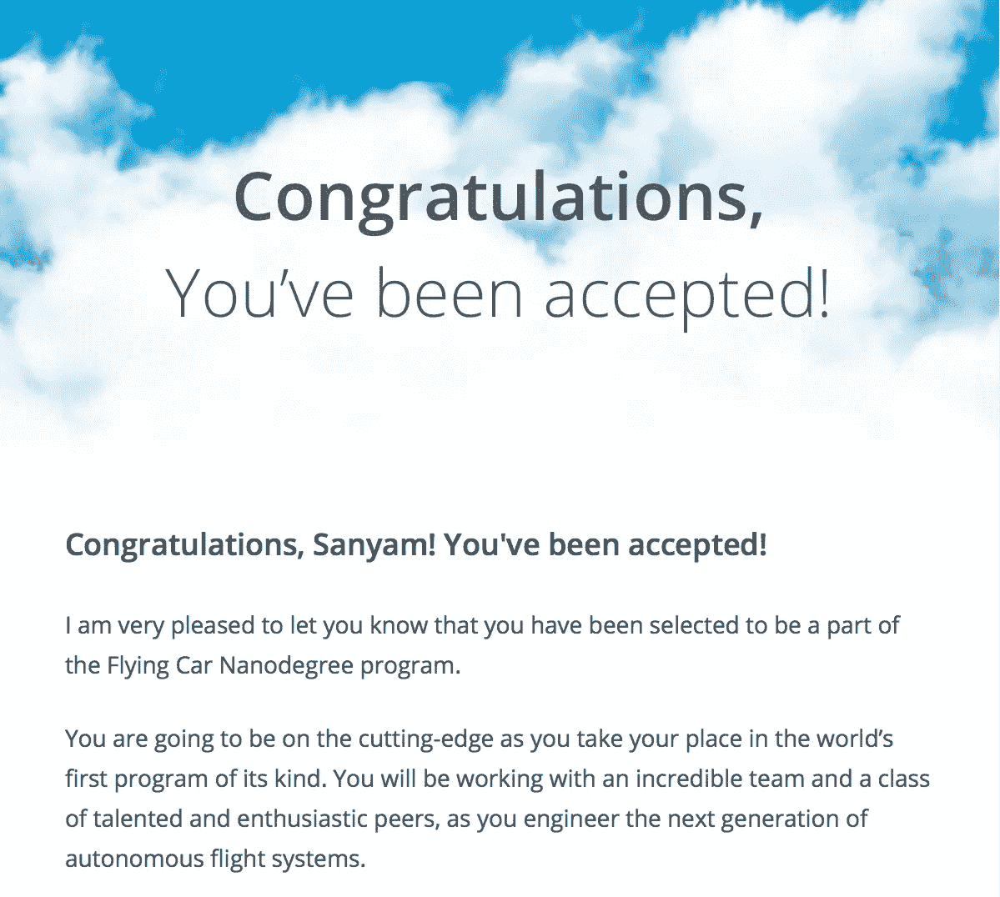
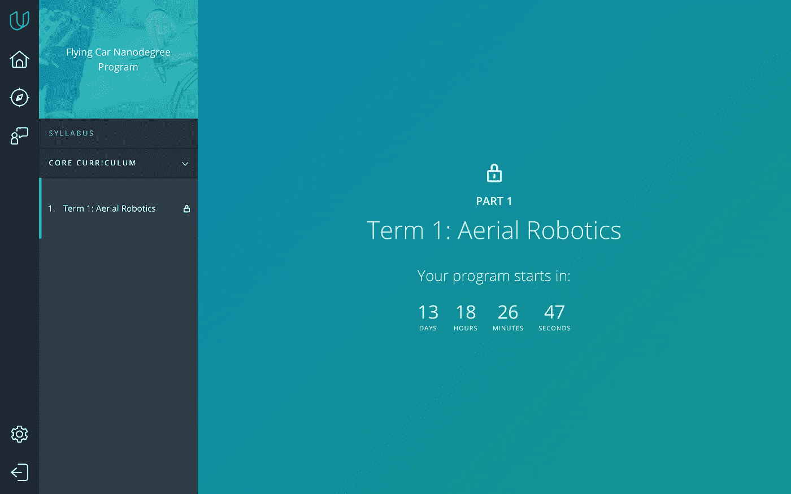
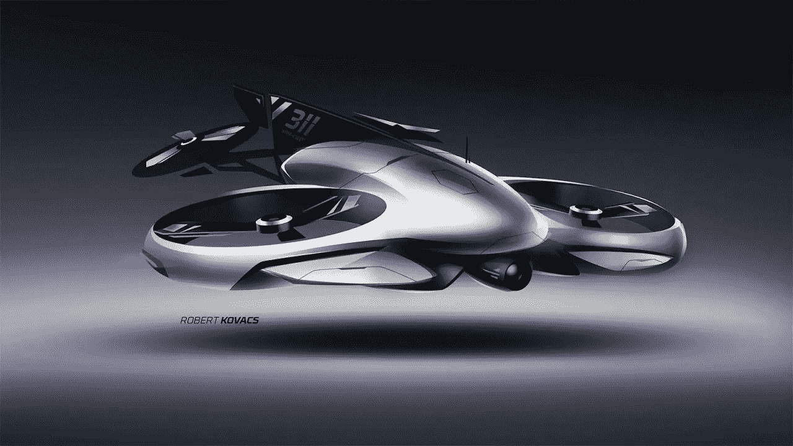

# 自动驾驶和飞行(新)年#3

> 原文：<https://medium.com/hackernoon/a-self-driving-and-flying-new-year-3-30d5ecd375e8>

## 我的 2018 自驾与飞行——学习之路博客系列。

> [你可以在 Twitter @bhutanisanyam1](http://twitter.com/bhutanisanyam1) 上找到我，在 [Linkedin 上联系我](https://www.linkedin.com/in/sanyambhutani/)
> 
> 这是本系列的第 3 部分。
> [这是第二部分，去看看我的车库里发生了什么吧！](https://hackernoon.com/a-self-driving-new-year-2-d1bbc5a83570)

一个月下来，我的自动驾驶汽车[在高速公路上学习](https://hackernoon.com/tagged/learning)路径，我喜欢这种感觉。我有一些激动人心的消息要分享。

但首先，我在我的车库里做了些什么:

*   完成了[麻省理工学院 SDC 2018 课程](https://hackernoon.com/mit-6-s094-deep-learning-for-self-driving-cars-2018-lecture-1-notes-807be1a50893)，在 DeepTraffic 中获得了 70 英里每小时的高分。我期待着 SegFuse 的发布，以尝试更多令人兴奋的东西。
*   [故障]烧毁了我的迷你 SDC 项目上的 [RasPi](https://hackernoon.com/tagged/raspi) 相机。公平警告:使用裸电路电子设备时要非常小心。幸运的是，我的新相机今天刚刚到达，Pi 板没有损坏，我可以回去了。

*   完成了车道发现和交通标志分类器项目。一旦这些被 Udacity 审查后，会有一个详细的帖子。
*   使用 Keras(链接 TBD)练习 LSTM 实施(端到端)。
*   学习 ROS 基础知识。
    【公告】:我将很快发布一个关于使用 ROS(带 Gazebo Sim)与自动驾驶汽车合作的媒体和 YouTube 教程系列。

这是该系列的第一个(未经编辑的)视频:

 [## Sanyam Bhutani_ROS 为 SDC 第 1 部分. mov

### 编辑描述

drive.google.com](https://drive.google.com/open?id=1bk1-D5Xo3FDKDEk_wvSZahIl8Lm2QvDD) 

*   我已经探索了几个模拟器来玩我的 SDC 想法:
    -[CarlaSim](http://carla.org)
    -[Autoware](https://github.com/CPFL/Autoware)
    -[air sim](https://github.com/Microsoft/AirSim)
    -[true vision](https://www.truevision.ai)
    -[right hook](https://www.righthook.io)
    -[eurotracksim 2](https://eurotrucksimulator2.com)
    一旦我对所有的模拟器有了坚定的理解，很快就会有关于这些的更详细的帖子。现在，我非常喜欢 et2 和卡拉。但是我还有很多修补工作要做。

# 谷歌印度奖学金

我一直想致力于深入学习能够大规模帮助人们的想法。

开发 Android/iOS 应用程序将是实现这一目标的理想途径。

感谢 Udacity 和 [Google](https://hackernoon.com/tagged/google) 授予我 Android 应用开发奖学金。

我当然希望发布我的一些想法(当然是免费的，在 2018 年第三季度之前)。

# 改变航线搭乘航班

鉴于我对 Sebestian Thrun 关于大胆梦想和无所畏惧地追逐想法的哲学的信念，我真的很期待飞行汽车 Nanodegree。

2 月 14 日，当我收到来自 Udacity 的录取邮件时，我决定换一条航线，换一种飞行方式。

你认为一个极客在情人节会做什么？

我决定把我的积蓄投资到一个 GPU 平台上，来学习飞行汽车。

> 现在飞，以后训练模型。(与此同时，AWS 前来救援)

我肯定会接受挑战，因为我正在研究飞行汽车、自动驾驶汽车，并从奖学金中学习，我是一名“全日制大学生，兼职深度学习学生”。

但是我肯定会在这个系列中继续分享我从纳米学位中学到的东西。分享我的自动驾驶和飞行之路。

你们这些书呆子在情人节做什么？

回复:
即将推出(链接 TBD):

*   [PyTorch 系列](https://hackernoon.com/pytorch-primer-series-0-e2e5df9b31c6)
*   ROS 系列
*   SDC 项目系列
*   飞行汽车系列(详细的项目描述，如果我可以的话——一个 YouTube 系列)

这是我的一个长期梦想概念:

Source: [https://i.ytimg.com/vi/DBz_8Cif-YY/maxresdefault.jpg](https://i.ytimg.com/vi/DBz_8Cif-YY/maxresdefault.jpg)

> [你可以在 Twitter @bhutanisanyam1](http://twitter.com/bhutanisanyam1) 上找到我，在 [Linkedin 上联系我](https://www.linkedin.com/in/sanyambhutani/)
> 
> [订阅我的时事通讯，获取深度学习、计算机视觉文章的每周精选列表](https://tinyletter.com/sanyambhutani)