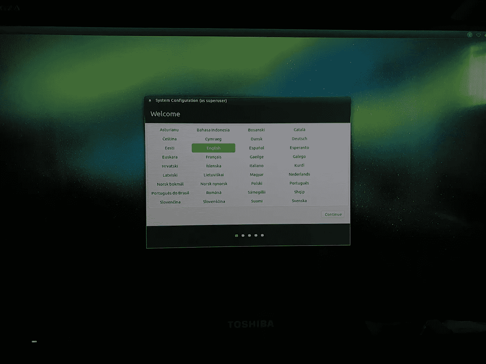

# 自驾车(新)年#2

> 原文：<https://medium.com/hackernoon/a-self-driving-new-year-2-d1bbc5a83570>

我的 2018 学习之路。

> [你可以在 Twitter @bhutanisanyam1](http://twitter.com/bhutanisanyam1) 上找到我，在 [Linkedin 上联系我](https://www.linkedin.com/in/sanyambhutani/)
> 
> 这是本系列的第 2 部分。
> [这是第一部分，去看看我的车库里发生了什么吧！](https://becominghuman.ai/a-self-driving-new-year-33284e592f35)

我的无人驾驶汽车纳米学位课堂的第一学期于 19 日开始，与此同时，我已经开始在我的车库里做一些事情，我想分享一下:

# 两周内:

正如承诺的那样，我会定期给这个系列添加帖子

下面是一些新闻:
我已经决定制造一辆迷你无人驾驶汽车，以应用我将在无人驾驶汽车纳米学位项目中学习到的知识:

*   **设置:**Model 1(名字 TBD——请帮我在下面的评论中挑选一个名字！)将是树莓 Pi 3 基础+ RC 汽车设置。
*   **原因:** Raspberry Pi 3 虽然运行所有图像处理和检测任务的马力较小(双关语),但它是测试我作为初级用户的技能的好地方，当然稍后我会将同样的技术应用到 Nvidia Jetson TX-2(或 1)上。第二个原因是，我没有杰特森，我以后会申请学生资助。

Model 1 Chasis: The Chasis is 10 years old!

*   **进度:** 1。我发现了一个遥控玩具汽车(从我的童年)，这将作为主要底盘的功能。
    2。设置 RPI3 板:我已经在树莓 PI 板上安装了 Ubuntu Mate，在上面配置了 ROS 和 OpenCV。
    3。为远程登录设置 PiBoard 并在启动时运行脚本:这是必不可少的，因为在现场我的 Model 1 汽车应该能够立即启动并行驶！

Ubuntu Mate Setup

我也鼓起勇气在我的第一学期开始前(大约一周后)设定了 5 个大胆的目标:

*   学期开始前完成 2 个项目:
    我将尝试对车道检测做一个粗略的解决方案&标志分类项目， ***在*** 纳米学位开始前！(项目存储库托管在 GitHub 上，我将尝试使用通过它们提供的知识和提示来解决这个问题)。稍后，一旦项目“符合规范”，我将分享一个适当的审查——这是 Udacity 表示项目完成的代码字！
*   在 Model 1 Mini SDC 上部署车道检测(伙计们，请帮我挑个名字，这听起来一点都不酷)。由于车道检测管道是基于 OpenCV 的，我将使用 PI 相机在 RPI 板上进行测试。

Pi Cam 2

*   使用 ROS 创建自动驾驶汽车的模拟:
    我将**而不是** Udacity 的模拟器，我将在 Gazebo 拍摄并使用开源汽车模型进行模拟。目标是制作一个模型，我可以在其中玩算法(而不是在模拟中制作一个功能完整的原型)
*   学习 Keras 基础知识:
    [我在深度学习纳米学位](http://sanyambhutani.com/generating-faces/)和实习项目中从事 Tensorflow 项目，在 [FastAI 国际奖学金](http://sanyambhutani.com/cats-vs-dogs/)中从事 PyTorch 项目。接下来是 Keras，将在我的第一学期使用。
    我绝不是这些库的大师，但我热衷于[学习](https://hackernoon.com/tagged/learning)并使用它们实现模型。
*   在麻省理工学院 2018 版完成莱克斯·弗里德曼[的自驾课程。](https://selfdrivingcars.mit.edu)

我的迷你无人驾驶汽车的长期功能目标:

*   路径(车道)跟随
*   避免撞车
*   目标检测
*   符号检测
*   加分:一个漂移模式！

请注意，这些不是先决条件，而是我个人对我的自驾年的冒险。

我会分享我完成的目标的详细帖子。

敬请关注更新！我会继续分享我的故事，如果我带着我的目标到达终点线或者失败了！

> 这些系列也将是我如何在我的旅程中工作的公共责任，因此系列的标题是“自我驾驶年”
> 
> 如果你想要一份深度学习和计算机视觉文章的每周精选列表，请订阅我的时事通讯。
> 
> [你可以在 Twitter @bhutanisanyam1](http://twitter.com/bhutanisanyam1) 上找到我，在 [Linkedin 上联系我](https://www.linkedin.com/in/sanyambhutani/)