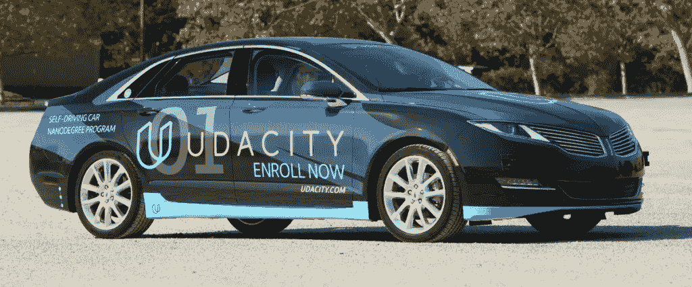

# 自驾游新年#1

> 原文：<https://medium.com/hackernoon/a-self-driving-new-year-33284e592f35>

我的 2018 学习之路。

> [你可以在 Twitter @bhutanisanyam1](http://twitter.com/bhutanisanyam1) 上找到我，在 [Linkedin 上联系我](https://www.linkedin.com/in/sanyambhutani/)
> 
> [该系列的第二部分正在直播](https://hackernoon.com/a-self-driving-new-year-2-d1bbc5a83570?source=user_profile---------11----------------)

Carla: Udacity’s SDC.

# 我进入深度学习世界的旅程(2018 年前)

祝大家新年晚了两天，但迟到总比不到好。新年世界快乐。

今年，我下定决心，定期在博客上记录我的发现和学习。这是我为什么选择从事自动驾驶汽车纳米学位的博客。

首先，这里有一个我如何走到今天这一步的背景:

从学校开始，我就一直是个技术书呆子。我在四年级的时候写了我的第一个 Hello world(基础版)，我当时就被吸引住了。

时间快进到 2015 年，我加入了印度一所著名的大学，通过攻读计算机科学学位来实现我童年的梦想——“成为一名程序员”。

当然，我对这个领域一无所知，也不知道自己想以此为生，但我确定自己热爱编程——我在高中时学过数据结构基础、Linux 和 C 语言。

在大学里，我参加了很多 MOOCs 来体验这个领域，探索了很多东西，参加了我大学的技术俱乐部和活动:在自主水下航行器上工作，在 IIT-钦奈研究园的机器人团队工作，在 IIT-洛克，IIT-马德拉斯，ONGC 的各种实习和项目中工作。

到了 2017 年，我坚定了追求深度学习的兴趣，[计算机视觉](https://hackernoon.com/tagged/computer-vision)。老实说，我总是对“人工智能”这个词着迷，但我不确定我是否应该在本科时学习它，因为普遍的观点要求我成为一名硕士生或数学天才。(不是我的观点)

我已经在 ONGC 实习过几个数据科学项目，2017 年夏天，我还在 IIT-罗克从事另一个项目。

所以我终于鼓起勇气，报了 [Udacity 的深度学习纳米学位](https://in.udacity.com/course/deep-learning-nanodegree-foundation--nd101/)，瞧！我恋爱了。6 个月后，我从 Nanodegree 毕业了，有了很多新的经历，很少有[【玩具项目】](http://sanyambhutani.com/)(除了课程中的那些)。

我也很幸运地进入了 Fast AI 国际奖学金:至少可以说这是一次过山车之旅！(很快会有一个非常详细的帖子)

做一些玩具 CV 项目。

# 我的 2018 学习之路:自动驾驶汽车

我真的非常感谢[安德鲁·特拉斯克](https://twitter.com/iamtrask)(我认为不需要介绍——但安德鲁是牛津大学的博士生，由牛津-DeepMind 研究生奖学金资助，他在那里研究深度[学习](https://hackernoon.com/tagged/learning)方法，特别强调人类语言，目前是 OpenMined 的主要贡献者)，[阿卡什·奈恩](https://twitter.com/A_K_Nain)指导我(查看他对 SDCND 的评论:[阿卡什的博客](/implodinggradients/self-driving-car-engineer-nanodegree-is-it-worth-it-8c675735cbd4))TL；大卫:正如安德鲁建议的那样，我决定听从自己的直觉:

我决定最终开始我的自我驱动的 SDCs 之旅(我希望这是我一生中最好的新年决心):无论是在现实生活中，还是在我小时候的科幻电影中，我都一直很着迷(哦，如果我们觉得自己是开着橙色奥迪车的托尼·斯塔克斯，我们会付出什么呢！)因此，我已经报名参加了 2018 年 1 月 1 日的 [Udacity 自动驾驶汽车纳米学位课程](https://in.udacity.com/course/self-driving-car-engineer-nanodegree--nd013/)。

我现在的目标是:我希望学习并应用我在深度学习和计算机视觉方面的知识到这个领域，同时探索深度学习的深度并获得自动驾驶汽车的知识。当然，我想成为一名 SDC 工程师，但这不是我的近期目标，首先是享受这个领域。

与 David Venturi 不同的是，我不想辍学去创造自己的学位——我想“碰碰运气”,完成我的本科学业，然后攻读这个领域的硕士学位，结识令人惊叹的爱好者，获得更多的知识，同时做兼职项目，填补我觉得课程可能存在的空白。(缺乏实际方面，也就是——再次强调，这是个人意见)我当然不是那种冒这一切风险的人。

我将(我当然希望我坚持这个计划——另一个决心)，在 2018 年期间通过博客帖子定期分享学到的经验教训:我从纳米学位和我的车库项目中获得的经验。

与此同时，我真的希望做一点深度学习和(如果我敢说的话)兼职+回顾我从 DLND、FastAI 学到的东西，最重要的是，为 communities-OpenMined 做贡献，培育 [AI](http://BecomingHuman.ai) 。

大家新年快乐！我也很想听听你的新年决心！

敬请关注更多内容！作为这个系列的一部分，我将继续分享我的博客，作为我学习道路和经历的一种责任。我希望每个人都能从我的经历和错误中吸取教训。

> [如果你想要一份深度学习和计算机视觉文章的每周精选列表，请订阅我的时事通讯](http://tinyletter.com/sanyambhutani/)。
> 
> [你可以在 Twitter @bhutanisanyam1](http://twitter.com/bhutanisanyam1) 上找到我，在 [Linkedin 上联系我](https://www.linkedin.com/in/sanyambhutani/)