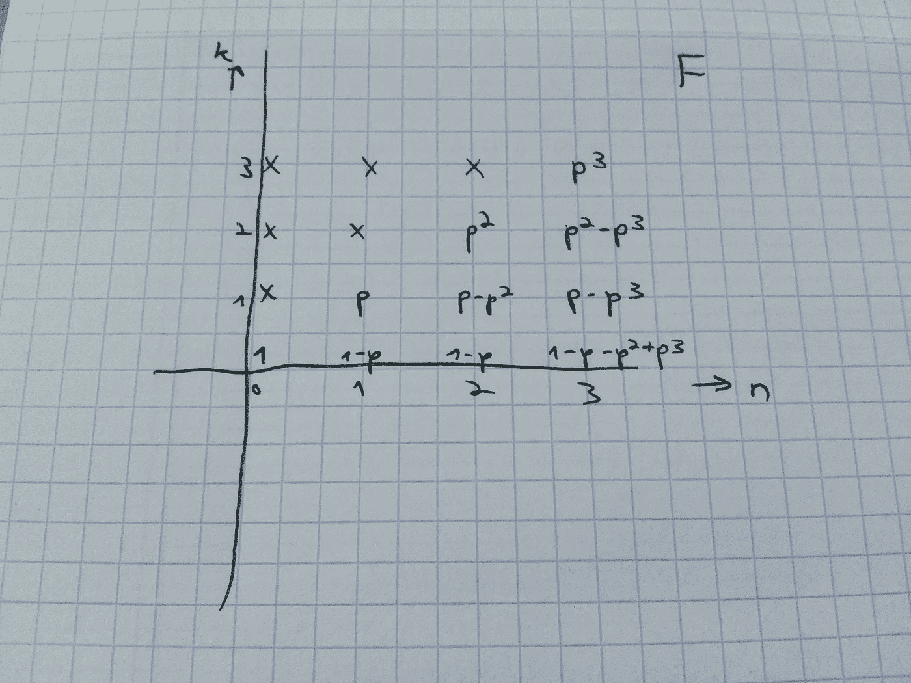

# 一个自私的挖掘双重花费攻击模拟器

> 原文：<https://medium.com/hackernoon/a-selfish-mining-double-spending-attack-simulator-fda1af38794b>

让我们从命名开始——坦白地说，我不喜欢自私采矿这个名字。所有的区块链矿业都是自私的，都是为了创收。对所谓“自私采矿”的正确和不言自明的解释应该是“[秘密采矿](https://www.cs.cornell.edu/~ie53/publications/btcProcFC.pdf)”。

我相信[阿维夫·佐哈尔](https://arxiv.org/pdf/1507.06183.pdf)让人们注意到了这样一个事实:使用隐形采矿可以产生双倍的支出攻击。基本上你要做的就是在主链之外继续采矿。由于区块链的规则是最长的有效链被视为分类账，如果你的链恰好比常规共识链长，那么那里的交易将被接受，而不是全球链上的交易。假设你在网络中拥有 25%的采矿能力，它可能在大约 4096 10 分钟的纪元内- >大约 280 天你将拥有这样的机会，你将领先主链 6 个街区。在这种情况下，你可以安排转移大量比特币来换取美元。然后，按照惯例等待 6 个时期，交易将被视为已接受。然后，你从帽子里拉出兔子，提交你的隐形链并覆盖主链，废弃之前完成的比特币转移。你带着你的美元逃跑，在危地马拉度过余生，原因不明。

但是你要多久才能完成这个快速致富的计划呢？

为此，我在 Github 上创建了一个计算器供您使用

 [## yotam-GAF ni/自私 _ 采矿 _ 计算器

### 在 GitHub 上创建一个帐户，为自私 _ 采矿 _ 计算器开发做贡献。

github.com](https://github.com/yotam-gafni/selfish_mining_calculator) 

有趣的部分是解释这个计算背后的数学。这里你实际上有一种[随机漫步](https://en.wikipedia.org/wiki/Random_walk)。在概率 p 下，p 是你在总开采量中的份额，你设法在世界上其他人之前到达一个区块。在概率为 1-p 的情况下，他们会比你先做。然后，如果你达到 6，也就是说你比其他人多前进了 6 个街区，你就赢了。这类似于[赌徒的破产问题](https://en.wikipedia.org/wiki/Gambler%27s_ruin)——一个资源 X 有限的赌徒需要多久才能完成他对赌场的资源赌博。但是有一些不同。首先也是最重要的是，每当世界上的其他人在你身上获得优势时，你可以重置他们的链条。没有伤害，你会重新开始。所以随机漫步永远不会进入轴的负侧。鉴于此，你不能直接使用随机游走公式。

所以，你建立了一个递归公式，在 n 次随机行走后，距离原点 k 步的概率。我们把自己限制在 k <=6\. The formulas look like that:

F(n,k) = pF(n-1,k-1) + (1-p)F(n-1,k+1)

F(n,0)= (1-p)F(n-1,0) + (1-p)F(n-1,1)

There are other edge cases such as F(1,2) is obviously 0 — You can’t get to a distance of 2 from the origin with only one step.

Our ultimate goal would be to represent F(n,k) not as a recursive function depending on other values of F but as an explicit formula in terms of p.

Sadly enough, this is hard math.

But there’s a more straight-forward solution using [动态编程](https://en.wikipedia.org/wiki/Dynamic_programming)上。与其递归执行公式，导致指数复杂度计算，不如看看 F 创建的筛子，从(n，k)对的较低值向上。这就变成了多项式复杂度的运算。

By ways of Dynamic programming, you can calculate sieve values from lower n,k pairs upwards

我在 Python 中实现了这种筛选计算，以评估不同的 p 值在比特币挖掘时代产生攻击所需的时间。基本上我所做的是我有一个 Numpy 数组，代表 p 的系数，对于每一个 n，k 的组合。我归纳计算了 n 值增长时的 F。出于记忆和简化的原因，我将 k 值限制为 6，因此近似值为 F(n，6) = pF(n-1，5) + pF(n-1，6)，而不是扩展到更高的 k 值。这种近似值实际上降低了攻击成功的概率，因此您可能会期望更高的历元估计值。我让代码可以扩展到更高的 k 值，比如 12。

当您实现它时，很快就会遇到一些问题:

*   一旦你有了筛子，你如何找到概率足够好的点呢？为此，我使用了这个不错的通用二分搜索法摘录，我发现[在这里](https://gist.github.com/Shnatsel/e23fcd2fe4fbbd869581)。
*   内存大小。F 的系数是线性增长的，所以对于 F(10000，k ),你已经有了 10K 系数，每个最大的浮点大小是 16 字节。对于筛子中的每个点来说，这是 160KB，因此，如果筛子在该大小下大约有 60K 个点，这可以估计为高达 1GB 的 RAM …这是一个很大的数字。我解决这个问题的方法是在筛子上加一个滑动窗。我计算了前 200 个 n 值。我检查概率是否足够好。如果是，我在当前窗口做一个二分搜索法。如果没有，我生成 200 个 n 值的下一个窗口。递归公式的好处是 n 的计算只取决于 n-1 个值。所以，你实际上不需要一次把所有东西都存在内存里。
*   浮点问题——你很快就明白了。我只是使用了 numpy 的 longdouble，这应该是最准确的可用 float，而没有实现我自己版本的 float，这样会很麻烦。

享受模拟器吧！

