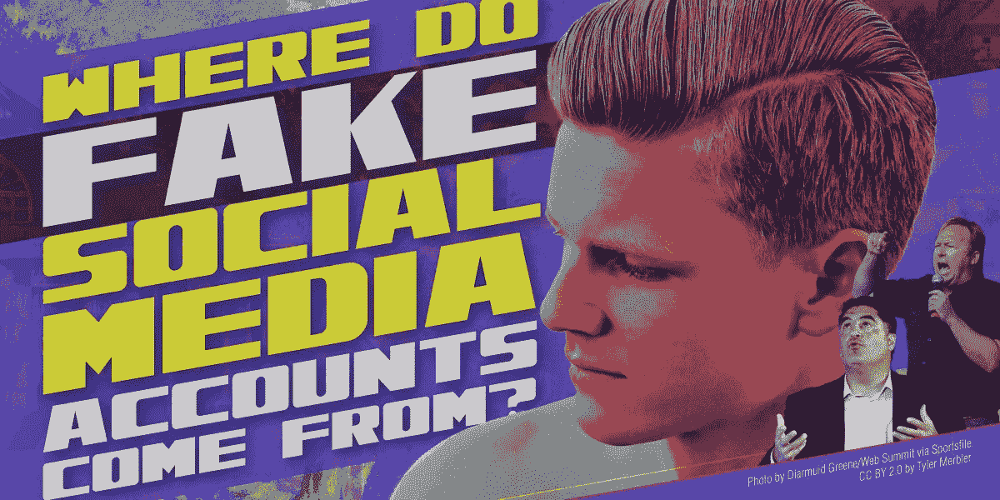
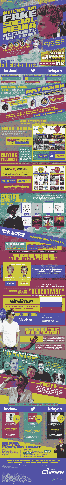

# 令人震惊的社交媒体账户的来源(以及它们是如何产生的)

> 原文：<https://medium.com/hackernoon/a-shocking-look-at-where-social-media-accounts-come-from-and-how-they-are-made-8a58322dd88b>

## 影响者营销是一个 10 亿美元的市场，预计到 2019 年将翻一番。这关系到很多事情。

虚假社交媒体账号从何而来，我们为什么要关注？我们都知道有人因工作而受到社交媒体的限制，他们可能会创建一个假账户，这样他们就可以自由地在网上互动，而不用担心工作上的惩罚。还有人给自己的宠物做社交媒体账号。这些是人们创建虚假社交媒体账户的一些更良性的原因。但创建一个虚假的社交媒体账户可能有更多邪恶的原因，当你看到他们中的许多人在网上做什么时，这一点就很明显了。

虚假的社交媒体账户通常是为了获取个人信息而创建的。黑客知道，如果他们能从你那里找到一些关键信息，比如你的出生日期和你母亲的婚前姓氏，他们就能侵入你的银行账户，或者窃取你的身份。

但也有一些社交媒体账户的唯一目的是传播错误信息。我们最近在新闻中听到了很多关于这种虚假账户传播假新闻的盛行，这可能影响了 2016 年的总统选举。

从这张信息图中了解更多关于[虚假社交媒体账户](https://socialcatfish.com/blog/where-do-fake-social-media-profiles-come-from/)的来源及其重要性的信息。

