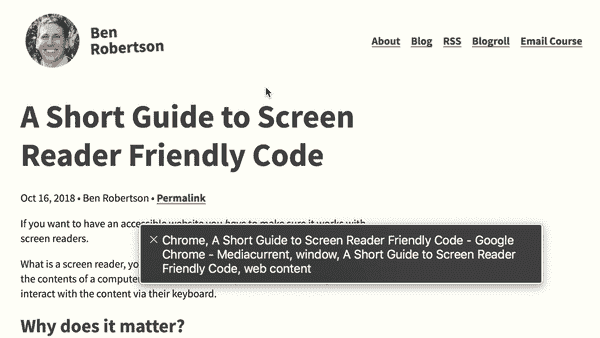

# 屏幕阅读器友好代码的简短指南

> 原文：<https://medium.com/hackernoon/a-short-guide-to-screen-reader-friendly-code-9ccf31b7e36a>

The macOS VoiceOver screen reader in action.

如果你想有一个可访问的网站，你需要确保它能与屏幕阅读器一起工作。

你会问，什么是屏幕阅读器？一个**屏幕阅读器**是一个软件，它把电脑屏幕上的内容大声读给一个人听，并让那个人通过他们的键盘与内容互动。

# 为什么重要？