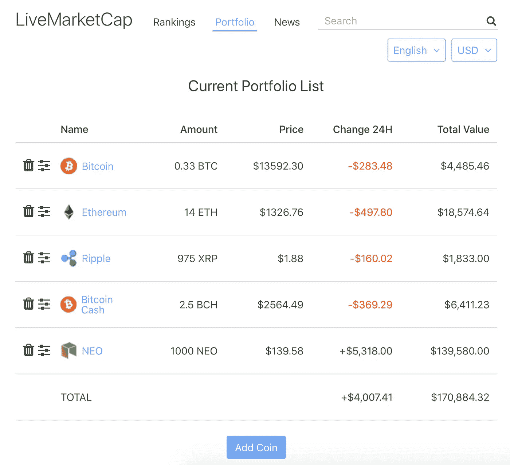
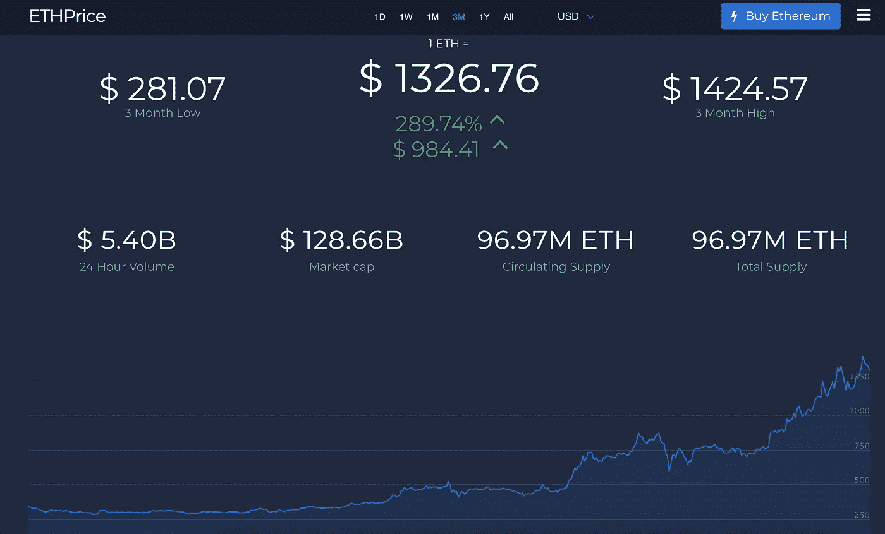
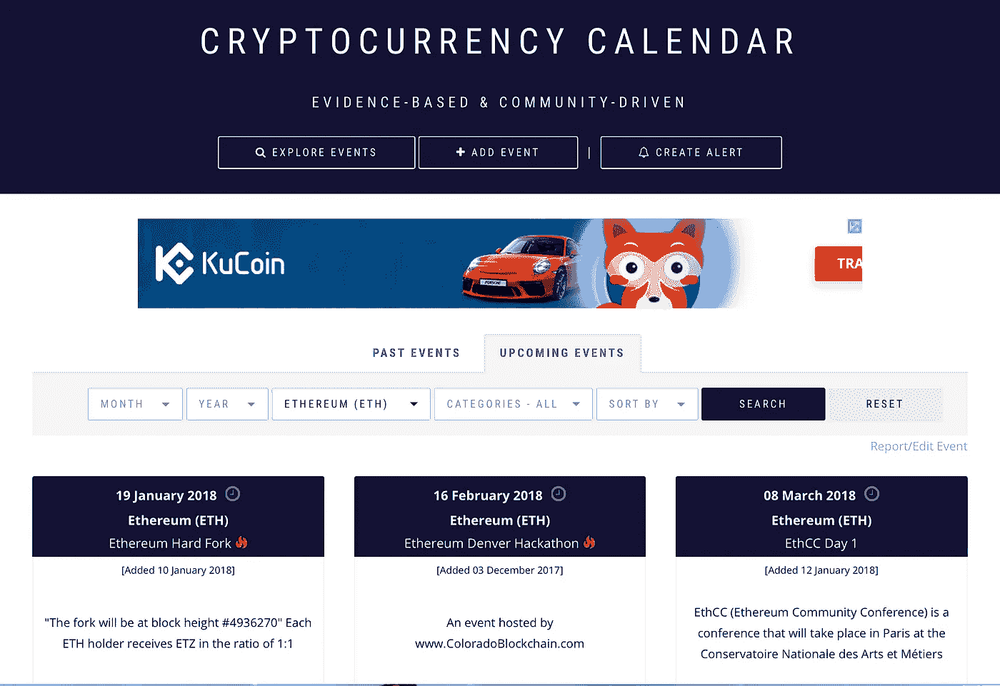

# 我日常使用的加密交易和投资工具的(简短)列表

> 原文：<https://medium.com/hackernoon/a-short-list-of-tools-i-use-daily-for-crypto-trading-investment-4991ceff55d7>

# 加密投资组合跟踪和最新信息

链接:[https://livemarketcap.com/portfolio](https://livemarketcap.com/portfolio)

一个非常简单的工具，帮助跟踪你的投资组合。最新价格、24 小时变化和总价值。历史价格图表将很快添加。

# 实时价格和新闻

一组设计良好的移动友好型网站，提供关于一种加密货币的最新信息:实时价格、历史价格数据、最新市场价格、最新加密新闻。

*   比特币 https://bitcoin-live.net[T3](https://bitcoin-live.net)
*   https://eth-price.org 以太坊
*   比特币现金[https://bitcoin-cash-price.org](https://bitcoin-cash-price.org)
*   涟漪[https://ripple-price.org](https://ripple-price.org)
*   卡尔达诺[https://cardano-price.org](https://cardano-price.org)
*   莱特币[https://litecoin-price.org](https://litecoin-price.org)
*   https://iota-price.org
*   破折号[https://dash-price.org](https://dash-price.org)
*   莫内罗[https://monero-price.com](https://monero-price.com)
*   https://eos-price.com

# 技术分析和投资建议

[https://www.investing.com](https://www.investing.com)

Investing.com 成立于 2007 年，是金融市场相关工具和信息的权威来源，如实时报价和流图、最新金融新闻、技术分析、工具和计算器。

# 加密日历和事件

[https://coinmarketcal.com](https://coinmarketcal.com)

关于加密货币更新、路线图和其他变化的众包信息。这些信息对于预测价格走势非常重要和有用。

> 感谢阅读！如果你喜欢，请鼓掌支持👏👏👏还有分享帖子。欢迎在下面留下你的评论💭。

> ***丹*** *是区块链* ***开发商*******投资方*** *。**
> 
> **他是***的 CEO。它提供所有活跃加密货币的实时排名，包括最新的加密货币新闻、市场价格、图表和分析。***
> 
> ***有反馈？关注 LiveMarketCap 上的* [*推特*](https://twitter.com/livemarketcap) *！👋***