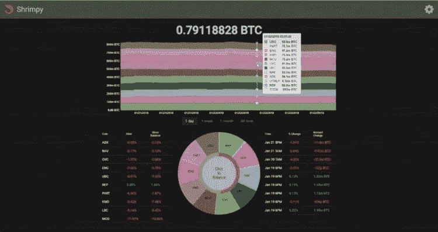
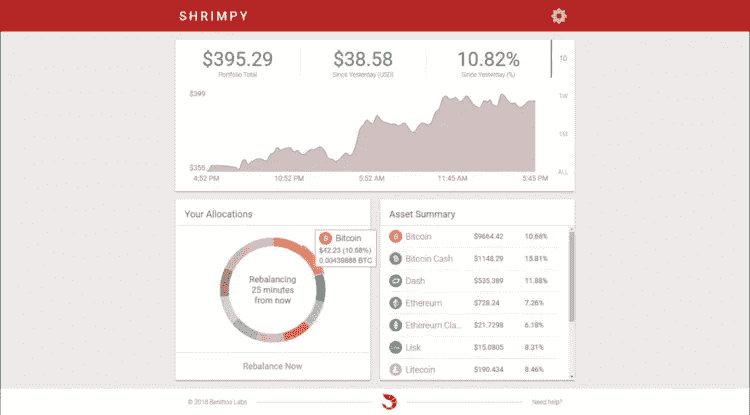
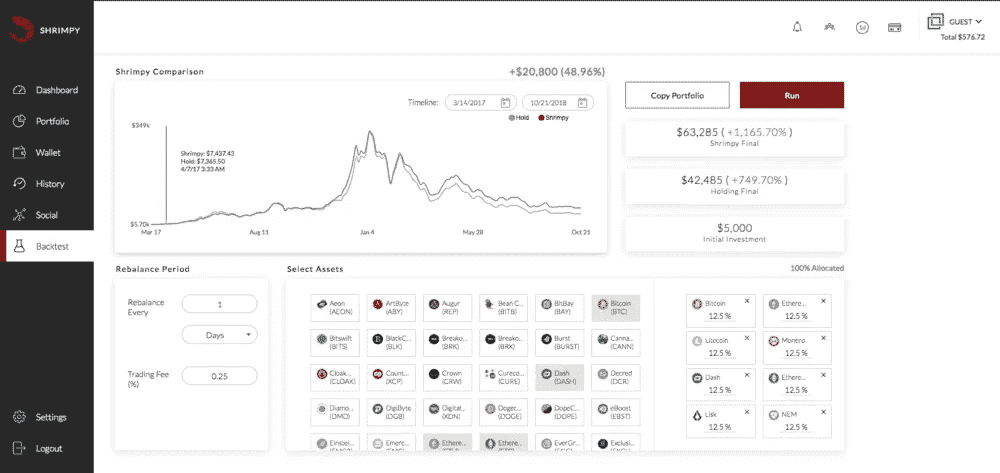

# 回顾惨淡的一年

> 原文：<https://medium.com/hackernoon/a-shrimpy-year-in-review-807c88ddf639>

2018 已经落下帷幕。在经历了 12 个月的寒冷而隐秘的冬天后，我们北方的一些人每次离开家都会想起这个事实。我们的脸受伤了，就像每当我们看着自己的投资组合时一样。

谢天谢地，2018 年并不是所有的事情都不好。Shrimpy 于 2018 年 1 月 20 日作为桌面应用推出！

没错，伙计们，一个桌面应用程序。一个下载到你的个人电脑上，如果你想不断地重新平衡，可以全天候运行。

这是什么，寿司店的背景？不，只是 Shrimpy 应用程序的第一个版本。由两个工程师的头脑驱动，我们的初始版本会困扰任何一个理智的 UI/UX 设计师的梦想。

订阅迭代过程，我们用了不到一个月的时间发布了 Shrimpy 的第一个版本。这是一个桌面应用程序，人们可以下载到他们的电脑上。这意味着，如果用户想要连续的数据和重新平衡，他们需要让应用程序全天候运行。

我们很快意识到这种模式是错误的！

没有人想下载应用程序。我是说*无名小卒*。如果我们要求所有用户加入篮球联盟，我们将没有足够的球员组成一个完整的球队。人们害怕从互联网上下载加密应用程序。就连微软也会反复询问试图下载 Shrimpy 的人是否确定他们没有下载病毒。这肯定不会对任何试图使用该应用程序的人产生信心。

在意识到我们的巨大错误后，我们花了接下来的两个月重写了应用程序，使其具有网站的功能。2018 年 3 月 25 日，Shrimpy 作为网站应用重新发布。

这是我们知道我们击中了目标的时候。Shrimpy 开始迅速起飞。

好吧，我承认这个设计不怎么样。当然，比上一个界面好 10 倍，但仍然不是最好的。crypto 中没有人想打开一个让他们感觉像在血泊中四处飞溅的应用程序。毕竟，这是加密空间，今年每个人都在处理足够多的红色。我们受够了！

是时候雇佣一名设计师了。我们不能继续走这条路。有人需要拯救我们。

手里拿着一把斧子，Sumaya 加入了 Shrimpy 团队，开始切割设计。把它组装成一张精致的红木书桌，打磨得完美无缺。设计开始整合。

通过功能开发、重新设计和快速迭代，我们能够将 Shrimpy 变成每个人都喜欢使用的应用程序。感觉很神奇。Shrimpy 开始演变成每个人都可以自豪地与朋友分享的东西。它改变了我们参与加密货币社区的方式。

Shrimpy 团队明年的工作已经安排好了。功能路线图是无止境的，增长计划是积极的，合作伙伴关系正在发展中。这些领域都将促进我们的全球采用战略进入下一个牛市。

我说的是全球领养。

我们的目标是锁定每一个机构、加密用户和企业。

Shrimpy 将成为交易所之上的通用层，促进新平台的出现。我们的交易引擎将向公众发布，因此业内的每个人都可以开始基于我们的创新解决方案构建产品。没有更多的争论，试图找出他们的独特怪癖，以及如何处理他们。我们会为你做的。加快交易应用程序的采用将提高市场的流动性和稳定性。任何人都可以通过我们的统一交易自动化层更快地进入 crypto 并管理他们的资产。一个将概括 exchange 访问和集成的层。停止挣扎，开始使用 Shrimpy 加速你的发展。

*原载于 2019 年 1 月 8 日*[*blog . shrimpy . io*](https://blog.shrimpy.io/blog/2018/12/13/a-shrimpy-year-in-review)*。*