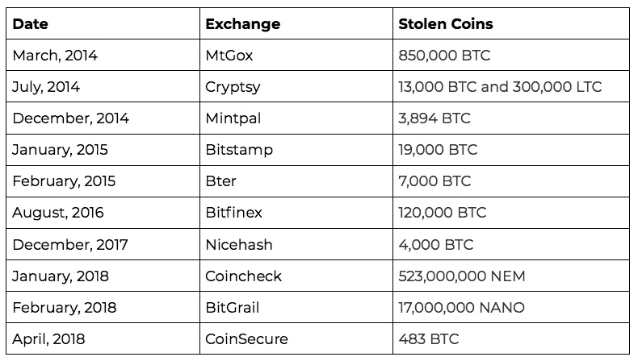

# 大多数密码交易员都会犯的愚蠢错误

> 原文：<https://medium.com/hackernoon/a-silly-mistake-most-crypto-traders-make-6d179aa74a70>

## 不要在交易所存放代币

***“给你一把枪，六个枪膛中有一个是装子弹的。游戏就是把武器对准自己，扣动扳机。如果你活着出来，你将得到 100 万美元的奖励。你会碰碰运气吗？”***

有六分之一的机会失去你的生命。现在，想象一下这种情况，有一千个弹膛，其中五个是装弹的。你仍然有风险，在交易所存储你的加密资产也有类似的风险。以下是常见攻击的列表。

在大多数集中交易中，你不会得到一个真正的钱包，但会产生一个钱包的幻觉。因为为庞大的用户群准备单独的钱包效率很低。他们将“谁拥有什么资产”的地图存储在数据库中，加密资产被集中存储(不考虑所有权)在几个真正的钱包中。当用户彼此交易时，交易在数据库中被更新，账户余额被更新，真正的加密转移不会发生。

如果一个交易所把所有比特币都放在一个钱包里，一旦钱包被攻破，所有东西都会丢失。这种情况在过去发生过几次。

虽然许多交易所声称将它存储在冷/实体钱包上，但这一过程并不容易。冷钱包通常是纸质钱包或存储钱包凭证(私钥/公钥)的 USB 拇指驱动器。

纸质钱包容易受到火/水的损害。如果一个人失去了他的拇指驱动器，就没有办法恢复。

Poor Guy Lost His Cold Wallet

另一个问题是，由于交易所不受监管，欺诈的几率更高。交易所很容易随着人的钱消失。政府也有可能迫使交易所交出钱包。

将加密资产存储在集中化的交易所没有意义，因为加密货币的关键概念是去中心化。但是，由于它存储在中央交易所，他们可以随心所欲地提高交易/取款费用。用户别无选择，只能忍受。

将你的加密资产存储在交易所是一个坏主意。对于大量交易的人来说，这是不切实际的，因为在自己的钱包上存储既费时又费钱。

最好确定自己的交易量，只保留交易所需要的东西。只在你能承受损失的交易所储存资产，不要储存任何东西。区块链项目已经开始[警告人们](/edu-coins/education-ecosystem-project-update-e378ad73b35b)在交易所持有代币，它适用于所有类型的加密资产，不仅仅是比特币或以太坊。

我希望这个问题不会持续太久，交易所应该采用一种机制，在不持有用户资产的情况下实现交易。

请鼓掌👏，谢谢你😊。关注我们[**Hackernoon**](http://hackernoon.com)**和我(**[**Febin John James**](https://medium.com/u/75a616711f4e?source=post_page-----6d179aa74a70--------------------------------)**)了解更多故事。**

***你怎么看？你有不同的意见吗？评论到这里，大家讨论一下。***