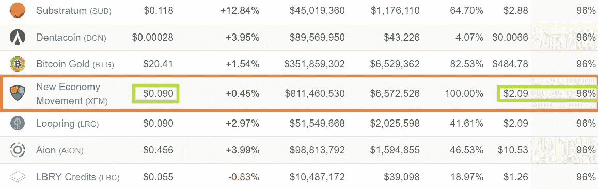

# 寻找最具反弹潜力的替代硬币的简单公式

> 原文：<https://medium.com/hackernoon/a-simple-formula-for-finding-altcoins-with-the-most-rebound-potential-79d298f68866>

What Comes Down Can Go Up Even Higher

金钱买不到幸福。但是现在，一辆小菲亚特可以给你买几大包的 alt。这是否让你快乐取决于你自己。

现在，加密市场的悲观情绪正在对一些可靠的项目造成影响。想象一下，在 2018 年 1 月推出一个 ICO，用你项目的代币换 1300 美元 ETH。

同样的 ETH 现在徘徊在 200 美元左右。瑞科特。

除非你聪明地对待你的资产，并做了一些谨慎的加密洗牌，否则你的项目资产负债表将是一幅令人遗憾的景象。

整个市场经历了长达数月的颠簸，随之而来的是无数的大宗投资组合余额。一些 ico 肯定感受到了市场下跌带来的冰冷痛苦。

但目光长远的霍德勒可能会对价格下跌不屑一顾。我们去中心化的未来的技术基础继续增长。

区块链变得越来越安全、可伸缩，并提供了更多有用的功能。以$KMD 为例。他们的链是经过公证的，并得到 BTC hashrate 的支持，他们的原子交换平台接近 100 万次/秒

看着 CoinMarketCap 上今天的价格，感觉就像去了一趟沃尔玛。我欢迎几乎所有硬币都亏损两位数的日子。

以我的**“哦，不，这不是财务建议”**个人观点，那些日子提供了极好的购买机会。

如果你在我的船上，你绝对会被众多渴望新代币持有者的激动人心的区块链项目所淹没。

但是，即使我有一个无限的菲亚特水龙头来交易加密，跟上叉子和代币互换和空投和品牌重塑和钱包更新……嗯，有很多*来跟踪你什么时候有一个硬币的位置。*

关键是，你必须做出明智的选择。在找到可以乘坐的密码之前，你需要做一些调查。记住，你需要分配一点时间来监控你参与的每一个项目。

那么，你在哪里找到最有上涨潜力的币呢？你如何缩小你的有前途的硬币膨胀列表？选择潜在赢家的公式是什么？

我们一会儿就到了。但首先，我们来聊聊为什么一些加密货币有这么大的收益。

# 螺旋弹簧

Institutional investors are poised to inject boatloads of cash into the crypto market

交易所交易基金、场外交易柜台、区块链专利、加密对冲基金、托管解决方案等等！——很明显，大美元正摩拳擦掌，准备和我们这些小鱼一起游泳。

今天，密码市场的总市值徘徊在 2000 亿美元左右。在 2017 年末至 2018 年初的大牛市中，这一数字更接近 8000 亿美元。

现在，成吨的——如果不是大多数的话——硬币在那段时间里看到了它们的**历史新高**。但是从那以后，烛台大部分指向了下坡路。

不幸的是，加密市场仍然不成熟，充满了情感。

> 如果行业得到重要消息的风声——不管是真是假——硬币要么爬上陡峭的山，要么掉进深坑。

但所有这些硬币都没有得到 ETF 的任何帮助。仅在一年前，大银行和公司还将加密空间视为一种短暂的时尚，不会对他们的机构构成任何可信的威胁。

现在一切都变了。大狗们比以往更加饥饿。丰厚的利润实在太诱人了，不容忽视。

现在，当那些数百万机构投资者开始涌入市场，让所有船只都浮上水面时——由于神秘领域的周期性，这几乎是不可避免的——上一轮牛市中的一些 ATHs 将会重现。

一旦 BTC 最终越过 2 万美元的心理障碍，alt 赛季将全面展开。我们将会看到许多项目突破了他们以前的高度，走得更远、更高。

这一次，将会是所有的机构资金来帮助推动我们的月球火箭。

当所有这些资金雄厚的投资者都加入进来时——可能要等到市场的监管框架更加确立之后——第一批流向超大袋子的硬币是最受欢迎的、由社区驱动的顶级项目。

建筑的紧张几乎显而易见。今天的密码市场有一种氛围。我们能感觉到一些重大的事情正在酝酿之中…揭开盖子只是时间问题。

这就引出了我们简单的公式…

# 最高回撤百分比+前 25 名市值排名=最大潜力

CoinMarketCap 上列出的前 25 个项目排名如此之高有一个很好的原因:受欢迎程度。

密码爱好者聚集在他们认为在技术上和/或经济上有前途的硬币和团队后面。

现在，我想传递一个免费资源，帮助你评估硬币。当然，还有其他类似的网站，但这是我更喜欢点击的一个。

有了它，你可以检查，除了其他参数，硬币的 ATH，它的回撤百分比，以及自 ATH 以来经过的时间:

> [**OnChainFX**](https://onchainfx.com/)

假设一枚硬币曾经回到其曾经的高点，10 倍收益的基准是 90%的回撤。也许 10 倍利润的可能性是你最初选择 crypto 的原因？

截至今天，共有 7 只排名前 25 的硬币处于或超过 90%的回调水平:

*   **$MIOTA = 90%**
*   **$NEO = 91%**
*   **$LISK = 92%**
*   **$XRP = 93%**
*   **$TRX = 93%**
*   **$ADA = 95%**

Winner, winner, chicken dinner

胜利者 XEM 以高达 96%的得票率胜出。卡尔达诺仅以 1%的差距位居第二。只要你相信基础项目的基本面，这两种硬币现在绝对是抢手货。

# 最后的想法…

如果你认为整个加密市场有一天会恢复往日的辉煌，那么你已经在犹豫了。

你有几个袋子——希望在下跌时通过平均成本装满——在任何交易所都不会看到时间，直到它们的价值至少翻了一倍。

当我们耐心等待熊市过去时，我们可以微笑着知道未来会发生什么。不管所有议程推进者可能会说什么，加密并没有死。

低廉的价格表面上看起来暗淡无光，但吹掉灰尘，你可能会发现一颗闪亮的宝石。只要看一看，你就会找到它们——到处都是。

当你把前 25 名的排名和暂时的巨大失宠结合在一起时，你就拥有了可以帮助你获得可观利润的代币和硬币。

现在你知道去哪里找，要找什么了。剩下的就看你个人研究了。

祝你狩猎愉快！

## 顺便说一下…

如果你喜欢你刚刚读到的，并且需要帮助把你的区块链信息传达给大众，我很乐意听听你的项目。

即使你只是想聊聊加密，你也可以在这里找到我:blockchainauthor at Gmail