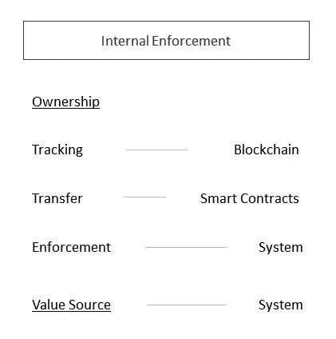
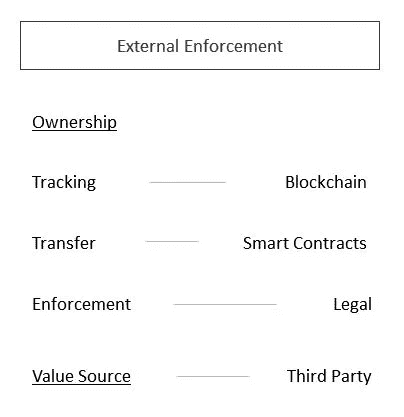
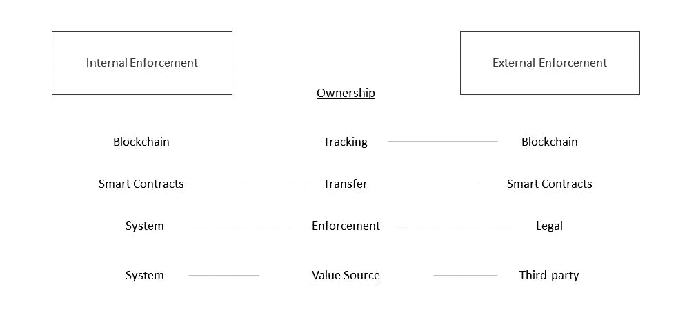

# 理解智能合约应用程序的简单框架

> 原文：<https://medium.com/hackernoon/a-simple-framework-for-understanding-smart-contract-applications-18fd78080436>

## 为什么区块链和智能合约对数字和实物资产都有用。

via @unsplash by Vincent van Zalinge

在这篇短文中，我将提出一种简单而直观的智能合约方法，呈现两类用例:1) **内部强制**和 2) **外部强制**。对于这两者，我将给出一些例子，并简要讨论它们的局限性。这里的目标是消除围绕其潜在应用的所有杂音和迷雾，并为未来的讨论提供一个简单而直观的起点。阅读了许多关于智能合约的文章和帖子后，我觉得下面我将介绍的细分的缺乏导致了围绕它们的应用的许多混乱，经常导致 a)高估，或者 b)完全忽略它们的潜力。我相信智能合约可以在各种情况下增加大量价值，但我们必须了解我们应用它们的背景。

*快速笔记。下面的论点适用于一般的智能合约，而不一定是以太坊支持的现在众所周知的图灵完全智能合约。此外，我并没有完全理解区块链或智能合约的所有内容，但是我相信下面的剖析有助于简化智能合约可以成功使用的环境。我并不声称这是一个通用的框架，或者它涵盖了所有的情况(事实上，它很可能是非常简化的)，只是说这可能是看待区块链/智能合同用例的一种有趣的方式。最后，当提到“区块链”时，我可以互换地谈论数据库类型或数据库类型和整个 p2p 网络及其协议。*

这里的目标是建立一个简单的框架，从这个框架中可以讨论和探讨智能合约的潜在应用。与其以相似的心态对待任何场景，并基于其局限性排除其他场景，我们可以使用以下两个类别:1) **内部实施**和 2) **外部实施**。

# 内部执行

> 数字资产或其使用在所有权确认后在封闭系统中发布，并且根据定义只能由所有者使用。

这意味着数字资产的所有者只能在这些系统内使用它们，而不能提取资产或其代码用于系统外的任何(有价值的)用途。在这些情况下，我们真正讨论的是所有者在系统内给予**“使用许可”(在所有权——在区块链上被跟踪——被验证之后),而不是能够拥有资产并在其他地方使用它(尽管系统可以合作并允许跨平台使用)。这很抽象。这里的一个例子是由用户“拥有”的游戏中的物品。在登录时，所述物品的所有权被验证，因此用户可以在游戏中使用它。这里，不需要外部方来强制正确使用数字资产:游戏软件(可以是分散的)提供资产的可用性，区块链/智能合同提供所有权验证。如果你不“拥有”它，你就不能使用它。提取“使用许可”这一原则，我们可以突出几个例子。在任何可以在区块链上跟踪所有权并且数字资产的有用性由可以使用它的系统决定的情况下，智能合同都可以在没有任何中介的情况下成功地确定所有权、转移所有权并允许使用。分散式音乐流服务可以使歌曲的所有者能够流传输该歌曲，而无需实际拥有或提取代表该歌曲的代码。类似的情况也适用于视频流，或任何基于所有权提供价值的东西。**

****

**Fig. 1: Internal Enforcement**

**它避开了我可能能够从使用不属于我的数字资产中获得价值的任何场景，因为没有这种可能的场景(与属于第二类“外部强制执行”的智能合同的使用相比)；稍后会有更多的介绍)。还有另一个例子，它与外部强制类别有些重叠:使用图像的许可。如果系统仅根据用户是否拥有该数字资产来启用图像发布，则结合系统代码的智能合同可以强制规定图像是否可以使用。所要做的就是验证用户是否拥有该数字资产(读取区块链),并相应地启用或禁用使用。图像不是你的吗？你不能在这个系统中使用它。**

**这就把我们带到了第二个类别:外部强制。**

**如果我是图像的所有者，但没有防止他人使用它的实际措施，该怎么办？换句话说，我可以访问图片的代码(下载)并在互联网上重新发布，实际上没有任何东西可以阻止我。想想现在网络上是如何使用图像许可的；即使你不被允许使用某个图像，如果你没有许可证，这并不意味着你不能。唯一的执行方式是通过外部起诉。**

# **外部强制执行**

> **使用区块链和智能合约，可以跟踪和转移数字资产或具有数字表现形式的实物资产的所有权，但从技术上讲，这些资产可以被任何人使用(没有任何实际措施阻止他们使用不属于自己的资产)。所有权的唯一执行是通过外部起诉。**

**这里有一些很好的例子是产权所有权和产品所有权跟踪。资产的所有权可以由数字资产(例如某种令牌)来表示，该数字资产可用于转移和跟踪所有权。我们可以说，在这些场景中，数字资产支持**“声明许可”**。然而，即使您可能拥有资产的数字表示，也不存在阻止其他人使用它的继承性质。例如，我可能是区块链上验证的产品的所有者，但其他人可以从我这里获得并使用该产品。外部强制是必要的。**

**人们通常会认为，因为在这些场景中，智能合约无法强制实施所有权，所以它们是无用的。权限不是在使用系统内强制执行的，而是仅由(害怕)外部起诉和影响强制执行的，仍然需要律师和检察官。尽管后者是正确的，但我认为，在这里拒绝使用区块链和智能合约将是一个巨大的错误。区块链和智能合约可以实现更高效的所有权转移和跟踪，比现在更加准确和透明。它们可能不像内部执行那样包罗万象和多功能，但在效率和透明度方面肯定比传统系统更上一层楼。**

****

**Fig. 2: External Enforcement**

**然而，需要注意的是，在外部强制执行的情况下，我们还需要初始方将价值记入资产的数字表示。如果没有现实世界中的一方(有权力的一方)能够确定数字表示是否实际代表了实物资产，那么它是相当无用的。例如，如果我在网上存储了一份文件，上面写着我拥有一栋房子，但这不被我的政府承认，那么这份文件就是无用的。当内部执行得到使用它的系统的认可时，我们也需要这样的一方(不幸的是，这些很可能不是分散的，这是我们希望从上述系统中得到的)。这是否意味着我们应该因此放弃使用区块链和智能合约？我认为我们不应该。尽管有这些限制，区块链和智能合约使跟踪所有权变得更加高效和透明。**

**总结这一部分，这里是核心要点。**

**当评估在不同场景中使用区块链和智能合同的潜力时，考虑这个框架是有帮助的:它们是否允许**内部执行**或需要**外部执行**。在这两种情况下，它们都可以增加大量价值，尽管当所有权在内部得到强制执行时，我们会看到区块链和智能合约更全面的有效性。尽管如此，当所有权跟踪效率很低时(例如在供应链中经常出现的情况)，它们可以为实物资产跟踪提供令人难以置信的改进，并且不应该仅仅因为其在自动执行方面的限制而不予考虑。**

****

**Fig. 3: Internal/External Framework**

**请在下面的评论中告诉我你的想法。你同意什么，不同意什么？这只是我分享的一个我觉得有用的智能合同使用方法。显然，这并不是如此简单和明确的，许多情况可能会超出这一框架。不过，我发现这是一个有趣的方法，我想分享一下。我很想听听你的想法。**

**万事如意。**