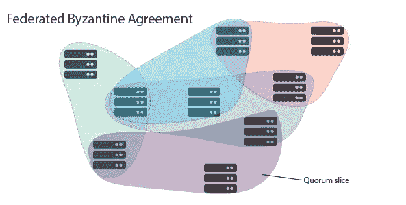

# 理解恒星区块链网络的简单指南

> 原文：<https://medium.com/hackernoon/a-simple-guide-to-understanding-the-stellar-blockchain-network-3609d728e9a7>

Stellar 是一个面向银行和跨境金融交易的区块链平台。它打算解决汇款、移动支付和微支付的问题。恒星网络的一大目标是以闪电般的速度提供负担得起的金融服务。

**恒星共识协议**

恒星[网络](https://hackernoon.com/tagged/network)于 2014 年启动，是 Ripple 协议的一个分支。Jed McCaleb，Ripple 的联合创始人和 Mt. Gox 的创始人，以及律师 Joyce Kim。然而，由于恒星架构已被重组，以解决各种问题，它现在明显不同于瑞波。最初，网络上的加密货币也被称为“恒星”。但后来它被从 stellars 改为 lumens (XLM)，以避免任何可能与恒星网络混淆。

Stellar 解决了困扰其他区块链或数字账本技术的共识协议问题。区块链使用[拜占庭容错(BFT)](https://www.nasdaq.com/article/byzantine-fault-tolerance-the-key-for-blockchains-cm810058) 来维护记录和交易的可靠性。大多数区块链使用所谓的实用拜占庭容错(PBFT)。一个使用 PBFT 的区块链网络需要 66%的验证者同意交易以达到法定人数或共识。为了保持网络的有效性，恶意节点的数量需要保持在 33%以下。像 Hyperledger 和 Ripple 这样的系统使用 PBFT。

研究人员发现 Ripple 协议的 PBFT 不够容错。此外，验证器的选择使得 PBFT 系统变得集中。于是 PBFT 被联邦拜占庭协议(FBA)所取代。在 FBA 系统中，不需要预定义的验证器。节点单独决定信任谁。它分散了系统。FBA 系统使用“仲裁片”或仲裁的子集，而不是整个仲裁或预设数量的节点。

在 FBA 系统中，节点相互广播它们信任的仲裁片。节点各自决定信任哪些法定人数，并根据手头的信息建立自己的法定人数。理想的情况是有法定交叉或法定重叠。这确保了整个网络的共识。如果没有交集，那么将会有不相交的定额，这会导致记录矛盾的事务。这是使用恒星网络的最大风险。

[Stellar Consensus Protocol](https://www.stellar.org/developers/guides/concepts/scp.html) 使用 FBA 拥有更分散的系统。网络对新节点更加开放，FBA 也使网络在出现故障时更加可靠。

**星网成果**

Stellar 正在超越以太坊，因为它更便宜、更快，并且资产交换是 Stellar 协议的一个内置特性。虽然用户通常必须使用第三方交易所来处理以太坊交易，但这种易用性使 Stellar 在许多项目中广受欢迎。

IBM 是目前有多个项目使用 Stellar 区块链的大公司之一。它推出了名为“区块链世界线”的恒星支付系统。IBM 还简化了之前复杂繁琐的碳信用交易流程，建立了基于恒星的系统，通过支持印度尼西亚的一片雨林来抵消环境破坏。

**未来路线图**

恒星发展基金会(SDF)于 2018 年 9 月收购了区块链公司 Chain。该公司得到了 Visa、纳斯达克和花旗风险投资公司的支持。此外，Stellar 最近实施了 Stellar 分散交换(SDEX ),并且正在进行 Stellar 照明网络的工作。尽管 Stellar 可能还没有以太坊的大品牌认知度，但上述优势和一些主要行业参与者的支持确保了它在区块链生态系统中越来越突出。