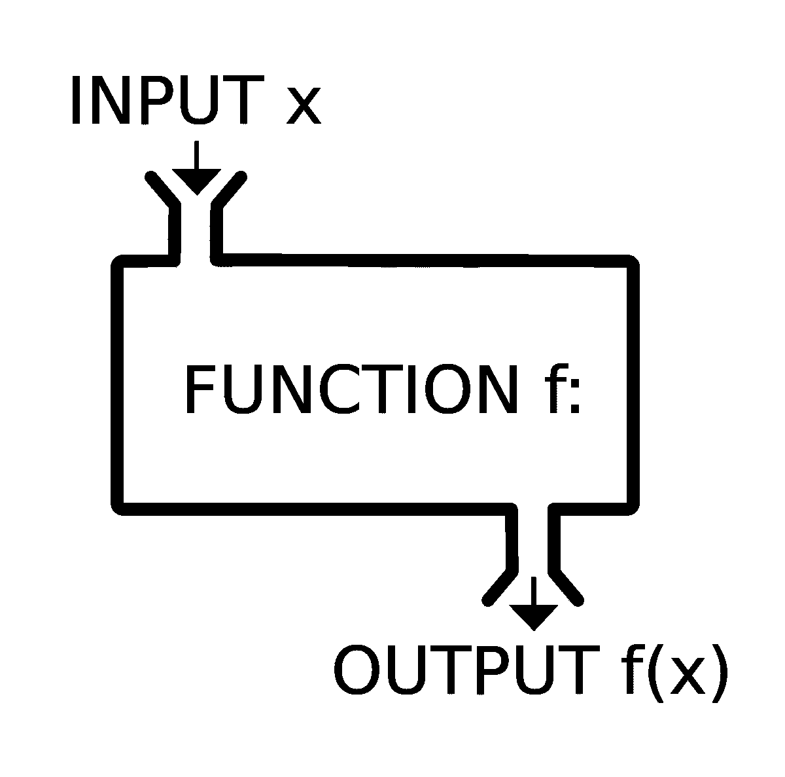
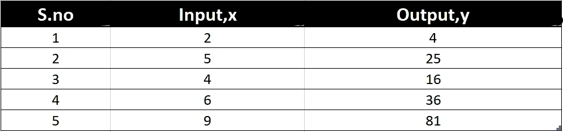

# 单向函数的简单介绍

> 原文：<https://medium.com/hackernoon/a-simple-introduction-to-one-way-functions-a2429d427546>

## 这是我计划撰写的解释**区块链**背后的密码学的系列文章的第一篇。

[**Source**](https://sco.wikipedia.org/wiki/Function_(mathematics))

在本文中，我将介绍**单向函数。**

为了理解单向函数的必要性，让我先帮助你理解**双向函数。**

# 双向功能

让我们假设我们有一个函数 f(x)=y，每当我们给定输入为“x”，我们就得到一个输出“y”。

现在让我们看看下表:

如果我们观察上面的输入和输出值，通过仔细观察我们发现输出总是输入的平方，即 y=x*x .或 f(x)=x*x。

现在，假设该函数生成一个输出“121”。因为我知道这个函数，所以我可以很容易地判断出输入应该是“11”。我们可以借助其输出来确定输入的函数称为**双向函数**。

尽管我们很喜欢破解这个功能，但我们应该意识到，如果我们将它们整合到系统或应用程序设计中，任何黑客都可以通过简单的**暴力攻击**破解应用程序。

双向函数的这个特殊的**漏洞**导致了单向函数的采用。

# 单向函数

让我们考虑下列数字中的 SHA256。

sha 256(1)= 6b 86b 273 ff 34 FCE 19 d6b 804 eff 5a 3 f 5747 ada 4 EAA 22 f1 d 49 c 01 e 52 DDB 7875 b4b

sha 256(2)= d 4735 E3 a 265 e 16 eee 03 f 59718 B9 b5 d 03019 c 07d 8 b 6 c 51 f 90 da 3a 666 EEC 13 ab 35

sha 256(3)= 4e 07408562 bedb 8 b 60 ce 05 C1 decfe 3 ad 16 b 72230967 de 01 f 640 b 7e 4729 b 49 FCE

如果您观察上面的三个输出，它们没有遵循一个模式。因此，我们无法识别函数的输入。当在应用程序中使用这些功能时，黑客要渗透到应用程序中并不是一件容易的事情。这种函数被称为**单向函数。**

以下引文是我写这篇文章的动机:

> “技术是应用科学。科学是对自然的研究。数学是自然的语言。哲学是数学的根源。所有这些都紧密相关。”~海军拉维坎特

在本系列接下来的文章中，我将解释**哈希算法**以及它们如何被整合到**区块链设计**中。敬请关注最新消息！感谢您阅读我的文章。

*如有任何问题，欢迎随时给我发* [*邮件*](mailto:pamanalionline@gmail.com) *。也可以通过*[*Linkedin*](https://www.linkedin.com/in/amanali1/)*联系我。也可以关注我的* [*推特*](https://twitter.com/aliandco) *。*

*为了区块链入门阅读我的* [*文章*](https://hackernoon.com/blockchain-learning-path-2019-e54d6763dd6c) *发表于*[*hacker noon*](https://hackernoon.com/)