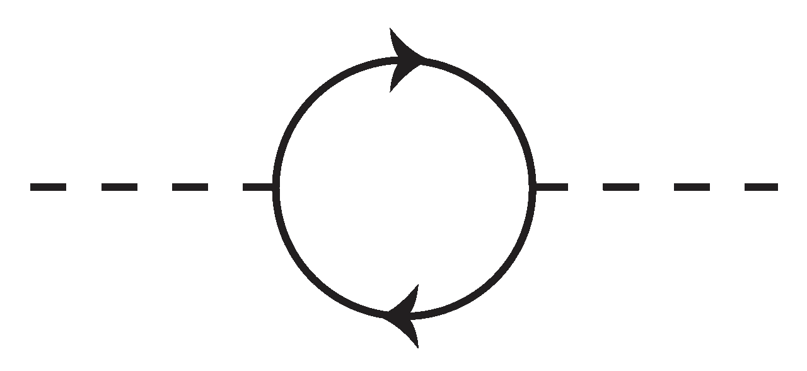

# Python 的 asyncio 简单介绍

> 原文：<https://medium.com/hackernoon/a-simple-introduction-to-pythons-asyncio-595d9c9ecf8c>

> 这是对 Python 中的 asyncio 库的简明扼要的基本原则介绍。

如果您已经来到这里，您可能听说过诸如异步、并发和并行这样的词。在我们开始使用 asyncio 之前，让我们快速了解一些关于这些单词的基本知识(通过例子)，这样我们就有了一个坚实的基础。

**并发**是就像在单核 CPU 上运行两个线程。来自每个线程的指令可以交错，但是在任何给定的时间，两个线程中只有一个在积极地取得进展。

**并行**就像在多核 CPU 的不同内核上同时运行两个线程。

> 值得注意的是，并行意味着并发，而不是相反。

异步是一个更高层次的编程概念，你启动某个任务，并决定当你没有那个任务的结果时，你最好做一些其他的工作而不是等待。

> 当你异步地做事情时，根据定义，你意味着这些事情之间的并发性。

## 为什么要异步编程？

你说我们为什么要写异步程序——因为它可以让你的程序性能提高很多很多倍。假设您有一台运行应用的单核机器。您收到一个请求，您需要进行两次数据库查询来完成该请求。每个查询需要 50 毫秒的时间。对于同步程序，只有在完成第一个请求(总时间为 100 毫秒)后，才能发出第二个请求。使用异步程序，您可以一个接一个地执行这两个查询——总时间为 50 毫秒。

# 阿辛西奥

Asyncio 是关于用 Python 编写异步程序的。Asyncio 是一部美妙的交响乐，它将一个**事件循环**、**任务**和**协程**完美地结合在一起——它会让你哭泣。

## 事件循环

这就是让这一切成为可能的原因——一个简单的循环，就是这样。嗯不是*那么简单*。但它是这样工作的。事件循环是交响乐的指挥者。它一个接一个地运行*任务*。在任何给定时间，只有一个任务在运行。

可以想象，活动任务压力很大，因为其他任务正在等待轮到它们。因此，当活动任务发出阻塞调用(比如网络请求)并且无法继续时，它会将控制权交还给事件循环，并意识到其他任务可能会更好地利用事件循环的时间。它还告诉事件循环它被阻塞的确切原因，以便当网络响应到来时，事件循环可以考虑给它时间再次运行。

> 事件循环时间非常宝贵。如果你没有进步，你应该退出这个循环，这样别人也能进步。事件循环是进度的度量。

## 协程和任务

协同例程(合作例程)是交响乐的关键元素。当协同程序没有任何有用的事情可做时，正是协同程序和它们的协作性质使得能够放弃对事件循环的控制。协程是子程序概念的有状态概括。

子程序是你的老式函数或方法。您调用子例程来执行计算。您可以再次调用它，但是它不会在两次调用之间保持状态。每次调用都是全新的，并且执行相同的计算。

另一方面，协程是一个可爱的有状态的小部件。它看起来像一个子例程，但是它在两次执行之间维护状态。换句话说，当协程“返回”(放弃控制权)时，这仅仅意味着它已经**暂停了**它的执行(带有一些保存的状态)。因此，当您随后“调用”(控制)协程时，可以说协程已经**恢复了**它的执行(从保存状态)。

> 协程看起来像一个普通的函数，但是在它们的行为中，它们是有状态的对象，有类似于`resume()`和`pause()`的方法。

在 Python 3.5+中，**协程暂停自身的方式**是使用`await`关键字。在一个协程内部，当您`await`在另一个协程上时，您离开事件循环并调度等待的协程立即运行**。也就是说，协程内的`await other_coroutine`将暂停它，并调度协程`other_coroutine`立即运行。**

> **请注意，事件循环不会抢占正在运行的协程。只有协程程序可以暂停自己。**

**下面是一个非常简单的例子 *(Python 3.5+)* 关于协程如何相互协作。我们将使用一个预定义的协程`asyncio.sleep`来帮助我们模拟这个例子中的阻塞任务，但是它可以是现实世界场景中的任何东西，比如网络请求、数据库查询等等。**

**注意，**代码在单线程**中运行，然而，输出将具有交错的打印语句。发生这种情况是因为当一个协程被阻塞时，它会退出循环，这样另一个就可以运行了(耶！用 asyncio 进行异步编程)。**

**python run coroutine_example.py**

**需要注意的几点**

*   **调用协程定义**并不执行它**。它初始化一个*协程对象*。你`await`在*协程对象*上，而不是*协程定义*上你可以在上面的`line 8`和`line 17`中看到。**
*   ****事件循环直接运行任务**，而不是*协程对象*。任务是围绕*协程对象*的包装器。当你写`await coroutine_object`的时候，你实际上安排了一个包装器任务在事件循环**上立即运行**。**
*   **`asyncio.sleep`也是一个协同程序，由 asyncio 库提供。`asyncio.sleep(2)`用值 2 秒初始化协程对象。当你使用它时，你就把事件循环的控制权交给了它。睡眠协程很聪明，不会阻塞循环。它立即释放控制，简单地要求循环在指定时间后唤醒它。当时间到期时，它被交还控制权，并立即返回，从而解除对其调用方的阻塞(在上面的示例中为`coroutine_1`或`coroutine_2`)。**
*   **上面的例子有三种不同类型的协程运行在事件循环上— `coroutine_1`、`coroutine_2`和`asyncio.sleep`。然而，四个不同的任务在循环中运行，对应于以下协程对象:调度在`line 25`的`coroutine_1()`和`coroutine_2()`、调度在`line 8`的`asyncio.sleep(4)`和调度在`line 17`的`asyncio.sleep(5)`。**
*   **在循环中调度任务的另一种方式(尽管不是立即)是使用`[ensure_future()](https://docs.python.org/3/library/asyncio-task.html#asyncio.ensure_future)`或`[AbstractEventLoop.create_task()](https://docs.python.org/3/library/asyncio-eventloop.html#asyncio.AbstractEventLoop.create_task)`方法，这两种方法都接受协程对象。最后的示例代码演示了这些方法。**

## **一个更现实但简单的例子**

**python run asyncio_example.py**

## **阿彻萨伯的蟒蛇**

**在 ArchSaber，我们的目标之一一直是从客户的应用程序代码中挖掘深刻的见解。我们的许多客户依赖于我们的 Python APM 解决方案。因此，我们尽最大努力去理解这门语言及其框架的复杂性。我们自己非常依赖 Python——我们的许多分析引擎和 ML 代码都是用 Python 编写的，通过它我们可以对客户的生产问题进行实时根本原因分析。**

> **感谢阅读。如果你喜欢这个帖子，请订阅并分享。**