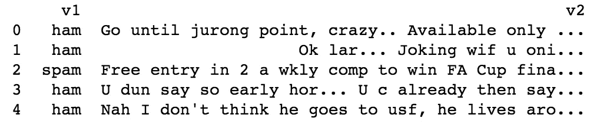
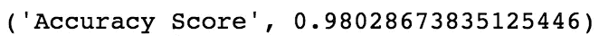

# 一个简单的垃圾邮件分类器

> 原文：<https://medium.com/hackernoon/a-simple-spam-classifier-193a23666570>

## 将短信分类为垃圾短信或真实短信


## 介绍

现在，要注册或登录任何网站，你必须提供你的电子邮件 id，有时还需要你的电话号码。这些详细信息用于验证用户。但是，这些细节有可能被滥用于促销、虚假信息等。举个例子，如果你输入你的银行信息、电话号码和电子邮件 id，从一个看起来很粗略的网站上购买一件商品，几天后你可能会收到一封来自地球另一端的邮件，声称你已经赢得了 1 亿美元。我们大多数人都知道这封邮件是假的，这封邮件最终会变成垃圾邮件。这一招就是再也不管用了(但愿如此！).

我们人类有时会不计后果。我们在几乎所有要求我们输入电子邮件 id 和电话号码的网站上输入，我们希望我们的电子邮件公司和电话公司确保没有垃圾邮件进入我们的收件箱。因此，我们没有在输入我们的详细信息时小心翼翼，而是决定构建自动读取邮件并判断它是否是垃圾邮件的算法。如果是垃圾邮件，该邮件将从您的收件箱中删除，并且不会向您显示。

## 为什么你甚至需要一个垃圾邮件分类器？？为什么不跳过垃圾短信呢？？

您可以跳过垃圾邮件，但也很有可能跳过来自真实发件人的重要邮件。据估计，每天大约有 1000 亿封垃圾邮件被发送出去。所以，每天你的收件箱里很有可能会有至少 10 封垃圾邮件。在这堆垃圾邮件中搜索那些重要的信息可能非常困难，但是你很有可能会浏览它们。因此，如果一种算法可以正确地将一封电子邮件分类为垃圾邮件，并且永远不会向我们显示它，我们的生活会变得容易得多。

## 资料组



First 5 samples in dataset

现在，让我们用几行代码构建我们自己的垃圾邮件[分类器](https://hackernoon.com/tagged/classifier)。数据集是一个 csv 文件，可以从这个[链接](https://www.kaggle.com/uciml/sms-spam-collection-dataset/data)下载。csv 文件有一列消息和一个表示该消息是否是垃圾邮件的目标变量。现在，让我们继续看代码。

## 密码

我们使用 pandas 库读取 csv 文件，从各个列中提取文本和标签，并将其存储在一个列表中。目标变量是一个字符串，其中“ham”表示文本不是垃圾邮件，“spam”表示文本是垃圾邮件。列表被转换成 numpy 数组，因为 numpy 有助于矢量计算。

我们将数据打乱，分成训练样本和测试样本。90%的数据用于训练，其余 10%用于测试模型。存储在列表中的训练和测试数据被转换为 numpy 数组。

我们现在准备文本数据，以便可以将它输入到我们的模型中。这是最关键的一步，因为我们将文本转换成密集的整数表示，我们的[机器学习](https://hackernoon.com/tagged/machine-learning)模型可以从中学习。这里使用了两个类，CountVectorizer 和 TfidfTransformer。让我们按顺序来看。

*   使用计数矢量器，我们对输入的文本数据进行标记，也就是说，我们为消息中的所有单词分配唯一的值，并对它们的出现次数进行计数。使用这些值，我们对输入文本进行建模。

```
text = ["The quick brown fox jumped over the lazy dog."]

vectorizer = CountVectorizer()
vectorizer.fit(text)
print(vectorizer.vocabulary_)
# Output: {'dog': 1, 'fox': 2, 'over': 5, 'brown': 0, 'quick': 6, 'the': 7, 'lazy': 4, 'jumped': 3}

vector = vectorizer.transform(text)
print(vector.toarray())
# Output: [[1 1 1 1 1 1 1 2]]
```

从上面的例子中，您可以理解，每个唯一的单词都被分配了一个索引值，并且这些单词中的每一个的出现被用来表示文本。在给定的文本中，只有单词“the”出现了两次，其索引为 7。因此，第 7 个位置的值为 2，其余的值为 1。

*   当我们使用 CountVectorizer 对数据进行标记时，很有可能像“a”、“the”、“an”等词会比模型应该关注的实际词更重要。tf-idf tranformer 所做的是缩小所有文本中频繁出现的单词的值。Tfidf 代表术语频率和逆文档频率。

```
from sklearn.feature_extraction.text import TfidfVectorizer

text = ["The quick brown fox jumped over the lazy dog.",
  "The dog.",
  "The fox"]
vectorizer = TfidfVectorizer()
vectorizer.fit(text)
print(vectorizer.vocabulary_)
# Ouput: {'fox': 2, 'lazy': 4, 'dog': 1, 'quick': 6, 'the': 7, 'over': 5, 'brown': 0, 'jumped': 3}print(vectorizer.idf_)
# Output: [ 1.69314718 1.28768207 1.28768207 1.69314718 1.69314718 1.69314718 1.69314718 1\. ]vector = vectorizer.transform([text[0]])
print(vector.toarray())
# Output: [[ 0.36388646 0.27674503 0.27674503 0.36388646 0.36388646 0.36388646 0.36388646 0.42983441]]
```

从上面的例子中，你可以观察到不同文本之间的常用词缩小了。这样做的是，它允许我们的机器学习模型专注于那些低频词，这些词主要影响邮件是否是垃圾邮件。

我们现在使用一个名为 [XGBoost](https://hackernoon.com/boosting-algorithms-adaboost-gradient-boosting-and-xgboost-f74991cad38c) 的梯度推进模型来拟合我们的训练数据，并测量对测试数据的准确性预测。



## 结论

由于机器学习，我们可以继续肆无忌惮，仍然不会在收件箱中发现任何垃圾邮件；)

## 参考

*   [https://machine learning mastery . com/prepare-text-data-machine-learning-scikit-learn/](https://machinelearningmastery.com/prepare-text-data-machine-learning-scikit-learn/)