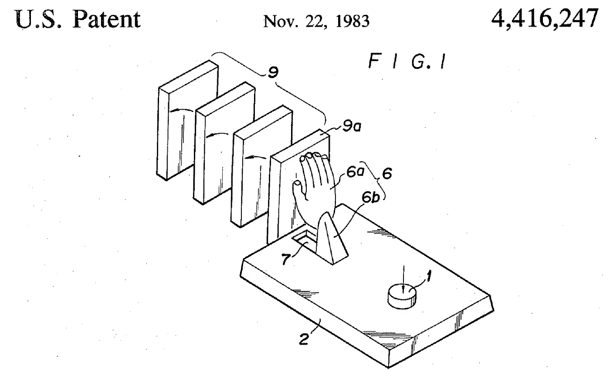

# 单个优先列表(一个故事)

> 原文：<https://medium.com/hackernoon/a-single-prioritized-list-a-story-a3e6590c52bc>

我能想到的最好的写作方式是对话。

这里的症结在于，积压的工作和路线图被视为一系列的清单/泳道，可能会掩盖一些非常重要的东西。

你需要一个单一的优先列表。最重要的只有一件事。并限制正在进行的工作。

> 不，我们没有！“在顶端”的一切都很重要！因此，我们将它们放在单独的列表中，按照价值流进行组织。然后把它们放在这张看起来像甘特图但不是的路线图上。
> 
> 限制我们正在做的事情？那听起来像疯狂的谈话。

酷毙了。所以，如果我随机选择一个努力，并杀死它，你会同意吗？

> 嗯，我的意思是，嗯…我的意思是如果你杀了项目 Acme 银弹我很肯定我们的首席执行官的头会爆炸。

就像，爆炸*比项目 Foo Quick Fix 被杀还要多*？

> 是啊。但是你知道，他们是不同的。这两件事都非常重要，但是……不一样。不管怎样，他的头都会爆炸……但是用 Acme 银弹会爆炸得更厉害。

听起来 ASB 更重要！

> 不。但我会配合的。有什么区别吗？我们不能让整个公司都参与 Acme 银弹项目，对吧？你是说我们一次只能做一件重要的事吗？这太疯狂了。我们的投资者会怎么说？

假设我是一名营销人员，正在努力决定是真的专注于 ASB，还是一心多用？或者更好的是，我担心我们的客户可能很难接受 ASB 和 FQF，如果同时推出这两个标准，我们可能会将两者都置于危险之中。我该怎么办？

> 嗯。我希望那不会发生。我们有负责任的人。我希望他们能提前给我们一些警告。我们都知道营销不会成为我们的阻碍，所以…

你的运营团队怎么样？他们正试图支持这两项努力…我在吉拉看到了门票。就在这里，你付出了相当大的上下文切换成本。在 ASB 和 FQF 这样的多方努力之间周旋就像在下三维象棋。

> 他们需要更加负责，更好地管理他们的项目！我们需要每个人更好的估计，更好的计划！呃…行动。你希望我们做什么…在每个团队中都嵌入运营？

比如说 DevOps？

> 打得好。说真的，我们永远负担不起！他们总是丢球，所以雇佣更多的人看起来，嗯…

…丢的球比销售、营销和产品还多？你测量那些吗？或者操作失误只是更容易看到，是太多工作进展的副产品？你可能对他们不公平，尽管我承认过度工作会让他们脾气暴躁。

关于能够负担 DevOps(专用运营)…如果您的惊人想法能够获得 2 倍的吞吐量，成本会不会太高？想象一下这将如何改变游戏！

> …但是运营是一项运营开支，我们的团队是对新东西的投资！所以…

但是我跑题了。抱歉，我自以为是。我认为你实际上说的是，作为一家公司，多下赌注对我们来说可能很重要。因此，这并不是说这些东西更有价值/更没有价值，而是它们是不同类型的赌注，应该有所不同。“最重要”是一种特殊类型的赌注。

> 我同意！但是我不得不承认。
> 
> 我认为正在进行的努力之一——项目争取时间——不太重要。但是我们向这位新的副总裁许下承诺——must hire board members friend——他们会有机会，我们有一个团队——你知道，去年的团队——在我们去年取消了这个项目之后，他们正在寻找事情做。我们不希望那些有才华的工程师离开公司…我们也不希望 MustHire 离开。

嗯。听起来很难。不过，从表面上看，你并没有真正给予项目购买时间应有的关注。工程师(和 MustHire)对此有何感想？如果他们在 ASB 上提供帮助，或者修复一些拖累所有工作的基础设施问题，会怎么样呢？在某种程度上，基础设施问题是最重要的，因为它们影响所有最重要的东西，对吗？我似乎找不到一个项目，为解除封锁最重要的东西，虽然…让我检查吉拉。不…

> 项目解锁最重要的东西…有趣。
> 
> 我认为，Ops 正在帮助 ASB 和 FQF 争取时间，解决生产问题。我需要一份情况报告。
> 
> 我是说，我想争取时间会有帮助，但是…

你知道，感觉你把两件事搞混了:你想下的赌注和你的组织结构。事实上，这是两码事。这就像把你的求职限制在你的家乡，或者因为你没有四轮车而不去偏远的地方。

我并不是说你不能同时做多件事情——正在进行的事情的最佳数量可能不是一件——而是说你应该扩展你对价值、优先级和赌注的看法。把事情说清楚。

> 这难道不违背小自治团队的宗旨吗？拥有所有权？团队应该拥有一些东西，对吗？

退一步说，如果你包括所有参与这些工作的人和资源…这真的是一个小的自治团队吗？如果这些人是共享的呢？营销怎么样？支持？QA？操作(我们讨论过的)。顾客。听取状态更新的执行领导团队。当有质量问题时，所有在团队“上游”进行的计划，以及所有计划外的中断又如何呢？不知道你是否知道这一点，但是“流动效率”(接触时间与从想法到客户价值的时间之比)通常小于 10%。所以大部分时间花在与直接工作无关的事情上…如果这有意义的话？

> 我想我明白了。10% ?天啊。但我的意思是，如果人们很忙，那么所有这些非工作时间真的会让我们付出任何代价吗？我们的团队在工作？

不能以人家忙不忙来看成本。在许多情况下，系统中有更多的空闲时间将会提高吞吐量。不忙=更好的结果。还有:计划过时了，情况变了，你要为环境转换付出代价。你在为一条高速公路买单，但是在考虑管道的“成本”时，高速公路上车道的数量只是一个因素。考虑车速、入口匝道设计、汽车尺寸、跟车距离、驾驶员技能、路况/天气、事故等。

> 我抓住你了！HOV 是另一个名单！！这些是高优先级的车。

你又把事情搞混了。车就是车。人就是人。HOV 车道是一个设计决策——结构——以最大限度地提高整个公路的吞吐量。一辆车载 4 个人，就是 4 辆车载一个人。

> 我坐火车去上班，所以…你知道，我最近确实读到了无人驾驶汽车会对高速公路造成什么影响。有趣的东西。但是等等，为什么这些都和一个按值排序的列表有关。

因为没有这份清单，没有这种视角，就很难搞清楚发生了什么，也很难做出合理的经济决策。除非你能让团队独立到基本可以自己经营自己的业务，自己所有的资源。在这种情况下……一定要列出不同的清单，并分别进行优先排序。为什么？因为你可以将他们视为谨慎的系统，而不是高度依赖系统中的小型自治团队。

> 你是说人们不应该有积压工作或个人路线图吗？对我来说这听起来很有企业精神。

一点也不…优先列表的过滤视图非常有用。团队应该完全拥有他们任务的待办事项。但他们的使命是什么？

> 这不就是项目管理办公室的宗旨吗？维基百科:
> 
> “企业 PMO:确保项目与组织战略和目标一致；这些人拥有所有项目管理办公室类型中最广泛的职权，通常直接向首席执行官(或类似角色)报告，并有权对所有项目做出战略和战术决策。”

我想是的，但是你的项目管理办公室是从流程的角度考虑，还是从项目交付和最大化利用率的角度考虑…玩项目俄罗斯方块？他们是从组织设计和持续改进的角度考虑的吗？我曾经和一个项目管理办公室打过交道，这个办公室对事情的“操作”方面完全不了解。他们只是专注于往管道里塞新东西，并对此进行报道。

> 哦俄罗斯方块！一定会喜欢这个游戏的。
> 
> 他们确实有这个呼叫红/绿/橙状态图…

但是，这真的能让您知道您的吞吐能力在向哪里发展吗？或者它采用项目中心观点和资源分配观点，例如，在项目上放置“芯片”(人)？

> 好的好的。我开始明白了。但是让我问你。我听到了三个信息:1)一个单一的优先列表，2)限制正在进行的工作，3)对所有事情都有一个真正宽广的视野。但是有些事情让我很恼火。有一些非常真实和人为的阻碍使这一切发生。

到目前为止，最难的部分是透明度。也许在过去，这只是“已知的”——不太重要的工作被称为同等重要，但事实并非如此，或者首席执行官们的宠物项目被称为“战略性的”，以便快速完成。但是不明确。为此，你需要心理安全和信任。

你将击中阻挡者，你将有一个选择…要么把他们藏起来，要么不。最后，人们看穿了“假”自治。当系统高度受限时，它们会感觉到。因此，如果你想让团队真正拥有自己的价值流并真正独立，你可以把它作为一个渴望的目标，并继续朝着它努力。

业务成果/使命的单一优先列表，并限制工作进展。