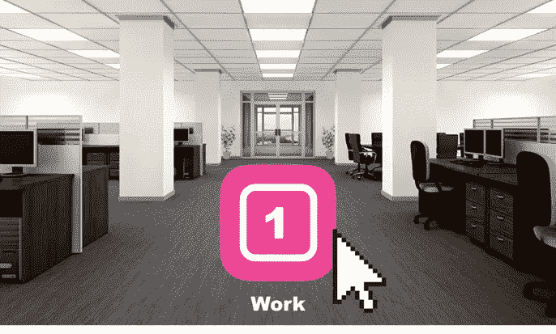
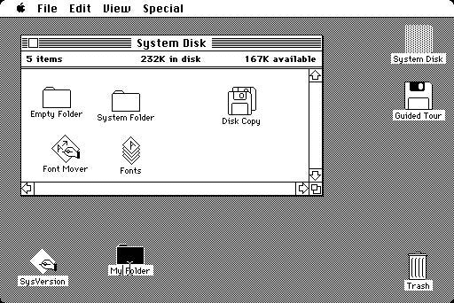
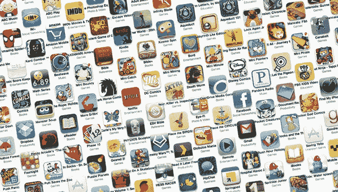
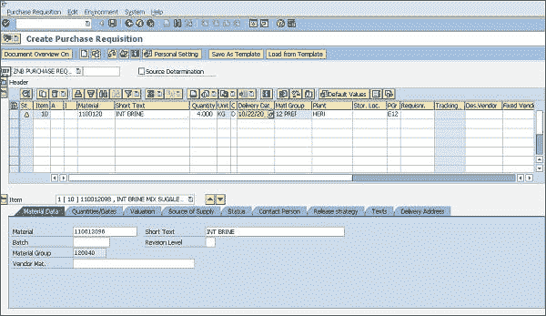
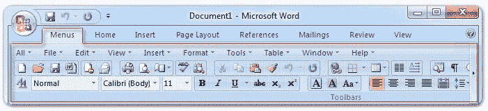

# 单一用户界面可以提高企业的效率

> 原文：<https://medium.com/hackernoon/a-single-ui-could-increase-efficiency-in-corporations-b0702e7a4da2>

今天，我们的手机上有数百个应用程序。这些应用程序旨在让我们的生活变得更简单，它们确实如此。但是对于大公司来说，拥有几十个业务应用程序是最糟糕的噩梦之一。大量的应用程序使得最小的改变也变得极其昂贵，并且产生了对遗留平台的依赖性。问题包括缺乏可重用性，集成测试的挑战，以及孤岛式开发。传统基础架构成为这些公司跟上发展速度的瓶颈。尽管在后端使用模块化方法是一个很好的实践，但是拥有多个 ui 效率很低。拥有单一的前端可以为公司带来巨大的收益，提高工作绩效和协作。

内部开发、外包和从几家供应商购买产品，为基本操作创建了一长串业务应用程序和工具。要想知道用户界面是如何有问题的，你只需要看看自己的桌面就知道在这个精确的时刻你打开了多少个窗口。每读一封邮件，都会成为一扇打开的新窗口——提醒你以后回复它。

Apple Macintosh GUI

自从 80 年代早期 Xerox Alto、Star 和 Apple Macintosh 问世以来，图形界面发生了巨大的变化，带来了挑战和机遇。“UI”和鼠标的引入为软件行业创造了一个无限的市场。这些设计比需要专业训练的复杂 DOS/UNIX 命令的黑屏更有吸引力，而且在商业上没有吸引力。虽然**在很多情况下使用键盘更有效，但是**我们仍然使用鼠标来完成大部分动作。

但是，为什么在我们的手机或个人电脑上有数百个应用程序是有意义的，但在企业方面却如此低效呢？这个问题的答案是个人*偏好*。就个人而言，如果一个人在家，想要听一些音乐，她可以去她喜欢的音乐流媒体，如 *Spotify* ，而另一个人可能更喜欢 *iTunes* 或*谷歌音乐*或 *Pandora* 。如果一个人想写一封信，他可以在单词和页数之间选择。决定是个人做出的，并且可以根据口味和偏好有很大的不同。每个人的目标完全不同，这就创造了一个竞争的市场。

A large list of applications makes sense for personal purposes

在商业方面，事情是非常不同的。目标、过程和活动被很好地定义，并由执行类似行动的团队共享。公司的主要目标是该业务所独有的。公司知道每个个人或团体应该执行哪些行动，以及需要如何执行。

拥有多个业务应用程序会给公司的几乎每个领域带来巨大的重叠。想想支持区域的所谓“票”。如果一个人的电脑有问题，他会为服务台开一张罚单。如果有人对空调有问题，他也会为他们的设施管理开一张罚单。很明显，这两个系统将有类似的要求，如票证状态、优先级、解析器、注释等。然而，因为这两个领域解决不同的问题，它将可能在不同的系统中。

集成 UI 最臭名昭著的例子是 SAP。1973 年， *SAP* 推出了第一款 ERP，旨在成为单一交互点。 *SAP* 整合了公司内的所有领域，带来了代码变更的可伸缩性、效率和协作。另一个有趣的方面是 *SAP* 基于事务工作。每个屏幕都被称为**事务**，看起来一样，感觉也一样。可以通过输入一个五个字母的代码来快速访问它，该代码会立即加载用户界面。

封装的**事务**背后的基本原理是每个业务活动都可以分解到最小的粒度级别。根据定义，事务是不可分割的操作。它不能半途而废。

例如，如果公司的任何一个部门需要购买办公用品，它就会启动采购申请屏幕。把它想象成填表。

软件行业喜欢构建单独的应用程序，如 Word、Excel 和 PowerPoint，而不是集成的应用程序，原因有很多。创造不同的产品是一个重要的商业策略。微软 Office 被认为是一个“杀手级”应用程序(基本任务所必需的)，但它以不同的包装出售。这种方法在经济学和商业中被称为**价格差异**和**产品歧视**。创造同一产品的不同版本是成功的销售策略。

Office 应用程序可能看起来完全不同，用途不同，但事实并非如此。微软 Office 的*5000 万行*大部分是由各个应用使用的库共享的。通过查看产品顶部的工具栏，很容易看出证据，它们是相同的。谷歌文档(Google Docs)和微软办公软件(MS Office)的在线版本，可以选择你想要创建的文档类型，而不是启动哪个应用程序。

应用程序的经典定义是可执行程序。但是很难说一个应用程序在哪里结束，另一个应用程序在哪里开始。web 应用呢？每个网站域名，是一个应用吗？还是每个页面都是一个应用？很难定义。许多软件公司将 UI 集成最大化以降低成本。

我们需要将我们与计算机的互动视为一种数学功能。与计算机类似，我们也有 I/O(输入和输出),处理器是我们的大脑。它是这样工作的:你“要求”计算机向你显示一些信息，这些信息将使你能够作出决定，这些决定反过来又回到计算机。例如，你可以让计算机通知你库存中有多少盒钢笔。如果只剩下两个，你想要求重新购买。你在屏幕上读到的信息是对你大脑的输入。键盘和鼠标上的动作是大脑处理的结果(你决定需要购买新的东西)。

在上面的例子中，显然有自动化的空间:我们可以设置一个触发新购买的钢笔盒的阈值，从而消除人工交互。然而，我们仍然有工作，我们的工作仍然有价值，因为我们的“处理器”做了机器的处理器不能做的事情。对于更复杂的过程，我们需要人的判断和推理。这就是我们 I/O 效率提高的地方——消除了我们与机器之间的交互。

拥有单一界面将使公司面向未来。创建办公用品的请购单可以简单地由语音识别代替。与其打字，执行多次点击，填充搜索框，切换应用，为什么不说:“买 5 盒笔”？

对于一个人工智能算法来说，如果公司已经采用交易模式，那么处理这种句子会更容易。单词“buy”只是成为表单采购申请的触发器。如果我们没有单一的交互点，那么计算机就很难为这个命令启动特定的服务。最后，需要 10 分钟做的事情，可以缩减到 3 秒钟。使用语音识别是有效的，因为 I/O 是最小的。

大多数跨国公司越来越像一家科技公司，而不是他们自己的终极目标企业。大多数公司无法在市场上找到合适的应用程序，他们最终只能自己开发。当用前端开发应用程序时，公司总是需要记住 UI 集成。如果可能的话，为 UI 创建一个专门的团队，并将所有的开发集中到那个 UI 上。这将构建强大的用户界面功能，促进所有技术团队的集成和协作。