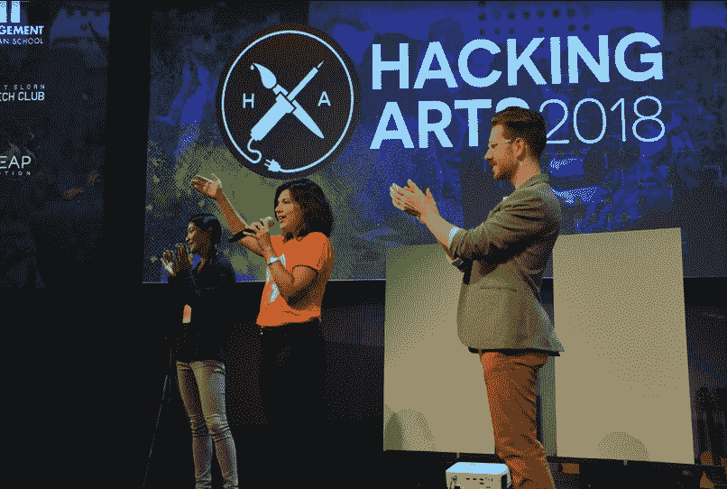
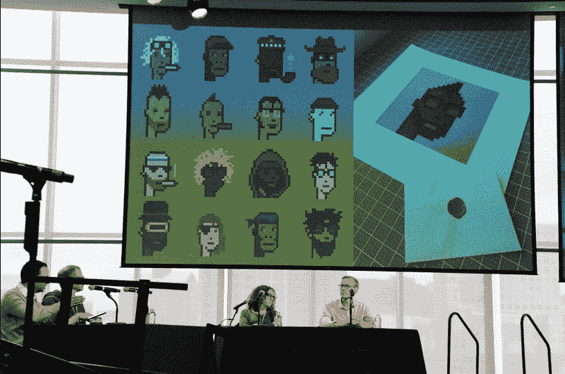

# 麻省理工学院的艺术和技术奇观——黑客艺术 2018

> 原文：<https://medium.com/hackernoon/a-spectacle-of-art-tech-at-mit-hacking-arts-2018-1098a35eb115>

## 作者:Davinder Jangi，编辑:Philip Plotnicki

Welcoming the Best of the Best to Hacking Arts 2018

听到艺术首先想到的是什么？它可能属于视觉和表演艺术、音乐或时尚领域:班克斯的一幅画(或任何它的遗物)、芭蕾舞表演或肯德里克·拉马尔的一首歌。

艺术和科技怎么样？

现在可能性飙升到一个深不可测的程度:区块链上的数字艺术，虚拟现实灯光秀或由 **DNA** 创造的说唱音乐(见下面的会议要点)。

Kaavya Gupta & Nicholas Medvescek, Co-Organizers of Hacking Arts, kicking off the closing ceremonies

艺术有能力以强有力的方式赋予人们力量和灵感，至少能让人们逃离日常生活的危险。无论你是热爱艺术还是认为它微不足道，从商业角度来看，这都是一个利润丰厚的行业，因为新兴技术而充满创新。虽然技术与一切都有交集，但技术与艺术的交集并不经常被讨论到与技术、医疗保健或金融同等的程度。此外，很少有空间让技术专家和艺术家一起探索像黑客艺术这样的艺术的未来。

> “黑客艺术很有趣，因为你周围的每个人都有想法，”—哈佛大学的 Vivekh。

# 黑客艺术背景

黑客艺术是一个为期两天的节日，探索艺术和技术之间的交集；它由 24 小时黑客马拉松、演讲者、小组讨论、研讨会和艺术与技术博览会组成。该节日自创办以来已是第六年了！

茱莉亚音乐学院**艺术创新中心**的创始主任埃德·比留斯(Ed Bilious)作为主旨发言人宣布艺术节开幕，他阐述了艺术和技术的重要性。他引用了热情的小提琴手爱因斯坦的话，他曾经说过:“我的发现是音乐感知的结果。”

来自北美 22 所学校的 200 多名黑客参加了一场 24 小时的黑客马拉松。有价值的奖品:第一名——2500 美元，第二名——1000 美元和粉丝最爱的 500 美元。每个团队都可以使用一系列设备，包括 V12 威力登激光雷达传感器、基于位置的声音雕塑立方体、Leap Motion 控制器、HTC VIVE 套件和 Oculus Rift VR 系统。

# 构思阶段

有了想法的黑客已经走上舞台，推销他们的想法来吸引团队成员。这些想法很有创意:Shazam for dance moves，一个将艺术家与导师联系起来以帮助他们创建项目的 AR 平台，以及一个用户可以在城市航拍照片上绘制艺术的应用程序。房间里的兴奋是显而易见的；当观众听到一个创新的想法时，他们欢呼起来；黑客们仔细聆听，寻找一个理想的群体。推销结束后，黑客们组成了小组，他们出发了！

# 黑客和共同创造

黑客们被分散在他们的团队中，在麻省理工学院媒体实验室的一个宽敞的、天花板很高的房间里，俯瞰波士顿市中心天际线的风景如画的景色——这给了他们与他们的编码屏幕一个令人耳目一新的视觉对比。正如每个团队的多样性所展示的那样，共同创造是电影节的焦点。“我们有一名音乐技术人员，我们自己有 3 名视觉设计师和开发人员，这是一种有趣的沟通方式，你必须调整你的语言和想法，让外界的人理解你想说的话，只是这种练习就能产生很多新的想法，”来自茱莉亚音乐学院的学生帕洛说，他的团队的想法使观众能够通过检测湿度温度、呼吸和心率的不同控制器对表演产生直接影响。

# 声音

黑客艺术的一个突出方面是它听起来的方式。房间里有如此多的声音与持续不断的嗡嗡讨论声交织在一起。首先，小提琴的高音会进入。那么黑客绕过激光雷达传感器发出的类似风的声音就会通过。最重要的是，在整个音乐节期间，黑客们旁边都有现场音乐表演。其中一位表演者是 Wayup Rui，一位崭露头角的波士顿艺术家，他哼唱和说唱了各种不同的节拍。“我认为对这里的每个人来说，听到与他们习惯的不同的氛围是很酷的。芮说:“音乐对人们有很大的帮助——它可以让你为工作或篮球比赛做好准备，我想分享这种积极的氛围。”

¥vng Rui — KHRØMEHEARTZ EP out now!

# 行业专业人士

有大量的展位为黑客和节日游客设立，像来自赞助商谷歌云，Adobe 和 Wayfair 的展位。此外，对于那些对艺术和技术感兴趣的人来说，有大量的社交机会，比如王尧和雪莉·李，她们是 ICTUS AUDIO 的联合创始人，并向我展示了他们名为“解开”的项目(点击此处观看“解开”视频)。这是一种 360 度的环绕立体声体验，感觉就像你在探索一个意识和潜意识的同时穿越时空。Sherry 阐述了虚拟现实在电影行业的存在，“一些大工作室的伟大动画电影有效地利用了虚拟现实的交互性。然而，在音频方面，大多数作品仍然使用与平面电影相同的音乐评分原则。我们相信虚拟现实提供了一个发展音乐和配乐的机会，在“解开”之后，我们认为我们接近找到下一阶段的关键。这是一个挑战，但我们决心实现这一目标，以便实现完全沉浸的承诺。”

为了让他们的创作更上一层楼，黑客们请来了提供行业经验的导师。导师之一是 Andrew Shum， [Thread Genius](https://www.fastcompany.com/40575641/can-ai-have-good-taste-auction-giant-sothebys-is-counting-on-it) 的创始人，这是一家专注于时尚和艺术的视觉探索初创公司，被苏富比收购，“这次黑客马拉松最大的挑战之一将是时间限制。我见过成功的黑客通过不断地模块化思考来克服这个挑战。这不仅允许您的团队优先考虑要构建的组件，而且还确保人们可以根据专业来分配任务。这是一种应用于项目管理的软件方法。安德鲁说:“在苏富比，我们正是用这种心态来解决艺术行业最大的挑战之一——有效地采购供应。

Andrew 接着解释了他在 Thread Genius 的团队如何应用这些项目管理概念来寻找艺术鉴定师的替代方案，“组成专家工作流程的各个部分和任务是什么？哪些零件可以通过软件更高效地制造出来？哪些部分可以通过招聘更专业的人员来提高效率？我在 Thread Genius 的团队一直在思考这类问题。”

Davinder Jangi (Author) watching ICTUS Audio’s “Unraveled”

Alex Sarian, Acting Executive Director of Lincoln Center for Education, and Kathleen Stetson, Co-Founder of Hacking Arts, on Financing Your Artistic Venture

# 小组讨论

**密码艺术和区块链上的艺术**

“区块链时代的艺术”的小组成员讨论了加密艺术的相关性以及区块链如何影响艺术生态系统中的参与者。小组成员之一约翰·沃特金森讨论了他共同创建的加密艺术项目“加密朋克”:在以太坊网络上收集 10，000 枚硬币；每枚硬币都有一个与之相关的角色(想象一个来自 80 年代街机游戏的角色)。由于加密艺术是艺术，除了源于稀缺性和安全性的加密货币的常规价值之外，它还有一层投机价值。小组成员还讨论了区块链对数字艺术销售的影响；像画廊和拍卖商这样的中介机构权力较小，艺术家和卖家通过公平交易获得权力。很明显，秘密艺术运动正在兴起，但所有小组成员都同意，在这个行业真正起飞之前，消费者需要更多关于区块链的教育。

Crypto Punks Speaking the Truth

**人人艺术**

“创造性参与的未来”讨论了如何利用技术让残疾人更容易接触到艺术。小组成员 John Olsen 是 3D Photoworks 的联合创始人，他解释了他的公司如何通过使用触觉艺术印刷将二维图像转换为三维触觉艺术印刷，使视觉障碍者更容易获得艺术。约翰给电影节带来了蒙娜丽莎的触觉艺术版画:蒙娜丽莎的脸摸起来像皮肤，她的衣服摸起来像织物，根据深度和纹理，人们可以分辨出她的脸和背景的不同部分。

Tactile Fine Art Printing of the Mona Lisa

**生物群跳动**

David Kong of Biota Beats

最引人入胜的演讲者之一是 David Kong，他是一名合成生物学家、社区组织者、音乐家和摄影师，在麻省理工学院媒体实验室工作。他演示了《生物群节拍》( Biota Beats )( T7 ):一首由微生物唱机创作的歌曲，该唱机翻译了人体几个部位的细菌，并将其与嘻哈节拍混合在一起。虽然我不会将它添加到我的 Spotify 播放列表中，但知道你身体上的细菌可以发出声音，这是令人难以置信的。

## 最终陈述

24 小时后，黑客马拉松结束了，评委们选出了七个决赛小组。所有参加节日活动的人都挤进了演讲即将开始的礼堂，激动的情绪达到了白热化。每一场演讲都引人入胜。

SoundSpace taking 2nd Place

粉丝最喜欢的是 Luxo——一个受皮克斯电影中 Luxo Jr .灯启发的 VR 应用程序。想象一下，如果像桌子或床这样的无生命物体可以有生命和个性——这可能会改变我们对日常空间的感知。Geoff Winegar 说:“我们认识到，我们可以把一群拥有不同技能和相当复杂愿景的人放在一起，让他们玩得开心，学到很多东西，还可以做出一些非常酷的东西。”他的队友黄浩然解释说，“我知道我不应该让焦虑阻止我投球”，Uz Zhan 最后说，“当你与外面的东西建立个人联系时，这是非常强大的，人们真的会与他们拥有的东西联系起来。”

Luxo as a Fan Favourite

获胜的团队是 Paper Cuts，这是一个音乐教程工具包，用户可以剪下纸条并将其放在键盘上，这是一种指导他们播放歌曲的虚拟现实技术。“这真的是一次很酷的经历，我们去年参加了黑客艺术，但完全失败了，所以回到这里，有机会责备自己，并作为一个团队一起做一些工作和创造一些很棒的东西，这真的很酷，”来自哈佛的乔丹·西格尔说，他的队友补充道，“每次我在麻省理工学院，我们都提出非常好的想法，并在这里做非常好的事情。哈佛大学的 Vivekh 说:“黑客艺术很有趣，因为你周围的每个人都有想法。

Paper Cuts for First Place!

# 一生中的一次经历

最终，黑客艺术 2018 的周末取得了成功。非常感谢整个黑客艺术团队专注于最好的个人和团队来创造一些不可思议的、可行的和难以置信的东西，以造福社会和不同的社区。感谢本次活动的赞助商和合作伙伴，Wayfair、麻省理工学院管理层、麻省理工学院斯隆科技俱乐部、麻省理工学院创业中心、EMS、Adobe、Xd、创业与创新集团、Clover、Leap Motion、Vive、Masary Studio、谷歌云和威力登激光雷达。

