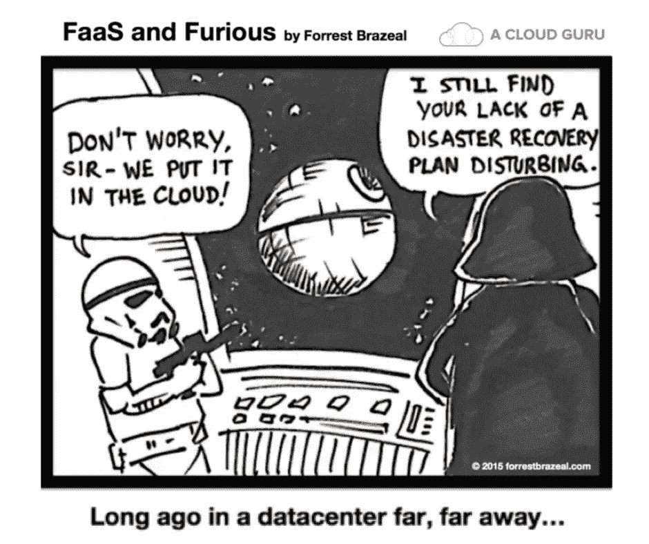
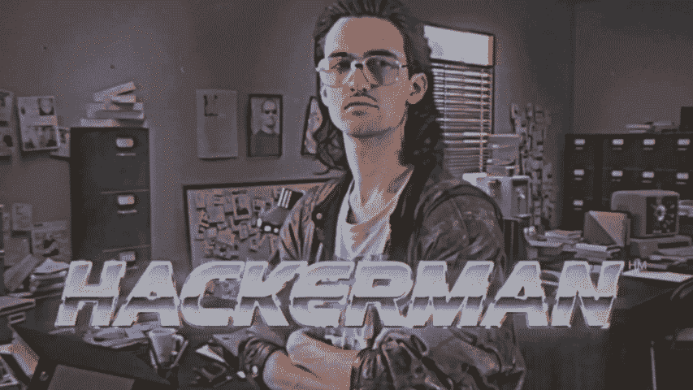

# 去中心化网络的艺术状态——第二部分

> 原文：<https://medium.com/hackernoon/a-state-of-the-art-of-decentralized-web-part-2-ea630917332a>

## 2.文件存储器

本文是关于 web 去中心化系列文章的第二章。在这里，我们将重点讨论如何存储文件。我认为存储是谈论去中心化时最先进的领域，因为它依赖于成熟和健壮的技术:点对点和加密。如果您是一名应用程序开发人员(web 或移动)，您已经可以用一个分散的存储层来替换您的存储层。

And wherever you store your data, always anticipate worst-case scenarios 😉

# 系列文章

1.  [**简介**](https://hackernoon.com/a-state-of-the-art-of-decentralized-web-part-1-54f70fdb7355)
2.  ***文件存储***
3.  [**区块链和智能合约**](https://hackernoon.com/a-state-of-the-art-of-decentralized-web-part-3-7d901e09d06f)
4.  [**数据库**](https://hackernoon.com/a-state-of-the-art-of-decentralized-web-part-4-212732f74894)

# 为什么要分散文件存储？

在典型的云架构中，我们会使用云服务，如[亚马逊 S3](https://aws.amazon.com/s3/) 、 [Azure 文件](https://azure.microsoft.com/en-us/services/storage/files/)或[谷歌云存储](https://cloud.google.com/storage/)。在安全性和可靠性方面，不用担心这是一个非常好的选择:文件可以在服务器端加密(因此云提供商无法访问您的文件)，您可以配置备份和跨区域复制。您还拥有无限的可伸缩性和一组很好的 API，可以从任何程序访问您的文件。

但是，我认为这些服务存在两个问题:

*   它们是集中式的，这意味着一旦发生故障，整个系统都会受到影响。有时候，一个打字错误可以让网站关闭四个小时。
*   它们的价格很高(通常以美元/GB/月为单位)，这使得非营利组织很难提出使用云存储服务的应用程序。

另一方面，你的新电脑可能有一个 2TB 的硬盘，而你只用了它的十分之一。那么，为什么不用这些空闲空间来支持一个协作文件存储系统呢？

让我们来看看提供这种解决方案的主要候选公司:

1.  [星际文件系统](#5101)
2.  [蜂群](#7732)
3.  Storj
4.  [DADI](#a45d)
5.  [Dat 项目](#bbce)
6.  [新航](#ecb9)
7.  [块堆栈](#25bf)

这有很多选项，它们有时会提供相似的功能，所以我将重点介绍它们的独特之处。准备好了吗？

# 1.星际文件系统

 [## IPFS 是分布式网络

### 一种对等超媒体协议，使网络更快、更安全、更开放。

ipfs.io](http://ipfs.io/) 

在这个[谜一样的名字](https://discuss.ipfs.io/t/why-the-name-ipfs/307)背后，是我认为迄今为止最成熟的系统。

**功能:**

*   对等协议和网络。它是 Kademlia、BitTorrent 和 Git 的组合。
*   IPFS 可以单独使用，所以你不需要为了使用 IPFS 而使用一个特定的栈。
*   IPFS 提供了一个命名系统(IPNS)，一个 CDN，可以直接服务于网站。
*   不保证数据可用性或冗余。IPFS 的姊妹项目之一 FileCoin 提出通过引入基于区块链的激励系统来解决这个问题(存储数据的用户将获得 FileCoin 代币)。我们可以把它看作是 IPFS 的“企业版”,带有链上 SLA。
*   [开源](https://github.com/ipfs/ipfs)。IPFS 的一些模块已经成为独立的项目( [libp2p](https://libp2p.io/) 、 [IPLD](https://ipld.io/) )。

**定价:** IPFS 免费使用。用户通过向他们的同伴提供文件来为网络做贡献。FileCoin 的价格将取决于市场(越多人提议磁盘存储，它就越便宜)。

**状态:**尽管自 2015 年以来它仍处于 alpha 版本，但该协议似乎相当稳定和快速。怀疑？然后在 [DTube](https://d.tube/) 上观看这个[滑稽猫汇编](https://d.tube/#!/v/megamovie/a82s7pkc)，一个类似 YouTube 的基于 IPFS 的存储和 [Steemit](https://steemit.com/) 来管理内容和奖励作者。然而，FileCoin 要年轻得多，还不准备使用(见路线图的[最后更新)。](https://filecoin.io/blog/update-2018-q1-q2/)

为了更好地从理论和实践上介绍 IPFS，我向您推荐这篇文章:

 [## 对 IPFS 的实际介绍

### 星际文件系统将会是一件大事。

medium.com](/coinmonks/a-hands-on-introduction-to-ipfs-ee65b594937) 

如果你有兴趣了解 IPFS 是如何在幕后工作的(它的名称服务和各种协议)，那么请观看胡安·贝尼特(IPFS 和 Filecoin 的创始人)讲述他们实现的不同机制:

# 2.蜂群

 [## 蜂群

### 2017 年 10 月，五个工作组开始工作。网络测试和模拟框架项目旨在测试…

ethersphere.github.io](https://ethersphere.github.io/swarm-home/) 

**特性:**

从功能和技术角度来看，Swarm 与 IPFS 非常相似，但有两个主要区别:

*   Swarm 与以太坊区块链紧密结合。如果您已经在项目中使用 Ethereum，这可以被视为一个优势，但在其他情况下也会使您的堆栈变得复杂。
*   Swarm 有一个内置的激励系统，用来煽动托管数据的人。从功能上来说，使用 Swarm 相当于同时使用 IPFS 和 FileCoin。

为了更好地了解这两个项目的异同，[这里有一个很好的总结](https://github.com/ethersphere/go-ethereum/wiki/IPFS-&-SWARM)。以太坊选择开始自己的项目一直是许多争论的主题，但这种并发也可以使他们产生更好的结果(我希望如此)。Swarm 是[开源](https://github.com/ethereum/go-ethereum/tree/master/swarm)(以太坊代码库的一部分)。

定价:同样，价格将取决于市场

状态: Swarm 还在实验阶段。[概念验证 3 已经发布](https://blog.ethereum.org/2018/06/21/announcing-swarm-proof-of-concept-release-3/)，测试网已经推出。路线图可在[此处](https://github.com/orgs/ethersphere/projects/5)获得。密切关注这个项目，但暂时不要用于生产。

**更进一步:**要开始使用 Swarm，[阅读官方文档](https://swarm-guide.readthedocs.io/en/latest/introduction.html)。

# 3.斯托尔杰

 [## 分散式云存储- Storj

### Storj 是互联网的存储层。分散式云存储是一种新的模式，它消除了中介…

storj.io](https://storj.io/) 

**功能:**

*   S3 兼容。这意味着它将具有相同的桶和对象概念，但是没有像标准文件系统中的文件夹。这将使得使用亚马逊 S3 分散现有应用程序的存储层变得非常容易！
*   内置端到端加密。
*   [开源](https://github.com/storj/storj)。

**定价:**

*   存储:每月每 GB 0.015 美元
*   带宽:下载每 GB 0.05 美元

Storj 为开源软件提出了[合作计划。简而言之，每一个使用 Storj 的开源软件都将获得 10%的收益。](https://storj.io/partners)

**状态:**Storj 网络将于 2019 年初启动。在这里看路线图[。](https://storjlabs.aha.io/published/01ee405b4bd8d14208c5256d70d73a38?page=1)

**更进一步:** [白皮书](https://storj.io/white-paper)

# 4.二甲氧基苯胺二异氰酸酯

 [## 本地全球网络

### DADI 是云计算服务的新边缘网络，由区块链技术提供支持。

大地云](https://dadi.cloud/) 

对 DADI 的一个很好的描述是“**一个分散的云提供商**”。DADI 已经提出了 CDN，云存储服务也即将推出。这里重点说一下 CDN。

**功能:**

*   提供静态文件(资产、网站等)。
*   数据缓存在边缘。
*   完全支持缓存、标题控制、图像处理、图像压缩和图像格式转换。
*   [开源](https://github.com/dadi/cdn)。

**定价:** [本文件](https://docs.google.com/document/d/1lEIfZZtI2QITG0AHxZsAdWsKMwmZaLBhOEVq6wZ4B2w/edit#heading=h.wjvafd9hyvex)详细说明了取决于请求量的定价。DADI 是基于赌注的证明，所以要成为 DADI 的主人，你必须下注 5000 美元 DADI 代币(相当于现在的 216 美元)。

**状态:** CDN 已经可用，云存储应该在 2019 年初可用。看他们极其雄心勃勃的路线图[这里](https://dadi.cloud/en/marketplace/)。他们最近通过一个 ICO 筹集了 2900 万美元。

**更进一步:**这里有一堆教程(寻找 CDN 标签)。

# 5.Dat 项目

 [## Dat 项目——一个社区驱动的网络协议

### Dat 是一个非营利的技术和社区，用于构建未来的应用程序。

datproject.org](https://datproject.org/) 

**特色:**Dat 是什么？Dat 是一种对等协议。它提供了一个 CLI、一个 Node.js API 和一个桌面应用程序。托管文件可以通过网络浏览器访问，地址:`https://datproject.org/{dat-key}`。没什么新鲜的？嗯，这里的特殊性是你共享一个文件夹而不是单独的文件，就像用 git ( `dat clone`、`dat create`、`dat share`)共享一个存储库，你还可以更新你的文件。考虑到这一点，我们可以理解它并不是构建分散式 web 应用程序的最佳选择(与以前的解决方案相比)。然而，对于愿意向社区发布数据(实验结果、训练数据库……)并轻松应用变化的研究人员和科学家来说，它具有真正的附加值。这里有可用的资源。

**定价:**免费使用。但是，您有责任保持数据存活(对等体只共享它们克隆的数据，就像在经典的 BitTorrent 系统中一样)。

**状态:** Dat 已经可以使用。用法示例见 [dat.land](https://dat.land/) 。

**更进一步:** Dat 文档和教程可从[这里](https://docs.datproject.org/)获得。

# 6.希雅·凯特·伊索贝尔·富勒

 [## 希雅·凯特·伊索贝尔·富勒

### Sia 是一个由区块链技术保护的分散式存储平台。Sia 存储平台利用了…

新航科技](https://sia.tech/) 

**特点:**同样，Sia 总部设在区块链，为 SiaCoin 的东道主提供报酬。上传文件时，保证存活期为 3 个月，合同可以自动续签。它也是开源的([最近转移到 GitLab](https://gitlab.com/NebulousLabs/Sia) )。即使 Sia 提供了一个 API，我相信它的主要用例是存储用户的个人数据，并摆脱像 Dropbox 或 Google Drive 这样的服务。

**定价:**每月每 GB 约 0.002 美元。

**状态:** Sia 已准备好用于存储非关键文件。在接下来的一年里，他们计划提高速度，支持热存储，并增加一个 CDN 功能。

**更进一步:**开始使用 [API (CLI 或 JS)](https://blog.sia.tech/api-quickstart-guide-f1d160c05235) 或 [GUI](https://blog.sia.tech/getting-started-with-private-decentralized-cloud-storage-c9565dc8c854) 。

# 7.块堆栈

 [## 块堆栈

### Blockstack 正在构建一个生态系统，让您的用户能够控制他们的基本数字权利:身份…

blockstack.org](https://blockstack.org/) 

Blokstack 不仅仅是存储。这是一个工具包，旨在提供一切来创建一个新的去中心化的互联网。目前，它由一个命名系统( [BNS](https://docs.blockstack.org/core/naming/introduction.html) )、一个文件存储系统([盖亚](https://github.com/blockstack/gaia))、一个认证系统(你可以在 Blokstack 上构建的每个应用程序上使用相同的 Blockstack id)和一个[网络浏览器](https://github.com/blockstack/blockstack-browser)组成。让我们来关注一下存储层。

**功能:**

*   [灵活的驱动系统](https://github.com/blockstack/gaia/tree/master/hub/src/server/drivers)(兼容当前云存储提供商)。
*   当与 Blockstack 浏览器一起使用时，用户可以通过运行 Gaia hub 和使用驱动程序来选择存储数据的位置(在本地磁盘上或在云提供商上)。有趣的是，您选择的存储解决方案将被所有需要存储数据的块堆栈应用程序使用。所以你可以控制你所有的数据，你可以备份，删除，托管或使用第三方。**你只是拥有你的数据！**
*   [开源](https://github.com/blockstack/gaia)。

**定价:**默认存储提供商是免费的。如果你想在 S3 上存储你的所有数据，那么你将支付 S3 费用。
如果你是一名开发者，Blockstack 刚刚推出了它的应用挖掘计划:在 Blockstack 上开发应用获得报酬。从 12 月开始，每月将发放总额为 100，000 美元的奖金(排名第一的应用程序 20%，排名第二的应用程序剩余 80%的 20%…)。这是一大笔钱，你可以用这笔钱来激励用户也使用你的应用程序(重新分配一部分钱)。关于[https://app.co/mining](https://app.co/mining)的更多信息。

**状态:**准备使用。2019 年初，Gaia 将作为一个独立的项目发布，因此我们将能够在任何项目中使用存储层。

**更进一步:**看看[盖娅自述](https://github.com/blockstack/gaia/blob/master/README.md)和 [blockstack.js 文档](http://blockstack.github.io/blockstack.js/)。

# 下一步是什么？

现在，根据您的应用程序需求，您有了一个惊人的技术选择来存储您的文件。下一章是关于使用区块链去中心化你的应用程序的逻辑。

I hope you are ready because it’s gonna be tricky 🤓

给一些👏👏👏如果你欣赏这一个并且不耐烦继续。这些文章反映了我对这个主题的理解，欢迎在评论中进行讨论。