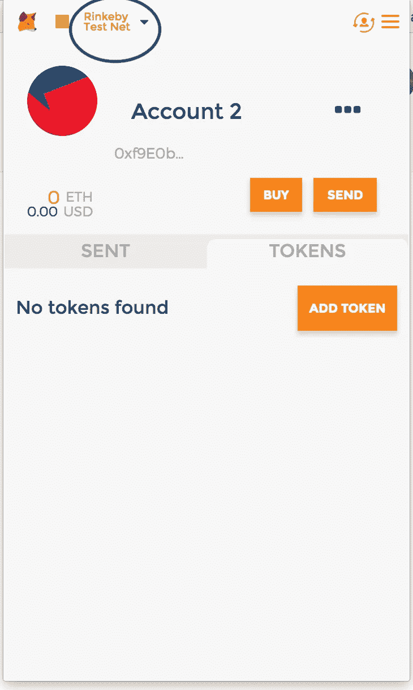
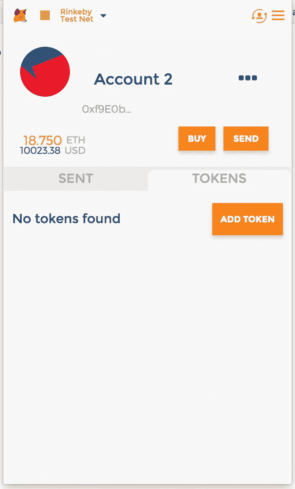

# 在 Go 中测试和部署以太坊智能合约的分步指南

> 原文：<https://medium.com/hackernoon/a-step-by-step-guide-to-testing-and-deploying-ethereum-smart-contracts-in-go-9fc34b178d78>


“A toddler standing at the bottom of a tall staircase” by [Mikito Tateisi](https://unsplash.com/@tateisimikito?utm_source=medium&utm_medium=referral) on [Unsplash](https://unsplash.com?utm_source=medium&utm_medium=referral)

在这篇文章中，我们将一步一步地看看如何使用 Go 编程语言测试、部署一个简单的以太坊智能合约并与之交互。

网上有很多教程详细介绍了如何部署以太坊智能合约并与之交互。然而，这些教程要么完全由 Javascript 完成，要么是 Javascript 和 Go 的某种组合。

作为一个初露头角的 Gopher 和以太坊爱好者，我想使用 Go 在以太坊上构建、测试、部署智能合约并与之交互。然而，我无法找到一个简单的逐步指南来帮助我开始。我不得不从不同的来源收集信息，并通过挖掘 Go Ethereum 源代码来理解和整合所有需要的拼图。在这篇文章中，我将尝试使用我所学到的知识来编写一个简单的循序渐进的指南，希望能帮助其他人快速掌握围棋和以太坊。

在以下情况下，这篇文章对你最有用:

*   您熟悉 Go 编程语言，并且已经设置了 Go 工作区。
*   你对以太坊区块链和相关的智能合约有了大致的了解。
*   您已经接触了一些用于编写智能合同的 Solidity 编程语言。

如果你是区块链和以太坊领域的新手，我建议你从以下方面开始:

*   观看这个精彩的[视频](https://anders.com/blockchain/)，从高层次了解区块链是什么。
*   浏览(打开你最喜欢的文本编辑器，用你最喜欢的编程语言跟随)这篇关于构建区块链的优秀的[博客](https://hackernoon.com/learn-blockchains-by-building-one-117428612f46)文章。
*   阅读以太坊[白皮书](https://github.com/ethereum/wiki/wiki/White-Paper)。

## 安装 Go-Ethereum 和相关的开发工具

首先，我们需要为以太坊协议安装 Go 绑定。假设您已经安装了 Go 并适当地设置了 *GOPATH* 环境变量，您可以通过以下方式获得绑定:

```
$ go get -d github.com/ethereum/go-ethereum
```

一旦我们签出了源代码，我们就可以继续构建 *geth* (Geth 是运行以太坊节点的完整 go 实现的主要命令行工具)以及所有开发人员工具:

```
$ cd $GOPATH/src/github.com/ethereum
$ go install ./...
```

## 设置项目结构

我们将编写并部署一个简单的收件箱合约。为此，让我们从设置以下目录和文件结构开始:

```
# Navigate to your Go src directory. Mine looks like: 
# $GOPATH/src/github.com/sabbas$ cd $GOPATH/src/github.com/sabbas
$ mkdir -p inbox/contracts
$ touch contracts/inbox_test.go fetch.go update.go deploy.go$ tree inbox/
inbox/
├── contracts
│   └── inbox_test.go
├── deploy.go
├── fetch.go
└── update.go
```

我们创建一个名为*收件箱*的新项目文件夹。在这个文件夹中，我们创建一个名为*合同的包文件夹。*该文件夹将包含我们收件箱合同的可靠性代码及其相关的 Go 绑定(我们将很快生成)。在*合同*包文件夹中，我们还有一个 *inbox_test.go* 文件。这个文件将包含我们所有的测试。还有三个名为 *deploy.go、fetch.go 和 update.go 的附加文件*我们将使用这些附加文件来编写代码，以便在公共网络上部署以太坊合约并与之交互。这些文件暂时可以是空的。

## 创建一个简单的以太坊契约

我们现在准备为我们的收件箱合约编写一些可靠性代码。导航到`inbox/contracts`文件夹，创建一个名为 *Inbox.sol* 的文件。

```
$ tree inbox/
inbox/
└── contracts
    └── Inbox.sol
```

编辑 *inbox.sol* 文件，并为我们的收件箱合同添加以下几行可靠性代码:

```
pragma solidity ^0.4.17;

contract Inbox {

    string public message;

    function Inbox(string initialMessage) public {
        message = initialMessage;
    }

    function setMessage(string newMessage) public {
        message = newMessage;
    }
}
```

收件箱合同非常简单。它有一个名为 *message* 的公共数据变量，用于保存最新消息字符串的内容。该契约还定义了一个公共的 *setMessage* 方法，该方法更新*消息*数据变量的内容。

## 使用 Go 中的以太坊合同

既然我们在 Solidity 中定义了收件箱合约，我们希望能够在 Go 应用程序中使用这个合约。更具体地说，我们希望能够将这个契约部署到以太网上，并在我们的 Go 应用程序中方便地与之交互。go-Ethereum 提供了一个代码生成器工具，可以将一个 Solidity 契约文件转换成一个类型安全的 Go 包，我们可以直接从 Go 应用程序中导入和使用这个包。这个工具叫做 *abigen* ，它是在我们上面的 go-ethereum 设置中构建和安装的。要使用 *abigen，*导航到`inbox/contracts`文件夹并执行:

```
$ abigen -sol inbox.sol -pkg contracts -out inbox.go$ tree inbox
inbox
└── contracts
    ├── Inbox.sol
    └── inbox.go
```

我们将我们想要生成 Go 包的 Solidity 契约文件的名称传递给 *sol* 命令行参数。我们还为 *pkg* 和 *out* 命令行参数指定 Go 包名称和输出文件名。运行 *abigen* 会生成 *inbox.go* 包文件，其中包含收件箱可靠性契约的 go 绑定。一旦我们有了这些绑定，我们就可以开始测试收件箱合约了。

## 在部署到公共网络之前测试以太坊合同

在我们将我们的合同部署到一个公共以太网之前，我们希望确保它按预期工作。在收件箱契约的情况下，我们想要测试我们是否可以部署带有初始消息的契约，检索这个初始消息并在以后更新它的值。Go-Ethereum 为区块链模拟器提供了一个很好的工具，对自动化单元测试非常有帮助。在下面的代码片段中，我们将看到如何使用区块链模拟器工具来测试收件箱合同。

*TestDeployInbox* 方法通过调用`crypto.GenerateKey`来生成私钥。该键用于创建交易签名者功能，该功能用于在模拟区块链中授权交易。通过调用`bind.NewKeyedTransactor.`生成交易签名函数和一个我们可以用来进行交易的地址。这个地址然后被用来创建一个包含有一些初始余额的单一账户的起源块(通过调用`make(core.GenesisAlloc`和`core.GenesisAccount`)。这个创世纪块然后被用来播种模拟区块链。最后，我们*“挖掘”*下一个块，方法是显式提交所有未决事务，并检查收件箱合约是否部署在有效地址。

我们可以导航到`inbox\contracts`并执行`go test`来确保我们的部署测试通过

```
$ go test -v
=== RUN   TestDeployInbox
--- PASS: TestDeployInbox (0.01s)
PASS
ok   github.com/sabbas/inbox/contracts 0.042s
```

接下来，我们想要测试当我们部署 Inbox 契约时，它与正确的初始消息一起被部署。

类似于 *TestDeployInbox* 函数， *TestGetMessage* 函数通过设置我们的模拟区块链开始(模拟区块链函数可以重构为一个单独的可重用函数。我在这里避免了这一点，只是为了有助于可读性)。然后它调用 *DeployInbox* 函数，该函数是为我们的 Inbox Solidity 契约自动生成的 Go 绑定的一部分。注意， *DeployInbox* 函数返回一个指向已部署的收件箱契约实例的指针，作为第三个返回值。我们可以使用这个指针与我们部署的收件箱合同进行交互(超级酷！).这正是测试查询和检查存储在我们刚刚部署的 inbox 契约实例中的初始消息的目的。

我们可以导航到`inbox\contracts`并执行`go test`来确保我们的测试通过

```
$ go test -v
=== RUN   TestDeployInbox
--- PASS: TestDeployInbox (0.01s)
=== RUN   TestGetMessage
--- PASS: TestGetMessage (0.00s)
PASS
ok   github.com/sabbas/inbox/contracts 0.045s
```

最后，我们希望测试我们是否可以将已部署的收件箱契约中的消息数据属性更新为一个新值。

*TestSetMessage* 函数从我们之前看到的相同 boiler plate 代码开始，以设置模拟区块链并部署收件箱合同。正如我们之前看到的，成功调用 *DeployInbox* 函数调用会返回一个指向已部署收件箱契约实例的指针，作为第三个返回值。在 *TestSetMessage* 函数中，我们使用这个契约指针通过调用`SetMessage`函数来更新收件箱契约的消息数据属性。由于`SetMessage`函数*修改了*收件箱合同，它实际上生成了一个新的*事务。*结果，我们传入一个指向填充了交易授权数据的`TrasactOpts`结构的指针。由于我们不需要随`SetMessage`调用发送任何资金，我们将`TransactOpts`结构的`Value`属性设置为`nil.`

我们可以导航到`inbox\contracts`并再次运行`go test`以确保一切正常。

```
$ go test -v
=== RUN   TestDeployInbox
--- PASS: TestDeployInbox (0.01s)
=== RUN   TestGetMessage
--- PASS: TestGetMessage (0.00s)
=== RUN   TestSetMessage
--- PASS: TestSetMessage (0.01s)
PASS
ok   github.com/sabbas/inbox/contracts 0.051s
```

一旦我们的本地测试通过，我们的收件箱合同就准备好了。在下一节中，我们将了解如何将收件箱合同部署到公共以太网上。

我们将在 *Rinkeby 测试*以太坊公共网络上部署收件箱合同。在*主*以太坊网络上部署以太坊合约并与之互动需要实际的金钱，当我们只是在学习或玩耍时，这是不必要的。

要在像 *Rinkeby* 这样的公共网络上部署以太坊契约并与之交互，需要做几件事情:

*   我们需要在网络上有一个有一些资金的账户
*   我们需要能够连接到以太坊节点并与之交互。

在接下来的几节中，我们将依次研究每一个问题。

## 使用元掩码创建帐户

我们可以直接从我们之前构建的命令行界面创建和管理账户。然而，当开始时，我发现使用浏览器中的 meta mask Chrome 扩展要简单得多。安装 Metamask 并创建一个帐户非常简单。我将把这作为一个练习留给读者。

一旦我们启动并运行元掩码并创建了一个帐户，我们希望确保将元掩码指向 *Rinkeby* 测试网络



## 为账户提供资金

Rinkeby 网络有一个测试龙头(【https://faucet.rinkeby.io/】)正在运行，我们可以用它来请求乙醚。然而，要从这个测试龙头请求以太，我们首先需要发布一个包含我们以太坊帐户地址的帖子(这是我们想要转移资金的帐户。我们可以通过在社交网站上点击 Metamask 扩展上的帐户名称右边的省略号来复制这个地址，并提供到水龙头的帖子的链接。这很简单。


这将需要几秒钟，我们应该会看到资金显示在我们的帐户中的 Metamask 扩展。



## 连接到以太坊节点

我们可以使用 *geth* 在 Rinkeby 测试网络上启动和管理我们自己的以太坊节点。这是一个既耗费资源又耗费时间的过程，并不总是一帆风顺。一个更好的替代方法是连接到第三方提供商托管的运行中的以太坊节点。一个这样的提供者是 [Infura](https://infura.io/) 。我们可以在 Infura 注册一个免费账户。一旦我们注册，Infura 将发送 URL 给我们，以连接到运行在不同以太网上的节点。Rinkeby 测试网络的 URL 应该类似于[https://rinkeby.infura.io/fYE8qC0WiMx4ZAX4Voff](https://rinkeby.infura.io/fYe8qCnWiMxQZAXOVoff)。

## 为我们的帐户生成加密的 JSON 密钥

为了通过 Go-Ethereum 在 Rinkeby 等公共以太网上部署和交互合同，我们需要为通过上面的 Metamask 创建的帐户提供一个加密的 json 密钥。这是我们希望为部署收件箱合同并与之交互而收取费用的帐户。

我们可以通过将 metamask 中帐户的私钥导出到一个文件中(单击 Metamask 中帐户名称旁边的省略号，进入导出私钥选项),然后通过 *geth 导入它，从而生成这个 JSON 密钥。确保在完成导入后删除私钥文件。*

```
geth account import path/to/private/key/file
```

上述命令将在 Mac 上的*~/Library/ether eum/keystore*和 *~/.ethereum 中生成一个加密的 JSON 密钥文件。*注意这个文件。当我们在 Rinkeby 测试网络上部署 Inbox 契约并与之交互时，我们将在下一节中使用它的内容。

## 最后的边疆

我们终于可以将收件箱合同部署到 Rinkeby 网络了。让我们首先来看看我们之前创建的 *deploy.go* 文件中的代码，然后我们将详细介绍它。

我们使用前面生成的带有 Infura url 的`ethclient.Dial`方法连接到 Rinkeby 测试网络上的以太坊节点。然后，我们使用`bind.NewTransactor`实用程序方法从密钥文件的内容(您可以使用`geth account list`命令来检索您的 JSON 密钥文件在您的系统上的位置)和我们上面通过`geth account import`生成的相关密码创建一个授权的交易者。从那以后，部署契约的代码与我们在使用模拟区块链部署收件箱契约时看到的代码完全相同。最后，如果一切顺利，我们打印收件箱合同在网络上部署的地址。

```
$ go run deploy.go
Contract pending deploy: 0x491c7fd67ac1f0afeceae79447cd98d2a0e6a9ff
```

这将需要几分钟的时间来开采合同，并成为区块链的一部分。我们可以通过导航到 https://rinke by . etherscan . io/address/[合同地址]来通过 ethers can 检查状态。在我的情况下，这将是[https://rinkeby . ethers can . io/address/0x 491 C7 FD 67 AC 1 f 0 afeceae 79447 CD 98 D2 A0 e 6 a9 ff](https://rinkeby.etherscan.io/address/)

一旦被挖掘并包含在区块链中，我们就可以使用已部署的收件箱合约的地址开始与之交互。例如，我们可以将下面的代码放在我们上面创建的 *fetch.go* 中，以检索初始消息。

如前所述，我们使用前面生成的带有 Infura url 的`ethclient.Dial`方法连接到 Rinkeby 测试网络上的以太坊节点。然后，我们使用作为 Solidity 契约的 Go 绑定的一部分而生成的`NewInbox`方法，将收件箱契约的一个实例附加到部署在特定地址的收件箱契约。最后，我们访问契约上的`Message`属性，它应该打印 *Hello World。*

```
$ go run interact.go
Hello World <nil>
```

我们还可以更新已部署的收件箱契约上的`Message`属性。为此，将下面的代码放入之前创建的 *update.go* 文件中。

回想一下，`SetMessage`函数*修改了*收件箱合同，并实际生成了一个新的*事务。*结果，我们传入一个指向填充了交易授权数据的`TrasactOpts`结构的指针。同样，需要几分钟时间来挖掘该事务，使其成为区块链的一部分。一旦它被挖掘出来并包含在区块链中，我们就可以按照前面的例子从已部署的契约中检索`Message`属性来查看更新后的值。

我们可以用 Go Ethereum 做很多事情，但是刚刚开始可能有点太累了。希望这篇文章给了你一个可以进一步探索的起点。