# 50 枚硬币的故事

> 原文：<https://medium.com/hackernoon/a-story-of-50-coins-de44826f4f47>

将资产放在交易所意味着你不是它们的唯一所有者。维护多个钱包既费时又容易出错，但这是确保它们属于你的唯一方法。以下是帮助您存储前 50 种加密货币的最佳实践。

钥匙🔑表示硬件钱包支持，生锈的🗝键表示缺少该选项。链⛓意味着你将需要下载完整的区块链(可能是数十千兆字节)，闪电⚡means 一个轻客户端可用。

⌘F，你需要直接跳到它上面。

## 🔑⚡以太坊和代币(20/50)

瑞士联邦理工学院、TRX、瑞士、ICX、荷兰、BNB、菲律宾、RHOC、SNT、WTC、新西兰、澳大利亚、DGD、大韩民国、KCS、英美烟草、荷兰、斯里兰卡、韩国

让我们从简单的部分开始。在硬件设备上存储以太和标准以太坊令牌。

在[账本上存储 Nano S](https://lampa.fund/ledger) + [MyEtherWallet](https://myetherwallet.com/) 或 [MyCrypto](https://mycrypto.com/) 。

如果您需要手机钱包，请使用[信任钱包](https://trustwalletapp.com/)或[密码浏览器](https://www.cipherbrowser.com/)。

如果你需要一个多签名的解决方案，看看 [Gnosis 钱包](https://wallet.gnosis.pm/)，它经过了多重审核，对硬件和普通钱包都有支持。

在[以太扫描](https://etherscan.io/)或[以太浏览器](https://ethplorer.io/)上探索。

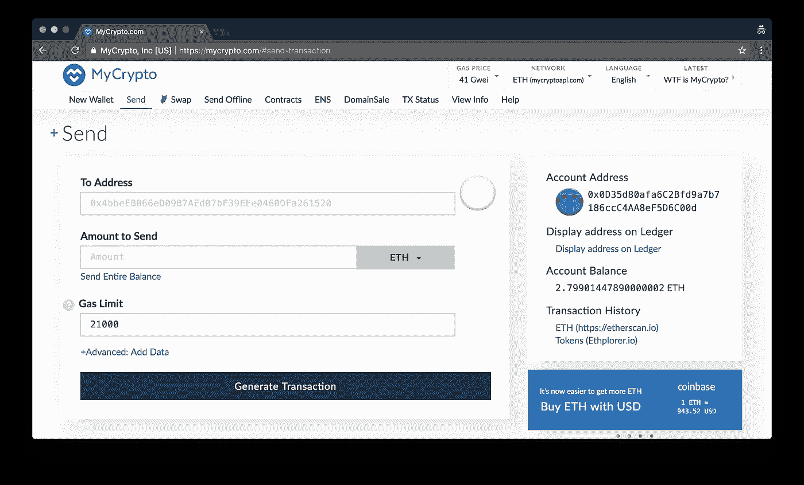

## 🗝⚡特例:EOS (21/50)

黎明的女神

暂时存储在分类帐中，但请确保将其转移到一个单独的钱包中，在那里您可以访问私钥，并在 2018 年 6 月 1 日之前[在此](https://eos.io/instructions#register)注册。

## 🔑⚡比特币和家庭(32/50)

BTC、LTC、BCH、BTG、ZEC、DOGE、KMD、STRAT、HSR、QTUM、DASH

将比特币及其众多分叉存储在一个硬件钱包上。请注意，Ledger Nano S 的容量有限，因此最多只能容纳 4 或 5 个应用程序。你可以安全地改变它们，因为密钥是从主种子中确定性地获得的，所以删除应用程序不会影响硬币。

在账本上存储 Nano S + [账本钱包比特币](https://www.ledgerwallet.com/apps/bitcoin)。

探索者:[BTC 的 Blockchain.info](https://blockchain.info/) ，LTC 的 [CryptoID](https://chainz.cryptoid.info/) ，BTC 和 BCH 的 [Blockchair](https://blockchair.com/) ，BTG 的 [BTG 探索者](https://btgexplorer.com)，ZEC 的 [Zchain](https://zchain.online/) ，DOGE 的 [Dogechain](https://dogechain.info/) ，KMD 的 [Komodo 探索者](https://kmd.explorer.supernet.org/)，STRAT 的 [Crypto ID](https://chainz.cryptoid.info/) ，HSR 的 [Hcash 探索者](http://explorer.h.cash/)

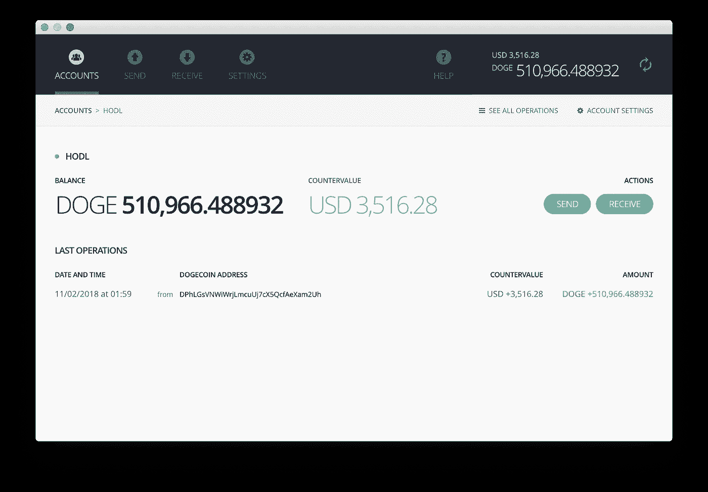

## 🔑⚡近地天体(34/50)

尼奥，气体

NEO 没有小数位，所以你只能存储或转移完整的硬币，尽管你可以在交易所购买零头。

莱杰纳米 S + [霓虹](http://neonwallet.com/)商店。

在 [Neoscan](https://neoscan.io/) 或 [Neo Tracker](https://neotracker.io/) 上探索。

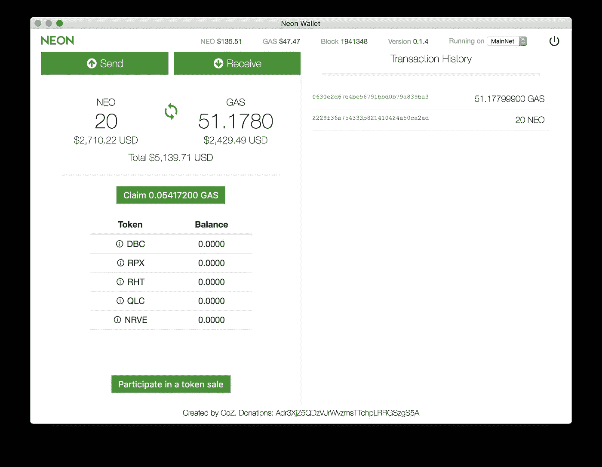

## 🗝⛓·卡尔达诺(35/50)

自动数据采集（Automaticdataacquisitions）

存放在[代达罗斯](https://daedaluswallet.io/)上，当被支撑时移动到大横杆 Nano S [上。根据](https://trello.com/c/rEK3saDK/71-cardano-support) [Cardano 路线图](https://cardanoroadmap.com)，轻客户端已有 20%准备就绪。

在[卡达诺探险家](https://cardanoexplorer.com/)上探索。

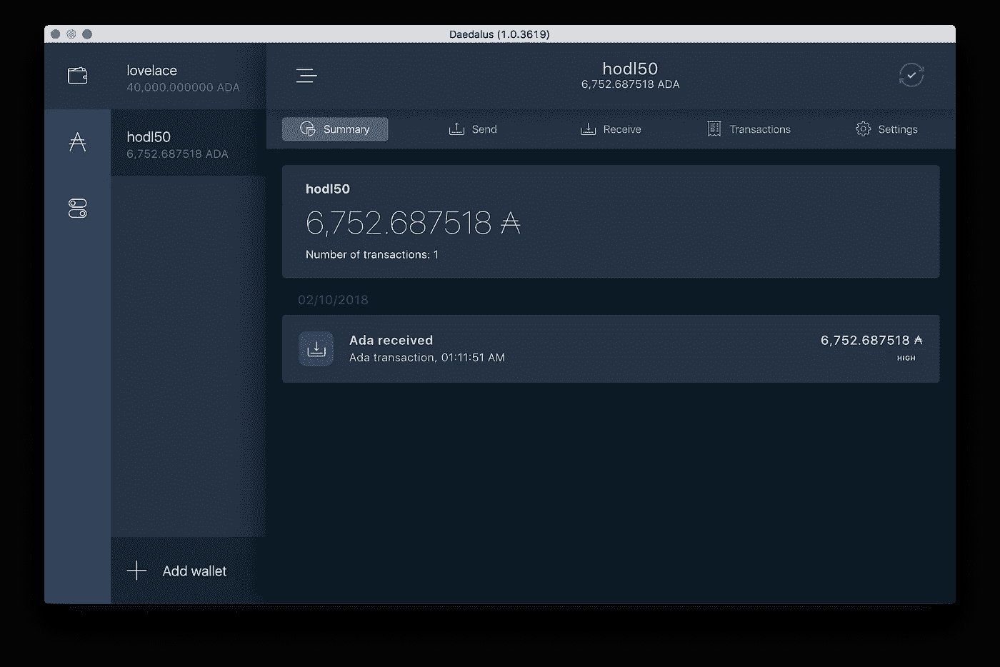

## 🗝⚡比特股份公司(36/50)

防弹少年团

在 [OpenLedger](https://bitshares.openledger.info/) 上注册，选择 brainkey 模型并备份您的种子。

探索[密码新鲜度](http://cryptofresh.com/)。

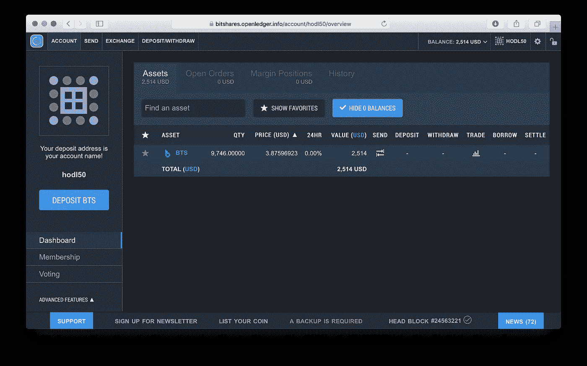

## 🔑⚡方舟(37/50)

避难所

存储在账本上 Nano S + [方舟桌面钱包](https://github.com/ArkEcosystem/ark-desktop/releases)。

在[方舟浏览器](https://explorer.ark.io/)上探索。

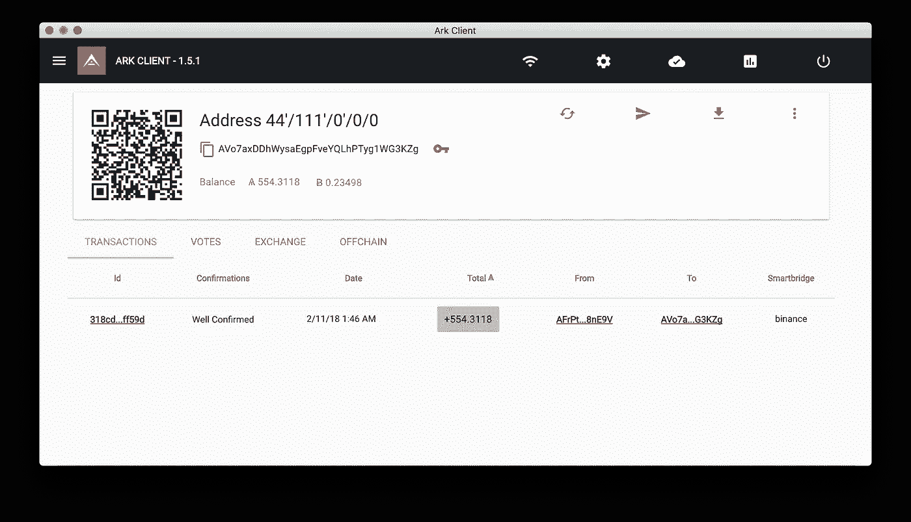

## 🔑⚡波纹(38/50)

XRP

存储在分类帐 Nano S+ [分类帐钱包波纹](https://www.ledgerwallet.com/apps/ripple)。

在[波纹图](https://xrpcharts.ripple.com/)和[位图](https://bithomp.com/)上探索。

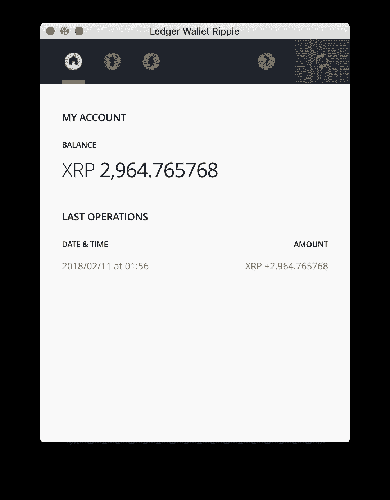

## 🗝⚡·利斯克(39/50)

LSK

存储在 [Lisk Nano](https://lisk.io/download) 上。

在 [Lisk Explorer](https://explorer.lisk.io/) 上探索。

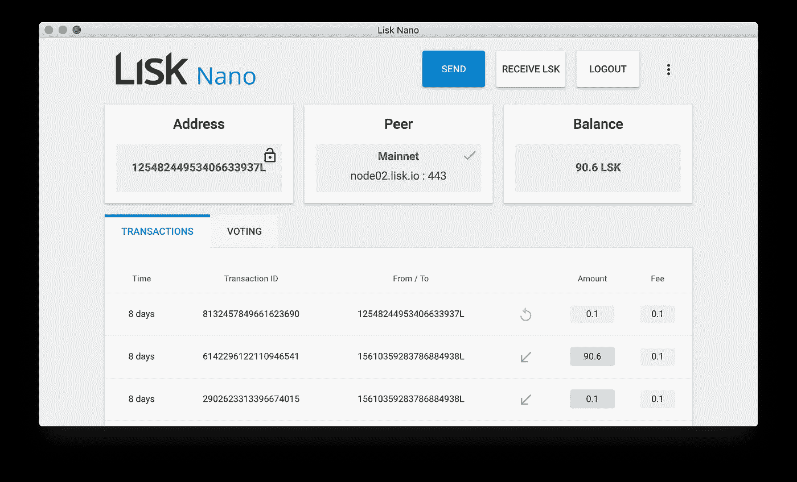

## 🗝⚡·内姆(40/50)

XEM

在 [NEM 纳米钱包](https://nem.io/downloads/)上存储。

探索我们的 NEM 探险家。


## 🔑⚡·斯特勒(41/50)

XLM

存储在分类帐 Nano S + [恒星帐户查看器](https://www.stellar.org/account-viewer/#!/)。

探索[恒星链](https://stellarchain.io/)。

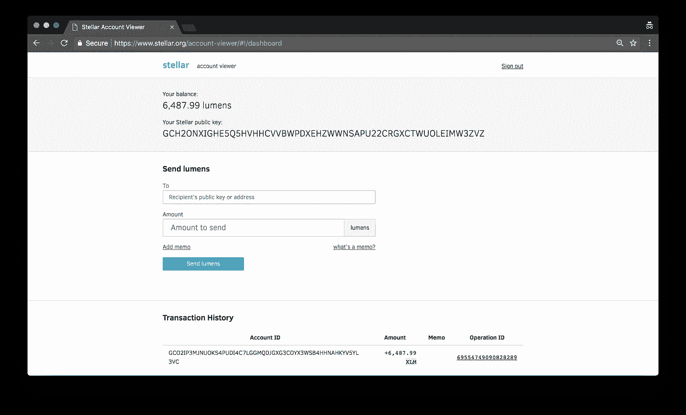

## 🗝⛓热情(42/50)

ARDR

储存在[热情钱包](https://www.jelurida.com/)中。还有一个[轻便钱包](https://wallet.ardor.tools/)。

探索[热情工具](https://ardor.tools/account/ARDOR-SKSH-YBJL-KP62-9ZDJ6)。

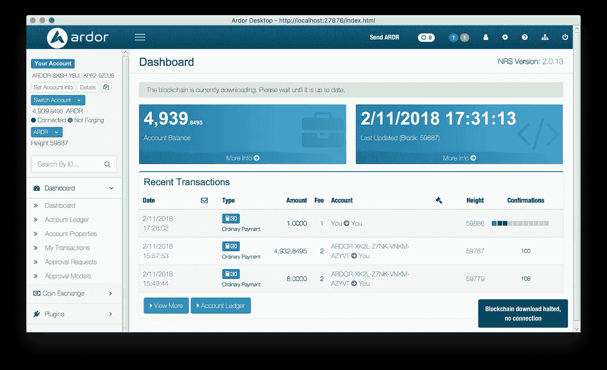

## 🗝⛓法令(43/50)

DCR

存储在[命令](https://github.com/decred/decred-binaries/releases)上。注意[大横杆支撑](https://trello.com/c/E8jasA61/63-decred-support)。

在[上探索被授权的探索者](https://mainnet.decred.org/)。

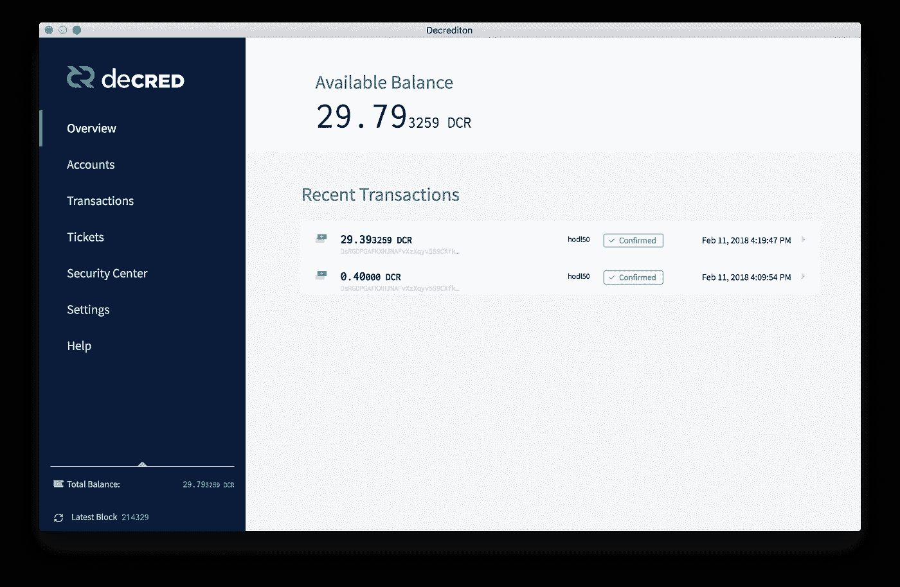

## 🗝⚡波浪(44/50)

志愿紧急服役妇女队

储存在[波浪钱包](https://waveswallet.io/)上。

探索上[波去](http://www.wavesgo.com/)。

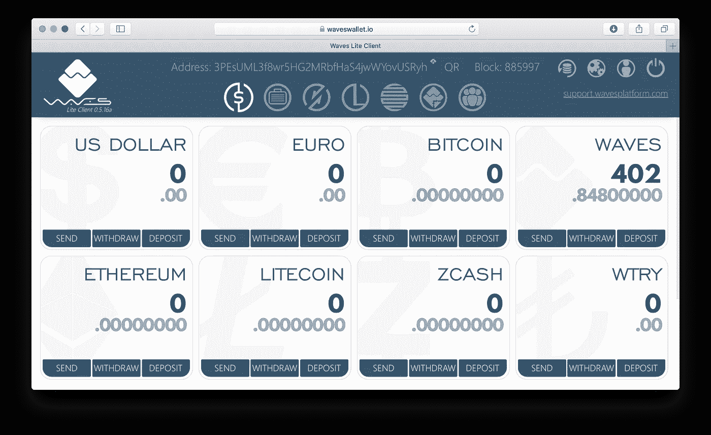

## 🗝⚡纳米(45/50)

XRB

唯一的选择是基于网络的纳米钱包。在撰写本文时，没有可用的桌面或移动应用程序。

在[纳米电极](https://www.nanode.co/)上探索。

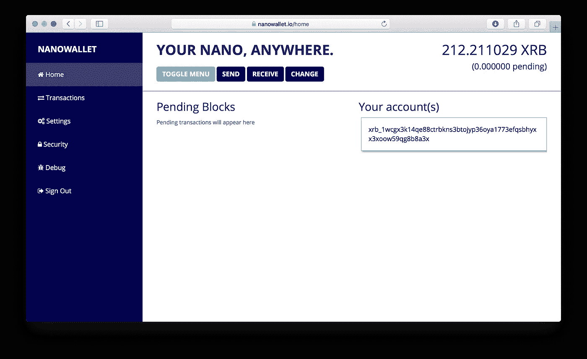

## 🗝⛓新航(46/50)

希雅·凯特·伊索贝尔·富勒

存储在 [Sia UI](https://sia.tech/get-started) 上。

在 [Sia Explorer](https://explore.sia.tech/) 上探索。

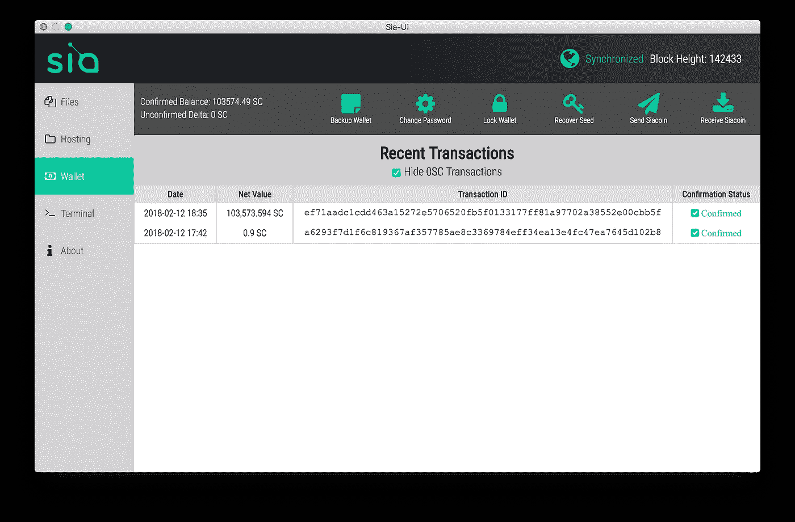

## 🗝⚡·奥塔(47/50)

米欧塔

存储在 [IOTA 轻型钱包](https://github.com/iotaledger/wallet/releases)上。

探索[上的纠结](https://thetangle.org/)。

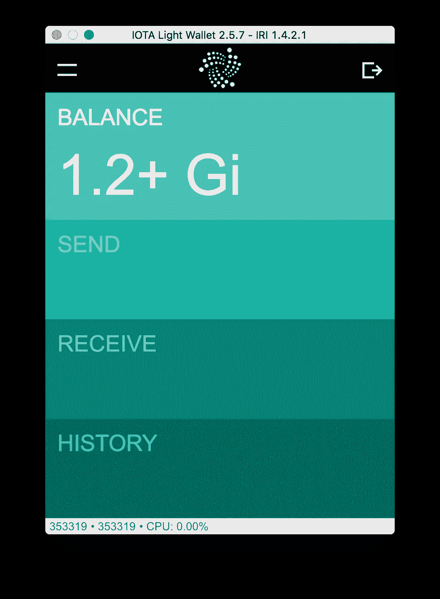

## 🗝⚡边缘(48/50)

XVG

在 [Electrum-XVG](https://vergecurrency.com/) 上存储。尽管它是流行的比特币钱包 Electrum 的一个分支，但它无法连接默认设置。我们不得不在 Reddit 上寻找解决方案。不惜一切代价避免这枚硬币。

在 [Verge 区块链](https://verge-blockchain.info/)上探索。

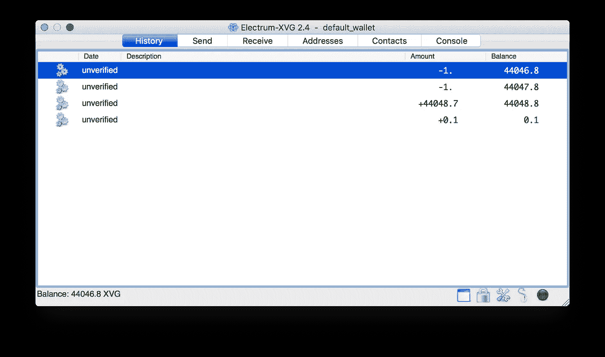

## 🗝⚡·斯蒂姆(49/50)

斯蒂姆

注册参加 [Steemit](https://signup.steemit.com/) 需要提供电子邮件和电话号码。我们尝试了几种组合，但都收不到邮件或短信。

如果这对你也不起作用，使用 [Anon Steem](https://anon.steem.network/) 注册并更改密钥。服务费为 0.0042 BTC 或 0.2 立特或 5 先令。

存储在 [Steemit](https://steemit.com/) 上。转入储蓄账户，获得额外保障，3 天提款期。

在 [Steemd](https://steemd.com/) 探索。

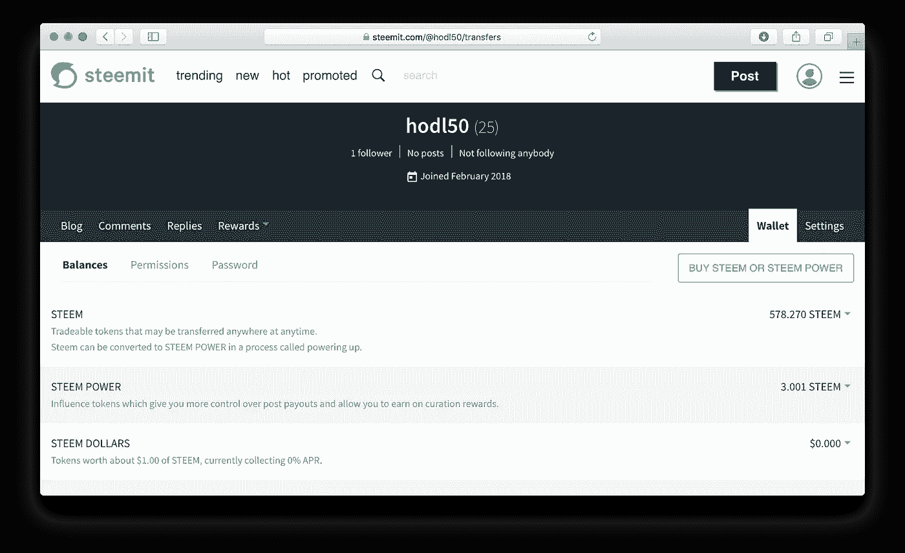

## 🗝⛓·莫内罗(50/50)

XMR

在[官方钱包](https://getmonero.org/downloads/)上存储。还有一款名为 [MyMonero](https://mymonero.com/) 的轻便钱包和一款名为 [Monerujo](https://monerujo.io/) 的安卓应用。我们最终使用命令行钱包，它允许冷存储和提取审计余额所需的密钥。莱杰团队正在研究 Monero 支持，但这可能永远不会发生，因为计算环签名对设备内的简单芯片来说可能太多了。

从头开始同步区块链可能需要一个多星期，你可以通过导入最新的快照来加快这个过程。下载这个 29 GB 的文件花了 6 分钟，在我们的设置中导入它花了大约 2 个小时。使用命令行工具之一:

```
monero-blockchain-import -i blockchain.raw --verify 0
```

在 [Monero Explorer](http://moneroexplorer.com/) 上探索。请注意，如果没有秘密视图密钥和交易密钥图像，您在这里看不到太多内容。

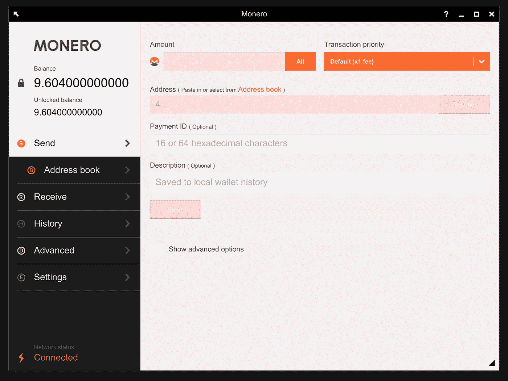

这就是我们解除你的负担。 [HODL50](https://hodl50.fund/) 是由前 50 名硬币支持的代币。在 Telegram 上加入我们[，在 Twitter](https://t.me/hodl50_chat) 上关注我们[。](https://twitter.com/hodl50)