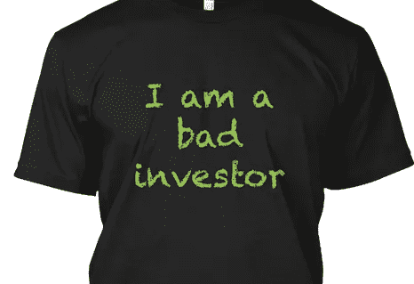

# 与一个糟糕投资者的成功互动

> 原文：<https://medium.com/hackernoon/a-successful-interaction-with-a-bad-investor-d9d036ac5128>

一个糟糕的投资者不会带着“**我是一个糟糕的投资者”的标签来。**“因此，你必须了解初创公司[的成长](https://hackernoon.com/tagged/growth)是如何发生的，以及启动一家[初创公司](https://hackernoon.com/tagged/startup)的整个过程:从创意到产品、联合创始人、发现客户的努力、确认客户和市场、将创意产品化的方法、新领域的线索和收购、董事会成员的选择等等。也不要忘记好的和坏的文化、诚信和其他价值观。

You can only tell who are they when you evaluate their experience and references – this is what a good investor would do for you too.

可悲的现实是，如果不了解游戏规则，实际上是不可能提升的:想法、产品、市场、投资加速和风险系统等等。

你对这些方面了解得越多，你就越能发现和评估你的同龄人。例如，如果你遇到了一位食品行业的投资者，如果她确实提出投资你的新社交媒体应用，那么你很可能找错了人，浪费了你的时间。

当然，也可能有例外；但是不要指望例外最终会自己出现。当马克·安德森(A16Z)被问到“[如果你是创始人，第一次融资](https://www.youtube.com/watch?v=NEOR0AJsziE&feature=youtu.be&t=14m11s)，你怎么知道一个投资人是不是真的好。”[ [M](https://youtu.be/NEOR0AJsziE?t=14m11s) arc @ YCombinator，2016， [14m11s](https://youtu.be/NEOR0AJsziE?t=14m11s) ]他用直 5 分爆技回复:

1.  参考文献，
2.  参考文献，
3.  参考文献，
4.  参考文献，
5.  [和]参考

因此，在这个特殊的时刻结束:如果你想要聪明的钱，这意味着集中精力组装一个聪明的反馈系统；确保你没有产生幻觉，不要陷入试图建立一个自我验证系统的浪漫陷阱，这很可能会在你的未来暴露自己。

Y Combinator，2016，马克·安德森在创业学校 SV 2016，发表于 2016 年 10 月 25 日【视频】[https://www.youtube.com/watch?v=NEOR0AJsziE](https://www.youtube.com/watch?v=NEOR0AJsziE)