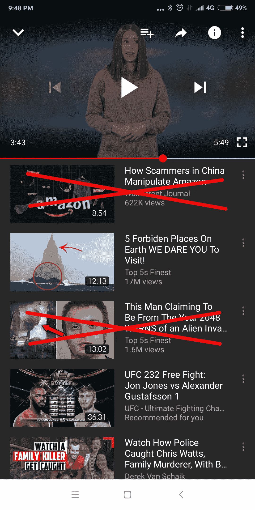

# 净化 YouTube 推荐和搜索结果的建议

> 原文：<https://medium.com/hackernoon/a-suggestion-for-sanitizing-youtube-recommendations-and-search-results-a16176f0d9d0>

可恶的 YouTube 视频或虚假的搜索结果是争议的来源，这种争议已经蔓延到国会，正如谷歌首席执行官桑德尔·皮帅不得不处理的粗暴问题所见证的。自动 YouTube 提要已经变得如此正常(默认自动播放设置为“开”)，以至于这是许多人最喜欢的消遣，以保持观看提要。我儿子不停地看 YouTube 视频，完全不知道视频来源有多可信。人们不能低估这些未经证实的信息对易受骗的年轻人和易受影响的人的影响。谷歌肯定会抓住这个有可能引发暴力的大问题。华盛顿披萨店枪击案就是一个例子，另一个更暴力的事件可能会让谷歌(和 Alphabet)成为政府或法院的靶子。谷歌对国会议员提问的回答听起来并不令人信服。如果发生了严重的事情，将责任归咎于算法并不能免除谷歌的责任。他们的职责是确保算法不会让虚假、可恶的信息出现在孩子的手机上(或任何人的手机上)。

谷歌给出的解释大致符合这些思路，

问题的严重性:正如皮查伊所说，每天大约有 600 万个视频被上传。无论从哪个角度看，把好的和坏的区分开来都是一项艰巨的任务。

我们已经在工作了:据说谷歌雇佣了数千名工程师来审查视频中的仇恨内容、成人内容等。他们还不断更新检测虚假内容的算法。

区分对错的难度:虽然可以配置一个算法来识别骂人的话、仇恨的话等等。一个算法如何知道一个人谈论一个导致 911 的政府阴谋，是在说废话还是事实？

毫无疑问，这是一个巨大而复杂的问题，谷歌或许正在为此投入最大努力。

尽管如此，作为一个狂热的 YouTuber 用户，如果能有所帮助的话，这里是我对这个问题的两点看法。

我的想法大致如下

-我们的目标不是阻止虚假视频，而是防止它们进入推荐列表、搜索结果和订阅列表(我们称之为订阅源)

-接受极端主义观点、阴谋论倾向于被群体创造和追随的假设。如果有办法检测到这些群组，那么他们后面的所有视频都可以标记为不可感知(不能进入 feeds)。

-一旦检测到此类群体，对他们的视频进行抽样审查就足以标记他们的所有视频，从而减少工作内容。

-使用众包来验证来自该组的样本并对该组进行评级

-使用协同过滤(一种已经在推荐系统中使用的方法)来实现上述目的(稍后将详细解释这个想法)。

**推荐系统**

这里有一篇关于谷歌如何使用深度学习架构进行推荐的论文。谷歌使用两个阶段的过程，首先确定可能的候选视频，然后得出一个带有排名的视频列表，显示给用户。这些过程广泛使用谷歌收集的用户交互信息，包括视频观看时间、喜欢/不喜欢的反馈、评论等。它似乎做了一项彻底的工作，考虑了许多因素，如视频的新鲜度、用户统计数据等。以确保推荐引起观众的注意。正如谷歌在他们的[网站](https://creatoracademy.youtube.com/page/lesson/discovery?cid=get-discovered&hl=en)中所说，“YouTube 的搜索和发现系统有两个目标:帮助观众找到他们想看的视频，并最大化长期观众参与度和满意度”。重点是获得观众会看、会喜欢的视频，这将使观众继续观看 YouTube 视频。事实上，深度学习模型被训练成模拟实际的观看模式。它被输入数百万个过去客户使用数据的例子，并被训练来正确预测下一块手表。

谷歌也有适当的算法来检测视频脚本中不可接受的内容(根据他们公布的政策)，并将它们标记为罢工。视频上传者还有人工验证过程和申诉过程。如果罢工次数超过一定数量，视频就会被屏蔽。看起来他们有不同的推荐算法和内容验证算法。这里建议的想法是将这两者结合起来。

许多推荐系统使用的方法之一是所谓的协同过滤(CF ),上面 Google 提到它用于候选人选择。这是一个基于“不同的人的评价(比如说歌曲)在过去匹配的概念，在未来很可能再次匹配”的过程。例如，假设你通过乐队 X 观看歌曲 A，也通过乐队 y 观看宋立科 B。然后，该算法将寻找另一个具有相同观点/喜欢历史的人(比如个人 K ),并提取他喜欢的歌曲 C，并显示在你的订阅源中。如果你观看这首歌，那么这种模式将得到加强，你将获得更多 k 观看的视频。它寻找与你口味相似的人群，并推荐他们喜欢的商品(你还没有看过)。根据推荐系统手册，Springer (2015)，协同过滤被认为是推荐系统中最流行和最广泛实施的技术。

CF 的结果是相似口味的人聚在一起。例如，在谷歌或亚马逊的数据库中，你可能属于一个欣赏硬摇滚音乐、古典音乐或西部乡村音乐的群体，这取决于你的品味。不知不觉中，你和看到/喜欢你喜欢的东西的人在一起。有共同兴趣、激情、想法的团体，积极的或消极的。正是这一特性可以被谷歌用来发现那些有仇恨思想的人的视频，因为他们也会形成一个群体。

因此，如果有一种方法来识别这个群体，那么属于这个群体的整个类别的视频都可以被标记为不可搜索、不可感知。

**轮廓分组**

推荐系统使用协同过滤从大型语料库中过滤出可能的推荐。这里建议使用它来提取具有共同兴趣的用户简档的组。让我们称之为过程概要分组。PG 流程将简单地将用户映射到用户喜欢、评论或积极参与的视频(用技术术语来说)。它将识别喜欢视频的用户群。这样就会生成一个映射的 Groups-Videos 列表。这个组的成员专门观看视频的越多，映射就越强。它没有任何标签来定义它。谷歌有自己的标签来定义视频属于哪个类别(基于用户描述，它称之为元数据)，它在搜索中使用，但这里不需要。请记住，本练习的目的是识别产生有害视频的潜在群体。因此，唯一需要标记的是群组视频的虚假性。并且这将仅在检测到虚假视频之后发生。

因此，为了识别视频是否是伪造的，建议采用两阶段过程。

首先，除了喜欢/不喜欢按钮之外，应该在视频下方提供一个虚假按钮，通过按下该按钮，用户可以判断该视频是否不可接受，是否应该删除。这本身并不能保证视频是伪造的。

只有当用户发现视频是伪造的，第二阶段才会发生。这一阶段包括人工审查。审查，这是建议可以是一个众包的事情，在那里审查者发送视频评级。一旦评论者给出负面评价，该群组(和视频)就会被标记。因此，负面评价不仅适用于主题视频，还适用于映射到该用户所属群组的所有视频。如果该组的评级低于规定值，则该组中的所有视频将被标记为不可搜索，甚至对于订户来说也是不可感知的。它们不会出现在搜索或推荐源中。

因此，组标记是通过采样过程完成的，与检查每个视频所需的时间相比，这将大大减少处理时间。显然，这一过程将遭受所谓的冷启动问题，在这种情况下，只有在生成一些评论之后才会出现组定义，因此，糟糕的视频最初会出现在提要中。但是，我们再次相信，虚假视频往往是由某一类人制作的。因此，经过一段时间，谷歌应该能够了解有评级历史的群体，应该能够发现恶意视频。

然而，被标记的视频将出现在 YouTube 上，只能通过其正确的地址或链接访问，这将大大减少无意观看的机会。这是与目前屏蔽视频的做法的一个重要区别。唯一能做的就是让它远离非预期接收者。这也包括订阅源，因为 YouTube 不能成为一个传播虚假数据的论坛，即使是对订阅者。

考虑到每分钟上传的视频数量，人工审查可能是一项艰巨的任务。但是一旦一个群体被确认，如果来自该群体的新视频得到虚假的打击，第二阶段可以被取消。因此，经过一段时间后，需要审查的次数可能会减少。尽管如此，还是建议从这个神奇的平台——维基百科获得灵感，进行众包验证。尽管维基有其局限性，但它提供了相当真实的信息，尽管事实上它的编辑没有得到任何保证信息准确性的激励。这是对支持正义和促进真理的人类固有本性的奇妙展示。谷歌可以找到很多人愿意支持这种验证视频内容的活动。他们今天不这样做，或者可能没有看到他们这样做，因为每天喷出的视频数量惊人，这使得一些人甚至很难找到视频来提供反馈。有了一个合适的审查系统，谷歌可以开发具有绩效评级的审查人员，并根据专业知识的主题对他们进行分类。他们可以被发送视频审查，并提供补偿。为了确保消除人口统计、政治派别的影响，评审者可以分布在世界各地。

分组行动的主要影响之一是，它将减少要验证的视频数量。视频的样本集应该足以表征该组及其所有映射的视频。例如，一个右翼反犹太团体可以通过少量的视频来评估其内容，所有只被这个团体喜欢的视频都可以被标记为不可触摸，不可搜索。为了确保群组看到的好视频不会被负面标记，如果群组成员喜欢的视频也被其他群组喜欢，则它没有资格被负面标记。整个过程可以由一个匿名算法控制，所以没有偏见。个人审查者只会审查视频，不知道它属于哪个组，对算法采取的行动没有任何发言权。

这个过程可以成为 YouTube 视频链接和联网的框架。它还可以扩展到评价视频的真实性、赞同度等。从长远来看，这也可能使用户受益，并使 YouTube 成为可信的信息来源。这甚至可能有商业利益。

这将是一项艰巨的任务，无论如何，要发现并惩罚含有不可接受内容的视频，同时又不冒犯该频道的大量粉丝，正如本文[所示](https://www.newsweek.com/youtube-censorship-bots-mumkey-jones-algorithm-1265776)。但如果谷歌想避免仇恨视频导致暴力和生命损失，这是它必须付出的代价。

感谢阅读！