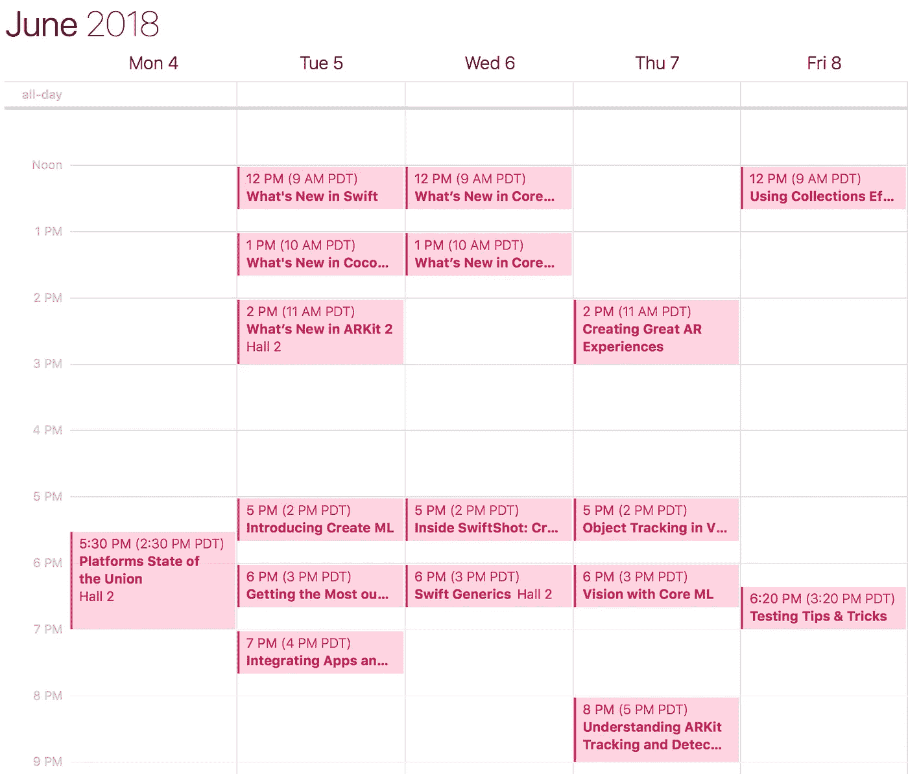
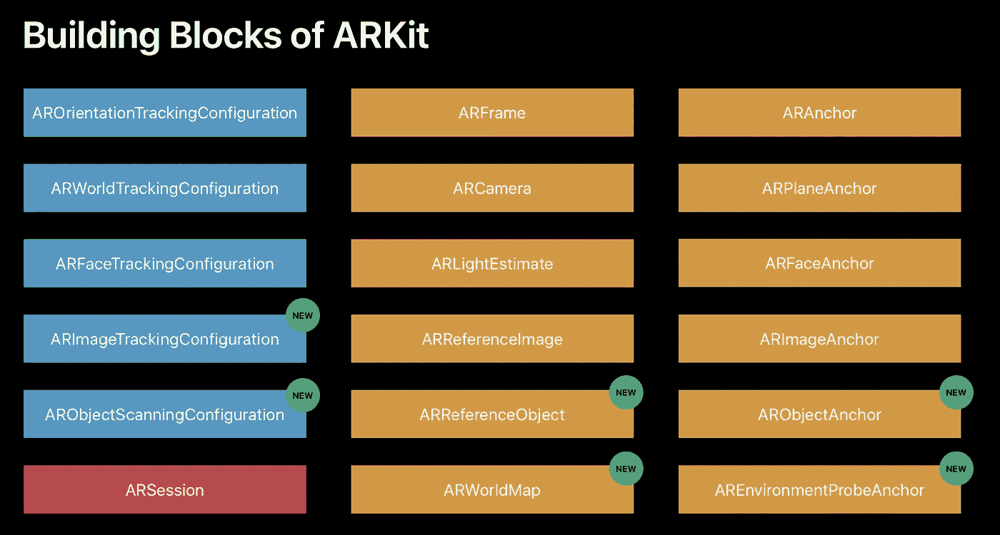
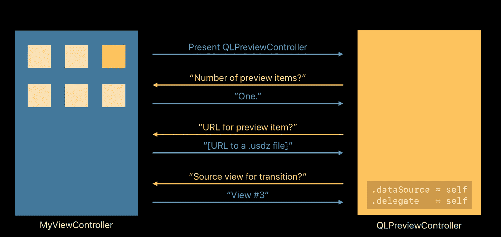
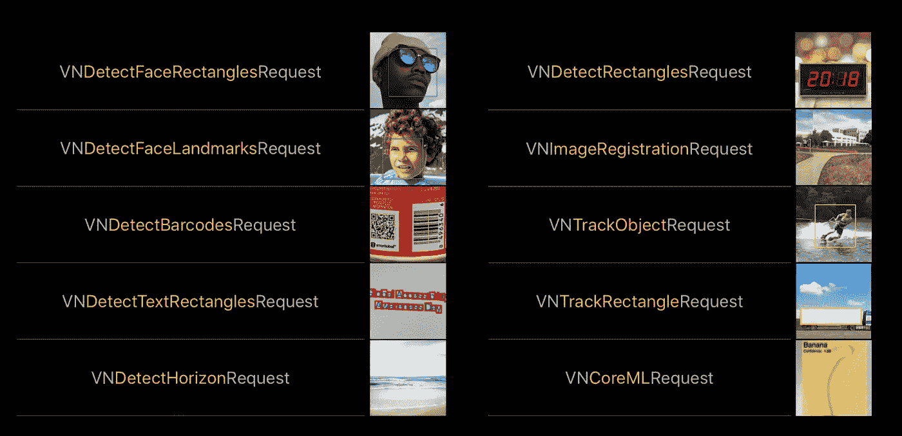
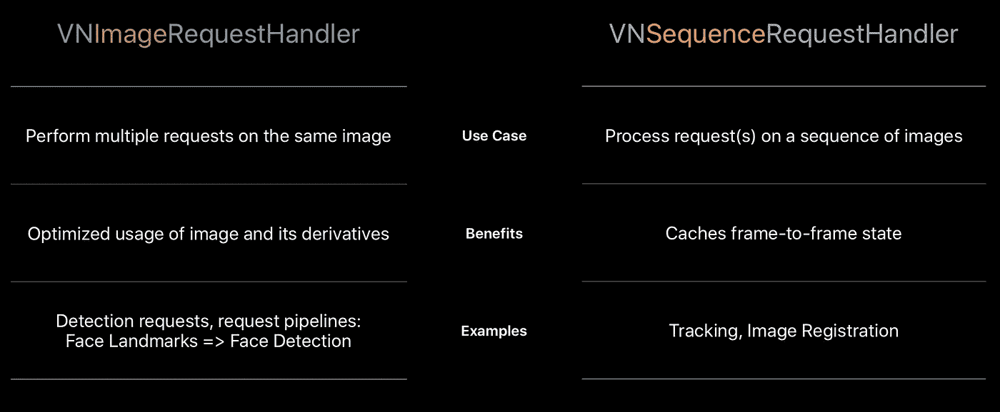

# WWDC 2018 增强现实综述

> 原文：<https://medium.com/hackernoon/a-summary-of-ar-at-wwdc-2018-1a01fe05a343>

今年夏天，我已经开始和一个朋友一起构建一个 AR &机器学习原型。我们正在观察这项技术是否适合我们想要开发的应用程序。

作为知识积累的一部分，我决定从今年最近的 WWDC 中收集一份清单，列出每次 AR 相关会议的要点。我发现 WWDC 有时信息超载，有时我对一系列会议所关注的领域有点支离破碎。

My essential WWDC sessions that I had to see live.

基于苹果的网站和应用来策划会议并不容易。值得庆幸的是，它们让 WWDC 应用程序与你的日历集成变得很容易，所以如果你像我一样喜欢给自己设置提醒，你可以这样做。

然而，一个头衔是不够的。我只需要一小组要点来总结每节课的内容。所以我自己也在尝试这样做，目的是让我更容易找到将来可能需要恢复的内容，并希望帮助其他人也这样做。

这将减少对 AR 等新内容的*公告*的关注，而更多地关注每次会谈的内容细分。以下是按会议日期排列的。

# [站台国情咨文](https://developer.apple.com/videos/play/wwdc2018/102/)

*将在 WWDC 涵盖的 AR 相关概念的总结，以及对 USDZ 的介绍。*

*   由于该会议是面向开发人员的一般主题演讲，所以直到大约 *1:21:45* *小时*才提到 AR。
*   USDZ 的第一次展示是在这次会议上——新的“通用”AR 格式。它提到了 USDZ 的一些内容创建工具和代码格式。
*   Adobe 推出他们的 USDZ 平台 **Project Aero** 。
*   给出了关于 ARKit 2 的后续会议将要涵盖的主题的概述——改进的**面部跟踪**、**环境纹理**(使对象看起来更真实)、**图像检测**、 **3D 对象检测**(这在一定程度上已经在 iOS 10 的视觉框架中，但对象跟踪看起来有待改进)、**保存和共享** AR 地图。

# [ARKit 2 的新功能](https://developer.apple.com/videos/play/wwdc2018/602/)

很好地概括了 ARkit 所做的大部分工作，新特性的应用程序演示，以及一些代码示例。

*   从 ARKit 的概述开始，展示了一些演示应用。基础是 **ARAnchor** 对象，通过每个 **ARFrame** 以高达 60 FPS 的频率传送。
*   解释了 ARWorldMap 的重要性，以及如何保持映射。
*   ARFrame 上的 **worldMappingStatus** 变量将指示映射的准确性。
*   这是一个简单的演示程序，演示了与环境相匹配的真实纹理，可以控制你的增强现实物体上的光照、阴影、反射等。
*   跟踪真实世界图像的演示。图像目标检测的扩展。这是通过 ARFrame 更新用 **ARImageAnchor** 完成的。
*   3D 真实世界物体上的物体检测(与 2D 图像上的图像检测和跟踪相反)。同样，这是通过 ARFrame 更新完成的，但使用了新的 **ARObjectAnchor** 。
*   通过 **ARFaceAnchor** 增强面部跟踪，包括苹果非常自豪的舌头跟踪成就。

Screenshot from Apple’s WWDC 2018.

# [将应用和内容与 AR Quick Look 集成](https://developer.apple.com/videos/play/wwdc2018/603/)

*深入探讨 iOS 中的一项新功能，该功能提供了一种从 USDZ 文件中预览任何 AR 对象的方法。*

*   有一个很棒的序列图(我希望更多的会议有这些！)用于预览 USDZ 对象，其中 **QLPreviewController** 起核心作用。

Screenshot from Apple’s WWDC 2018.

*   对于 web 开发人员，它涵盖了如何在 Safari 中预览 USDZ 对象的 HTML 示例。
*   然后，它将深入探讨如何*创建*实际的 USDZ 对象，并提供更多关于新的 AR 纹理功能的示例。
*   还有一个关于如何优化文件以减小文件大小的快速概述，以及组成 USDZ 格式的文件的分类。

# [Inside SwiftShot:创建 AR 游戏](https://developer.apple.com/videos/play/wwdc2018/605/)

*涵盖了世界地图共享、网络、如何构建 AR 游戏的物理学，以及一些设计见解(我的游戏开发经验有限，所以下面我会尽我所能)。*

*   设计 AR 游戏时要记住的要点，比如“鼓励”用户慢慢移动设备进行世界地图绘制！
*   它展示了图像和物体检测、世界地图共享和 iBeacons 在游戏中的使用。
*   将 **ARKit** 与 **SceneKit** 和 **Metal** 集成在一起，包括物理数据在每一个之间的转换——位置、速度和方向。
*   使用 **BitStreamCodable** 协议增强性能。
*   看看音频是如何融入到游戏中的。

# [创造卓越的 AR 体验](https://developer.apple.com/videos/play/wwdc2018/805/)

*最佳实践主要来自 UX &设计的角度(本课程中没有代码示例)。*

*   如果你在产品设计和对用户的同情方面需要帮助，这可能是有用的。
*   他们强调在场景之间使用过渡的重要性。
*   为什么 AR 是触摸和运动的特殊结合。
*   他们建议，最小的电池影响应该是一个巨大的焦点！这是一个挑战，因为他们建议以 60 渲染 FPS 以避免延迟。
*   有一个创建 AR 壁炉的冗长演示，有复杂的纹理，等等。它看起来很棒，但不幸的是没有伴随演示的编码样本。

# [视觉中的物体跟踪](https://developer.apple.com/videos/play/wwdc2018/716/)

*虽然技术上不是 AR，但 Vision 框架(iOS 11 中的新功能)与 iOS 中的 AR 和机器学习密切相关。*

*   在准确描述*如何使用*视觉方面，它似乎比 2017 年 WWDC 奥运会更详细。他们将解释分为请求( **VNRequest** )、请求处理程序( **VNImageRequestHandler** 或**VNSequenceRequestHandler**)和结果( **VNObservation** )。
*   不同类型请求的分类以及它们的用途。

*   请求处理程序的分解，何时使用它们，以及观察中包含的内容。

*   性能优化，以及将您的请求放在哪里。
*   涵盖了 iOS 12 的新增功能，包括更好的人脸**检测**，人脸**追踪**。区分人脸检测和跟踪，因为它们*与* *不同*。

# [了解 ARKit 跟踪和检测](https://developer.apple.com/videos/play/wwdc2018/610/)

对所有主要 AR 概念的全面概述。

*   这不仅是对 iOS 上 AR 的一个很好的介绍，也是对 AR 的一个很好的介绍，当 ARKit 首次推出时，它应该是 2017 年会议的一部分。亡羊捕牢，未为晚也。如果你只打算看一节，那就看这一节吧！
*   它概括了 ARKit 的主要特性— **定向、世界跟踪、**和**平面检测**，并通过编码示例深入演示了所有这些特性。
*   然后，它演示了 ARKit 2 的新功能— **共享世界映射、图像跟踪**和**对象检测**(这些功能已在上面概述的 Vision 框架中提供，但现在也可以在 ARKit 中访问)。
*   很好的解释了 AR 的一个核心原理**视觉惯性里程计**。除了深入其背后的实际物理方程，这应该会让你对 VIO 有一个很好的理解。

所以总而言之，2018 年 AR 上有 5 场优质的场次！7 如果你包括国情咨文，和有共同概念的远景会议。苹果可能还没有发布专用的增强现实设备，但自从 2017 年推出增强现实框架以来，他们真的提升了游戏水平。

问题是，如果苹果真的在未来 2 年、5 年甚至 10 年内发布 AR 设备，这些概念和框架将成为在任何未来设备上构建 AR 应用的基础。

现在让我们自己熟悉这些概念，会让我们更好地为苹果(或谷歌更好的 Glass，或 Snap，或其他人)必然会创造的未来平台和设备做好准备。