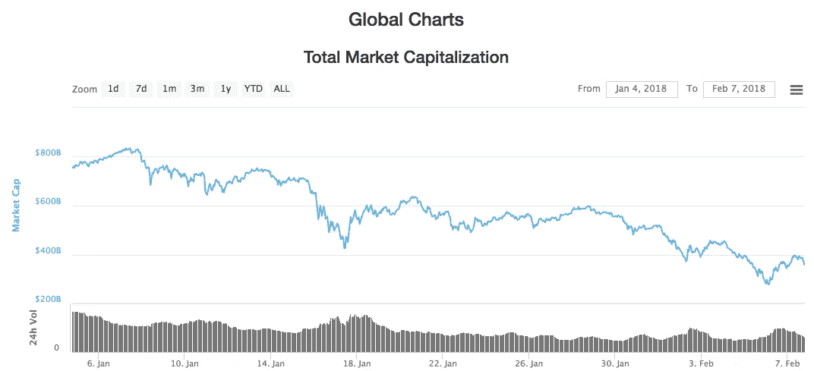
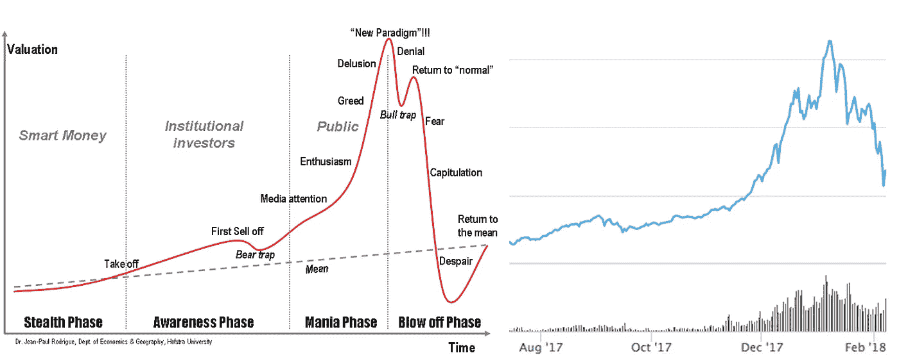
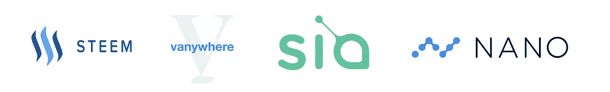

# 在混乱的密码市场中赢得胜利的令人惊讶的方法

> 原文：<https://medium.com/hackernoon/a-surprising-way-to-win-in-a-crashing-crypto-market-7515fbbc85f>

过去的几个月就像在危险的速成班上坐过山车。

周二，总市值触及 60 天低点。从 2018 年 1 月 7 日 8320 亿美元的峰值下跌至微不足道的 2750 亿美元。

如果你进一步缩小，趋势实际上会变得更糟。

> 每个人心中的疑问——*这是崩盘吗？*

Phases of a bubble compared to total market capitalization

更糟糕的是，不仅仅是 crypto 像石头一样落下。周一，T4 股市下跌了 1175 点。这是自 2011 年以来股市表现最糟糕的一天。

有人猜测是什么导致了 crypto 的下跌，但事实是，在同一天，股市下跌了 4.6%，crypto 下跌了 15.2%。随着股市下跌，人们开始撤出风险更高的投资。

如果说投资者的信心导致了狂热，那么投资者的紧张则终结了狂热。

为了解决这个问题，我们挖掘历史数据来寻找模式。纵观互联网泡沫[、房地产危机](https://en.wikipedia.org/wiki/Dot-com_bubble)[、中国股市泡沫](https://en.wikipedia.org/wiki/Subprime_mortgage_crisis)和，有一个趋势引人注目。具体来说，是哪些公司在互联网狂潮中幸存了下来。

# dotcom 发生了什么？

虽然这不是一个完美的比较，但互联网确实为加密的未来提供了一些预测。

在网络泡沫破裂期间，数千家公司和数万亿美元在几个月内化为乌有。像 pets.com 这样的公司烧掉了 1.47 亿美元，却一无所有。然而，尽管金融危机爆发，一些公司幸存了下来。那些成功的公司锁定了市场份额，雇佣了最好的人才，成长为今天的巨头。

我们分析了在互联网时代幸存下来的顶级公司，这种模式非常明显。

1.  **帮助人们赚钱**
2.  **帮助人们省钱**

这很直观。想象一下，你在一次市场崩盘中损失了所有的钱。你会额外花钱买更方便的化妆品和宠物玩具吗？

不。你要努力赚钱来弥补你的损失。你要去寻找交易。而提供这种服务的公司正是那些度过了经济衰退的公司。

# 制作并保存

易趣成为网上相当于车库拍卖的东西。帮助人们出售他们的新的和二手商品，并获得优惠。

[亚马逊](https://www.amazon.com)坚持不懈地致力于降低成本。通过对大多数书籍提供 10-30%的折扣，将这些节省的费用转移给用户。他们还推出了在线拍卖，并开始向网站所有者支付在他们网站上销售的产品的佣金。

T4 的 Priceline 和 Expedia 都加倍努力帮助人们节省旅行费用。

那些为现金交易提供便利的公司呢:etoys.com、webvan(杂货)、boo(服装)、beautyjungle(化妆品)？不幸的是，他们的故事没有好的结局。

# 为什么这很重要？

因为在崩溃期间，亚马逊的股票从 107 美元跌到了 7 美元！Priceline 下降了 99%！

以这些价格买入的投资者将获得 20，000%以上的净回报。

> 如果 crypto 遵循这一趋势，那么紧迫的问题就变成了—*crypto 中有哪些公司？*

我们翻遍了所有的硬币来寻找符合模型的。

## [**【Steem】**](https://steem.io/)

帮助出版商赚钱的代币。流行的应用程序 [Steemit](https://steemit.com) (使用 STEEM)，就像媒体一样，除了内容创作者得到报酬。

当事情发生时，内容创作者正在选择发布到哪个平台，他们会选择赚 0 美元还是 STEEM 已经支付的 2200 万美元的一小部分？在 Steemit 上拥有一个最高职位通常能带来 1500-2000 美元的收入。对于你本来打算免费做的事情来说，这已经不错了。

假设更多的网站和出版商采用 STEEM 令牌，这可能类似于 99 年网站所有者开始推销亚马逊产品收取佣金的情况。

## [**【范尼】**](http://vanywhere.com/)

Vanywhere 是一个自由职业者利用业余时间赚钱的市场。

想象一下一个厨师晚上有几个小时的空闲时间。他登录接听电话，用他的技能回答人们的问题。另一面是一位父亲，试图找出为什么他的 iPhone 和 Mac 之间似乎不能空投。他登录并拨打了一个电话，想找一个技术人员来回答他的简单问题。

他们的用户通过解决每个人都面临的令人沮丧的日常小问题来赚钱。成为技能者的过程 100%依赖于社区的认可，由于 Vanywhere 与量子区块链合作，它将能够扩展。

## [**【SIA】**](https://sia.tech/)

分散式文件存储。像 Dropbox，但使用区块链。降低存储费用，帮助用户通过托管文件赚钱。

在 [Sia](https://sia.tech/) 上存储 1tb 的成本只有 2 美元。相比之下，谷歌、Dropbox 和苹果每月收费 10 美元。它也是完全分散的，这将有助于扩展以满足需求。

通过为云存储创建一个市场，Sia 可以帮助人们在一个显然每个人现在和将来都需要的商品上赚钱和省钱。

## [**【纳诺】**](https://nano.org/en)

快速免费的数字货币。

虽然 Nano 作为一种支付方式有很多好处，但它们在崩溃后最大的优势是零交易费用。这为用户提供了省钱的机会，也帮助其他人以以前不可行的方式赚钱(微支付)。

这绝不是一份详尽的清单。如果你知道一些我们错过的伟大公司，请在下面的评论中描述它们。

这种模式会持续下去吗？现在很难说，但如果是这样的话——现在可能是挑选一些“特价”好硬币的好时机。

## 喜欢这篇文章吗？我们现在有电报信号组了！

我们发布**简单有效的交易信号**。所以你可以花更少的时间做技术分析，花更多的时间**得到结果。**
👉[https://t.me/coinandcrypto](http://telegram.coinandcrypto.com/medium)

