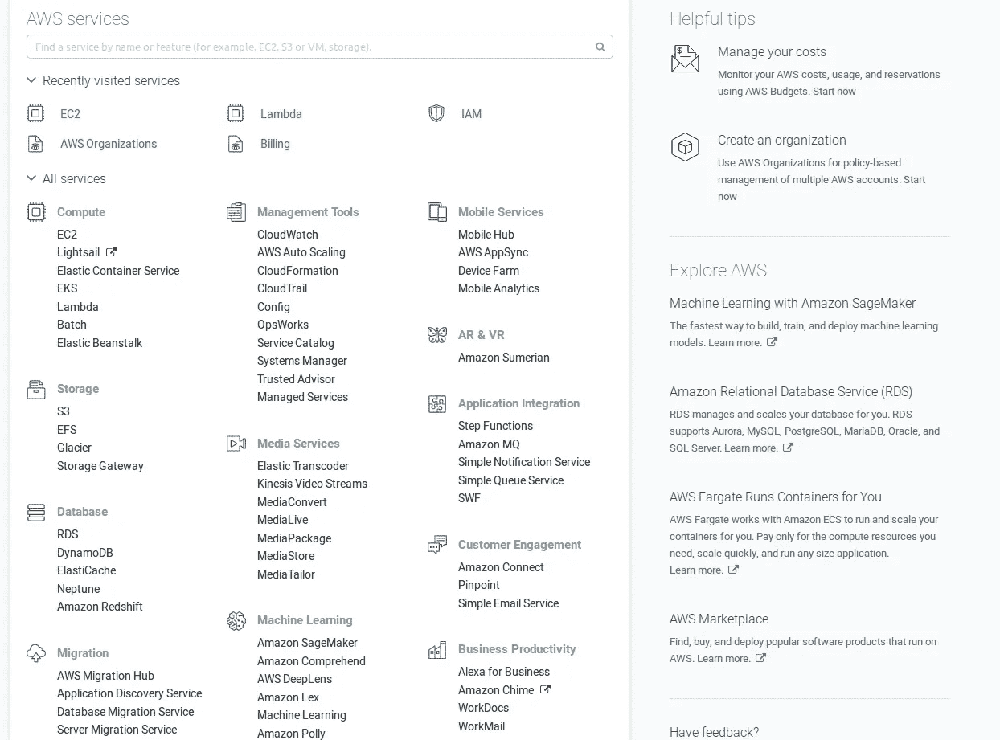
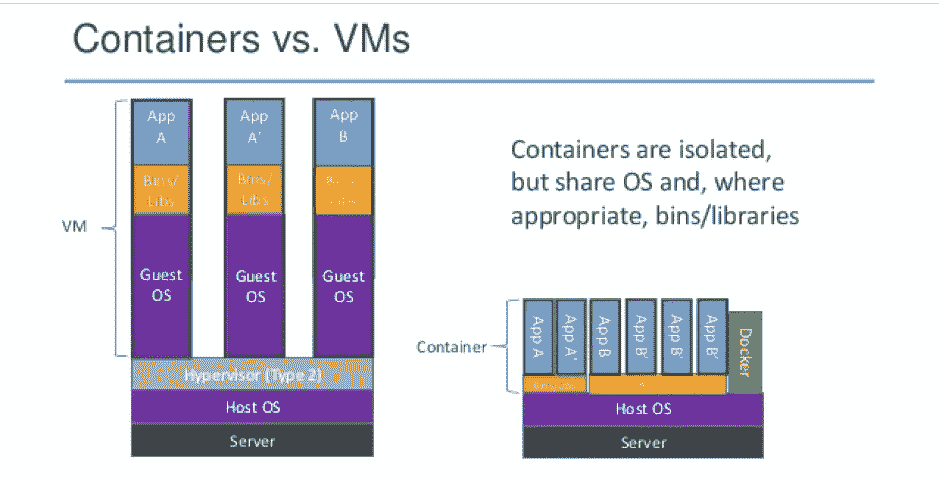
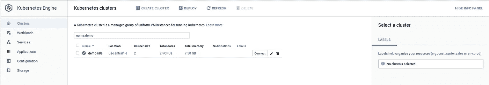
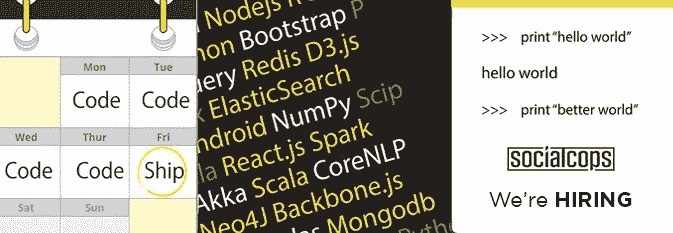

# 云、容器和 Kubernetes 的故事

> 原文：<https://medium.com/hackernoon/a-tale-of-cloud-containers-and-kubernetes-b6fb18edcfcd>

即使你没有参与过 Kubernetes 的工作，你也有可能至少听说过或读过它。它已经是有史以来最受欢迎的开源项目之一，并且仍在开发中。我们需要了解我们从何而来，才能体会到我们今天的处境。Kubernetes 也是如此。

*Photo by* [*frank mckenna*](https://unsplash.com/photos/tjX_sniNzgQ?utm_source=unsplash&utm_medium=referral&utm_content=creditCopyText) *on* [*Unsplash*](https://unsplash.com/search/photos/container?utm_source=unsplash&utm_medium=referral&utm_content=creditCopyText)

最近有人告诉我，‘无聊的基础设施现在变得有趣了’。在这种情况下,“无聊”是一个我不喜欢的词。但是我同意开发者社区在十多年前就在讨论基础设施和运营。看完这篇文章，你就会明白为什么会这样了。

我将概述使这种转变成为可能的发展，为什么你应该关心它们，以及 Kubernetes 适合在哪里。

# 巨石和金属

我很幸运在那个时代开始了软件开发，那时[云计算已经很普遍，AWS 部署也很规范。事实上，云资源的便利性是今天更多人选择软件开发的原因之一。](https://hackernoon.com/tagged/cloud)

在 20 世纪 90 年代和 21 世纪初，软件主要是作为大型代码库——单片——编写的，并使用专有硬件在内部部署。[负载平衡器](https://f5.com/glossary/load-balancer)，以其软件的形式被认为是昂贵的硬件。正如[乔希·埃文斯](https://www.linkedin.com/in/zen-tek/)在他关于网飞建筑的[深刻的演讲](https://www.youtube.com/watch?v=CZ3wIuvmHeM)中指出的，“试图在表格中增加一列是一个跨职能的大项目”。软件组件过去是紧密耦合的，硬件替换是困难的，水平可伸缩性甚至不是一件事情。如果你是一家服务公司，更新一个客户的软件意味着携带一个补丁并在现场进行更新。

缓解这些限制的努力，加上廉价的硬件和快速的互联网，将我们带入了一个云计算和开发运维的时代。 **DevOps** ，对于不了解的人来说，是一种旨在统一软件开发(Dev)和软件运营(Ops)流程的哲学。这篇博客中介绍的概念，从容器到 Kubernetes，将这种哲学的一部分付诸实践。

# 在云端

如今云计算无处不在——这个博客所在的服务甚至使用云计算。如果你仍然不清楚这个术语的意思，这里有一个来自微软 Azure 的定义来澄清事情:

> 简而言之，**云计算**是通过互联网(“云”)交付计算服务——服务器、存储、数据库、网络、软件、分析等。提供这些计算服务的公司被称为云提供商，通常根据使用情况对云计算服务收费，就像你在家里的水费或电费账单一样。

随着[云原生应用](https://www.cncf.io/blog/2017/05/15/developing-cloud-native-applications/)变得无处不在，云计算成为常态也就不足为奇了。虽然现在有很多提供商，包括 Azure 和谷歌云，但在 2000 年代中期，是亚马逊的 AWS 启动了云计算革命。如果你有兴趣获得更深入的视角，请查看 AWS 的[时间轴或著名的](https://en.wikipedia.org/wiki/Timeline_of_Amazon_Web_Services)[“谷歌平台咆哮”](https://plus.google.com/+RipRowan/posts/eVeouesvaVX)。

A glimpse at AWS’ offerings

**云**’已经成为一个流行语，但它实际上是什么意思呢？这是一种由一组技术支持的方法，而不是一组技术本身。使云生态系统成为可能的核心技术之一是虚拟化。Redhat 的[博客比较了云计算和虚拟化](https://www.redhat.com/en/topics/cloud-computing/cloud-vs-virtualization)是一个很好的资源。引用自同一博客，

> **“虚拟化**是一种将功能与硬件分离的技术，而云依赖于这种分离……虚拟化是一种允许您从单个物理硬件系统创建多个模拟环境或专用资源的技术。”

您可以在一个硬件上创建多个虚拟环境，在每个环境中运行单独的服务，并通过互联网向客户提供服务。这是云计算工作方式的简化版本。虚拟化使新的基础设施浪潮的另一个关键组件——容器——成为可能。

# 在容器中进行微加工

即使您在来到这里之前没有听说过虚拟化，您也有可能偶然发现了它的两种流行实现方式之一——虚拟机和容器。我们可以用一整篇文章来讨论这两者的区别。(其实早就有人做过[相当于](https://blog.netapp.com/blogs/containers-vs-vms/) [一](https://www.sdxcentral.com/cloud/containers/definitions/containers-vs-vms/) [位](http://www.electronicdesign.com/dev-tools/what-s-difference-between-containers-and-virtual-machines))。两者之间的主要区别在于虚拟化的完成级别。

[Lean Apps](https://theleanapps.com/) made a great chart explaining the difference between containers and virtual machines. [Read their full article here.](https://theleanapps.com/docker-monolithic-app/)

**虚拟机** (VMs)虚拟化硬件以运行多个操作系统(OS)实例。借助**容器**，一个操作系统被虚拟化以运行多个工作负载或进程。容器消除了运行虚拟机带来的开销。集装箱化已经以不同的形式存在了一段时间，但直到 2013 年 Docker 的出现才使集装箱成为主流。

与采用任何新技术一样，开销与现有应用程序的容器化有关。您需要考虑[可能的挑战](https://news.ycombinator.com/item?id=16892670)，包括那些与管理和安全相关的挑战。例如，由于多个容器共享同一个内核，一个潜在的错误会影响所有的容器。

然而，容器提供了众多的优势，这有助于它们被更多的采用。最常见的优势是能够在开发和生产环境中保持平衡，其次是易于部署。

微服务软件架构的采用与容器化的兴起不谋而合。Martin Fowler 撰写的广为流传的[微服务文章](https://martinfowler.com/articles/microservices.html)中概述了可以帮助您识别微服务的定义特征。容器化很好地补充了这些核心特征，比如组件化和故障设计。对于这个架构[的采用程度在声称使用它的团队](https://thenewstack.io/miniservices-a-realistic-alternative-to-microservices/)中会有所不同，但是毫无疑问，它的想法在设计软件时会很有用。容器有助于将这些想法付诸实践。

*注:* [*12 因素 app*](https://12factor.net/) *最初是由 Heroku 的人编写的，作为云时代应用程序开发的框架。它还可以很好地与微服务架构和容器部署配合使用。一定要读一读。*

# 编排字符串(或容器)

通常，您的应用程序会使用多个容器运行。随着规模的扩大，这些容器可以达到几十个甚至几百个。它们需要相互交互和维护，因此您需要一个工具来管理或编排它们。虽然有很多编排工具可用，但是最近 Kubernetes 成为了标准。

**Kubernetes** ，或 K8s，最初是由谷歌设计的。自从它从搜索巨头用来管理其集装箱船队的 Borg 项目中脱颖而出以来，它一直享有很高的可信度。K8s 现在由[云原生计算基金会](https://www.cncf.io/)维护，正在积极开发中。

托管自己的 Kubernetes 集群会带来一系列独特的挑战，比如网络设置。然而，托管解决方案，如谷歌云平台的 [Kubernetes 引擎](https://cloud.google.com/kubernetes-engine/docs/)让 K8s 变得更容易使用。

Google Kubernetes Engine (GKE) dashboard

Kubernetes 很好地运用了 12 因素方法论和 DevOps 哲学。它还允许你接受一个不变的基础设施的想法。(但是，您如何采用这些理念将因您组织的资源和需求而异。)

到目前为止，我们在 SocialCops 上使用 k8 的体验基本上是积极的。我们将很快发布关于如何使用它的详细帖子。然而，我鼓励你对 K8s 以及这篇文章中提到的所有其他概念做出自己的决定。在论坛上讨论这些话题可能会有所帮助，比如 Reddit 或 T2 黑客新闻。

# 下一步是什么？

互联网上有很多关于容器和 Kubernetes 的资料。你可以从阅读 Docker 或 Kubernetes 的官方文档开始。或者，如果你愿意，你可以通读一篇[介绍文章](https://www.digitalocean.com/community/tutorials/an-introduction-to-kubernetes)或者尝试一篇[互动教程](https://www.katacoda.com/courses/kubernetes)。

如果以上所有或大部分对你来说都是新的，那么你可能已经遭受了科技术语超载的困扰。如果是这样也不用担心。这篇文章中的概念和技术是几十年工作的成果。你不会一次就得到它们，你也不应该得到它们！如果有的话，把这个博客中的信息作为开始思考 DevOps 哲学和工具的基础，包括 Kubernetes。

我们毕竟站在巨人的肩膀上。

*在 SocialCops，我们在数据和技术的交叉点上开发产品，以解决当今世界面临的一些最大挑战。听起来很有趣？来和我们一起建造吧！我们正在招聘软件工程师来帮助我们为下一个 10 亿人做准备。了解更多并在此应用***。**

**

**原载于 2018 年 8 月 3 日*[*blog.socialcops.com*](https://blog.socialcops.com/technology/engineering/tale-cloud-containers-kubernetes/)*。**