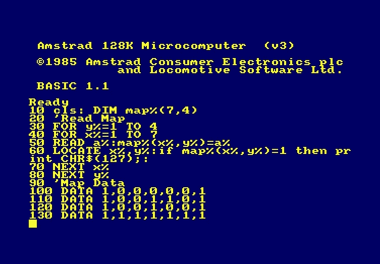

# 德沃普斯如何开始的故事

> 原文：<https://medium.com/hackernoon/a-tale-of-how-devops-began-35735b15e3e4>

## 一个关于开发和运营的寓言

Amstrad basic array, [retroacademy](https://www.retroacademy.it/2018/10/10/retrocomputers/amstrad-cpc-i-tiles/3581/attachment/code_map_lessons/)

很久以前，也就是三十年前，在曼彻斯特北部一个破败的小镇上，两个大人和一个孩子围坐在一栋议会大楼的黄色塑料桌子旁，打开礼物，互祝好运。一个新的黎明即将来临。进步的新方法即将推出。工人阶级的流程即将变得“数字化”。

那是 1985 年的圣诞节，寒冷附着在窗户上，猫们戴上新项圈，狼吞虎咽地吃着一年一度的圣诞沙丁鱼。这是一个高科技的房子，有一台彩色电视和最近购买的 VHS 播放器，还有一个便携式磁带播放器。事情即将好转。我当时八岁。

我的祖父母已经注意到了我对计算机的兴趣，从我去朋友家的时候，他们知道这将会很大。

我们没有太多的钱，所以我的祖父戒烟，以节省第一次购买，这将是我永远感激的。这台电脑是在圣诞节那天早上展示的。

Roland on the Ropes, [The Pixel Empire](http://www.thepixelempire.net/roland-on-the-ropes-cpc-review.html)

> 不仅仅是游戏，你也必须编码

我奶奶说。她对未来有先见之明，知道我有多容易分心。

是的，我在绳索上扮演罗兰，但是，是的，我要编码。

> 10 打印“Hello World”
> 
> 20 转到 10

太美了。我很快超越了这一点，发展到彩色字体、闪烁屏幕、闪烁边框和嵌套循环。每个程序的代码行将达到 10s。

过了一段时间，我很好，真的很好，已经建立了两个原则:

*   结对编程——电脑桌旁的两把椅子，我爷爷拿着编程杂志，轮流编写代码，并检查彼此的代码。我们在单一的多学科自治团队中进行开发、测试和运营。速度稳步增长。
*   按钮部署——程序编译成磁带后，只需按一下集成键盘的盒式磁带播放器上的 Play 按钮，就可以将我的应用程序直接部署到生产环境中，有时一天要部署多次(季度发布可不是胡说八道)

是时候进入下一个阶段了。极限编程(或者我喜欢称之为 XP)。

Photo by [Simson Petrol](https://unsplash.com/photos/IojCPQ2rWe8?utm_source=unsplash&utm_medium=referral&utm_content=creditCopyText) on [Unsplash](https://unsplash.com/search/photos/horse-racing?utm_source=unsplash&utm_medium=referral&utm_content=creditCopyText)

我坐在电脑桌前的椅子上。我非常自信——穿着百慕大短裤、亮紫色 t 恤和 He-man 拖鞋。我绝不是在胡闹。

我的祖父喜欢赌赛马，他和我分享了一个双管齐下的方法:推动我成为一个国际计算机明星，并赢得威廉希尔大。他意识到他可以将这两者结合起来。但对我们俩来说重要的是，完整的作品是可见的。我们想变得敏捷。按照 sprint 计划，很明显这将需要 1000 行代码和大量数据输入。我暂时不会出去玩了。

四天紧张的编码之后，是测试程序的时候了。我们没有 AWS CLI，所以我使用 Amstrad CLI。我打了“跑”。代码中的多个错误。正是在这一点上，我意识到微服务将比整体代码更好，在集成时自动测试小批量的多个代码提交(这将尽早发现编码错误——主要是我祖父的)。

# 90 年代

根据我的成绩记录，很明显我会在高中学习计算机科学。专用计算机科学室。阿基米德计算机用 3 1/4 软盘而不是磁带。麦加。

是时候更上一层楼了。

我在大多数测试中得到 10/10 和 20/20。太棒了。我的计算机科学老师很棒，建立了我的信心，他说我可以成为任何人，甚至是系统分析师。

我们编码了。我们的理念是尽可能快地交付软件——我们最重要的 KPI 之一是从想法到产品的交付周期。没有围墙，质量就是一切，我们生产的产品有价值。学生保留率高，流失率低。然后是赛博

Captain Jean-Luc Picard, [RollingStone](https://www.rollingstone.com/tv/tv-news/star-trek-plans-new-tv-series-with-patrick-stewarts-jean-luc-picard-706697/)

我们的老师是一位绅士——但他是秃头——只有头发长在头的两侧，对于 14 岁的男孩来说，这意味着他是一个目标。

我的一个朋友(我不会说出他的名字，但他知道他是谁)决定写一个病毒。阿基米德上的每一个图标都会变成一个光头，这是他在绘画程序中制作的。这不是用 C/C++或汇编语言写的，但是很有效。只要把软盘插入没有联网的计算机，病毒就会像野火一样蔓延。

这是在 devsecops 之前，也是在 CICD 输油管道实施安全程序之前。我们是 devops，但不是 devsecops。

我们有流量，质量，有问题的价值，但是很开心。我们控制了病毒，因为我们喜欢我们的老师，不想被开除。

考试通过了。接下来是高级考试。介绍一下，帕斯卡。我编写了代码，现在我在网上保存我的代码，不是在 Github 上，而是在 Burycollegehub 上——这样就可以了。

轻松进入大学。纯计算机科学，C，Java，算法，很便宜的啤酒…错误代码 1603: Java 更新没有完成。

质量和流量降低。DevOps 的采用经历了变化曲线:震惊、否认、接受、打嗝。是时候装箱了，我会坚持到最后。

> 选择你的最终任务

我的课程导师说。

> 会议组织者的工具包

我回答道。

Java/JavaScript/HTML，工作就这样开始了。

Conferences and Venues, [The University of Manchester](http://www.conference.manchester.ac.uk/)

我知道世界上有成千上万的会议组织者。我知道各行各业都在快速数字化转型。这意味着更快地交付工作软件。这意味着 devops。

我的工具包的潜在市场很大，而且还没有被破坏。在最初的几个月里，除了我和我的课程导师，我的工具包的采用率接近于零，但我知道我们正在做一些事情。不久之后，我的网站点击率会上升到很高的个位数。

会议组织者还没有准备好大规模使用我的软件，也许是因为我们不是 busdevops。

学位有了保障，然后在惠普公司找到了一份工作，这是硅谷的诞生地，通过四处走动进行管理——这是我一直引以为豪的原则，就早期开发而言，这导致了团队之间关系的建立。

DevOps the Wall of Confusion, [Microsoft Developer Network](https://blogs.msdn.microsoft.com/uk_faculty_connection/2016/06/23/devops-the-wall-of-confusion-understanding-the-basics-of-devops/)

然后职业生涯花在管理墙对面，帮助团队交谈，帮助项目团队交付，帮助现场服务团队不受苦。我没有发明 DevOps，但我应该发明。

我在罗兰的绳索上很得心应手。

对 DevOps 的真实描述是，它诞生于 Andrew Shafer 和 Patrick Debois 在 2008 年敏捷大会上的一次谈话中(我想知道他们是否使用了工具包来安排这件事？)—或者可能之前。我永远尊敬这些人，因为他们把两个词合二为一，工作软件可以更快地交付生产。

至于罗兰，如果你已经读到这里，你也可以在[维基百科](https://en.wikipedia.org/wiki/Roland_(game_character))上找到关于他的所有信息，或者更好的是(不用等它的 9 分钟加载)在这个[你管视频](https://www.youtube.com/watch?v=AdJ4teJLI6c)中见证现场游戏动作。

加里·沃茨

An Amstrad CPC, [Wikipedia](https://en.m.wikipedia.org/wiki/Amstrad_CPC)

如果你喜欢这个，请拍几下。

*可以关注我在*[*hackernoon.com/@gary.sa.watts*](https://hackernoon.com/@gary.sa.watts)*和*[*twitter.com/@garysawatts*](https://twitter.com/@garysawatts)

*更多我的文章:*

 [## 什么让敏捷下降了？

### 生产率难题

hackernoon.com](https://hackernoon.com/whats-getting-agile-down-7b0983b8027e)  [## 是时候告别 Scrum 了？

### 持续的交货可能会把它吹走

hackernoon.com](https://hackernoon.com/time-to-say-farewell-to-scrum-8344ed9440db)  [## Mabl 教我如何变得符合 DevOps

### 席卷 IT 行业的动向引人入胜——devo PS、站点可靠性工程、无服务器、NoOps——

hackernoon.com](https://hackernoon.com/i-fell-in-love-with-mabl-3b1d0a9cbb3f)  [## DevOops，一些常见的反模式

### 未能打破这些筒仓

hackernoon.com](https://hackernoon.com/devoops-some-common-anti-patterns-1850ac2f5074)