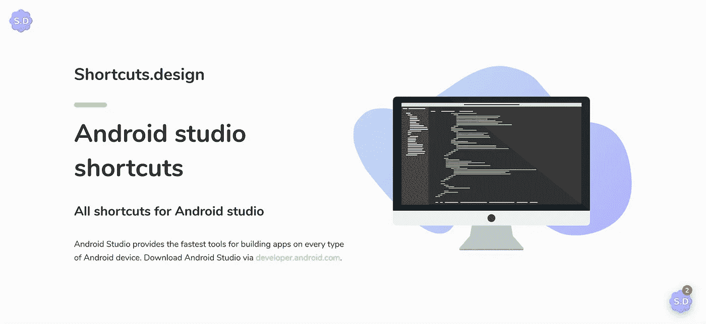

# Android Studio 快捷方式的故事&快速拉取请求

> 原文：<https://medium.com/hackernoon/a-tale-of-shortcuts-for-android-studio-a-quick-pull-request-6f6487d5739c>

## 一个关于快捷方式的拉取请求的故事，它提高了我的 android 开发效率

Picture from [Shortcuts.design](http://shortcuts.design) Webpage

我们，开发人员，总是在寻找最短的方法来完成我们的工作，或者修复那个烦人的 bug，或者完成那个特性开发，等等。而这些最短的路，最终都变成了捷径。对于每一种编码 IDE，从桌面软件到移动应用程序到网站，再到物联网设备的嵌入式软件，都有许多快捷方式来快速执行某些操作。

> 它的速度和使用任何 IDE 的方式，这告诉一个伟大的程序员从一个好的程序员。

我在过去的 7 年里一直从事编码和编程工作，并且我已经为不同种类的软件使用了许多不同的 ide 和编译器，例如 Adobe Flash、Adobe Flex Builder、Microsoft Visual Studio、Eclipse、Android Studio 等。当我安装任何新的 IDE 时，我做的第一件事就是搜索该软件的快捷方式。我使用键盘的次数通常比使用鼠标的次数多。我的写作习惯确保了这一点。有时候，我成功地找到了 ide 和编译器的捷径，有时候却没有。

## 偶然发现[快捷键](http://shortcuts.design)

跟踪最有用的快捷方式很难。为了提高你的工作效率和快速执行操作，你至少需要记住最常用的快捷方式。为此，你需要找个地方。在

### [为 Android Studio 添加了 Windows 快捷方式](https://medium.com/u/9115dc59efb3#4 …</h2>
<div class=)

## 感激和欣赏的时刻

开源社区是关于爱和分享的。所以，表达一些感激和欣赏贡献者和创造者是传播爱和增加分享的好方法。所以，我去 twitter 上寻找那里的米歇尔，并给他发了一条关于拉请求的推文。

几天后，Michel 合并了 pull 请求，Android Studio 快捷方式在网站上可用。看到这个页面，想到自己在那个美丽的作品中做出了贡献，感觉非常好。

## 谢谢你米歇尔·文·希斯特

感谢 Michel 创建了 Shortcuts.design 网站，并帮助世界各地的开发人员和设计人员提高了他们的工作效率。这可能看起来是一个愚蠢的网站，几乎没有快捷方式列表，但是它可以节省创建者很多时间。有时候，这些小事也能产生蝴蝶效应。

感谢 Michel 合并我的拉动式请求。作为一个开源爱好者和贡献者，当他/她的拉请求被合并到任何其他开发人员的库中时，这是任何开发人员所能拥有的最好感觉。这使得协作和分享非常容易实现，并在社区中带来积极性。

**Wajahat Karim** 是一名经验丰富的 android 开发人员，积极的开源贡献者，也是两本书的合著者[学习 Android 意图](https://www.amazon.com/Learning-Android-Intents-Muhammad-Usama/dp/1783289635)和[用 Unity 掌握 Android 游戏开发](https://www.amazon.com/Mastering-Android-Game-Development-Unity/dp/1783550775/)。在业余时间，他喜欢和家人呆在一起或者做编码和开源方面的实验，并且喜欢写很多东西。在 Twitter 和 [Medium](/@wajahatkarim3) 上关注他，获得更多关于他的写作、Android 和开源工作的更新。

 [## Wajahat Karim (@WajahatKarim) |推特

### Wajahat Karim 的最新推文(@WajahatKarim)。安卓开发者。UI/UX 设计师。博主。作家…

twitter.com](https://twitter.com/WajahatKarim) 

此外，如果你有任何想让他回答的问题，请通过他在 wajahatkarim.com 的网站联系他，在主题栏写上“亲爱的瓦贾哈特”。